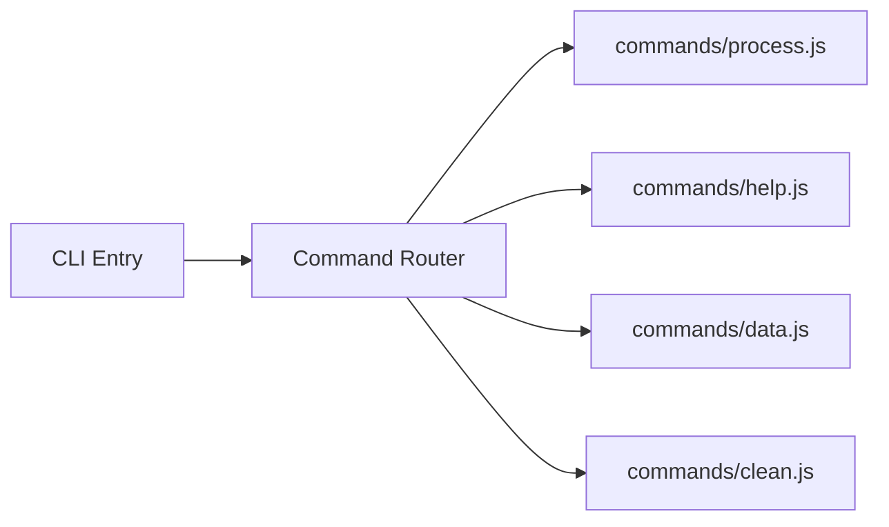
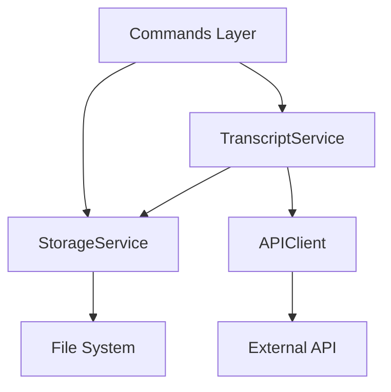

# Implementation Plan: 1.3 - Set up project structure

**Date:** 2025-11-18
**Task:** 1.3 - Set up project structure (implements TR-1, Module Structure)
**Status:** Ready for Implementation
**Requirements:** TR-1 (Module Structure), TR-18 (CLI Entry Point)

## Plan Overview

Establish foundational directory architecture for Transcriptor CLI tool by creating organized module boundaries separating command routing, business logic, and shared utilities. Structure follows clean architecture principles with clear separation of concerns: commands handle user interaction, services encapsulate business logic, and utils provide cross-cutting functionality. Outcome ensures maintainable codebase aligned with technical requirements for scalable growth.

## High-Level Steps

1. Create command handlers directory structure
2. Create services directory for business logic
3. Create utilities directory for shared functionality
4. Update index.js to command router foundation
5. Verify directory structure integrity

## Detailed Implementation

### Step 1: Create Command Handlers Directory

#### A. Rationale & Objective

Centralize all CLI command implementations in dedicated module, establishing clear boundary between user interface layer and business logic. Enables each command (process, help, data, clean) to have isolated implementation following single responsibility principle.

#### B. Core Concepts & Strategy

Follow commander.js patterns where each command maps to handler function. Directory structure supports modular command registration and promotes testability through separation. Each command file exports handler function accepting commander options/arguments.



#### C. Implementation Guidelines

**Key Logic:**

```javascript
// src/commands/process.js structure
module.exports = async function processCommand(options) {
  // 1. Validate youtube.md exists
  // 2. Parse URLs from file
  // 3. Delegate to TranscriptService
  // 4. Output results
};

// src/commands/help.js structure
module.exports = function helpCommand() {
  // Display comprehensive usage text
};

// src/commands/data.js structure
module.exports = async function dataCommand(options) {
  // 1. Load registry
  // 2. Calculate statistics
  // 3. Format and display
};

// src/commands/clean.js structure
module.exports = async function cleanCommand(date, options) {
  // 1. Validate date format
  // 2. Filter old transcripts
  // 3. Delete files and links
  // 4. Update registry
};
```

**Critical Points:**

- Each command handler is standalone async function
- Error handling contained within command boundary
- No direct file system access; delegate to services
- Commands orchestrate, services execute

#### D. Success Criteria

- [ ] `src/commands/` directory created
- [ ] Placeholder files created for all four command handlers
- [ ] Each file exports properly structured function
- [ ] Directory accessible from index.js

#### E. Dependencies & Inputs

- Requires: Existing `src/` directory
- Produces: `src/commands/` with 4 handler files ready for implementation

### Step 2: Create Services Directory

#### A. Rationale & Objective

Isolate business logic into service layer that encapsulates core operations: transcript fetching, storage management, API communication. Enables command handlers to remain thin orchestrators while services contain reusable, testable logic.

#### B. Core Concepts & Strategy

Service layer implements business rules defined in FR/TR specifications. Three primary services handle distinct concerns: TranscriptService orchestrates workflow, StorageService manages persistence, APIClient handles external communication. Services expose clean interfaces hiding implementation complexity.



#### C. Implementation Guidelines

**Key Logic:**

```javascript
// src/services/TranscriptService.js structure
class TranscriptService {
  constructor(storageService, apiClient) {
    this.storage = storageService;
    this.api = apiClient;
  }

  async processVideo(videoId) {
    // 1. Check cache via storage
    // 2. Fetch if missing via API
    // 3. Save transcript
    // 4. Create links
    // 5. Update registry
  }

  async checkCache(videoId) {
    // Query registry for existence
  }
}

// src/services/StorageService.js structure
class StorageService {
  constructor(pathResolver) {
    this.paths = pathResolver;
  }

  async loadRegistry() {
    /* ... */
  }
  async saveRegistry(data) {
    /* atomic write */
  }
  async saveTranscript(id, content) {
    /* ... */
  }
  async createSymlink(source, target) {
    /* ... */
  }
  async deleteTranscript(id) {
    /* ... */
  }
}

// src/services/APIClient.js structure
class APIClient {
  constructor(apiKey) {
    this.apiKey = apiKey;
    this.baseURL = 'https://api.scrape-creators.com';
  }

  async fetchTranscript(url) {
    // POST to /transcript endpoint
    // Handle errors per TR-12
    // Return transcript_only_text
  }
}
```

**Critical Points:**

- Use class-based architecture for state encapsulation
- Constructor dependency injection for testability
- Services own their domain logic completely
- No cross-service dependencies except TranscriptService → others

#### D. Success Criteria

- [ ] `src/services/` directory created
- [ ] Three service files created with class skeletons
- [ ] Each class exports via module.exports
- [ ] Constructor signatures defined with dependencies

#### E. Dependencies & Inputs

- Requires: Existing `src/` directory
- Produces: `src/services/` with 3 service class files

### Step 3: Create Utilities Directory

#### A. Rationale & Objective

Provide shared utilities for cross-cutting concerns used by multiple modules: path resolution (cross-platform), environment loading, validation helpers. Prevents duplication and centralizes platform-specific logic.

#### B. Core Concepts & Strategy

Utilities are pure functions or simple modules exporting reusable functionality. PathResolver handles all file system path construction following TR-10 specifications. Environment loader manages dotenv integration and validation per TR-11. Validators provide input sanitization.

#### C. Implementation Guidelines

**Key Logic:**

```javascript
// src/utils/pathResolver.js structure
const os = require('os');
const path = require('path');

module.exports = {
  getHomePath() {
    return os.homedir();
  },

  getStoragePath() {
    return path.join(this.getHomePath(), '.transcriptor');
  },

  getTranscriptsPath() {
    return path.join(this.getStoragePath(), 'transcripts');
  },

  getRegistryPath() {
    return path.join(this.getStoragePath(), 'data.json');
  },

  getLocalTranscriptsPath() {
    return path.resolve('./transcripts');
  },
};

// src/utils/envLoader.js structure
const dotenv = require('dotenv');

module.exports = {
  load() {
    dotenv.config();
    this.validate();
  },

  validate() {
    if (!process.env.SCRAPE_CREATORS_API_KEY) {
      console.error('Error: SCRAPE_CREATORS_API_KEY not found in environment');
      process.exit(1);
    }
  },

  getApiKey() {
    return process.env.SCRAPE_CREATORS_API_KEY;
  },
};

// src/utils/validators.js structure
module.exports = {
  isValidVideoId(id) {
    // Length 11, alphanumeric + dash/underscore
    return /^[A-Za-z0-9_-]{11}$/.test(id);
  },

  isValidDate(dateString) {
    // YYYY-MM-DD format
    return /^\d{4}-\d{2}-\d{2}$/.test(dateString);
  },
};
```

**Critical Points:**

- Utilities are stateless where possible
- Use module.exports for object/function exports
- PathResolver centralizes all path logic
- Environment validation fails fast with clear messages

#### D. Success Criteria

- [ ] `src/utils/` directory created
- [ ] Three utility modules created with skeleton implementations
- [ ] Each module exports well-defined interface
- [ ] No circular dependencies between utilities

#### E. Dependencies & Inputs

- Requires: Existing `src/` directory, installed dependencies (dotenv)
- Produces: `src/utils/` with 3 utility modules

### Step 4: Update index.js to Command Router Foundation

#### A. Rationale & Objective

Transform placeholder index.js into command router that delegates to appropriate handlers based on CLI input. Implements TR-18 routing specification and establishes entry point for all user interactions.

#### B. Core Concepts & Strategy

Use commander.js to define program structure with subcommands. Default action processes youtube.md file, named commands handle help/data/clean operations. Router remains thin, delegating immediately to command handler modules.

#### C. Implementation Guidelines

**Key Logic:**

```javascript
#!/usr/bin/env node

const { program } = require('commander');
const envLoader = require('./utils/envLoader');

// Load environment early
envLoader.load();

// Define program metadata
program
  .name('transcriptor')
  .description('YouTube transcript extraction and management tool')
  .version('1.0.0');

// Default action: process youtube.md
program.action(async () => {
  const processCommand = require('./commands/process');
  await processCommand();
});

// Help command
program
  .command('help')
  .description('Display usage information')
  .action(() => {
    const helpCommand = require('./commands/help');
    helpCommand();
  });

// Data statistics command
program
  .command('data')
  .description('Show repository statistics')
  .action(async () => {
    const dataCommand = require('./commands/data');
    await dataCommand();
  });

// Clean command
program
  .command('clean <date>')
  .description('Remove transcripts older than date (YYYY-MM-DD)')
  .action(async (date) => {
    const cleanCommand = require('./commands/clean');
    await cleanCommand(date);
  });

program.parse(process.argv);
```

**Critical Points:**

- Environment loads before command parsing
- Lazy-require commands to reduce startup time
- Preserve executable shebang at file start
- Use async/await for command handlers
- Commander handles argument parsing and validation

#### D. Success Criteria

- [ ] index.js updated with commander integration
- [ ] All four commands registered with proper signatures
- [ ] Environment loading happens at startup
- [ ] Shebang preserved for executable functionality
- [ ] File can be executed via node src/index.js

#### E. Dependencies & Inputs

- Requires: commander package installed, command handlers created
- Produces: Functional CLI router ready for handler implementation

### Step 5: Verify Directory Structure Integrity

#### A. Rationale & Objective

Ensure complete directory structure matches technical specifications before proceeding to implementation phases. Validation prevents downstream issues from missing components.

#### B. Core Concepts & Strategy

Programmatic verification using file system checks confirms all directories and placeholder files exist. Structure should match TR-1 module architecture exactly.

#### C. Implementation Guidelines

**Key Logic:**

Expected structure after completion:

```
src/
├── index.js                    (updated router)
├── commands/
│   ├── process.js             (placeholder handler)
│   ├── help.js                (placeholder handler)
│   ├── data.js                (placeholder handler)
│   └── clean.js               (placeholder handler)
├── services/
│   ├── TranscriptService.js   (class skeleton)
│   ├── StorageService.js      (class skeleton)
│   └── APIClient.js           (class skeleton)
└── utils/
    ├── pathResolver.js        (module skeleton)
    ├── envLoader.js           (module skeleton)
    └── validators.js          (module skeleton)
```

**Critical Points:**

- All 10 files must be present
- Each file must have valid JavaScript syntax
- Module exports must be defined even if placeholder
- Directory permissions must allow read/write

#### D. Success Criteria

- [ ] All directories created successfully
- [ ] All 10 files exist with valid syntax
- [ ] Running `node src/index.js --help` shows commander output
- [ ] No import/require errors when loading index.js

#### E. Dependencies & Inputs

- Requires: Steps 1-4 completed
- Produces: Validated project structure ready for implementation

## Task Breakdown Updates

No additional subtasks required beyond what's defined in tasks.md. All steps map directly to subtasks 1.3.1 through 1.3.4.

## Technical Considerations

### Architecture Impact

Establishes three-tier architecture:

- **Presentation Layer**: commands/ handles CLI interactions
- **Business Layer**: services/ implements domain logic
- **Infrastructure Layer**: utils/ provides cross-cutting concerns

This separation enables independent evolution of each layer and facilitates future refactoring or feature additions without cascading changes.

### Integration Points

- **commander.js**: Primary CLI framework dependency
- **dotenv**: Environment configuration at startup
- **fs-extra**: Future file operations in services
- **axios**: Future HTTP operations in APIClient

### Risk Mitigation

| Risk                                    | Likelihood | Impact | Mitigation Strategy                                                   |
| --------------------------------------- | ---------- | ------ | --------------------------------------------------------------------- |
| Circular dependencies between modules   | Medium     | Medium | Enforce unidirectional dependency flow: commands → services → utils   |
| Incomplete placeholder implementations  | Low        | Low    | Define clear module.exports in all files to catch import errors early |
| Path resolution failures cross-platform | Low        | High   | Use Node.js native path/os modules, avoid hardcoded separators        |

### Performance Considerations

- Expected load: Minimal at this stage (structure only)
- Optimization opportunities: Lazy-load command handlers to reduce startup time
- Monitoring points: None required for structure phase

## Testing Strategy

### Unit Testing

Not applicable per project testing policy (no tests required).

### Integration Testing

Manual validation:

- Execute `node src/index.js --help`
- Verify commander output displays correctly
- Check all module imports resolve without errors

### Edge Cases

- Missing directories: Create on first access
- Permission issues: Fail fast with clear error message
- Invalid syntax in placeholders: Validate with node --check

## Implementation Notes

### Code Organization

```
nodejs-youtube-transcriptor/
├── src/
│   ├── index.js               # CLI entry point, command router
│   ├── commands/              # Command handler implementations
│   │   ├── process.js         # Main processing command
│   │   ├── help.js            # Help display
│   │   ├── data.js            # Statistics command
│   │   └── clean.js           # Cleanup command
│   ├── services/              # Business logic layer
│   │   ├── TranscriptService.js   # Orchestrates workflow
│   │   ├── StorageService.js      # Manages persistence
│   │   └── APIClient.js           # External API communication
│   └── utils/                 # Shared utilities
│       ├── pathResolver.js    # Cross-platform paths
│       ├── envLoader.js       # Environment configuration
│       └── validators.js      # Input validation
└── package.json               # Already exists
```

### Coding Standards

Follow patterns:

- Use CommonJS modules (require/module.exports) for Node.js CLI compatibility
- Async functions for all I/O operations
- Class-based services with constructor dependency injection
- Pure functions for utilities where possible
- Descriptive function/class names matching domain concepts

Avoid anti-patterns:

- Circular dependencies between modules
- Direct file system access from commands layer
- Hardcoded paths or configuration values
- Mixing sync/async patterns inconsistently

### Documentation Requirements

Inline comments for:

- Complex routing logic in index.js
- Each command handler's purpose and arguments
- Service class responsibilities and dependencies
- Utility function parameter expectations

README updates: None required at this stage (handled in task 9.1)

API documentation: None required (internal modules only)

## Estimated Effort

| Component                                       | Effort    | Complexity   |
| ----------------------------------------------- | --------- | ------------ |
| Create commands/ directory with placeholders    | 0.5 hours | Low          |
| Create services/ directory with class skeletons | 1 hour    | Low          |
| Create utils/ directory with module skeletons   | 1 hour    | Low          |
| Update index.js router implementation           | 1.5 hours | Medium       |
| Verification and validation                     | 0.5 hours | Low          |
| **Total**                                       | 4.5 hours | Overall: Low |

## Next Steps

1. Execute steps 1-5 sequentially to create complete structure
2. Verify structure with manual tests (node src/index.js --help)
3. Update tasks.md to mark 1.3.1 through 1.3.4 as complete
4. Proceed to task 1.4.2 (Create .gitignore) or task 2.1 (Path management system)

## References

- Functional Requirements: FR-1 (URL Input Processing), FR-2 (Transcript Acquisition), FR-5 (Data Statistics), FR-6 (Cleanup Operations), FR-8 (Command Interface)
- Technical Requirements: TR-1 (Main Command), TR-2 (Help Command), TR-3 (Data Command), TR-4 (Clean Command), TR-10 (Cross-Platform Paths), TR-11 (API Key Management), TR-18 (CLI Entry Point)
- Related Tasks: 1.1 (npm package structure - completed), 1.2 (dependencies installation - completed)
- External Documentation: [Commander.js documentation](https://github.com/tj/commander.js), [Node.js path module](https://nodejs.org/api/path.html), [dotenv documentation](https://github.com/motdotla/dotenv)
