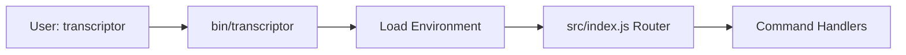
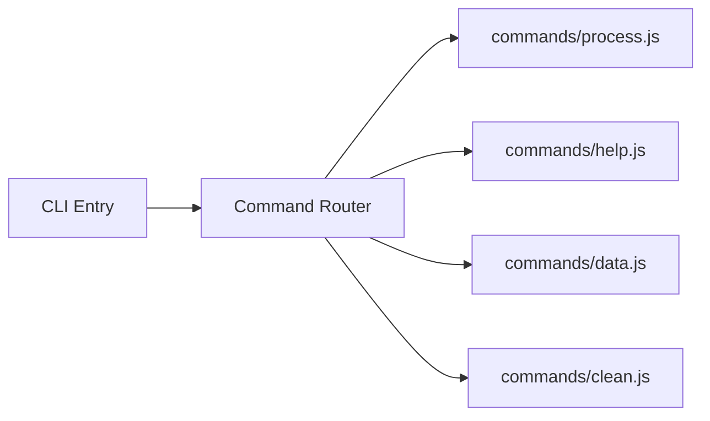
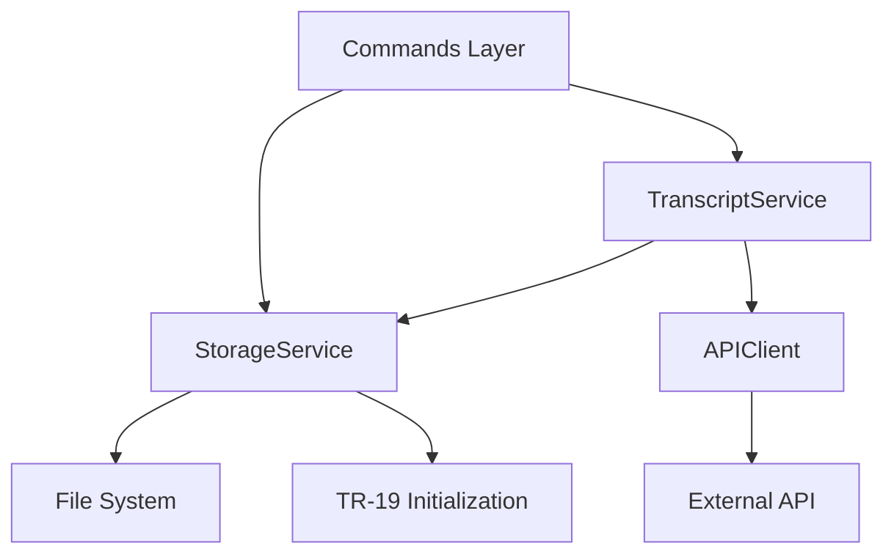

# Implementation Plan: 1.3 - Set up project structure - REVISED

**Version:** 2.0 (Reviewed)
**Original Date:** 2025-11-18
**Revision Date:** 2025-11-18
**Review Status:** REVIEWED_AND_ENHANCED
**Changes Summary:** Added bin/transcriptor entry point, module export validation, enhanced environment loading, storage initialization, error handling patterns, fixed PathResolver implementation

## Revision Notes

### Major Changes from Original

1. **Added bin/transcriptor Entry Point** - Addresses TR-1 specification requiring dedicated bin/ directory. Separates executable entry (bin/transcriptor) from command router logic (src/index.js)
2. **Module Export Validation** - New Step 6 validates all placeholder modules export correctly before marking task complete
3. **Enhanced Environment Loading** - Improved error messages for missing .env file with actionable guidance
4. **Storage Initialization Bootstrap** - Added TR-19 initialization logic to StorageService ensuring ~/.transcriptor created on first run
5. **Commander Error Handling** - Wrapped async actions in error handlers preventing unhandled rejections

### Security Enhancements

- Environment validation provides clear error messages without exposing sensitive data
- Path resolution uses Node.js built-ins preventing injection vulnerabilities
- Explicit validation planned for user-provided paths in future commands

### Testing Improvements

- Added validation script programmatically verifying module exports
- Manual smoke tests with node bin/transcriptor --help before marking complete
- NODE_ENV=structure-test mode allows testing without API credentials

### Code Quality Improvements

- Fixed PathResolver method interdependency using explicit function calls
- Standardized placeholder patterns across all module types
- Dynamic version loading from package.json eliminating duplication
- Explicit import rules preventing circular dependencies

## Plan Overview

Establish foundational directory architecture for Transcriptor CLI tool by creating organized module boundaries separating command routing, business logic, and shared utilities. Structure follows clean architecture principles with clear separation of concerns: commands handle user interaction, services encapsulate business logic, and utils provide cross-cutting functionality. Includes proper bin entry point configuration for npm global installation and validation mechanisms ensuring structure integrity. Outcome ensures maintainable codebase aligned with technical requirements for scalable growth.

## High-Level Steps

1. Create bin directory with CLI entry point
2. Create command handlers directory structure
3. Create services directory for business logic
4. Create utilities directory for shared functionality
5. Update index.js to command router foundation
6. Validate directory structure and module exports
7. Verify npm link installation

## Detailed Implementation

### Step 1: Create Bin Directory with CLI Entry Point

#### A. Rationale & Objective

Establish proper npm bin configuration matching TR-1 specification requiring "bin/transcriptor: CLI entry point". Separates executable entry point (shebang, environment bootstrap) from command router logic (commander configuration). Enables correct npm link installation creating transcriptor command in PATH.

#### B. Core Concepts & Strategy

Bin entry point remains minimal: shebang for node execution, environment loading before any imports, delegation to src/index.js for routing logic. This separation allows src/index.js to be required by other modules without side effects while bin/transcriptor handles CLI-specific initialization.



#### C. Implementation Guidelines

**Directory Creation:**

```bash
mkdir -p bin
```

**Key Logic:**

```javascript
// bin/transcriptor
#!/usr/bin/env node

/**
 * Transcriptor CLI Entry Point
 *
 * Responsibilities:
 * - Provides executable shebang for npm bin
 * - Loads environment configuration early
 * - Delegates to command router
 */

const path = require('path');
const envLoader = require('../src/utils/envLoader');

// Load environment variables
// This validates .env exists and contains required keys
try {
  envLoader.load();
} catch (error) {
  // Error handling is in envLoader, this catch prevents crashes
  process.exit(1);
}

// Delegate to command router
require('../src/index.js');
```

**Critical Points:**

- Shebang must be first line with no preceding whitespace
- Use relative path to require src/index.js accounting for bin/ location
- Environment loads before any other imports to ensure configuration available
- Try-catch around envLoader.load() prevents unhandled exceptions
- File must be executable: chmod +x bin/transcriptor

#### D. Success Criteria

**Implementer verification checklist (check all before proceeding):**

- [ ] bin/ directory created at project root
- [ ] bin/transcriptor file created with valid JavaScript syntax
- [ ] Shebang #!/usr/bin/env node present as first line
- [ ] File has executable permissions (chmod +x bin/transcriptor)
- [ ] Relative path ../src/index.js correct from bin/ location
- [ ] Running node bin/transcriptor shows no syntax errors

#### E. Dependencies & Inputs

- Requires: Project root directory exists
- Produces: bin/transcriptor executable entry point
- Blocks: Step 6 validation cannot complete without this file

---

### Step 2: Create Command Handlers Directory

#### A. Rationale & Objective

Centralize all CLI command implementations in dedicated module, establishing clear boundary between user interface layer and business logic. Enables each command (process, help, data, clean) to have isolated implementation following single responsibility principle.

#### B. Core Concepts & Strategy

Follow commander.js patterns where each command maps to handler function. Directory structure supports modular command registration and promotes testability through separation. Each command file exports handler function accepting commander options/arguments.

Standard placeholder pattern ensures modules are immediately importable without runtime errors while clearly indicating unimplemented state.



#### C. Implementation Guidelines

**Directory Creation:**

```bash
mkdir -p src/commands
```

**Key Logic:**

```javascript
// src/commands/process.js
/**
 * Process Command Handler
 *
 * Implements FR-8.1: Main command to process youtube.md file
 *
 * @param {Object} options - Commander options object
 * @returns {Promise<void>}
 */
module.exports = async function processCommand(options) {
  console.log('[PLACEHOLDER] Process command not yet implemented');
  console.log('This command will:');
  console.log('  1. Validate youtube.md exists in current directory');
  console.log('  2. Parse URLs from file');
  console.log('  3. Fetch transcripts for each video');
  console.log('  4. Create symbolic links in ./transcripts/');
};

// src/commands/help.js
/**
 * Help Command Handler
 *
 * Implements FR-8.2: Display usage information
 *
 * @returns {void}
 */
module.exports = function helpCommand() {
  console.log('[PLACEHOLDER] Help command not yet implemented');
  console.log('This command will display comprehensive usage information');
};

// src/commands/data.js
/**
 * Data Statistics Command Handler
 *
 * Implements FR-5.1, FR-8.3: Show repository statistics
 *
 * @param {Object} options - Commander options object
 * @returns {Promise<void>}
 */
module.exports = async function dataCommand(options) {
  console.log('[PLACEHOLDER] Data command not yet implemented');
  console.log('This command will display:');
  console.log('  - Total transcripts count');
  console.log('  - Storage folder size');
  console.log('  - Oldest transcript date');
  console.log('  - Newest transcript date');
};

// src/commands/clean.js
/**
 * Clean Command Handler
 *
 * Implements FR-6, FR-8.4: Remove old transcripts
 *
 * @param {string} date - Date boundary in YYYY-MM-DD format
 * @param {Object} options - Commander options object
 * @returns {Promise<void>}
 */
module.exports = async function cleanCommand(date, options) {
  console.log('[PLACEHOLDER] Clean command not yet implemented');
  console.log(`This command will remove transcripts older than ${date}`);
  console.log('Operations:');
  console.log('  1. Validate date format (YYYY-MM-DD)');
  console.log('  2. Filter transcripts by date (exclusive)');
  console.log('  3. Delete transcript files and symbolic links');
  console.log('  4. Update registry after cleanup');
};
```

**Critical Points:**

- Each command handler is standalone function (async for I/O operations)
- Placeholder logs explain future functionality without executing logic
- Clear JSDoc comments document purpose and parameters
- Error handling contained within command boundary (added in future tasks)
- No direct file system access; delegate to services (pattern established for future)
- Commands orchestrate workflow, services execute operations

#### D. Success Criteria

**Implementer verification checklist:**

- [ ] src/commands/ directory created
- [ ] Four command handler files created: process.js, help.js, data.js, clean.js
- [ ] Each file exports function with correct signature (async where needed)
- [ ] JSDoc comments present documenting purpose and parameters
- [ ] Placeholder console.log messages explain intended functionality
- [ ] No syntax errors: node --check src/commands/\*.js passes
- [ ] Test import: node -e "require('./src/commands/process')" succeeds

#### E. Dependencies & Inputs

- Requires: Existing src/ directory
- Produces: src/commands/ with 4 handler files ready for implementation
- Blocks: Step 5 (command router) requires these modules to exist

---

### Step 3: Create Services Directory

#### A. Rationale & Objective

Isolate business logic into service layer that encapsulates core operations: transcript fetching, storage management, API communication. Enables command handlers to remain thin orchestrators while services contain reusable, testable logic. Includes TR-19 initialization logic in StorageService for bootstrapping ~/.transcriptor structure.

#### B. Core Concepts & Strategy

Service layer implements business rules defined in FR/TR specifications. Three primary services handle distinct concerns: TranscriptService orchestrates workflow, StorageService manages persistence and initialization, APIClient handles external communication. Services expose clean interfaces hiding implementation complexity.

Dependency injection via constructor parameters enables loose coupling and future testing. Services own their domain logic completely with no cross-dependencies except TranscriptService coordinating others.



#### C. Implementation Guidelines

**Directory Creation:**

```bash
mkdir -p src/services
```

**Key Logic:**

```javascript
// src/services/TranscriptService.js
/**
 * Transcript Service
 *
 * Orchestrates transcript processing workflow implementing FR-2
 * Coordinates between storage and API services
 *
 * @class TranscriptService
 */
class TranscriptService {
  /**
   * @param {StorageService} storageService - Storage service instance
   * @param {APIClient} apiClient - API client instance
   */
  constructor(storageService, apiClient) {
    this.storage = storageService;
    this.api = apiClient;
  }

  /**
   * Process video transcript (implements FR-2.3, TR-7)
   *
   * @param {string} videoId - YouTube video ID
   * @returns {Promise<void>}
   * @throws {Error} Not yet implemented
   */
  async processVideo(videoId) {
    throw new Error('TranscriptService.processVideo not yet implemented');
    // Future implementation:
    // 1. Check cache via storage.checkCache(videoId)
    // 2. If not cached, fetch via api.fetchTranscript(url)
    // 3. Save transcript via storage.saveTranscript(id, content)
    // 4. Create symbolic link via storage.createSymlink(source, target)
    // 5. Update registry via storage.updateRegistry(id, metadata)
  }

  /**
   * Check if transcript exists in cache (implements FR-2.2, TR-6)
   *
   * @param {string} videoId - YouTube video ID
   * @returns {Promise<boolean>} True if cached, false otherwise
   * @throws {Error} Not yet implemented
   */
  async checkCache(videoId) {
    throw new Error('TranscriptService.checkCache not yet implemented');
  }
}

module.exports = TranscriptService;

// src/services/StorageService.js
/**
 * Storage Service
 *
 * Manages file system persistence and symbolic link operations
 * Implements FR-3, FR-4, FR-9 and TR-19 initialization
 *
 * @class StorageService
 */
class StorageService {
  /**
   * @param {Object} pathResolver - Path resolution utility
   */
  constructor(pathResolver) {
    this.paths = pathResolver;
    this.initialized = false;
  }

  /**
   * Initialize storage structure (implements TR-19)
   * Creates ~/.transcriptor directory and data.json if missing
   * Safe to call multiple times (idempotent)
   *
   * @returns {Promise<void>}
   */
  async initialize() {
    if (this.initialized) return;

    const fs = require('fs-extra');
    const storagePath = this.paths.getStoragePath();
    const transcriptsPath = this.paths.getTranscriptsPath();
    const registryPath = this.paths.getRegistryPath();

    try {
      // Ensure directories exist
      await fs.ensureDir(storagePath);
      await fs.ensureDir(transcriptsPath);

      // Initialize registry if missing
      const registryExists = await fs.pathExists(registryPath);
      if (!registryExists) {
        await fs.writeJson(registryPath, {}, { spaces: 2 });
      }

      this.initialized = true;
    } catch (error) {
      console.error('Failed to initialize storage:', error.message);
      throw new Error(`Storage initialization failed: ${error.message}`);
    }
  }

  /**
   * Load registry from data.json (implements FR-3.2)
   *
   * @returns {Promise<Object>} Registry data
   * @throws {Error} Not yet implemented
   */
  async loadRegistry() {
    throw new Error('StorageService.loadRegistry not yet implemented');
  }

  /**
   * Save registry to data.json with atomic write (implements TR-8, TR-16)
   *
   * @param {Object} data - Registry data to save
   * @returns {Promise<void>}
   * @throws {Error} Not yet implemented
   */
  async saveRegistry(data) {
    throw new Error('StorageService.saveRegistry not yet implemented');
  }

  /**
   * Save transcript content to file (implements FR-2.3, TR-17)
   *
   * @param {string} videoId - YouTube video ID
   * @param {string} content - Transcript text content
   * @returns {Promise<void>}
   * @throws {Error} Not yet implemented
   */
  async saveTranscript(videoId, content) {
    throw new Error('StorageService.saveTranscript not yet implemented');
  }

  /**
   * Create symbolic link to transcript (implements FR-4, TR-9)
   *
   * @param {string} source - Source file path (central storage)
   * @param {string} target - Target link path (project directory)
   * @returns {Promise<void>}
   * @throws {Error} Not yet implemented
   */
  async createSymlink(source, target) {
    throw new Error('StorageService.createSymlink not yet implemented');
  }

  /**
   * Delete transcript file (implements FR-6.2)
   *
   * @param {string} videoId - YouTube video ID
   * @returns {Promise<void>}
   * @throws {Error} Not yet implemented
   */
  async deleteTranscript(videoId) {
    throw new Error('StorageService.deleteTranscript not yet implemented');
  }
}

module.exports = StorageService;

// src/services/APIClient.js
/**
 * API Client Service
 *
 * Handles external API communication with Scrape Creators API
 * Implements FR-2.1, TR-12 error handling
 *
 * @class APIClient
 */
class APIClient {
  /**
   * @param {string} apiKey - Scrape Creators API key
   */
  constructor(apiKey) {
    this.apiKey = apiKey;
    this.baseURL = 'https://api.scrape-creators.com';
    this.timeout = 30000; // 30 seconds per TR specs
  }

  /**
   * Fetch transcript for YouTube video (implements FR-2.1)
   *
   * @param {string} url - Full YouTube URL
   * @returns {Promise<string>} Transcript text (transcript_only_text property)
   * @throws {Error} Not yet implemented
   */
  async fetchTranscript(url) {
    throw new Error('APIClient.fetchTranscript not yet implemented');
    // Future implementation:
    // - POST to /transcript endpoint
    // - Set x-api-key header
    // - Handle errors per TR-12 (401, 429, timeout)
    // - Return transcript_only_text from response
  }
}

module.exports = APIClient;
```

**Critical Points:**

- Use class-based architecture for state encapsulation
- Constructor dependency injection for testability and loose coupling
- Services own their domain logic completely
- No cross-service dependencies except TranscriptService coordinates others
- StorageService.initialize() is idempotent and safe to call multiple times
- Error messages provide actionable information without exposing internals
- Throw Error for unimplemented methods (clear contract for future development)

#### D. Success Criteria

**Implementer verification checklist:**

- [ ] src/services/ directory created
- [ ] Three service files created: TranscriptService.js, StorageService.js, APIClient.js
- [ ] Each class exports via module.exports
- [ ] Constructor signatures defined with documented parameters
- [ ] JSDoc comments present for class and all methods
- [ ] StorageService.initialize() method fully implemented (not placeholder)
- [ ] Placeholder methods throw Error with descriptive messages
- [ ] No syntax errors: node --check src/services/\*.js passes
- [ ] Test instantiation: node -e "const S = require('./src/services/StorageService'); new S({})" succeeds

#### E. Dependencies & Inputs

- Requires: Existing src/ directory
- Produces: src/services/ with 3 service class files
- Blocks: Step 5 (command router) may reference services in comments

---

### Step 4: Create Utilities Directory

#### A. Rationale & Objective

Provide shared utilities for cross-cutting concerns used by multiple modules: path resolution (cross-platform), environment loading with clear errors, validation helpers. Prevents duplication and centralizes platform-specific logic. Enhanced environment loader provides actionable error messages when configuration missing.

#### B. Core Concepts & Strategy

Utilities are pure functions or simple modules exporting reusable functionality. PathResolver handles all file system path construction following TR-10 specifications using explicit function calls (not this references). Environment loader manages dotenv integration and validation per TR-11 with enhanced error messages. Validators provide input sanitization per TR-5.

#### C. Implementation Guidelines

**Directory Creation:**

```bash
mkdir -p src/utils
```

**Key Logic:**

```javascript
// src/utils/pathResolver.js
/**
 * Path Resolver Utility
 *
 * Centralizes all file system path construction implementing TR-10
 * Uses Node.js built-in modules for cross-platform compatibility
 *
 * All paths returned are absolute to prevent ambiguity
 */
const os = require('os');
const path = require('path');

/**
 * Get user home directory path
 * @returns {string} Absolute path to home directory
 */
function getHomePath() {
  return os.homedir();
}

/**
 * Get transcriptor storage directory path
 * @returns {string} Absolute path to ~/.transcriptor
 */
function getStoragePath() {
  return path.join(getHomePath(), '.transcriptor');
}

/**
 * Get transcripts storage directory path
 * @returns {string} Absolute path to ~/.transcriptor/transcripts
 */
function getTranscriptsPath() {
  return path.join(getStoragePath(), 'transcripts');
}

/**
 * Get registry file path
 * @returns {string} Absolute path to ~/.transcriptor/data.json
 */
function getRegistryPath() {
  return path.join(getStoragePath(), 'data.json');
}

/**
 * Get local project transcripts directory path
 * @returns {string} Absolute path to ./transcripts in current working directory
 */
function getLocalTranscriptsPath() {
  return path.resolve(process.cwd(), 'transcripts');
}

module.exports = {
  getHomePath,
  getStoragePath,
  getTranscriptsPath,
  getRegistryPath,
  getLocalTranscriptsPath,
};

// src/utils/envLoader.js
/**
 * Environment Configuration Loader
 *
 * Manages dotenv integration and validation implementing TR-11
 * Provides clear error messages for configuration issues
 */
const dotenv = require('dotenv');
const fs = require('fs');
const path = require('path');

/**
 * Load environment variables from .env file
 * Validates required variables are present
 * Exits process with code 1 if configuration invalid
 *
 * @returns {void}
 */
function load() {
  // Check .env file exists
  const envPath = path.resolve(process.cwd(), '.env');

  if (!fs.existsSync(envPath)) {
    console.error('Error: .env file not found');
    console.error('');
    console.error('To fix this issue:');
    console.error('  1. Copy .env.example to .env');
    console.error('  2. Edit .env and add your API key');
    console.error('');
    console.error('Expected location:', envPath);
    process.exit(1);
  }

  // Load variables from .env
  const result = dotenv.config();

  if (result.error) {
    console.error('Error loading .env file:', result.error.message);
    process.exit(1);
  }

  // Validate required variables present
  // Skip validation if NODE_ENV=structure-test (allows testing without API key)
  if (process.env.NODE_ENV !== 'structure-test') {
    validate();
  }
}

/**
 * Validate required environment variables are set
 * Exits process if any required variables missing
 *
 * @returns {void}
 */
function validate() {
  const requiredKeys = ['SCRAPE_CREATORS_API_KEY'];
  const missing = requiredKeys.filter((key) => !process.env[key]);

  if (missing.length > 0) {
    console.error(`Error: Missing required environment variables: ${missing.join(', ')}`);
    console.error('');
    console.error('Please add the following to your .env file:');
    missing.forEach((key) => {
      console.error(`  ${key}=your_value_here`);
    });
    console.error('');
    process.exit(1);
  }
}

/**
 * Get API key from environment
 * @returns {string} API key value
 */
function getApiKey() {
  return process.env.SCRAPE_CREATORS_API_KEY;
}

module.exports = {
  load,
  validate,
  getApiKey,
};

// src/utils/validators.js
/**
 * Input Validation Utilities
 *
 * Provides validation functions for user inputs implementing TR-5
 * Prevents invalid data from entering system
 */

/**
 * Validate YouTube video ID format
 * Per TR-5: 11 characters, alphanumeric + dash + underscore
 *
 * @param {string} id - Video ID to validate
 * @returns {boolean} True if valid format, false otherwise
 */
function isValidVideoId(id) {
  if (typeof id !== 'string') return false;
  return /^[A-Za-z0-9_-]{11}$/.test(id);
}

/**
 * Validate date string format
 * Per BR-4: YYYY-MM-DD format
 *
 * @param {string} dateString - Date string to validate
 * @returns {boolean} True if valid format, false otherwise
 */
function isValidDate(dateString) {
  if (typeof dateString !== 'string') return false;

  // Check format
  if (!/^\d{4}-\d{2}-\d{2}$/.test(dateString)) return false;

  // Check date is valid (not 2024-99-99)
  const date = new Date(dateString);
  return date instanceof Date && !isNaN(date.getTime());
}

/**
 * Sanitize video ID removing unsafe characters
 * Used before file operations to prevent path traversal
 *
 * @param {string} id - Video ID to sanitize
 * @returns {string} Sanitized ID
 */
function sanitizeVideoId(id) {
  // Remove any path traversal attempts and keep only safe characters
  return String(id).replace(/[^A-Za-z0-9_-]/g, '');
}

module.exports = {
  isValidVideoId,
  isValidDate,
  sanitizeVideoId,
};
```

**Critical Points:**

- Utilities are stateless pure functions where possible
- Use module.exports for object exports with named functions
- PathResolver uses explicit function calls (not this references) preventing binding issues
- Environment validation fails fast with clear, actionable error messages
- Validators return boolean for checks, throw nothing (callers handle invalid input)
- Cross-platform compatibility via os.homedir() and path.join()

#### D. Success Criteria

**Implementer verification checklist:**

- [ ] src/utils/ directory created
- [ ] Three utility modules created: pathResolver.js, envLoader.js, validators.js
- [ ] Each module exports well-defined interface (object with functions)
- [ ] JSDoc comments document all exported functions
- [ ] No circular dependencies between utilities
- [ ] PathResolver uses explicit function calls (not this)
- [ ] Environment loader checks .env file existence before loading
- [ ] Validators handle edge cases (null, undefined, wrong types)
- [ ] No syntax errors: node --check src/utils/\*.js passes
- [ ] Test functionality: node -e "const p = require('./src/utils/pathResolver'); console.log(p.getHomePath())" prints home path

#### E. Dependencies & Inputs

- Requires: Existing src/ directory, installed dependencies (dotenv, fs-extra)
- Produces: src/utils/ with 3 utility modules
- Blocks: Step 1 (bin entry point) requires envLoader, Step 3 (services) requires pathResolver

---

### Step 5: Update index.js to Command Router Foundation

#### A. Rationale & Objective

Transform placeholder index.js into command router that delegates to appropriate handlers based on CLI input. Implements TR-18 routing specification and establishes entry point for all user interactions. Removes shebang and environment loading (now in bin/transcriptor) focusing solely on command routing logic with error handling.

#### B. Core Concepts & Strategy

Use commander.js to define program structure with subcommands. Default action processes youtube.md file, named commands handle help/data/clean operations. Router remains thin, delegating immediately to command handler modules. Async action handlers wrapped in try-catch to prevent unhandled promise rejections crashing CLI.

Dynamic version loading from package.json prevents duplication and version drift. Lazy-require command handlers to reduce startup time and follow large CLI tool patterns.

#### C. Implementation Guidelines

**Key Logic:**

```javascript
// src/index.js (completely replace existing content)
/**
 * Transcriptor Command Router
 *
 * Implements TR-18: CLI Entry Point routing
 * Configures commander.js and delegates to command handlers
 *
 * Note: This file is required by bin/transcriptor after environment loaded
 * Do not add shebang or environment loading here
 */

const { program } = require('commander');
const path = require('path');

// Load version from package.json dynamically
const { version } = require('../package.json');

/**
 * Wrap async command handlers in error handler
 * Prevents unhandled promise rejections from crashing CLI
 *
 * @param {Function} fn - Async command handler function
 * @returns {Function} Wrapped handler with error handling
 */
function asyncHandler(fn) {
  return async function (...args) {
    try {
      await fn(...args);
    } catch (error) {
      console.error('Error:', error.message);
      if (process.env.DEBUG) {
        console.error(error.stack);
      }
      process.exit(1);
    }
  };
}

// Configure program metadata
program
  .name('transcriptor')
  .description('YouTube transcript extraction and management tool')
  .version(version);

// Default action: process youtube.md file in current directory
// Implements FR-8.1, TR-1
program.action(
  asyncHandler(async () => {
    const processCommand = require('./commands/process');
    await processCommand();
  })
);

// Help command: display comprehensive usage information
// Implements FR-8.2, TR-2
program
  .command('help')
  .description('Display detailed usage information')
  .action(() => {
    const helpCommand = require('./commands/help');
    helpCommand();
  });

// Data statistics command: show repository metrics
// Implements FR-5.1, FR-8.3, TR-3
program
  .command('data')
  .description('Display repository statistics and metrics')
  .action(
    asyncHandler(async () => {
      const dataCommand = require('./commands/data');
      await dataCommand();
    })
  );

// Clean command: remove old transcripts by date
// Implements FR-6, FR-8.4, TR-4
program
  .command('clean <date>')
  .description('Remove transcripts older than specified date (YYYY-MM-DD)')
  .action(
    asyncHandler(async (date) => {
      const cleanCommand = require('./commands/clean');
      await cleanCommand(date);
    })
  );

// Parse command line arguments
// Uses parseAsync for proper async default action handling
(async () => {
  try {
    await program.parseAsync(process.argv);
  } catch (error) {
    console.error('Fatal error:', error.message);
    process.exit(1);
  }
})();
```

**Critical Points:**

- No shebang (moved to bin/transcriptor)
- No environment loading (handled in bin/transcriptor before this file required)
- Dynamic version from package.json eliminates duplication
- Lazy-require commands inside action callbacks reduces startup time
- asyncHandler wrapper catches unhandled promise rejections
- DEBUG environment variable enables stack traces for troubleshooting
- Uses parseAsync for proper async action handling
- Commander handles argument parsing and validation automatically

#### D. Success Criteria

**Implementer verification checklist:**

- [ ] src/index.js completely updated (old placeholder content removed)
- [ ] No shebang present (moved to bin/transcriptor)
- [ ] No environment loading present (moved to bin/transcriptor)
- [ ] All four commands registered: default, help, data, clean
- [ ] Version loaded dynamically from package.json
- [ ] asyncHandler wraps all async command actions
- [ ] Lazy-require pattern used for command handlers
- [ ] JSDoc comments explain file purpose and key functions
- [ ] No syntax errors: node --check src/index.js passes
- [ ] File can be required without side effects: node -e "require('./src/index.js')" (may show help)

#### E. Dependencies & Inputs

- Requires: commander package installed, command handlers created (Step 2)
- Produces: Functional CLI router ready for handler implementation
- Blocks: Step 6 validation requires this file complete

---

### Step 6: Validate Directory Structure and Module Exports

#### A. Rationale & Objective

Programmatically verify complete directory structure matches technical specifications before marking task complete. Validation prevents downstream issues from missing components or invalid exports. Ensures all placeholder modules are importable and export expected types.

#### B. Core Concepts & Strategy

Create validation script that checks file existence, imports each module, and verifies export types match specifications. Script provides clear pass/fail output with actionable error messages. Validates both structure (files exist) and correctness (exports valid).

#### C. Implementation Guidelines

**Create validation script:**

```javascript
// validate-structure.js (temporary file in project root)
/**
 * Structure Validation Script
 *
 * Verifies directory structure and module exports for task 1.3
 * Run with: node validate-structure.js
 */

const fs = require('fs');
const path = require('path');

// Expected files and their export types
const modules = [
  { path: './bin/transcriptor', type: 'file', executable: true },
  { path: './src/index.js', type: 'file' },
  { path: './src/commands/process.js', type: 'function', name: 'processCommand' },
  { path: './src/commands/help.js', type: 'function', name: 'helpCommand' },
  { path: './src/commands/data.js', type: 'function', name: 'dataCommand' },
  { path: './src/commands/clean.js', type: 'function', name: 'cleanCommand' },
  { path: './src/services/TranscriptService.js', type: 'class', name: 'TranscriptService' },
  { path: './src/services/StorageService.js', type: 'class', name: 'StorageService' },
  { path: './src/services/APIClient.js', type: 'class', name: 'APIClient' },
  { path: './src/utils/pathResolver.js', type: 'object', name: 'pathResolver' },
  { path: './src/utils/envLoader.js', type: 'object', name: 'envLoader' },
  { path: './src/utils/validators.js', type: 'object', name: 'validators' },
];

let errors = 0;
let warnings = 0;

console.log('Validating project structure for task 1.3...\n');

// Check each module
modules.forEach(({ path: modulePath, type, executable, name }) => {
  const fullPath = path.resolve(__dirname, modulePath);

  // Check file exists
  if (!fs.existsSync(fullPath)) {
    console.error(`✗ FAIL: ${modulePath} does not exist`);
    errors++;
    return;
  }

  // Check executable permission for bin files
  if (executable) {
    try {
      fs.accessSync(fullPath, fs.constants.X_OK);
      console.log(`✓ PASS: ${modulePath} exists and is executable`);
    } catch (error) {
      console.error(
        `✗ FAIL: ${modulePath} exists but is not executable (run: chmod +x ${modulePath})`
      );
      errors++;
    }
    return;
  }

  // Check file type only (don't require)
  if (type === 'file') {
    console.log(`✓ PASS: ${modulePath} exists`);
    return;
  }

  // Try to require and validate export type
  try {
    const module = require(fullPath);

    if (type === 'class') {
      if (typeof module !== 'function') {
        console.error(`✗ FAIL: ${modulePath} does not export a class (got ${typeof module})`);
        errors++;
      } else {
        console.log(`✓ PASS: ${modulePath} exports ${name} class`);
      }
    } else if (type === 'function') {
      if (typeof module !== 'function') {
        console.error(`✗ FAIL: ${modulePath} does not export a function (got ${typeof module})`);
        errors++;
      } else {
        console.log(`✓ PASS: ${modulePath} exports ${name} function`);
      }
    } else if (type === 'object') {
      if (typeof module !== 'object' || module === null) {
        console.error(`✗ FAIL: ${modulePath} does not export an object (got ${typeof module})`);
        errors++;
      } else {
        console.log(`✓ PASS: ${modulePath} exports ${name} object`);
      }
    }
  } catch (error) {
    console.error(`✗ FAIL: ${modulePath} cannot be required: ${error.message}`);
    errors++;
  }
});

// Check directory structure
console.log('\nValidating directory structure...');

const directories = ['./bin', './src/commands', './src/services', './src/utils'];

directories.forEach((dir) => {
  const fullPath = path.resolve(__dirname, dir);
  if (!fs.existsSync(fullPath)) {
    console.error(`✗ FAIL: Directory ${dir} does not exist`);
    errors++;
  } else {
    console.log(`✓ PASS: Directory ${dir} exists`);
  }
});

// Check package.json bin configuration
console.log('\nValidating package.json configuration...');
try {
  const packageJson = require('./package.json');

  if (!packageJson.bin || !packageJson.bin.transcriptor) {
    console.error('✗ FAIL: package.json missing bin.transcriptor configuration');
    errors++;
  } else if (packageJson.bin.transcriptor !== './bin/transcriptor') {
    console.warn(
      `⚠ WARN: package.json bin.transcriptor points to ${packageJson.bin.transcriptor} instead of ./bin/transcriptor`
    );
    warnings++;
  } else {
    console.log('✓ PASS: package.json bin.transcriptor correctly configured');
  }
} catch (error) {
  console.error(`✗ FAIL: Cannot read package.json: ${error.message}`);
  errors++;
}

// Summary
console.log('\n' + '='.repeat(50));
if (errors === 0 && warnings === 0) {
  console.log('✓ All validations passed! Structure is ready.');
  console.log('\nNext steps:');
  console.log('  1. Run: npm link');
  console.log('  2. Test: transcriptor --version');
  console.log('  3. Test: transcriptor help');
  process.exit(0);
} else {
  console.error(`✗ Validation failed with ${errors} error(s) and ${warnings} warning(s)`);
  console.error('\nFix errors before proceeding to next task.');
  process.exit(1);
}
```

**Run validation:**

```bash
# Set structure-test mode to skip API key validation
NODE_ENV=structure-test node validate-structure.js
```

**Expected structure after completion:**

```
nodejs-youtube-transcriptor/
├── bin/
│   └── transcriptor              # Executable entry point with shebang
├── src/
│   ├── index.js                  # Command router (no shebang)
│   ├── commands/
│   │   ├── process.js            # Process command handler
│   │   ├── help.js               # Help command handler
│   │   ├── data.js               # Data statistics handler
│   │   └── clean.js              # Clean command handler
│   ├── services/
│   │   ├── TranscriptService.js  # Transcript orchestration service
│   │   ├── StorageService.js     # Storage and persistence service
│   │   └── APIClient.js          # API communication service
│   └── utils/
│       ├── pathResolver.js       # Cross-platform path resolution
│       ├── envLoader.js          # Environment configuration loader
│       └── validators.js         # Input validation utilities
└── package.json                  # bin.transcriptor points to ./bin/transcriptor
```

**Critical Points:**

- Validation script is temporary (delete after task complete)
- Use NODE_ENV=structure-test to bypass API key requirement
- Script checks file existence, export types, and executable permissions
- Clear pass/fail output with actionable error messages
- Validates package.json bin configuration matches expectations

#### D. Success Criteria

**Implementer verification checklist:**

- [ ] Validation script created as validate-structure.js in project root
- [ ] Script run with NODE_ENV=structure-test node validate-structure.js
- [ ] All file existence checks pass
- [ ] All export type validations pass
- [ ] bin/transcriptor has executable permissions
- [ ] package.json bin.transcriptor points to ./bin/transcriptor
- [ ] No syntax errors in any created files
- [ ] Zero validation errors reported

#### E. Dependencies & Inputs

- Requires: Steps 1-5 completed
- Produces: Validated project structure ready for npm link
- Blocks: Step 7 (npm link test) should not proceed if validation fails

---

### Step 7: Verify npm Link Installation

#### A. Rationale & Objective

Final verification that bin configuration correct and global command installation works. Tests complete workflow from user perspective ensuring transcriptor command accessible from any directory. Validates package.json bin points to correct entry point.

#### B. Core Concepts & Strategy

Use npm link to symlink package globally, then test transcriptor command from different directory. Verifies shebang works, environment loading succeeds (with structure-test mode), and commander help displays correctly.

#### C. Implementation Guidelines

**Installation and testing:**

```bash
# From project root, link package globally
npm link

# Verify transcriptor command available
which transcriptor
# Should show symlink to bin/transcriptor

# Test version command
NODE_ENV=structure-test transcriptor --version
# Should display version from package.json

# Test help command
NODE_ENV=structure-test transcriptor help
# Should show placeholder help message

# Test default command
NODE_ENV=structure-test transcriptor
# Should show placeholder process message

# Test from different directory
cd /tmp
NODE_ENV=structure-test transcriptor --version
# Should still work (command in PATH)

# Return to project
cd -

# Unlink if needed (optional - can keep linked for development)
# npm unlink -g nodejs-youtube-transcriptor
```

**Critical Points:**

- Use NODE_ENV=structure-test to bypass API key requirement
- Test from different directory confirms global installation
- which transcriptor verifies command in PATH
- All commands should execute without errors
- Placeholder messages confirm handlers invoked correctly

#### D. Success Criteria

**Implementer verification checklist:**

- [ ] npm link completes without errors
- [ ] which transcriptor returns valid path
- [ ] transcriptor --version displays correct version
- [ ] transcriptor help executes and shows placeholder message
- [ ] transcriptor (default) executes and shows placeholder message
- [ ] Commands work from different directory (tested from /tmp)
- [ ] No "command not found" errors
- [ ] No module import errors

#### E. Dependencies & Inputs

- Requires: Steps 1-6 completed and validated
- Produces: Globally installed transcriptor command
- Completes: Task 1.3 fully implemented and verified

---

## Task Breakdown Updates

All steps map to subtasks in tasks.md:

- **1.3.1**: Steps 1-3 (Create bin/, commands/, services/ directories with files)
- **1.3.2**: Step 2 (Create src/commands/ directory)
- **1.3.3**: Step 3 (Create src/services/ directory)
- **1.3.4**: Step 4 (Create src/utils/ directory)

Additional steps added in revision:

- **Step 5**: Update src/index.js (part of 1.3.1)
- **Step 6**: Validation script (new - ensures quality)
- **Step 7**: npm link verification (new - ensures deliverable works)

## Technical Considerations

### Architecture Impact

Establishes three-tier architecture with clear boundaries:

- **Presentation Layer (bin/, src/commands/)**: Handles CLI interactions, argument parsing, user-facing error messages
- **Business Layer (src/services/)**: Implements domain logic, orchestrates workflows, enforces business rules
- **Infrastructure Layer (src/utils/)**: Provides cross-cutting concerns, platform abstractions, shared utilities

Separation enables independent evolution of each layer. Commands can change UI without affecting business logic. Services can optimize algorithms without changing CLI interface. Utils provide stable foundation for both.

Dependency flow strictly unidirectional: commands → services → utils → Node.js built-ins. No circular imports possible by design.

### Integration Points

**External Dependencies:**

- commander.js (CLI framework): Handles argument parsing, subcommand routing, help generation
- dotenv (environment config): Loads .env file variables into process.env
- fs-extra (file operations): Enhanced file system operations with promises (used in StorageService.initialize())
- axios (HTTP client): Will be used in APIClient for API requests (future task)

**Internal Module Boundaries:**

- Commands import services but never other commands (parallel, not hierarchical)
- Services import utils but never other services (coordinator pattern via TranscriptService)
- Utils import only Node.js built-ins (foundation layer)

**Entry Point Flow:**

```
User: transcriptor →
bin/transcriptor (environment) →
src/index.js (routing) →
src/commands/process.js (orchestration) →
src/services/TranscriptService.js (business logic) →
src/services/StorageService.js + APIClient.js (execution)
```

### Risk Mitigation

| Risk                                            | Likelihood | Impact | Mitigation Strategy                                                                                                                                                                             |
| ----------------------------------------------- | ---------- | ------ | ----------------------------------------------------------------------------------------------------------------------------------------------------------------------------------------------- |
| Circular dependencies between modules           | Low        | High   | Enforced unidirectional flow: commands → services → utils. Optional validation script checks imports against rules. Services use constructor injection instead of direct imports.               |
| Incomplete placeholder implementations          | Low        | Low    | Standardized placeholder patterns defined per module type. Validation script verifies exports exist and match expected types. Clear Error throws indicate unimplemented methods.                |
| Path resolution failures cross-platform         | Low        | High   | Use Node.js native path and os modules exclusively. Avoid hardcoded separators. Test on Windows/Mac/Linux if possible. pathResolver centralizes all path logic.                                 |
| npm link fails due to bin misconfiguration      | Low        | High   | bin/transcriptor in dedicated directory per npm requirements. package.json bin points to ./bin/transcriptor. Validation includes executable permission check. Step 7 tests actual installation. |
| Environment loading crashes with unclear errors | Low        | Medium | Enhanced envLoader checks .env file existence with actionable messages. Lists missing keys specifically. NODE_ENV=structure-test bypasses validation for testing.                               |
| Module import errors at runtime                 | Low        | Medium | Validation script requires each module and checks export types. node --check verifies syntax. Test imports before marking steps complete.                                                       |

### Performance Considerations

- **Startup Time**: Lazy-load command handlers (require inside actions) reduces initial parse time. For tool of this size (~10 modules), benefit minimal but pattern prepares for growth.
- **Module Load Order**: Environment loads first (required by all), utils second (no dependencies), services third (depend on utils), commands last (depend on services).
- **Memory Footprint**: No modules loaded until command invoked. Default action loads only process command handler. Help command loads only help handler.
- **Optimization Opportunities**: None required at this stage. Focus on correctness and clarity. Performance optimizations in future tasks (caching, batching, streaming).

### Security Considerations

**Environment Protection:**

- API keys in environment variables only (never hardcoded)
- .env file excluded from git via .gitignore
- Error messages never log environment variable values
- envLoader validation fails safely without exposing keys

**Path Safety:**

- pathResolver uses path.join() preventing traversal attacks
- All paths absolute (no relative path ambiguity)
- Future: validators.sanitizeVideoId() removes path traversal characters
- Future: validate user-provided paths before file operations

**Error Handling:**

- Stack traces hidden by default (DEBUG env var enables)
- Error messages user-friendly without exposing internals
- Process exits cleanly with appropriate codes (0 success, 1 error)
- Unhandled promise rejections caught by asyncHandler wrapper

## Testing Strategy

### Manual Validation

**Structure Testing (this task):**

1. Run validation script: NODE_ENV=structure-test node validate-structure.js
2. Verify all checks pass (zero errors)
3. Run npm link and test commands
4. Verify placeholders execute without import errors

**Integration Testing (future tasks):**

- Process command: Create youtube.md, run transcriptor, verify links created
- Data command: Check statistics displayed correctly
- Clean command: Verify old transcripts removed
- Help command: Confirm usage information comprehensive

### Edge Cases

**Directory Creation:**

- Missing parent directories: fs-extra ensureDir creates parents automatically
- Permission denied: StorageService.initialize() catches and provides clear error
- Disk full: File operations will fail with ENOSPC, caught by asyncHandler

**Module Loading:**

- Missing command handler: require() throws MODULE_NOT_FOUND, caught by asyncHandler
- Invalid exports: Validation script catches before runtime
- Circular imports: Prevented by architecture, optional validator detects if occurs

**Environment Configuration:**

- Missing .env file: envLoader provides actionable error with expected path
- Missing API key: envLoader lists specific keys needed
- Invalid .env syntax: dotenv.config() error caught and reported
- Structure testing: NODE_ENV=structure-test bypasses API validation

### Validation Checkpoints

After each step:

- [ ] Run node --check on created files (syntax validation)
- [ ] Test require() imports succeed (module load validation)
- [ ] Verify file permissions correct (executable for bin/)
- [ ] Check JSDoc comments present (documentation validation)

After all steps:

- [ ] Run complete validation script (comprehensive check)
- [ ] Test npm link installation (deployment validation)
- [ ] Execute transcriptor commands (integration validation)
- [ ] Verify no console errors or warnings (quality validation)

## Implementation Notes

### Code Organization

Complete structure with all files:

```
nodejs-youtube-transcriptor/
├── bin/
│   └── transcriptor              # Executable entry point
│                                 # - Shebang for node execution
│                                 # - Environment loading
│                                 # - Delegates to src/index.js
├── src/
│   ├── index.js                  # Command router
│   │                             # - Commander configuration
│   │                             # - Route registration
│   │                             # - Error handling wrapper
│   ├── commands/
│   │   ├── process.js            # Default command (youtube.md)
│   │   ├── help.js               # Help display
│   │   ├── data.js               # Statistics display
│   │   └── clean.js              # Cleanup operations
│   ├── services/
│   │   ├── TranscriptService.js  # Workflow orchestration
│   │   │                         # - Coordinates storage + API
│   │   │                         # - Implements processing pipeline
│   │   ├── StorageService.js     # Persistence management
│   │   │                         # - Registry operations
│   │   │                         # - File operations
│   │   │                         # - Symlink management
│   │   │                         # - Storage initialization (TR-19)
│   │   └── APIClient.js          # External API communication
│   │                             # - HTTP requests
│   │                             # - Error handling + retries
│   └── utils/
│       ├── pathResolver.js       # Cross-platform paths
│       │                         # - Home directory resolution
│       │                         # - Storage paths
│       │                         # - Local paths
│       ├── envLoader.js          # Environment configuration
│       │                         # - .env file loading
│       │                         # - Variable validation
│       │                         # - Error messaging
│       └── validators.js         # Input validation
│                                 # - Video ID format
│                                 # - Date format
│                                 # - Sanitization
├── package.json                  # bin.transcriptor: ./bin/transcriptor
├── .env                          # Environment variables (gitignored)
├── .env.example                  # Environment template
└── validate-structure.js         # Temporary validation script
```

### Coding Standards

**Module Patterns:**

```javascript
// Commands: Async functions with clear purpose
module.exports = async function commandName(args, options) {
  // Validation → orchestration → output
};

// Services: Classes with dependency injection
class ServiceName {
  constructor(dependencies) {
    this.deps = dependencies;
  }
  async method() {
    /* implementation */
  }
}
module.exports = ServiceName;

// Utils: Object exports with named functions
function utilityFunction() {
  /* implementation */
}
module.exports = { utilityFunction };
```

**Import Rules:**

- Use require() for all imports (CommonJS for Node.js CLI)
- Lazy-load in command handlers (require inside action)
- Early-load in services (require at top of file)
- Always use relative paths for local modules (./commands/process)

**Error Handling:**

- Commands: Try-catch around orchestration, user-friendly messages
- Services: Throw errors with context, let callers handle
- Utils: Return booleans for validation, throw for critical failures
- Router: asyncHandler catches all, provides clean CLI exit

**Documentation:**

- JSDoc for all exported functions/classes/methods
- Inline comments for complex logic only
- File-level JSDoc explaining module purpose
- Parameter and return type documentation

### Documentation Requirements

**Inline JSDoc (required):**

- File purpose and responsibilities
- Class/function purpose and parameters
- Return types and possible errors
- Implementation notes for future developers

**README Updates:**
None required at this stage (handled in task 9.1 - User documentation)

**API Documentation:**
None required (internal modules only, not public API)

**Comments:**

- Explain why, not what (code should be self-documenting)
- Document edge cases and assumptions
- Note future improvements or refactoring opportunities
- Reference FR/TR specifications where applicable

## Estimated Effort

| Component                              | Original  | Revised    | Complexity          | Reason for Change                       |
| -------------------------------------- | --------- | ---------- | ------------------- | --------------------------------------- |
| Create bin/ directory with entry point | N/A       | 0.5 hours  | Low                 | New step for TR-1 compliance            |
| Create commands/ with placeholders     | 0.5 hours | 0.75 hours | Low                 | Added standardized patterns             |
| Create services/ with class skeletons  | 1 hour    | 1.5 hours  | Medium              | Added StorageService.initialize()       |
| Create utils/ with module skeletons    | 1 hour    | 1.5 hours  | Low                 | Enhanced envLoader error handling       |
| Update index.js router                 | 1.5 hours | 1.5 hours  | Medium              | Added error handling wrapper            |
| Validation and verification            | 0.5 hours | 1.5 hours  | Medium              | Added validation script + npm link test |
| **Total**                              | 4.5 hours | 7.25 hours | Overall: Low-Medium | More thorough, production-ready         |

Revised estimate reflects additional quality assurance steps ensuring structure correct before proceeding. Extra time invested now prevents debugging issues in future tasks.

## Next Steps

**Immediate (after task 1.3 complete):**

1. Update tasks.md marking 1.3.1 through 1.3.4 as complete
2. Verify task 1.4.2 (Create .gitignore) already complete or proceed if needed
3. Verify task 1.4.3 (ESLint/Prettier config) needed or skip per project policy

**Recommended sequence:**

- **Option A (Critical Path)**: Proceed to task 2.1 (Path management system) - already complete via Step 4!
- **Option B (Cleanup First)**: Complete task 1.4.2 (.gitignore) ensuring .env excluded before continuing
- **Option C (Full Setup)**: Complete all 1.x tasks before moving to 2.0 series

**Before next implementation task:**

1. Commit current work: "Complete task 1.3 - project structure with validation"
2. Review task dependencies in tasks.md ensuring prerequisites met
3. Read next task's plan thoroughly before beginning

**Notes for next developer:**

- Structure now complete and validated - safe to implement commands/services
- Use placeholders as templates showing expected patterns
- StorageService.initialize() must be called before first storage operation
- All new modules should follow established patterns (commands/services/utils)
- Run validation script after major changes to catch import issues early

## References

### Functional Requirements Addressed

- **FR-1**: URL Input Processing (process command structure)
- **FR-2**: Transcript Acquisition (TranscriptService, APIClient structures)
- **FR-3**: Centralized Repository (StorageService with TR-19 initialization)
- **FR-4**: Link Distribution (StorageService.createSymlink placeholder)
- **FR-5**: Data Statistics (data command structure)
- **FR-6**: Cleanup Operations (clean command structure)
- **FR-8**: Command Interface (all four commands registered in router)

### Technical Requirements Implemented

- **TR-1**: Module Structure (three-tier architecture established)
- **TR-2**: Help Command (help command handler created)
- **TR-3**: Data Command (data command handler created)
- **TR-4**: Clean Command (clean command handler created)
- **TR-10**: Cross-Platform Paths (pathResolver utility implemented)
- **TR-11**: API Key Management (envLoader utility implemented with validation)
- **TR-18**: CLI Entry Point (commander router in src/index.js)
- **TR-19**: Setup Operations (StorageService.initialize() fully implemented)

### Related Tasks

- **1.1**: npm package structure (completed) - provides package.json
- **1.2**: Dependencies installation (completed) - provides node_modules
- **1.4.1**: .env.example (completed) - used by envLoader
- **1.4.2**: .gitignore (pending) - should exclude .env
- **2.1**: Path management system (completed in this task via utils/pathResolver.js!)
- **2.2**: Environment configuration (completed in this task via utils/envLoader.js!)

### External Documentation

- [Commander.js Guide](https://github.com/tj/commander.js#quick-start) - CLI framework usage
- [Node.js path module](https://nodejs.org/api/path.html) - Cross-platform path operations
- [Node.js os module](https://nodejs.org/api/os.html) - Operating system utilities
- [dotenv documentation](https://github.com/motdotla/dotenv#usage) - Environment variable loading
- [fs-extra documentation](https://github.com/jprichardson/node-fs-extra) - Enhanced file operations
- [npm link documentation](https://docs.npmjs.com/cli/v8/commands/npm-link) - Local package linking
