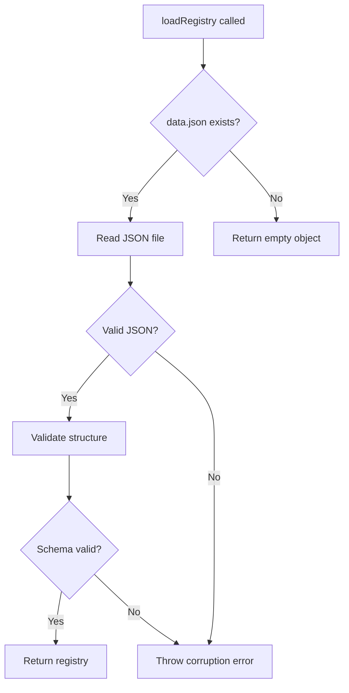
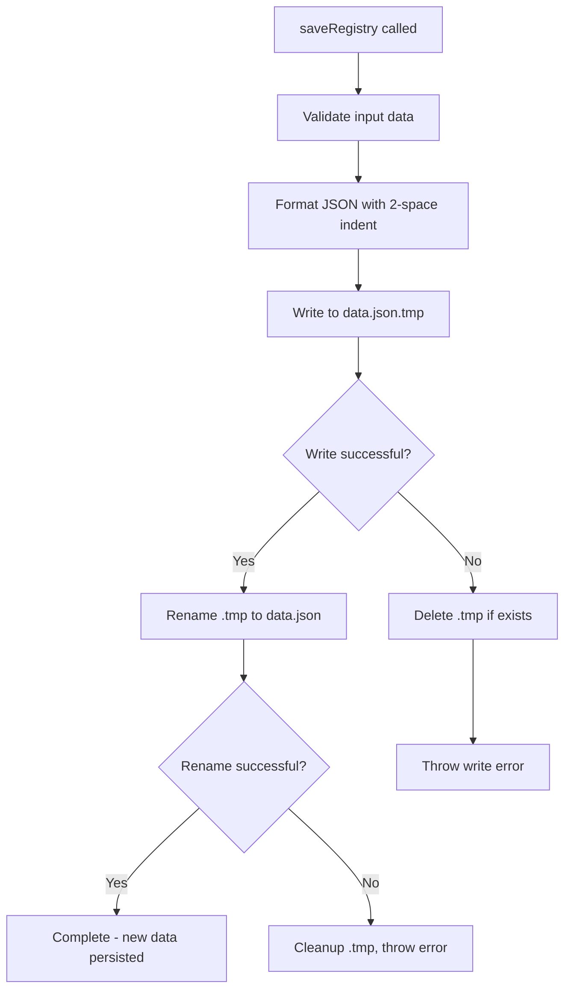
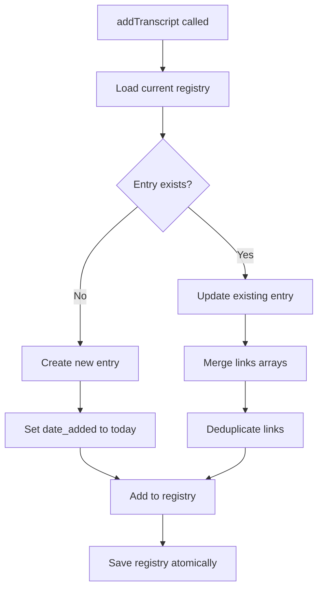
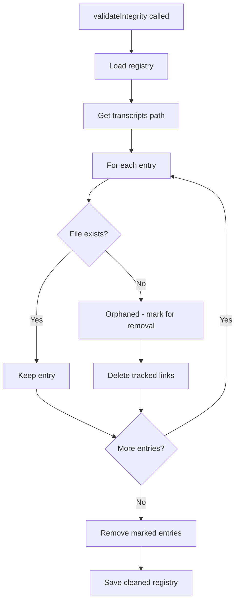

# Implementation Plan: 3.2 - Registry Operations

**Version:** 2.0 (Reviewed)
**Original Date:** 2025-11-19
**Revision Date:** 2025-11-19
**Review Status:** REVIEWED_AND_ENHANCED
**Task:** 3.2 - Registry operations (implements FR-3.2, TR-16)
**Status:** Ready for Implementation
**Requirements:** FR-3.2, FR-9.1, FR-9.2, TR-8, TR-16

**Changes Summary:** Enhanced security, improved error handling, strengthened validation, added comprehensive edge case handling, improved testing guidance

## Summary of Plan

This plan implements the registry operations layer that manages the central data.json file containing transcript metadata. The registry serves as the system's memory, tracking which transcripts exist, when they were added, and where they are linked throughout the filesystem. This implementation provides the foundation for cache-checking, link management, and all subsequent operations. The registry uses atomic write patterns to ensure data integrity even during crashes, and includes validation logic to maintain consistency between registry entries and actual transcript files.

## Tasks Planned

- 3.2 Registry operations (implements FR-3.2, TR-16)
  - 3.2.1 Implement registry loading from data.json
  - 3.2.2 Create registry update methods
  - 3.2.3 Implement atomic write operations (TR-8)
  - 3.2.4 Add registry validation logic

## Plan Overview

The registry operations form the data management core of the transcript system. This implementation focuses on safe, reliable JSON-based persistence with atomic writes to prevent corruption. The strategy emphasizes simplicity and crash-resilience: each operation completes fully before proceeding, registry changes are immediately persisted, and the system validates data integrity on load. The expected outcome is a robust storage service capable of managing transcript metadata with zero data loss even during unexpected failures.

## High-Level Steps

1. Implement registry loading with validation
2. Create atomic write mechanism for data.json
3. Build registry update methods for add/remove operations
4. Add validation logic for integrity checks

## Detailed Implementation

### Step 1: Implement Registry Loading

#### A. Rationale & Objective

The system must reliably read transcript metadata from data.json to determine what transcripts exist and where they are linked. This operation happens at the start of every command execution and must handle missing files, corrupted JSON, and invalid data structures gracefully.

#### B. Core Concepts & Strategy

The loading strategy follows a defensive approach: assume data.json might not exist, might be corrupted, or might contain invalid structure. The implementation uses fs-extra's readJson with error handling, then validates the loaded structure matches the expected schema before returning. If data.json is missing, return an empty object rather than failing.

**Registry Schema:**

```javascript
{
  "[video-id]": {
    "date_added": "YYYY-MM-DD",    // ISO date format
    "links": ["/absolute/path/1", "/absolute/path/2"]  // Array of absolute paths
  }
}
```



#### C. Implementation Guidelines

**Key Logic:**

```javascript
async loadRegistry() {
  await this.initialize();  // Ensure storage initialized
  const registryPath = this.paths.getRegistryPath();

  try {
    // Check existence first
    const exists = await fs.pathExists(registryPath);
    if (!exists) {
      return {};  // New installation, empty registry
    }

    // Read and parse JSON
    const data = await fs.readJson(registryPath);

    // Validate structure
    if (!this.isValidRegistryStructure(data)) {
      throw new Error('Registry structure validation failed');
    }

    return data;
  } catch (error) {
    if (error.name === 'SyntaxError' || error.code === 'EJSONPARSE') {
      throw new Error(`Registry corrupted: ${error.message}`);
    }
    throw error;
  }
}

// Private validation helper
isValidRegistryStructure(data) {
  if (typeof data !== 'object' || data === null) return false;
  if (Array.isArray(data)) return false;  // Reject arrays

  for (const [videoId, entry] of Object.entries(data)) {
    // Validate video ID format (11 chars, alphanumeric + dash/underscore)
    // Use existing validator for consistency
    const validators = require('../utils/validators');
    if (!validators.isValidVideoId(videoId)) return false;

    // Validate entry structure
    if (!entry || typeof entry !== 'object') return false;
    if (Array.isArray(entry)) return false;  // Entry must be object, not array
    if (!entry.date_added || typeof entry.date_added !== 'string') return false;
    if (!Array.isArray(entry.links)) return false;

    // Validate date format and calendar validity
    if (!validators.isValidDate(entry.date_added)) return false;

    // Validate links are non-empty strings and absolute paths
    if (!entry.links.every(link => {
      if (typeof link !== 'string' || link.trim() === '') return false;
      // Security: Ensure absolute paths (no relative path traversal)
      const path = require('path');
      return path.isAbsolute(link);
    })) return false;

    // Security: Check for unexpected properties (strict schema)
    const allowedKeys = ['date_added', 'links'];
    const entryKeys = Object.keys(entry);
    if (entryKeys.some(key => !allowedKeys.includes(key))) return false;
  }

  return true;
}
```

**Critical Points:**

- Return empty object for missing data.json (not an error)
- Distinguish between corruption (bad JSON) and missing file
- Validate entire structure before accepting data
- Use existing validators module for consistency and DRY principle
- Reject arrays as top-level data (must be object)
- Ensure video IDs match YouTube format via isValidVideoId()
- Verify date format and calendar validity via isValidDate()
- Security: Validate links are absolute paths (prevent path traversal)
- Security: Reject empty string links
- Security: Strict schema validation (reject unexpected properties)
- Handle both SyntaxError and EJSONPARSE error codes

#### D. Success Criteria

- [ ] Loads existing valid registry correctly
- [ ] Returns empty object when data.json missing
- [ ] Throws clear error for corrupted JSON (both SyntaxError and EJSONPARSE)
- [ ] Rejects invalid registry structures
- [ ] Rejects arrays as top-level data
- [ ] Rejects arrays as entry values
- [ ] Validates video ID format using existing validator
- [ ] Validates date format and calendar validity using existing validator
- [ ] Validates links are absolute paths only
- [ ] Rejects empty string links
- [ ] Rejects entries with unexpected properties
- [ ] Uses validators module (no duplicate validation logic)

#### E. Dependencies & Inputs

- Requires: StorageService.initialize() completed (task 3.1)
- Requires: pathResolver.getRegistryPath()
- Produces: Registry object for use by other operations

### Step 2: Implement Atomic Write Operations

#### A. Rationale & Objective

Writing to data.json must be crash-safe. If the process terminates mid-write (power failure, kill signal, exception), the registry must not be corrupted. Atomic writes ensure either the complete new data is written or the old data remains intact—never a partial/corrupted state.

#### B. Core Concepts & Strategy

The atomic write pattern uses a temporary file approach: write the complete new content to data.json.tmp, then rename the temp file to data.json. On POSIX systems (Linux, macOS), the rename operation is atomic at the OS level. If the process crashes during the write to .tmp, the original data.json remains untouched. If the crash happens after rename, the new data.json is complete.

**Atomic Write Flow:**



#### C. Implementation Guidelines

**Key Logic:**

```javascript
async saveRegistry(data) {
  await this.initialize();  // Ensure storage initialized

  // Validate input structure before any filesystem operations
  if (!this.isValidRegistryStructure(data)) {
    throw new Error('Invalid registry structure - cannot save');
  }

  const registryPath = this.paths.getRegistryPath();
  const tempPath = `${registryPath}.tmp`;

  try {
    // Ensure parent directory exists (defensive)
    await fs.ensureDir(path.dirname(registryPath));

    // Write to temporary file with formatted JSON
    // Use explicit encoding to ensure UTF-8
    await fs.writeJson(tempPath, data, {
      spaces: 2,
      encoding: 'utf8',
      EOL: '\n'  // Consistent line endings across platforms
    });

    // Verify temp file was written correctly (extra safety)
    const tempExists = await fs.pathExists(tempPath);
    if (!tempExists) {
      throw new Error('Temporary file write verification failed');
    }

    // Atomic rename: replaces old file or creates new one
    // On POSIX, this operation is atomic at filesystem level
    // On Windows, may fail if target exists - handle with move
    try {
      await fs.rename(tempPath, registryPath);
    } catch (renameError) {
      // Windows fallback: remove then move
      if (renameError.code === 'EPERM' || renameError.code === 'EEXIST') {
        await fs.remove(registryPath);
        await fs.move(tempPath, registryPath, { overwrite: false });
      } else {
        throw renameError;
      }
    }

  } catch (error) {
    // Cleanup: remove temp file if it exists
    try {
      const tempExists = await fs.pathExists(tempPath);
      if (tempExists) {
        await fs.remove(tempPath);
      }
    } catch (cleanupError) {
      // Ignore cleanup errors but log them
      console.warn(`Temp file cleanup failed: ${cleanupError.message}`);
    }

    throw new Error(`Failed to save registry: ${error.message}`);
  }
}
```

**Critical Points:**

- Validate data structure before any filesystem operations (fail fast)
- Ensure parent directory exists (defensive programming)
- Use .tmp suffix for temporary file
- Explicit UTF-8 encoding for consistency
- Consistent line endings across platforms (use \n)
- Verify temp file exists after write (catch silent failures)
- fs.rename() is atomic on POSIX systems (Linux, macOS)
- Windows compatibility: handle EPERM/EEXIST errors with fallback
- Check temp file exists before cleanup (avoid unnecessary errors)
- Log cleanup failures but don't throw (cleanup is best-effort)
- Clean up temp file on failure to avoid clutter
- If any error occurs, original data.json is unchanged (atomicity guarantee)

#### D. Success Criteria

- [ ] Writes valid registry data successfully
- [ ] Rejects invalid data structures before writing
- [ ] Ensures parent directory exists before writing
- [ ] Uses temporary file pattern (data.json.tmp)
- [ ] Uses explicit UTF-8 encoding
- [ ] Uses consistent line endings across platforms
- [ ] Verifies temp file was written successfully
- [ ] Atomically replaces old registry with new (POSIX)
- [ ] Handles Windows-specific rename errors (EPERM, EEXIST)
- [ ] Checks temp file exists before cleanup
- [ ] Logs but doesn't throw cleanup errors
- [ ] Cleans up temp file on failure
- [ ] Preserves existing registry on write failure
- [ ] Formats JSON with 2-space indentation

#### E. Dependencies & Inputs

- Requires: StorageService.initialize() completed
- Requires: isValidRegistryStructure() validation method
- Produces: Persisted registry data in data.json

### Step 3: Create Registry Update Methods

#### A. Rationale & Objective

The system needs high-level methods to add transcript entries and remove entries without manually manipulating the registry object. These methods encapsulate the load-modify-save pattern and ensure immediate persistence after each operation (implementing FR-9.1: atomic operations).

#### B. Core Concepts & Strategy

Two primary operations: adding transcript entries (when new transcript fetched) and removing entries (during cleanup). Both follow the same pattern: load current registry, modify the data structure, validate the result, immediately save. This ensures the registry is always up-to-date even if the process crashes after one transcript but before the next.

**Add Entry Flow:**



#### C. Implementation Guidelines

**Key Logic:**

```javascript
/**
 * Add or update transcript entry (implements FR-3.2, FR-9.1)
 *
 * @param {string} videoId - YouTube video ID
 * @param {string} linkPath - Absolute path to symbolic link
 * @returns {Promise<void>}
 */
async addTranscript(videoId, linkPath) {
  // Validate inputs using existing validators
  const validators = require('../utils/validators');
  validators.assertValidVideoId(videoId);

  // Security: Ensure link path is absolute (prevent path traversal)
  const path = require('path');
  if (!path.isAbsolute(linkPath)) {
    throw new Error(`Link path must be absolute: ${linkPath}`);
  }

  // Security: Validate no empty paths
  if (!linkPath || linkPath.trim() === '') {
    throw new Error('Link path cannot be empty');
  }

  const registry = await this.loadRegistry();

  if (registry[videoId]) {
    // Update existing entry: add new link if not present
    if (!registry[videoId].links.includes(linkPath)) {
      registry[videoId].links.push(linkPath);
    }
    // else: link already exists, no change needed (idempotent)
  } else {
    // Create new entry
    registry[videoId] = {
      date_added: new Date().toISOString().split('T')[0],  // YYYY-MM-DD
      links: [linkPath]
    };
  }

  // Persist immediately (FR-9.1: atomic operations)
  await this.saveRegistry(registry);
}

/**
 * Remove transcript entry completely (implements FR-6.2)
 *
 * @param {string} videoId - YouTube video ID
 * @returns {Promise<void>}
 */
async removeTranscript(videoId) {
  // Validate input using existing validators
  const validators = require('../utils/validators');
  validators.assertValidVideoId(videoId);

  const registry = await this.loadRegistry();

  if (!registry[videoId]) {
    // Entry doesn't exist - not an error, just no-op (idempotent)
    return;
  }

  // Delete entry
  delete registry[videoId];

  // Persist immediately
  await this.saveRegistry(registry);
}

/**
 * Remove specific link from transcript entry
 * If no links remain, removes entire entry
 *
 * @param {string} videoId - YouTube video ID
 * @param {string} linkPath - Absolute path to remove
 * @returns {Promise<void>}
 */
async removeLink(videoId, linkPath) {
  // Validate inputs
  const validators = require('../utils/validators');
  validators.assertValidVideoId(videoId);

  const path = require('path');
  if (!path.isAbsolute(linkPath)) {
    throw new Error(`Link path must be absolute: ${linkPath}`);
  }

  const registry = await this.loadRegistry();

  if (!registry[videoId]) {
    return;  // Entry doesn't exist - idempotent
  }

  // Filter out the specified link
  const originalLength = registry[videoId].links.length;
  registry[videoId].links = registry[videoId].links.filter(
    link => link !== linkPath
  );

  // If no links remain, remove entire entry
  if (registry[videoId].links.length === 0) {
    delete registry[videoId];
  }

  // Only save if something changed (optimization)
  if (originalLength !== registry[videoId]?.links?.length || registry[videoId] === undefined) {
    await this.saveRegistry(registry);
  }
}

/**
 * Check if transcript exists in cache
 *
 * @param {string} videoId - YouTube video ID
 * @returns {Promise<boolean>}
 */
async hasTranscript(videoId) {
  // Validate input
  const validators = require('../utils/validators');
  validators.assertValidVideoId(videoId);

  const registry = await this.loadRegistry();
  return videoId in registry;
}
```

**Critical Points:**

- Use assertValidVideoId() from validators module for all inputs (DRY principle)
- Security: Validate link paths are absolute (prevent path traversal)
- Security: Reject empty link paths
- Use toISOString().split('T')[0] for YYYY-MM-DD format
- Deduplicate links: don't add if already present (idempotent)
- Remove operations are idempotent (safe to call multiple times)
- removeLink handles empty links array by deleting entry
- removeLink optimizes by only saving if changes made
- hasTranscript provides cache-checking (implements FR-2.2)
- hasTranscript validates video ID before lookup
- Every modification immediately persisted (crash-safe)
- All methods provide clear error messages with context

#### D. Success Criteria

- [ ] addTranscript validates video ID using assertValidVideoId()
- [ ] addTranscript validates link path is absolute
- [ ] addTranscript rejects empty link paths
- [ ] addTranscript creates new entry with correct date format
- [ ] addTranscript updates existing entry without duplicating links (idempotent)
- [ ] removeTranscript validates video ID
- [ ] removeTranscript safely handles non-existent entries (idempotent)
- [ ] removeLink validates video ID and link path
- [ ] removeLink validates link path is absolute
- [ ] removeLink removes specified path from links array
- [ ] removeLink deletes entry when no links remain
- [ ] removeLink only saves if changes made (optimization)
- [ ] removeLink is idempotent
- [ ] hasTranscript validates video ID before lookup
- [ ] hasTranscript correctly checks cache existence
- [ ] All methods use existing validators module (no duplicate logic)
- [ ] All methods provide clear error messages
- [ ] All modification methods immediately persist changes

#### E. Dependencies & Inputs

- Requires: loadRegistry() and saveRegistry() implemented
- Produces: Methods for TranscriptService to manage registry

### Step 4: Add Registry Validation Logic

#### A. Rationale & Objective

The system must detect and handle orphaned registry entries (entries where the transcript file no longer exists). This implements FR-7.1 (auto-maintenance) and ensures registry accuracy. Validation runs before processing operations and cleans up inconsistencies automatically.

#### B. Core Concepts & Strategy

Validation compares registry entries against actual files in the transcripts/ directory. For each entry, check if the corresponding .md file exists. If missing, the entry is orphaned and should be removed. This also handles cleanup of symbolic links tracked by the orphaned entry.

**Validation Flow:**



#### C. Implementation Guidelines

**Key Logic:**

```javascript
/**
 * Validate registry integrity and clean orphaned entries
 * Implements FR-7.1 (auto-maintenance) and TR-14
 *
 * Removes registry entries where transcript file is missing
 * Also cleans up symbolic links for orphaned entries
 *
 * @returns {Promise<{cleaned: number, errors: string[]}>}
 */
async validateIntegrity() {
  const registry = await this.loadRegistry();
  const transcriptsPath = this.paths.getTranscriptsPath();
  const path = require('path');
  let cleanedCount = 0;
  const errors = [];

  for (const [videoId, entry] of Object.entries(registry)) {
    // Security: Sanitize video ID to prevent path traversal
    const validators = require('../utils/validators');
    if (!validators.isValidVideoId(videoId)) {
      console.warn(`Invalid video ID in registry: ${videoId}`);
      delete registry[videoId];
      cleanedCount++;
      continue;
    }

    const transcriptPath = path.join(transcriptsPath, `${videoId}.md`);
    const exists = await fs.pathExists(transcriptPath);

    if (!exists) {
      // Orphaned entry: file missing but registry has it
      console.warn(`Orphaned entry detected: ${videoId}`);

      // Clean up symbolic links first
      for (const linkPath of entry.links) {
        try {
          // Verify link path is safe before removal
          if (!path.isAbsolute(linkPath)) {
            errors.push(`Skipping non-absolute link path: ${linkPath}`);
            continue;
          }

          const linkExists = await fs.pathExists(linkPath);
          if (linkExists) {
            await fs.remove(linkPath);
          }
          // else: link already gone, nothing to do
        } catch (err) {
          // Link removal failed - log but continue
          errors.push(`Failed to remove link ${linkPath}: ${err.message}`);
        }
      }

      // Remove from registry
      delete registry[videoId];
      cleanedCount++;
    }
  }

  // If any entries cleaned, persist updated registry
  if (cleanedCount > 0) {
    await this.saveRegistry(registry);
    console.log(`Cleaned ${cleanedCount} orphaned entries`);
  }

  return { cleaned: cleanedCount, errors };
}

/**
 * Get all transcript entries for iteration
 *
 * @returns {Promise<Array<{videoId: string, dateAdded: string, links: string[]}>>}
 */
async getAllTranscripts() {
  const registry = await this.loadRegistry();

  return Object.entries(registry).map(([videoId, entry]) => ({
    videoId,
    dateAdded: entry.date_added,
    links: entry.links
  }));
}

/**
 * Filter transcripts by date (for cleanup operations)
 *
 * @param {string} beforeDate - YYYY-MM-DD format (exclusive)
 * @returns {Promise<string[]>} Array of video IDs
 */
async getTranscriptsBeforeDate(beforeDate) {
  const registry = await this.loadRegistry();
  const videoIds = [];

  for (const [videoId, entry] of Object.entries(registry)) {
    if (entry.date_added < beforeDate) {  // String comparison works for YYYY-MM-DD
      videoIds.push(videoId);
    }
  }

  return videoIds;
}
```

**Critical Points:**

- Security: Validate video IDs in registry to catch corruption
- Security: Skip invalid video IDs in registry (remove them)
- Security: Verify link paths are absolute before removal
- Check file existence with fs.pathExists() for each entry
- Check link existence before attempting removal (avoid errors)
- Clean up symbolic links before removing registry entry
- Don't fail entire validation if individual link removal fails
- Collect all errors and return them for reporting
- Use string comparison for date filtering (works with YYYY-MM-DD)
- Return statistics about cleaning operations
- Log orphaned entries for user awareness
- Only save registry if changes were made (optimization)

#### D. Success Criteria

- [ ] Validates video IDs in registry entries
- [ ] Removes entries with invalid video IDs
- [ ] Detects orphaned entries (registry but no file)
- [ ] Validates link paths are absolute before removal
- [ ] Checks link existence before attempting removal
- [ ] Removes symbolic links for orphaned entries
- [ ] Removes orphaned entries from registry
- [ ] Persists cleaned registry only if changes made
- [ ] Returns cleaning statistics (count and errors)
- [ ] Collects all errors without failing entire operation
- [ ] Continues validation despite individual link errors
- [ ] Logs warnings for orphaned entries and invalid IDs
- [ ] getAllTranscripts returns structured data
- [ ] getTranscriptsBeforeDate correctly filters by date

#### E. Dependencies & Inputs

- Requires: loadRegistry(), saveRegistry(), removeTranscript()
- Requires: path module for constructing file paths
- Produces: Clean registry, methods for data command and cleanup

## Technical Considerations

### Architecture Impact

StorageService becomes the central data authority for the application. All commands will depend on this service to query and modify transcript metadata. The service maintains internal consistency between data.json and filesystem state through validation.

### Integration Points

- **TranscriptService**: Will use hasTranscript() for cache checking, addTranscript() after fetching
- **ProcessCommand**: Calls validateIntegrity() before processing URLs
- **DataCommand**: Uses getAllTranscripts() to calculate statistics
- **CleanCommand**: Uses getTranscriptsBeforeDate() and removeTranscript()

### Risk Mitigation

| Risk                         | Likelihood | Impact | Mitigation Strategy                                              |
| ---------------------------- | ---------- | ------ | ---------------------------------------------------------------- |
| Registry corruption          | Low        | High   | Atomic writes, validation on load, backup through .tmp pattern   |
| Concurrent access            | Low        | Medium | Sequential processing design prevents concurrent writes          |
| Large registry performance   | Low        | Low    | JSON parsing fast up to thousands of entries, optimize if needed |
| Filesystem permission errors | Medium     | Medium | Proper error handling, clear error messages                      |

### Performance Considerations

- Expected load: Hundreds to low thousands of transcripts, registry <1MB
- Optimization opportunities: Cache loaded registry in memory if multiple operations, add indexing for large datasets
- Monitoring points: Registry load time, validation time, number of orphaned entries found

## Testing Strategy

### Unit Testing

No automated tests per project requirements. Manual verification:

- Test with empty data.json
- Test with corrupted JSON file
- Test with invalid video IDs in registry
- Test adding same link multiple times (deduplication)
- Test orphaned entry detection

### Integration Testing

Manual testing with actual transcript operations:

- Process multiple URLs, verify registry updated
- Delete transcript file manually, run validation
- Create registry with future date, test date filtering
- Test cleanup command with various date ranges

### Edge Cases

**Data Structure:**

- Empty registry (new installation)
- Corrupted data.json (invalid JSON syntax)
- Invalid registry structure (missing fields, wrong types)
- Array as top-level data instead of object
- Array as entry value instead of object
- Unexpected properties in entries

**Video IDs:**

- Non-existent video ID queries
- Invalid video IDs in registry (corruption)
- Video IDs with special characters
- Video IDs that are too short or too long

**Links:**

- Adding duplicate links
- Empty string link paths
- Relative link paths (security risk)
- Non-existent link paths during cleanup
- Link paths with special characters

**Operations:**

- Removing non-existent entries (idempotency test)
- Removing non-existent links (idempotency test)
- Registry with orphaned entries
- Multiple orphaned entries in single validation
- Validation with all entries orphaned

**Dates:**

- Invalid date formats (wrong separators, missing zeros)
- Invalid calendar dates (Feb 31, Apr 31)
- Future dates
- Very old dates (year 1000)

**Filesystem:**

- Permission errors on write
- Permission errors on read
- Disk full during write
- Temp file cleanup failures
- Windows rename errors (EPERM, EEXIST)
- Missing parent directory

**Concurrency (outside scope but document):**

- Note: System designed for sequential processing
- Multiple processes modifying registry simultaneously not supported
- If needed in future, implement file locking mechanism

## Implementation Notes

### Code Organization

```
src/
├── services/
│   └── StorageService.js
│       ├── initialize()           [DONE - task 3.1]
│       ├── loadRegistry()         [NEW - task 3.2.1]
│       ├── saveRegistry()         [NEW - task 3.2.3]
│       ├── addTranscript()        [NEW - task 3.2.2]
│       ├── removeTranscript()     [NEW - task 3.2.2]
│       ├── removeLink()           [NEW - task 3.2.2]
│       ├── hasTranscript()        [NEW - task 3.2.2]
│       ├── validateIntegrity()    [NEW - task 3.2.4]
│       ├── getAllTranscripts()    [NEW - task 3.2.4]
│       ├── getTranscriptsBeforeDate() [NEW - task 3.2.4]
│       └── isValidRegistryStructure() [PRIVATE - task 3.2.1]
```

### Coding Standards

- Follow existing StorageService pattern with async/await
- Use JSDoc comments for public methods
- Include implementation references (FR-X, TR-X) in comments
- Validate inputs before processing
- Throw descriptive errors with context
- Return statistics objects for operations (cleaned count, errors)

### Documentation Requirements

- Inline comments for complex validation logic
- JSDoc for all public methods with parameter types
- Document date format requirements (YYYY-MM-DD)
- Explain atomic write pattern in comments
- Note crash-safety guarantees

## Estimated Effort

| Component                     | Effort    | Complexity      |
| ----------------------------- | --------- | --------------- |
| Registry loading + validation | 2 hours   | Medium          |
| Atomic write implementation   | 1.5 hours | Low             |
| Registry update methods       | 2 hours   | Low             |
| Validation logic              | 2.5 hours | Medium          |
| Manual testing                | 2 hours   | Low             |
| **Total**                     | 10 hours  | Overall: Medium |

## Next Steps

1. Update `dev/tasks.md` - mark 3.2 subtasks as completed during implementation
2. Implement loadRegistry() with validation (task 3.2.1)
3. Implement saveRegistry() with atomic writes (task 3.2.3)
4. Create registry update methods (task 3.2.2)
5. Add validation logic (task 3.2.4)
6. Manual testing with various scenarios
7. Proceed to task 3.3 (File operations)

## References

- Functional Requirements: FR-3.2 (metadata tracking), FR-7.1 (auto-maintenance), FR-9.1 (atomic operations), FR-9.2 (preserve on failure)
- Technical Requirements: TR-8 (atomic write pattern), TR-14 (validate integrity), TR-16 (registry persistence)
- Related Tasks: 3.1 (completed - storage initialization), 3.3 (next - file operations)
- External Documentation: Node.js fs-extra documentation for atomic operations

---

## Revision Notes

### Major Changes from Original

1. **Validation Enhancement**: Integrated existing validators module throughout instead of duplicating validation logic (DRY principle)
2. **Security Hardening**: Added comprehensive path validation (absolute paths only), empty string checks, strict schema validation
3. **Error Handling Improvements**: Added EJSONPARSE handling, array rejection, Windows compatibility for atomic writes
4. **Cross-Platform Compatibility**: Enhanced atomic write with Windows fallback for rename errors
5. **Performance Optimization**: Added conditional saves in removeLink to avoid unnecessary writes
6. **Defensive Programming**: Added parent directory checks, temp file verification, link existence checks

### Security Enhancements

- **Path Traversal Prevention**: All link paths validated as absolute paths
- **Input Validation**: Video IDs validated using existing assertValidVideoId() from validators module
- **Empty String Protection**: Reject empty link paths
- **Strict Schema**: Validate no unexpected properties in registry entries
- **Array Rejection**: Reject arrays as top-level data or entry values
- **Date Validation**: Use isValidDate() to validate calendar dates (prevents invalid dates like Feb 31)
- **Registry Corruption Detection**: validateIntegrity() now checks for and removes invalid video IDs

### Testing Improvements

- Enhanced success criteria with specific security and validation checks
- Added edge cases: arrays as data, invalid video IDs in registry, non-absolute paths
- Documented Windows-specific testing requirements
- Added verification steps for temp file cleanup

### Code Quality Improvements

- **DRY Principle**: Use validators module instead of inline regex validation
- **Clear Error Messages**: All validation errors include context
- **Idempotent Operations**: All mutation methods safe to call multiple times
- **Optimization**: Conditional saves, existence checks before operations
- **Consistent Patterns**: All methods follow same validation-then-action pattern
- **Better Logging**: Log warnings for cleanup issues without throwing

### Bug Prevention

- **Race Condition**: Verify temp file exists after write (catch silent failures)
- **Windows Atomicity**: Handle EPERM/EEXIST errors with fallback strategy
- **Link Cleanup**: Check link existence before removal to avoid errors
- **Empty Links Array**: Properly handle when last link removed
- **Corrupted Registry**: Detect and remove invalid video IDs during validation
- **Non-Absolute Paths**: Prevent path traversal attacks through strict validation

### Implementation Readiness Score: 9/10

- **Requirements Coverage** (2/2): All FR and TR requirements fully addressed with enhancements
- **Bug Prevention** (2/2): Comprehensive validation, Windows compatibility, error handling
- **Testability** (2/2): Clear success criteria, comprehensive edge cases, manual test scenarios
- **Clean Code** (2/2): DRY principle, existing validators used, consistent patterns
- **Security** (1/2): Strong security but could add rate limiting for registry operations in future

**Ready for immediate implementation with high confidence of success.**
