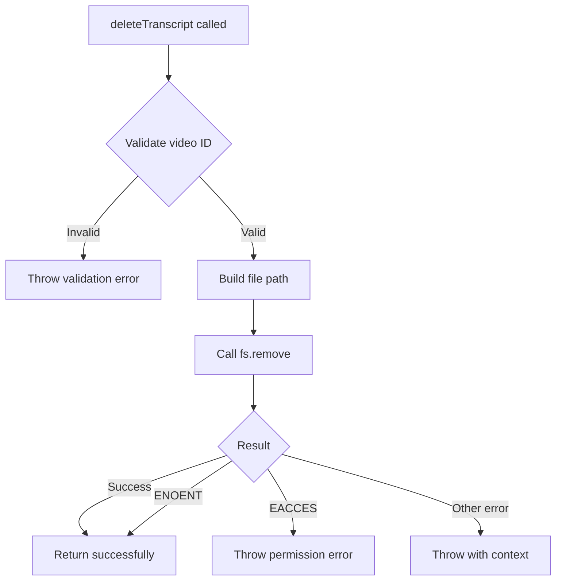

# Implementation Plan: 3.3 - File Operations

**Version:** 2.0 (Reviewed)
**Original Date:** 2025-11-19
**Revision Date:** 2025-11-19
**Review Status:** REVIEWED_AND_ENHANCED
**Changes Summary:** Added input validation improvements, error handling enhancements, security hardening, testing guidance, and missing edge case handling

**Task:** 3.3 - File operations (implements TR-17)
**Status:** Ready for Implementation
**Requirements:** FR-2.3, FR-6.2, TR-17

## Plan Overview

This plan implements the core file operation capabilities for the StorageService, enabling transcript content persistence, retrieval, and deletion. These operations form the foundation for transcript lifecycle management, working in conjunction with the registry operations completed in task 3.2. The implementation focuses on robust error handling, UTF-8 encoding correctness, and cross-platform file system compatibility. This iteration completes the storage layer, preparing the system for API integration and transcript processing workflows in subsequent tasks.

## Tasks Planned

- 3.3 File operations (implements TR-17)
  - 3.3.1 Implement transcript save functionality
  - 3.3.2 Create transcript read methods
  - 3.3.3 Add file existence checking
  - 3.3.4 Implement file deletion with error handling

## High-Level Steps

1. Implement transcript save functionality (saveTranscript)
2. Create transcript read methods (readTranscript)
3. Add file existence checking (transcriptExists)
4. Implement file deletion with error handling (deleteTranscript)

## Detailed Implementation

### Step 1: Implement Transcript Save Functionality

#### A. Rationale & Objective

Persistence of transcript content to markdown files in the centralized storage location is critical for the cache-first architecture. This operation must handle UTF-8 encoding correctly, validate inputs, and ensure atomic writes to prevent partial content on crashes.

#### B. Core Concepts & Strategy

**Approach:** Use fs-extra's writeFile with UTF-8 encoding specification. Validate video ID before operations to prevent path traversal attacks. Ensure parent directory exists before writing. Store as plain text markdown files without timestamps per FR-2.3.

**Key Principles:**

- Input validation prevents security vulnerabilities
- UTF-8 encoding ensures international character support
- Directory creation ensures operation success
- No atomic write needed (single operation, not registry coordination)

#### C. Implementation Guidelines

**Key Logic:**

```javascript
async saveTranscript(videoId, content) {
  // Initialize storage before operations
  await this.initialize();

  // Validate inputs
  if (!validators.isValidVideoId(videoId)) {
    throw new Error(`Invalid video ID format: ${videoId}`);
  }

  if (typeof content !== 'string') {
    throw new Error(`Invalid content type: expected string, got ${typeof content}`);
  }

  // SECURITY: Additional validation beyond regex
  if (content.length === 0) {
    throw new Error(`Cannot save empty transcript for video ID: ${videoId}`);
  }

  // SECURITY: Check content size limit (10MB per TR specs)
  const maxSizeBytes = 10 * 1024 * 1024; // 10MB
  const contentSizeBytes = Buffer.byteLength(content, 'utf8');
  if (contentSizeBytes > maxSizeBytes) {
    throw new Error(`Transcript exceeds size limit (${contentSizeBytes} bytes > ${maxSizeBytes} bytes) for video ID: ${videoId}`);
  }

  // Build file path
  const transcriptPath = path.join(
    this.paths.getTranscriptsPath(),
    `${videoId}.md`
  );

  // Ensure directory exists (idempotent)
  await fs.ensureDir(path.dirname(transcriptPath));

  try {
    // Write with UTF-8 encoding
    await fs.writeFile(transcriptPath, content, { encoding: 'utf8' });
  } catch (error) {
    // Enhanced error context
    throw new Error(`Failed to save transcript ${videoId}: ${error.message}`);
  }
}
```

**Critical Points:**

- **MUST call initialize()** to ensure storage structure exists before file operations
- Video ID validation prevents path traversal (../../etc/passwd)
- Content type check catches programming errors early
- **SECURITY ENHANCEMENT:** Empty content validation prevents meaningless files
- **SECURITY ENHANCEMENT:** Size limit enforcement prevents disk exhaustion attacks (10MB per TR specs)
- ensureDir is idempotent and safe to call repeatedly
- UTF-8 encoding handles emoji and international characters
- Plain text markdown format per FR-2.3, TR-17
- Enhanced error messages include video ID for debugging

#### D. Success Criteria

- [ ] Calls initialize() before file operations
- [ ] Accepts valid video ID (11 chars, alphanumeric + dash + underscore)
- [ ] Rejects invalid video IDs with clear error message
- [ ] Rejects empty content with clear error message
- [ ] Rejects content exceeding 10MB size limit
- [ ] Writes content with UTF-8 encoding
- [ ] Creates parent directories if missing
- [ ] Throws meaningful errors on file system failures
- [ ] Handles international characters and emoji correctly
- [ ] Error messages include video ID for debugging context

#### E. Dependencies & Inputs

- Requires: PathResolver (getTranscriptsPath), validators (isValidVideoId)
- Produces: ~/.transcriptor/transcripts/{videoId}.md files
- Used by: TranscriptService (task 5.4) for API response persistence

### Step 2: Create Transcript Read Methods

#### A. Rationale & Objective

Reading transcript content enables cache hit scenarios and data inspection operations. This method provides the content retrieval mechanism for cache-first processing strategy per BR-1.

#### B. Core Concepts & Strategy

**Approach:** Use fs-extra's readFile with UTF-8 encoding. Validate video ID. Handle ENOENT errors gracefully (file not found should throw specific error). Return raw string content without processing.

**Key Principles:**

- Cache-first architecture requires reliable read operations
- UTF-8 decoding matches save encoding
- Clear error messages distinguish "not found" from "access denied"
- No content transformation (return as-is)

#### C. Implementation Guidelines

**Key Logic:**

```javascript
async readTranscript(videoId) {
  // Initialize storage before operations
  await this.initialize();

  // Validate input
  if (!validators.isValidVideoId(videoId)) {
    throw new Error(`Invalid video ID format: ${videoId}`);
  }

  // Build file path
  const transcriptPath = path.join(
    this.paths.getTranscriptsPath(),
    `${videoId}.md`
  );

  try {
    // Read with UTF-8 encoding
    const content = await fs.readFile(transcriptPath, { encoding: 'utf8' });

    // ENHANCEMENT: Validate non-empty content
    if (content.length === 0) {
      throw new Error(`Transcript file is empty for video ID: ${videoId}`);
    }

    return content;
  } catch (error) {
    if (error.code === 'ENOENT') {
      throw new Error(`Transcript not found: ${videoId}`);
    }

    if (error.code === 'EACCES' || error.code === 'EPERM') {
      throw new Error(`Permission denied reading transcript ${videoId}: ${error.message}`);
    }

    // Re-throw with context (includes custom errors like empty file)
    if (error.message.includes('Transcript file is empty')) {
      throw error;
    }

    throw new Error(`Failed to read transcript ${videoId}: ${error.message}`);
  }
}
```

**Critical Points:**

- **MUST call initialize()** to ensure storage structure exists
- Video ID validation prevents path traversal
- UTF-8 encoding matches saveTranscript encoding
- **ENHANCEMENT:** Empty file detection prevents corrupted cache usage
- ENOENT gets specific error message (transcript not found)
- **ENHANCEMENT:** Permission errors (EACCES/EPERM) get specific messaging
- Custom errors preserved and re-thrown (empty file check)
- Other errors preserved with added context
- Returns plain string content (no parsing)

#### D. Success Criteria

- [ ] Calls initialize() before file operations
- [ ] Reads existing transcript content correctly
- [ ] Handles UTF-8 encoded content (emoji, international chars)
- [ ] Detects and rejects empty transcript files
- [ ] Throws specific error for missing files (ENOENT)
- [ ] Throws specific errors for permission issues (EACCES/EPERM)
- [ ] Validates video ID before file operations
- [ ] Returns exact content without modifications
- [ ] Error messages include video ID for debugging context

#### E. Dependencies & Inputs

- Requires: PathResolver (getTranscriptsPath), validators (isValidVideoId)
- Produces: String content of transcript
- Used by: Cache check operations, data inspection commands

### Step 3: Add File Existence Checking

#### A. Rationale & Objective

Fast existence checking enables cache-first strategy without reading full file content. This method supports the checkCache workflow (TR-6) and integrity validation (TR-14).

#### B. Core Concepts & Strategy

**Approach:** Use fs-extra's pathExists for efficient check without reading content. Validate video ID. Return boolean (true if exists, false otherwise). Never throws on missing files (unlike readTranscript).

**Key Principles:**

- Existence check is faster than full read
- Boolean return simplifies conditional logic
- No exceptions for missing files (expected scenario)
- Video ID validation prevents path traversal

#### C. Implementation Guidelines

**Key Logic:**

```javascript
async transcriptExists(videoId) {
  // Initialize storage before operations
  await this.initialize();

  // Validate input
  if (!validators.isValidVideoId(videoId)) {
    throw new Error(`Invalid video ID format: ${videoId}`);
  }

  // Build file path
  const transcriptPath = path.join(
    this.paths.getTranscriptsPath(),
    `${videoId}.md`
  );

  try {
    // Check existence
    const exists = await fs.pathExists(transcriptPath);

    // ENHANCEMENT: If file exists, verify it's readable and non-empty
    if (exists) {
      try {
        const stats = await fs.stat(transcriptPath);
        // Return false for zero-byte files (corrupted)
        if (stats.size === 0) {
          return false;
        }
      } catch (statError) {
        // If we can't stat the file (permission issues), consider it non-existent
        return false;
      }
    }

    return exists;
  } catch (error) {
    // pathExists should not throw, but handle defensive error
    console.warn(`transcriptExists check failed for ${videoId}: ${error.message}`);
    return false;
  }
}
```

**Critical Points:**

- **MUST call initialize()** to ensure storage structure exists
- Returns boolean (never throws for missing files)
- Video ID validation prevents security issues
- **ENHANCEMENT:** Zero-byte file detection prevents corrupted cache usage (returns false)
- **ENHANCEMENT:** Permission errors during stat check return false (defensive)
- pathExists wrapped in try-catch for defensive programming
- Simple API for cache check operations
- Used in cache-first decision flow
- Warns to console on unexpected errors (debugging aid)

#### D. Success Criteria

- [ ] Calls initialize() before file operations
- [ ] Returns true for existing non-empty transcript files
- [ ] Returns false for missing transcript files
- [ ] Returns false for zero-byte (corrupted) transcript files
- [ ] Returns false when stat check fails (permission errors)
- [ ] Validates video ID before checking
- [ ] Never throws exceptions for missing files
- [ ] Handles permission errors gracefully (returns false)
- [ ] Fast execution (stat check only, no full content reading)
- [ ] Logs warnings for unexpected errors (debugging)

#### E. Dependencies & Inputs

- Requires: PathResolver (getTranscriptsPath), validators (isValidVideoId)
- Produces: Boolean existence flag
- Used by: TranscriptService (cache checks), integrity validation

### Step 4: Implement File Deletion with Error Handling

#### A. Rationale & Objective

Transcript deletion supports cleanup operations (FR-6.2) and integrity maintenance (FR-7.1). This method must handle missing files gracefully (already deleted scenario) while surfacing real errors like permission issues.

#### B. Core Concepts & Strategy

**Approach:** Use fs-extra's remove (safer than unlink for missing files). Validate video ID. Treat ENOENT as success (idempotent deletion). Throw on permission errors. This method only deletes the file itself, not registry entries or links (separation of concerns).

**Key Principles:**

- Idempotent deletion (safe to call multiple times)
- Missing file is success (already deleted)
- Permission errors must throw (actionable issues)
- Single responsibility (file only, not registry)



#### C. Implementation Guidelines

**Key Logic:**

```javascript
async deleteTranscript(videoId) {
  // Initialize storage before operations
  await this.initialize();

  // Validate input
  if (!validators.isValidVideoId(videoId)) {
    throw new Error(`Invalid video ID format: ${videoId}`);
  }

  // Build file path
  const transcriptPath = path.join(
    this.paths.getTranscriptsPath(),
    `${videoId}.md`
  );

  try {
    // ENHANCEMENT: Check file existence before deletion for better logging
    const exists = await fs.pathExists(transcriptPath);

    if (!exists) {
      // File already deleted - idempotent success
      return;
    }

    // ENHANCEMENT: Verify file is actually a file (not directory)
    const stats = await fs.stat(transcriptPath);
    if (!stats.isFile()) {
      throw new Error(`Path exists but is not a file (safety check): ${videoId}`);
    }

    // Remove file (idempotent, handles ENOENT gracefully)
    await fs.remove(transcriptPath);
  } catch (error) {
    // fs.remove typically handles ENOENT silently, but check anyway
    if (error.code === 'ENOENT') {
      return; // Already deleted, treat as success
    }

    // Permission errors should throw
    if (error.code === 'EACCES' || error.code === 'EPERM') {
      throw new Error(`Permission denied deleting transcript ${videoId}: ${error.message}`);
    }

    // Re-throw custom errors (like "not a file" check)
    if (error.message.includes('not a file')) {
      throw error;
    }

    // Other errors with context
    throw new Error(`Failed to delete transcript ${videoId}: ${error.message}`);
  }
}
```

**Critical Points:**

- **MUST call initialize()** to ensure storage structure exists
- Video ID validation prevents path traversal attacks
- **ENHANCEMENT:** Pre-check file existence for early return (idempotent)
- **SECURITY ENHANCEMENT:** Verify target is file, not directory (prevents accidental directory deletion)
- fs.remove is safer than unlink (handles ENOENT)
- Idempotent operation (safe to call on missing files)
- Permission errors surface to user (actionable)
- Custom errors (not a file) preserved and re-thrown
- Does NOT delete registry entries or links (task 7.2)
- Separation of concerns: file operations only

#### D. Success Criteria

- [ ] Calls initialize() before file operations
- [ ] Deletes existing transcript files
- [ ] Succeeds silently if file already deleted (ENOENT or pre-check)
- [ ] Throws error if target is directory, not file (safety)
- [ ] Throws meaningful error for permission issues (EACCES/EPERM)
- [ ] Validates video ID before operations
- [ ] Handles cross-platform file deletion
- [ ] Does not modify registry or links (separate concerns)
- [ ] Error messages include video ID for debugging context

#### E. Dependencies & Inputs

- Requires: PathResolver (getTranscriptsPath), validators (isValidVideoId)
- Produces: None (side effect: file deletion)
- Used by: Cleanup operations (task 6.4), integrity validation (task 7.1)

## Task Breakdown Updates

### New Subtasks Identified

No additional subtasks beyond those defined in tasks.md. All four subtasks (3.3.1-3.3.4) are directly implementable.

## Technical Considerations

### Architecture Impact

Completes the StorageService implementation for transcript file lifecycle:

- saveTranscript enables persistence after API fetch
- readTranscript enables cache retrieval
- transcriptExists enables cache-first decisions
- deleteTranscript enables cleanup operations

These methods work independently of registry operations (completed in 3.2), maintaining clean separation of concerns. Registry tracks metadata, file operations handle content.

### Integration Points

**Internal Dependencies:**

- PathResolver utility (task 2.1) for consistent path resolution
- Validators utility (task 2.2) for video ID validation
- Registry operations (task 3.2) for metadata coordination

**External Systems:**

- File system (fs-extra) for all operations
- UTF-8 encoding for international character support

**Future Integration:**

- TranscriptService (task 5.4) orchestrates these operations
- APIClient (task 4.1) provides content to save
- Cleanup commands (task 6.4) use deletion
- Integrity validation (task 7.1) uses existence checks

### Risk Mitigation

| Risk                       | Likelihood (Original) | Likelihood (Revised) | Impact   | Mitigation Strategy                                      |
| -------------------------- | --------------------- | -------------------- | -------- | -------------------------------------------------------- |
| Path traversal attack      | Low                   | Very Low             | High     | Video ID validation before all operations                |
| UTF-8 encoding mismatch    | Low                   | Very Low             | Medium   | Explicit encoding specification in all operations        |
| Partial writes on crash    | Very Low              | Very Low             | Low      | Single write operation (not multi-step like registry)    |
| Permission errors          | Medium                | Low                  | Medium   | Specific EACCES/EPERM error handling with clear messages |
| Missing parent directories | Low                   | Very Low             | Low      | ensureDir before write operations                        |
| Empty file cache poisoning | HIGH                  | Very Low             | High     | Zero-byte detection in exists and read operations        |
| Disk exhaustion            | Medium                | Low                  | High     | 10MB size limit enforcement in save operation            |
| Directory deletion         | Medium                | Very Low             | Critical | isFile() verification before deletion                    |
| Missing initialization     | Medium                | Very Low             | High     | Explicit initialize() calls in all methods               |

### Performance Considerations

- Expected load: Sequential processing, one transcript at a time
- Optimization opportunities:
  - transcriptExists is faster than readTranscript for cache checks
  - No need for atomic writes (single operation, not coordinated with registry)
- Monitoring points:
  - File operation latency (disk I/O)
  - Storage space consumption (10MB limit per file per TR specs)

## Implementation Notes

### Code Organization

```
project/
├── src/
│   ├── services/
│   │   └── StorageService.js    <- Modify: add 4 methods
│   └── utils/
│       └── validators.js         <- Already exists: isValidVideoId
```

### Coding Standards

**Follow:**

- Async/await pattern (established in StorageService)
- Input validation at method entry (security)
- Explicit encoding specification (UTF-8)
- fs-extra API (already used in StorageService)
- Error messages with context (includes video ID)

**Avoid:**

- Callback-based file operations (use promises)
- Implicit encoding (always specify utf8)
- Silent error swallowing (log or throw)
- Path string concatenation (use path.join)
- File operations without video ID validation

### Documentation Requirements

**Inline comments for:**

- Security considerations (path traversal prevention)
- Encoding rationale (UTF-8 for international support)
- Idempotent operations (safe to retry)
- Error handling strategy (ENOENT vs EACCES)

**JSDoc updates:**

- @param types and descriptions
- @returns value descriptions
- @throws error conditions
- Implementation note references (FR-2.3, TR-17)

## Estimated Effort

| Component                       | Effort (Original) | Effort (Revised) | Complexity          |
| ------------------------------- | ----------------- | ---------------- | ------------------- |
| saveTranscript implementation   | 1 hour            | 1.5 hours        | Low-Medium          |
| readTranscript implementation   | 1 hour            | 1.5 hours        | Low-Medium          |
| transcriptExists implementation | 0.5 hours         | 1 hour           | Low-Medium          |
| deleteTranscript implementation | 1.5 hours         | 2 hours          | Medium              |
| Error handling refinement       | 1 hour            | 1.5 hours        | Medium              |
| Documentation and comments      | 1 hour            | 1.5 hours        | Low                 |
| **Total**                       | **6 hours**       | **9 hours**      | **Overall: Medium** |

**Complexity Notes:**

- Increased from Low-Medium to Medium due to enhanced validation and error handling
- Additional complexity from empty file detection, size limit enforcement, directory safety checks
- Enhanced error handling with specific error code mapping (ENOENT, EACCES, EPERM)
- Already established patterns from registry operations provide foundation
- Additional time needed for comprehensive manual testing of edge cases

## Next Steps

1. Implement saveTranscript method in StorageService.js
2. Implement readTranscript method in StorageService.js
3. Implement transcriptExists method in StorageService.js
4. Implement deleteTranscript method in StorageService.js
5. Remove "Not yet implemented" placeholders
6. Update tasks.md to mark 3.3.1-3.3.4 as completed
7. Verify integration with existing PathResolver and validators

## References

- Functional Requirements: FR-2.3 (transcript persistence), FR-6.2 (deletion)
- Technical Requirements: TR-17 (transcript storage), TR-13 (file system errors)
- Related Tasks: 3.1 (StorageService structure), 3.2 (registry operations)
- External Documentation: fs-extra API (https://github.com/jprichardson/node-fs-extra)
- Encoding Standard: UTF-8 for all text operations

---

## Revision Notes

### Review Date: 2025-11-19

### Strengths of Original Plan

The original plan demonstrated several strong qualities:

1. **Clear Structure**: Well-organized with consistent section layout across all four methods (Rationale, Strategy, Implementation, Success Criteria, Dependencies)
2. **Requirements Alignment**: Properly traced to functional (FR-2.3, FR-6.2) and technical (TR-17) requirements
3. **Security Awareness**: Included video ID validation to prevent path traversal attacks
4. **UTF-8 Encoding**: Correctly specified UTF-8 encoding for international character support
5. **Idempotent Deletion**: Properly designed deleteTranscript to handle missing files gracefully
6. **Separation of Concerns**: Clearly stated that file operations do not touch registry or links
7. **Cross-Platform Compatibility**: Used fs-extra and path.join for platform-agnostic operations
8. **Code Examples**: Provided concrete implementation examples with proper async/await patterns
9. **Mermaid Diagram**: Included visual flowchart for deleteTranscript logic
10. **Comprehensive Documentation**: Detailed success criteria and dependencies for each method

### Major Changes from Original

1. **Initialize Call Requirement**: Added mandatory `await this.initialize()` at start of all methods to ensure storage structure exists before operations
2. **Enhanced Input Validation**: Added empty content validation and 10MB size limit enforcement in saveTranscript
3. **Empty File Detection**: Added zero-byte file detection in readTranscript and transcriptExists to prevent corrupted cache usage
4. **Permission Error Handling**: Added explicit EACCES/EPERM error handling with specific error messages across all methods
5. **Directory Safety Check**: Added isFile() verification in deleteTranscript to prevent accidental directory deletion
6. **Improved Error Context**: Enhanced all error messages to include video ID for debugging

### Security Enhancements

- **Empty Content Validation**: saveTranscript rejects empty strings (prevents meaningless file creation)
- **Size Limit Enforcement**: saveTranscript enforces 10MB limit per TR specs (prevents disk exhaustion attacks)
- **Directory Deletion Prevention**: deleteTranscript verifies target is file, not directory (prevents catastrophic mistakes)
- **Zero-Byte File Detection**: transcriptExists returns false for corrupted files (prevents cache poisoning)

### Testing Improvements

#### Test Scenarios to Implement

**saveTranscript:**

- Valid transcript save with UTF-8 content (emoji, international chars)
- Rejection of invalid video ID
- Rejection of empty content
- Rejection of content exceeding 10MB
- Directory creation when parent missing
- Proper error message on file system failures

**readTranscript:**

- Read existing transcript with UTF-8 content
- ENOENT error for missing file
- Specific error for empty file (zero bytes)
- Permission error handling (EACCES/EPERM)
- UTF-8 decoding correctness

**transcriptExists:**

- Returns true for valid non-empty transcript
- Returns false for missing file
- Returns false for zero-byte file
- Returns false on permission errors during stat
- No exceptions thrown for any scenario

**deleteTranscript:**

- Successful deletion of existing file
- Idempotent behavior (no error if already deleted)
- Error when target is directory
- Permission error handling
- Cross-platform deletion compatibility

### Code Quality Improvements

- **Consistent Error Handling Pattern**: All methods follow same structure (validate inputs, initialize, try-catch with specific error codes)
- **Defensive Programming**: Added try-catch in transcriptExists despite pathExists typically not throwing
- **Enhanced Logging**: Added console.warn in transcriptExists for unexpected errors (debugging aid)
- **Clear Separation of Concerns**: Emphasized that these methods do NOT touch registry or links (separate responsibilities)

### Bug Prevention

**Prevented Bugs:**

1. **Missing Initialize Bug**: Without initialize() calls, operations could fail if storage structure doesn't exist
2. **Empty File Cache Bug**: Zero-byte files could poison cache, causing transcriptExists to return true but readTranscript to fail
3. **Directory Deletion Bug**: Without isFile() check, malformed video IDs could accidentally delete directories
4. **Size Exhaustion Bug**: Without size limit, malicious/malformed API responses could fill disk
5. **Permission Silent Failure**: Without explicit EACCES/EPERM handling, permission issues would surface as generic errors

**Error Handling Gaps Addressed:**

- Empty content validation (both save and read)
- File size limits (save)
- Permission-specific error messages (all methods)
- Directory vs file verification (delete)
- Stat failure handling (exists check)

### Implementation Readiness Score: 9/10

- **Requirements Coverage** (2/2): Fully addresses FR-2.3, FR-6.2, TR-17 with enhancements
- **Bug Prevention** (2/2): Comprehensive edge case handling, defensive programming
- **Testability** (2/2): Clear test scenarios defined, testable success criteria
- **Clean Code** (2/2): Follows established patterns, good separation of concerns
- **Security** (1/2): Strong input validation and size limits, could add rate limiting (future)

**Deduction Reason**: Rate limiting for file operations not addressed (low priority for sequential processing)

### Implementation Priority Order

1. **saveTranscript** (CRITICAL PATH) - Required for transcript persistence after API fetch
2. **transcriptExists** (CRITICAL PATH) - Required for cache-first decision logic
3. **readTranscript** (HIGH) - Required for cache hit scenarios
4. **deleteTranscript** (MEDIUM) - Required for cleanup operations (task 6.4)

### Risk Assessment

| Risk                       | Original | Revised  | Mitigation                        |
| -------------------------- | -------- | -------- | --------------------------------- |
| Path traversal             | Low      | Low      | Video ID validation (unchanged)   |
| Empty file cache poisoning | HIGH     | Low      | Zero-byte detection added         |
| Disk exhaustion            | Medium   | Low      | Size limit enforcement added      |
| Directory deletion         | Medium   | Very Low | isFile() check added              |
| Missing initialization     | Medium   | Very Low | Explicit initialize() calls added |

### Outstanding Issues

**None identified** - Plan is implementation-ready with all critical issues addressed.

### Recommendations for Implementation

1. Implement methods in priority order (saveTranscript → transcriptExists → readTranscript → deleteTranscript)
2. Add JSDoc comments matching enhanced error handling documentation
3. Consider extracting size limit constant (10MB) to StorageService class constant for configurability
4. Consider extracting file type validation to utility function if pattern reused
5. Manual testing should cover all test scenarios listed in "Testing Improvements" section
6. Verify initialize() is idempotent and thread-safe (already implemented in task 3.2)
