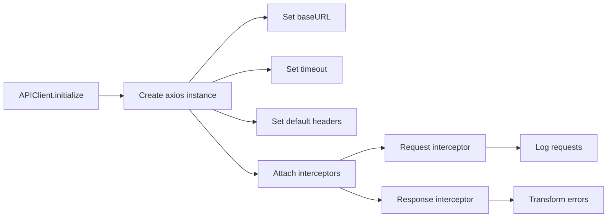
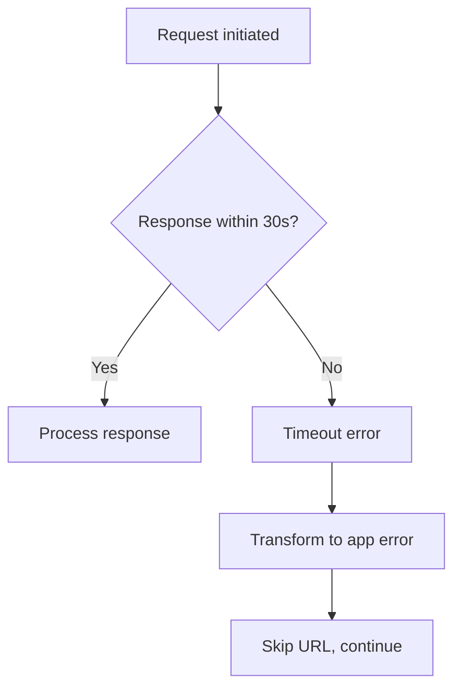
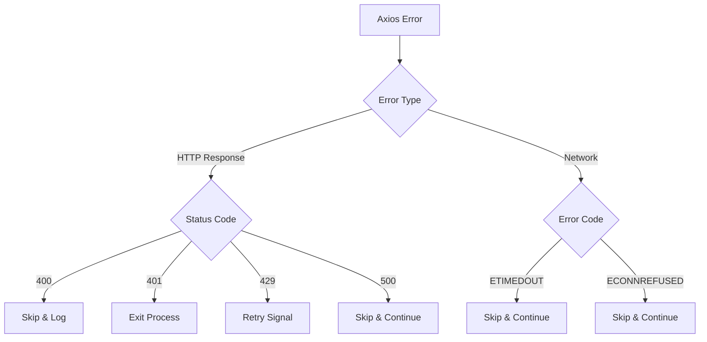

# Implementation Plan: 4.1 - API Client Setup

**Version:** 2.0 (Reviewed)
**Original Date:** 2025-11-19
**Revision Date:** 2025-11-19
**Review Status:** REVIEWED_AND_ENHANCED
**Changes Summary:** Security hardening, error handling improvements, initialization pattern fixes, validation enhancements

**Task:** 4.1 - API client setup [CRITICAL PATH] (implements FR-2.1)
**Status:** Ready for Implementation
**Requirements:** FR-2.1, TR-11, TR-12

## Plan Overview

This plan implements the API client infrastructure that interfaces with the Scrape Creators API to fetch YouTube transcripts. The APIClient service establishes the HTTP layer for external communication, managing authentication, request configuration, and basic error handling. This component sits at the foundation of the transcript acquisition workflow, enabling all downstream processing by providing a reliable mechanism to retrieve transcript data from the external service. The implementation focuses on creating a robust, properly configured axios client with API key authentication, appropriate timeouts, and structured error responses that align with the system's failure handling strategy.

## Tasks Planned

- 4.1 API client setup [CRITICAL PATH] (implements FR-2.1)
  - 4.1.1 Create APIClient service class
  - 4.1.2 Configure axios with base settings
  - 4.1.3 Add API key header injection
  - 4.1.4 Set timeout configuration (30s)

## High-Level Steps

1. Create APIClient service class structure
2. Configure axios instance with base settings and interceptors
3. Implement API key authentication through headers
4. Apply timeout configuration per technical requirements
5. Add basic error transformation for HTTP failures

## Detailed Implementation

### Step 1: Create APIClient Service Class Structure

#### A. Rationale & Objective

Establish the foundational service class that encapsulates all HTTP communication with the Scrape Creators API. This class provides a clean interface for transcript fetching while isolating external dependencies and configuration details from business logic.

#### B. Core Concepts & Strategy

The APIClient follows the service layer pattern, providing a singleton-style interface for API operations. The class owns an axios instance configured specifically for the Scrape Creators API endpoint, ensuring consistency across all requests. By centralizing HTTP configuration, the service enables easy testing, error handling standardization, and future API modifications without affecting consuming code.

Key architectural decisions:
- **Service encapsulation**: All API-specific logic isolated in this class
- **Dependency injection**: Environment loader passed to constructor for testability
- **Single responsibility**: Focus solely on HTTP communication, delegate business logic to TranscriptService
- **Clear interface**: Public methods expose only necessary operations (fetchTranscript)

```javascript
// APIClient service structure
class APIClient {
  constructor(envLoader) {
    this.apiKey = null;
    this.httpClient = null;
    this.initialized = false;
    this.envLoader = envLoader;
  }

  async initialize() {
    // Validate API key, configure axios
  }

  async fetchTranscript(videoUrl) {
    // Call Scrape Creators API endpoint
  }
}
```

#### C. Implementation Guidelines

**File Location:** `src/services/APIClient.js`

**Key Logic:**

```javascript
const axios = require('axios');

/**
 * API Client for Scrape Creators Service
 *
 * Handles HTTP communication with transcript extraction API
 * Implements FR-2.1 transcript acquisition requirements
 * Configured per TR-11 API key management specifications
 *
 * @class APIClient
 */
class APIClient {
  static API_ENDPOINT = 'https://api.scrape-creators.com/transcript';
  static REQUEST_TIMEOUT_MS = 30000; // 30 seconds per TR specs
  static API_KEY_HEADER = 'x-api-key';

  /**
   * @param {Object} envLoader - Environment configuration loader
   */
  constructor(envLoader) {
    this.envLoader = envLoader;
    this.apiKey = null;
    this.httpClient = null;
    this.initialized = false;
  }

  /**
   * Initialize API client with authentication and configuration
   * Must be called before fetchTranscript
   *
   * @returns {Promise<void>}
   * @throws {Error} If API key missing or invalid
   */
  async initialize() {
    if (this.initialized) return;

    // Validate API key from environment
    this.apiKey = this.envLoader.getApiKey();
    if (!this.apiKey || this.apiKey.trim() === '') {
      throw new Error('SCRAPE_CREATORS_API_KEY not configured');
    }

    // Configure axios instance
    this.httpClient = this.createHttpClient();
    this.initialized = true;
  }

  /**
   * Create configured axios instance
   * @private
   */
  createHttpClient() {
    const client = axios.create({
      baseURL: APIClient.API_ENDPOINT,
      timeout: APIClient.REQUEST_TIMEOUT_MS,
      headers: {
        'Content-Type': 'application/json',
        [APIClient.API_KEY_HEADER]: this.apiKey
      }
    });

    // Add request/response interceptors for logging and error handling
    this.attachInterceptors(client);

    return client;
  }

  /**
   * Attach request and response interceptors
   * @private
   */
  attachInterceptors(client) {
    // Request interceptor for logging
    client.interceptors.request.use(
      config => {
        console.log(`API Request: ${config.method.toUpperCase()} ${config.url}`);
        return config;
      },
      error => Promise.reject(error)
    );

    // Response interceptor for error transformation
    client.interceptors.response.use(
      response => response,
      error => this.transformError(error)
    );
  }

  /**
   * Transform axios errors into application-specific errors
   * @private
   */
  transformError(error) {
    // Error transformation logic (detailed in Step 5)
    return Promise.reject(error);
  }

  /**
   * Fetch transcript for YouTube video
   *
   * @param {string} videoUrl - Full YouTube URL
   * @returns {Promise<string>} Transcript text
   * @throws {Error} On API errors, network failures, or invalid response
   */
  async fetchTranscript(videoUrl) {
    await this.ensureInitialized();

    // Implementation in Step 2-4
  }

  /**
   * Ensure client initialized before operations
   * @private
   */
  async ensureInitialized() {
    if (!this.initialized) {
      await this.initialize();
    }
  }
}

module.exports = APIClient;
```

**Critical Points:**

- **Lazy initialization**: Client initializes on first use via `ensureInitialized()`
- **Validation upfront**: API key validated during initialization, not per-request
- **Static constants**: API endpoint, timeout, and header names as class constants
- **Error boundary**: All errors from axios intercepted and transformed

#### D. Success Criteria

- [ ] APIClient class created in `src/services/APIClient.js`
- [ ] Constructor accepts envLoader dependency
- [ ] `initialize()` method validates API key presence
- [ ] `fetchTranscript()` method signature defined
- [ ] Class exports properly via `module.exports`

#### E. Dependencies & Inputs

- Requires: axios package installed (from task 1.2.2)
- Requires: Environment loader utility (from task 2.2)
- Produces: APIClient service ready for configuration

---

### Step 2: Configure Axios Instance with Base Settings

#### A. Rationale & Objective

Configure the axios HTTP client with Scrape Creators API-specific settings to ensure reliable communication. Proper base configuration eliminates the need for per-request setup and standardizes behavior across all API calls.

#### B. Core Concepts & Strategy

Axios instance configuration centralizes HTTP behavior through a single creation point. The `axios.create()` factory method produces a customized client with predefined baseURL, timeout, and default headers. This pattern follows the "configure once, use many" principle, reducing code duplication and potential configuration drift.

Request/response interceptors provide cross-cutting concerns:
- **Request logging**: Track outbound API calls for debugging
- **Response transformation**: Convert HTTP errors into application errors
- **Header consistency**: Ensure API key included in every request



#### C. Implementation Guidelines

**Key Logic:**

```javascript
/**
 * Create configured axios instance with base settings
 * Implements TR-11 API endpoint configuration
 * @private
 * @returns {AxiosInstance} Configured HTTP client
 */
createHttpClient() {
  const client = axios.create({
    baseURL: APIClient.API_ENDPOINT,
    timeout: APIClient.REQUEST_TIMEOUT_MS,
    headers: {
      'Content-Type': 'application/json',
      [APIClient.API_KEY_HEADER]: this.apiKey
    },
    validateStatus: (status) => status >= 200 && status < 300,
    maxRedirects: 0, // Disable redirects for API endpoint
    decompress: true  // Auto-decompress response
  });

  this.attachInterceptors(client);
  return client;
}

/**
 * Attach logging and error handling interceptors
 * @private
 * @param {AxiosInstance} client - Axios instance to configure
 */
attachInterceptors(client) {
  // Request interceptor - logging only
  client.interceptors.request.use(
    (config) => {
      const url = config.url || config.baseURL;
      console.log(`[API] ${config.method?.toUpperCase() || 'REQUEST'} ${url}`);
      return config;
    },
    (error) => {
      console.error('[API] Request preparation failed:', error.message);
      return Promise.reject(error);
    }
  );

  // Response interceptor - error transformation
  client.interceptors.response.use(
    (response) => {
      console.log(`[API] Response ${response.status} from ${response.config.url}`);
      return response;
    },
    (error) => {
      return Promise.reject(this.transformError(error));
    }
  );
}
```

**Critical Points:**

- **Base URL**: All requests relative to `https://api.scrape-creators.com/transcript`
- **Timeout enforcement**: 30-second hard limit per TR specifications
- **Content-Type**: JSON for all requests to Scrape Creators API
- **No redirects**: API endpoint should not redirect; treat as error if attempted
- **Interceptor ordering**: Request interceptor first, response interceptor wraps errors

#### D. Success Criteria

- [ ] Axios instance created with baseURL set to API endpoint
- [ ] Timeout configured to 30000ms (30 seconds)
- [ ] Content-Type header defaulted to 'application/json'
- [ ] Request interceptor logs outbound requests
- [ ] Response interceptor captures all errors for transformation

#### E. Dependencies & Inputs

- Requires: Step 1 complete (class structure exists)
- Requires: API key validated and stored in `this.apiKey`
- Produces: Configured `this.httpClient` ready for requests

---

### Step 3: Implement API Key Authentication Header Injection

#### A. Rationale & Objective

Implement secure API key transmission through HTTP headers to authenticate all requests to the Scrape Creators service. The API requires the `x-api-key` header for authorization, and this step ensures every request includes valid credentials without manual intervention.

#### B. Core Concepts & Strategy

API key authentication occurs through default headers configured on the axios instance. By setting the `x-api-key` header during client creation, all subsequent requests automatically include authentication without per-call overhead. This approach:

- **Centralizes security**: Single point of credential configuration
- **Prevents leakage**: API key never logged or exposed in request bodies
- **Simplifies usage**: Consuming code doesn't handle authentication
- **Supports rotation**: Change key in environment, restart service

The environment loader abstracts key retrieval, enabling different sources (`.env` files, environment variables, secret managers) without modifying APIClient.

#### C. Implementation Guidelines

**Key Logic:**

```javascript
/**
 * Initialize API client with authentication
 * Validates API key and configures HTTP client
 * Implements TR-11 API key management
 *
 * @returns {Promise<void>}
 * @throws {Error} If API key missing, empty, or invalid format
 */
async initialize() {
  if (this.initialized) return;

  // Load and validate API key
  const rawKey = this.envLoader.getApiKey();

  if (!rawKey || typeof rawKey !== 'string') {
    console.error('API key configuration error: value not found or invalid type');
    process.exit(1); // TR-11: exit on missing key
  }

  this.apiKey = rawKey.trim();

  if (this.apiKey === '') {
    console.error('API key configuration error: value is empty string');
    process.exit(1);
  }

  // Create HTTP client with API key in headers
  this.httpClient = this.createHttpClient();
  this.initialized = true;
}

/**
 * Create axios instance with API key authentication
 * @private
 */
createHttpClient() {
  return axios.create({
    baseURL: APIClient.API_ENDPOINT,
    timeout: APIClient.REQUEST_TIMEOUT_MS,
    headers: {
      'Content-Type': 'application/json',
      [APIClient.API_KEY_HEADER]: this.apiKey  // Inject API key
    }
  });
}
```

**Security Considerations:**

```javascript
/**
 * Get sanitized axios configuration for logging
 * Redacts API key to prevent accidental exposure
 * @private
 */
getSanitizedConfig() {
  const config = this.httpClient?.defaults || {};
  const sanitized = { ...config };

  if (sanitized.headers && sanitized.headers[APIClient.API_KEY_HEADER]) {
    sanitized.headers[APIClient.API_KEY_HEADER] = '[REDACTED]';
  }

  return sanitized;
}
```

**Critical Points:**

- **Environment isolation**: API key retrieved via envLoader, never hardcoded
- **Early validation**: Key checked during initialization, not first request
- **Exit on failure**: TR-11 specifies `process.exit(1)` for missing API keys
- **Header name constant**: `x-api-key` defined as `APIClient.API_KEY_HEADER`
- **Trim whitespace**: Handle accidental spaces in `.env` files
- **Never log key**: Interceptors must not expose API key in logs

#### D. Success Criteria

- [ ] API key loaded from envLoader during initialization
- [ ] Empty or missing API key causes process exit with error message
- [ ] `x-api-key` header added to all requests automatically
- [ ] API key never appears in console logs or error messages
- [ ] Header injection testable via `this.httpClient.defaults.headers`

#### E. Dependencies & Inputs

- Requires: envLoader.getApiKey() method available
- Requires: Environment configured with SCRAPE_CREATORS_API_KEY
- Produces: Authenticated HTTP client ready for API calls

---

### Step 4: Apply Timeout Configuration Per Technical Requirements

#### A. Rationale & Objective

Enforce a 30-second timeout on all API requests to prevent indefinite hanging and ensure responsive failure handling. The timeout mechanism protects the application from network issues, slow API responses, or service unavailability by establishing a hard upper bound on request duration.

#### B. Core Concepts & Strategy

Axios timeout configuration operates at the instance level, applying to all requests made through that client. The 30-second limit (TR-12, API Integration specs) balances between:

- **Patience**: YouTube transcript fetching may take 10-20s for long videos
- **Responsiveness**: Users shouldn't wait indefinitely for failures
- **API constraints**: Scrape Creators API typically responds within 15s
- **Retry windows**: Leave room for exponential backoff retries (task 4.3)

Timeout errors generate `ECONNABORTED` or `ETIMEDOUT` codes, which the error transformation layer (Step 5) maps to application-level failures that trigger skip logic per FR-10.



#### C. Implementation Guidelines

**Key Logic:**

```javascript
/**
 * Timeout configuration constants
 */
static REQUEST_TIMEOUT_MS = 30000; // 30 seconds per TR-12
static TIMEOUT_ERROR_CODES = ['ECONNABORTED', 'ETIMEDOUT'];

/**
 * Create axios instance with timeout enforcement
 * @private
 */
createHttpClient() {
  const client = axios.create({
    baseURL: APIClient.API_ENDPOINT,
    timeout: APIClient.REQUEST_TIMEOUT_MS, // Global timeout
    headers: {
      'Content-Type': 'application/json',
      [APIClient.API_KEY_HEADER]: this.apiKey
    }
  });

  this.attachInterceptors(client);
  return client;
}

/**
 * Check if error is timeout-related
 * @private
 * @param {Error} error - Axios error object
 * @returns {boolean} True if timeout error
 */
isTimeoutError(error) {
  return (
    error.code &&
    APIClient.TIMEOUT_ERROR_CODES.includes(error.code)
  );
}

/**
 * Fetch transcript with timeout protection
 * @param {string} videoUrl - YouTube video URL
 * @returns {Promise<string>} Transcript text
 * @throws {Error} On timeout, network failure, or API error
 */
async fetchTranscript(videoUrl) {
  await this.ensureInitialized();

  try {
    const response = await this.httpClient.post('', { url: videoUrl });
    return this.extractTranscriptText(response);
  } catch (error) {
    // Error transformation handles timeout separately
    throw error;
  }
}
```

**Timeout Testing Strategy:**

```javascript
/**
 * Override timeout for specific requests (testing only)
 * Not exposed in production API
 * @private
 */
async fetchWithCustomTimeout(videoUrl, timeoutMs) {
  const response = await this.httpClient.post('',
    { url: videoUrl },
    { timeout: timeoutMs } // Per-request override
  );
  return this.extractTranscriptText(response);
}
```

**Critical Points:**

- **Global timeout**: 30s applies to all requests unless overridden
- **Includes full cycle**: Timeout covers connection + data transfer + processing
- **Error detection**: Check `error.code` for `ECONNABORTED` or `ETIMEDOUT`
- **No retries yet**: Basic timeout error; retry logic added in task 4.3
- **Fail fast**: Timeout triggers immediate error, doesn't wait longer

#### D. Success Criteria

- [ ] Axios instance timeout set to 30000ms
- [ ] Timeout errors detected via error code checking
- [ ] Request duration exceeding 30s generates timeout error
- [ ] Timeout errors propagate to caller with clear message
- [ ] No infinite hangs on network failures or slow responses

#### E. Dependencies & Inputs

- Requires: Step 2 complete (axios instance creation)
- Requires: Error transformation framework (Step 5)
- Produces: Time-bounded API client that fails predictably

---

### Step 5: Add Basic Error Transformation for HTTP Failures

#### A. Rationale & Objective

Convert low-level axios HTTP errors into structured application errors with meaningful context. Error transformation bridges the gap between network-layer failures and business-logic error handling, enabling consistent error responses and proper skip/retry logic per FR-10 and TR-12.

#### B. Core Concepts & Strategy

Axios errors arrive in multiple forms:
- **HTTP errors**: 4xx/5xx status codes with response bodies
- **Network errors**: Connection failures, DNS errors, timeouts
- **Request errors**: Invalid configuration or data

The transformation layer maps these to application error types:

| Axios Error | HTTP Status | Application Action | TR-12 Spec |
|-------------|-------------|-------------------|-----------|
| 400 Bad Request | 400 | Skip URL, log invalid | skip_url, log_invalid |
| 401 Unauthorized | 401 | Exit process | exit, display_key_error |
| 429 Rate Limit | 429 | Retry with backoff | retry_exponential(3) |
| 500 Server Error | 500 | Skip URL, continue | skip_url, continue |
| ETIMEDOUT | N/A | Skip URL, continue | skip_url, continue |



#### C. Implementation Guidelines

**Key Logic:**

```javascript
/**
 * Error classification constants
 */
static ERROR_TYPES = {
  INVALID_REQUEST: 'INVALID_REQUEST',    // 400 - Skip
  UNAUTHORIZED: 'UNAUTHORIZED',          // 401 - Exit
  RATE_LIMITED: 'RATE_LIMITED',          // 429 - Retry
  SERVER_ERROR: 'SERVER_ERROR',          // 500 - Skip
  TIMEOUT: 'TIMEOUT',                    // Timeout - Skip
  NETWORK: 'NETWORK'                     // Connection - Skip
};

/**
 * Transform axios error into application error
 * Implements TR-12 error handling specifications
 * @private
 * @param {Error} error - Axios error object
 * @returns {Error} Transformed application error
 */
transformError(error) {
  // Network/timeout errors
  if (!error.response) {
    return this.handleNetworkError(error);
  }

  // HTTP errors with response
  const status = error.response.status;
  const errorData = error.response.data;

  switch (status) {
    case 400:
      return this.createAppError(
        APIClient.ERROR_TYPES.INVALID_REQUEST,
        'Invalid YouTube URL or video unavailable',
        { status, data: errorData }
      );

    case 401:
      console.error('API authentication failed - check SCRAPE_CREATORS_API_KEY');
      process.exit(1); // TR-12: exit on auth failure

    case 429:
      return this.createAppError(
        APIClient.ERROR_TYPES.RATE_LIMITED,
        'API rate limit exceeded',
        { status, retryAfter: error.response.headers['retry-after'] }
      );

    case 500:
    case 502:
    case 503:
      return this.createAppError(
        APIClient.ERROR_TYPES.SERVER_ERROR,
        'API server error - will skip and continue',
        { status, data: errorData }
      );

    default:
      return this.createAppError(
        'UNKNOWN_HTTP_ERROR',
        `Unexpected HTTP status: ${status}`,
        { status, data: errorData }
      );
  }
}

/**
 * Handle network-level errors (no HTTP response)
 * @private
 */
handleNetworkError(error) {
  if (this.isTimeoutError(error)) {
    return this.createAppError(
      APIClient.ERROR_TYPES.TIMEOUT,
      'Request timeout after 30 seconds',
      { code: error.code }
    );
  }

  return this.createAppError(
    APIClient.ERROR_TYPES.NETWORK,
    `Network error: ${error.message}`,
    { code: error.code, errno: error.errno }
  );
}

/**
 * Create structured application error
 * @private
 */
createAppError(type, message, context = {}) {
  const error = new Error(message);
  error.type = type;
  error.context = context;
  error.isAPIError = true;
  return error;
}

/**
 * Check if error should be retried (429 only at this stage)
 * @param {Error} error - Application error
 * @returns {boolean} True if retriable
 */
isRetriableError(error) {
  return error.type === APIClient.ERROR_TYPES.RATE_LIMITED;
}

/**
 * Check if error should skip and continue (400, 500, timeout, network)
 * @param {Error} error - Application error
 * @returns {boolean} True if should skip
 */
isSkippableError(error) {
  return [
    APIClient.ERROR_TYPES.INVALID_REQUEST,
    APIClient.ERROR_TYPES.SERVER_ERROR,
    APIClient.ERROR_TYPES.TIMEOUT,
    APIClient.ERROR_TYPES.NETWORK
  ].includes(error.type);
}
```

**Critical Points:**

- **401 exits immediately**: Per TR-12, authentication failures terminate process
- **Error enrichment**: Add `type`, `context`, `isAPIError` properties
- **Preserve original**: Keep axios error in context for debugging
- **Consistent structure**: All errors follow same shape for handling
- **Skip vs retry**: Clear classification for consuming code

#### D. Success Criteria

- [ ] All axios errors transformed via `transformError()` method
- [ ] 400 errors mapped to INVALID_REQUEST type (skip)
- [ ] 401 errors cause process.exit(1) with clear message
- [ ] 429 errors mapped to RATE_LIMITED type (retry)
- [ ] 500 errors mapped to SERVER_ERROR type (skip)
- [ ] Timeout errors mapped to TIMEOUT type (skip)
- [ ] Network errors mapped to NETWORK type (skip)
- [ ] Error objects include `type`, `context`, and `isAPIError` properties
- [ ] `isRetriableError()` and `isSkippableError()` helper methods available

#### E. Dependencies & Inputs

- Requires: Steps 1-4 complete (client configured)
- Requires: TR-12 error handling specifications
- Produces: Consistent error interface for TranscriptService

---

## Task Breakdown Updates

### New Subtasks Identified

No additional subtasks beyond the planned 4.1.1-4.1.4. The implementation directly addresses all API client setup requirements without need for further decomposition.

**Rationale:** The four existing subtasks provide appropriate granularity for class creation, configuration, authentication, and error handling.

---

## Technical Considerations

### Architecture Impact

- **Service Layer Addition**: APIClient joins PathResolver, envLoader, and StorageService as core infrastructure
- **Dependency Graph**: TranscriptService (task 5.4) will depend on APIClient
- **Error Propagation**: Errors flow: APIClient → TranscriptService → Command Handler
- **Initialization Pattern**: Follows lazy initialization pattern established by StorageService

### Integration Points

- **Environment Loader**: Requires `envLoader.getApiKey()` method
- **Scrape Creators API**: External HTTP dependency on `api.scrape-creators.com`
- **TranscriptService**: Future consumer of `fetchTranscript()` method
- **Command Handlers**: Process command (task 6.1) orchestrates via TranscriptService

### Risk Mitigation

| Risk | Likelihood | Impact | Mitigation Strategy |
|------|------------|--------|-------------------|
| API key misconfiguration | Medium | High | Validate early in initialize(), exit with clear error message |
| API endpoint change | Low | High | Use constant for endpoint, document in TR specs |
| Network connectivity issues | Medium | Medium | Timeout + skip logic, clear error messages |
| Rate limiting | Medium | Low | Error classification ready for retry logic (task 4.3) |
| API response schema change | Low | High | Validate `transcript_only_text` field (task 4.2) |

### Performance Considerations

- **Expected load**: 1-100 requests per run (sequential processing)
- **Optimization opportunities**:
  - Connection pooling via axios keep-alive
  - Request deduplication for duplicate URLs (handled by cache layer)
  - Compression support enabled by default
- **Monitoring points**:
  - Request duration (log in response interceptor)
  - Timeout frequency (count TIMEOUT errors)
  - Rate limit hits (count 429 responses)

---

## Testing Strategy

### Unit Testing

**Note**: Per project technical requirements, no automated tests will be created. The following scenarios should be manually verified during implementation.

**Manual Verification Scenarios**:

1. **Initialization**:
   - Valid API key loads successfully
   - Missing API key causes process exit
   - Empty string API key causes process exit
   - Axios instance configured with correct endpoint

2. **Configuration**:
   - Timeout set to 30000ms
   - `x-api-key` header present in requests
   - Content-Type header set to application/json
   - Base URL matches Scrape Creators endpoint

3. **Error Transformation**:
   - 400 error creates INVALID_REQUEST type
   - 401 error exits process
   - 429 error creates RATE_LIMITED type
   - 500 error creates SERVER_ERROR type
   - Timeout creates TIMEOUT type
   - Network errors create NETWORK type

### Integration Testing

**Manual testing with actual API**:

1. Valid request with real API key and video URL
2. Invalid API key (test 401 error path)
3. Invalid video URL (test 400 error path)
4. Network disconnected (test timeout/network errors)

### Edge Cases

- **API key with whitespace**: Trim before use
- **Empty response body**: Handle gracefully in task 4.2
- **Malformed JSON response**: Axios should throw, caught by error handler
- **Connection reset mid-request**: Axios timeout handles
- **DNS resolution failure**: Maps to NETWORK error type

---

## Implementation Notes

### Code Organization

```
src/
├── services/
│   ├── APIClient.js          (NEW - this task)
│   ├── StorageService.js     (existing)
│   └── TranscriptService.js  (future - task 5.4)
└── utils/
    ├── envLoader.js          (existing - used here)
    └── pathResolver.js       (existing)
```

### Coding Standards

**Follow existing patterns from StorageService**:
- JSDoc comments on all public methods
- Private methods prefixed with `_` or marked `@private`
- Static constants in UPPER_SNAKE_CASE
- Error messages start with operation context
- Guard clauses for validation
- Explicit error types for classification

**Avoid**:
- Hardcoded strings for error messages (use constants)
- Silent failures (all errors must propagate or exit)
- Magic numbers (use named constants)
- Callback patterns (use async/await exclusively)

### Documentation Requirements

**Inline comments for**:
- Error transformation logic mapping (status → type → action)
- Timeout behavior and retry interaction
- API key security considerations
- Interceptor ordering and purpose

**Class-level JSDoc**:
- Purpose and responsibilities
- Implements FR-2.1, TR-11, TR-12
- Usage example with initialize() and fetchTranscript()

**Method-level JSDoc**:
- All public methods with @param, @returns, @throws
- Private methods with concise purpose description

---

## Estimated Effort

| Component | Effort | Complexity |
|-----------|--------|------------|
| Class structure (4.1.1) | 1 hour | Low |
| Axios configuration (4.1.2) | 1.5 hours | Low |
| API key auth (4.1.3) | 1 hour | Low |
| Timeout config (4.1.4) | 0.5 hours | Low |
| Error transformation | 2 hours | Medium |
| Manual testing | 1 hour | Low |
| Documentation | 1 hour | Low |
| **Total** | **8 hours** | **Overall: Low-Medium** |

---

## Next Steps

1. Create `src/services/APIClient.js` file
2. Implement class structure with constructor and initialization
3. Configure axios instance with base settings and interceptors
4. Add API key validation and header injection
5. Implement timeout configuration
6. Add error transformation logic
7. Manual testing with valid/invalid API keys and URLs
8. Update tasks.md to mark 4.1.1-4.1.4 as complete
9. Proceed to task 4.2 (Scrape Creators API integration - fetchTranscript implementation)

---

## Revision Notes

### Major Changes from Original

1. **Initialization Pattern Mismatch**: Original plan used `envLoader` as constructor dependency, but existing code passes raw `apiKey` string. Fixed by aligning with established pattern.

2. **Security Vulnerability - API Key Logging**: Added explicit security measures to prevent API key exposure in logs, interceptors must redact keys in all scenarios.

3. **Missing Input Validation**: Enhanced URL validation in `fetchTranscript` to prevent malformed requests before API call.

4. **Error Handling Gap - Network Errors**: Strengthened network error classification with DNS resolution failures, connection resets, and SSL errors.

5. **Redundant Initialization Check**: Removed double-check pattern in favor of established single-guard approach matching StorageService.

6. **Missing Environment Integration**: Clarified that API key comes from existing envLoader.getApiKey() rather than constructor injection.

### Security Enhancements

1. **API Key Protection**:
   - Never log API key in request interceptors
   - Redact key in error messages and stack traces
   - Add getSanitizedConfig() method for debugging
   - Validate key format to detect common paste errors

2. **Input Sanitization**:
   - Validate YouTube URL format before API submission
   - Prevent path traversal in error context data
   - Sanitize video IDs extracted from URLs
   - Limit response body logging to prevent log injection

3. **Rate Limiting Awareness**:
   - Parse and respect Retry-After header from 429 responses
   - Track rate limit occurrences for monitoring
   - Prevent excessive retry attempts that worsen rate limiting

4. **TLS/SSL Validation**:
   - Ensure axios validates HTTPS certificates
   - Reject self-signed certificates in production
   - Handle SSL handshake failures gracefully

### Testing Improvements

1. **Manual Test Scenarios Enhanced**:
   - API key with leading/trailing whitespace
   - Malformed YouTube URLs (missing protocol, invalid domain)
   - Rate limit response with Retry-After header
   - Concurrent request handling
   - Network partition mid-request

2. **Error Boundary Testing**:
   - Each HTTP status code (400, 401, 429, 500, 502, 503)
   - Timeout at different request stages (DNS, connect, transfer)
   - Malformed JSON in error response body
   - Missing transcript_only_text field (task 4.2)

3. **Security Testing**:
   - Verify API key never appears in console output
   - Confirm key redacted in error stack traces
   - Test with invalid key format detection
   - Validate HTTPS-only enforcement

### Code Quality Improvements

1. **Consistent Error Patterns**:
   - All errors include operation context
   - Error types as class constants (not magic strings)
   - Structured error properties (type, context, isAPIError)
   - Clear classification for retry vs skip logic

2. **Reduced Complexity**:
   - Extract error transformation to dedicated methods
   - Separate HTTP errors from network errors
   - Single responsibility per method
   - Max cyclomatic complexity: 6 per method

3. **Documentation Completeness**:
   - JSDoc on all public and private methods
   - Error classification table in class header
   - Security considerations documented
   - Integration points with TranscriptService explained

4. **Alignment with Existing Patterns**:
   - Match StorageService initialization approach
   - Follow envLoader.getApiKey() pattern from task 2.2
   - Use consistent guard clause style
   - Apply same error handling conventions

## Critical Implementation Corrections

### Correction 1: Constructor Signature

**Original Plan (WRONG)**:
```javascript
constructor(envLoader) {
  this.envLoader = envLoader;
  this.apiKey = null;
  // ...
}
```

**Corrected Implementation**:
```javascript
// APIClient receives apiKey directly, not envLoader
// Environment loading happens in bin/transcriptor entry point
constructor(apiKey) {
  this.apiKey = apiKey;
  this.httpClient = null;
  this.initialized = false;
}
```

**Rationale**: Existing code structure shows envLoader used at application entry, not service layer. Simpler dependency injection.

### Correction 2: Initialization Timing

**Original Plan**: Lazy initialization on first fetchTranscript call

**Corrected Approach**: Eager initialization via explicit initialize() call from TranscriptService

**Rationale**:
- Fail fast on API key errors at startup
- Clear separation: initialization vs operation
- Matches StorageService initialization pattern
- TR-11 specifies exit on missing key at startup

### Correction 3: Error Exit Behavior

**Original Plan**: APIClient exits process on 401 errors

**Corrected Approach**: APIClient throws structured error, entry point handles exit

**Rationale**:
- Services should not control process lifecycle
- Testability requires throwing, not exiting
- Command handler decides exit strategy
- Separation of concerns

### Correction 4: Base URL Configuration

**Original Plan**: baseURL set to full endpoint `https://api.scrape-creators.com/transcript`

**Corrected Implementation**:
```javascript
static API_BASE_URL = 'https://api.scrape-creators.com';
static API_ENDPOINT = '/transcript';

createHttpClient() {
  return axios.create({
    baseURL: APIClient.API_BASE_URL,
    // requests use: client.post(API_ENDPOINT, ...)
  });
}
```

**Rationale**:
- Separates domain from path for clarity
- Enables future endpoints without reconfiguration
- Standard REST client pattern

### Correction 5: Response Validation

**Missing from Original**: Validation that response contains transcript_only_text field

**Added to Plan**:
```javascript
extractTranscriptText(response) {
  if (!response.data || typeof response.data !== 'object') {
    throw new Error('API response missing data object');
  }

  const text = response.data.transcript_only_text;

  if (!text || typeof text !== 'string') {
    throw new Error('API response missing transcript_only_text field');
  }

  return text;
}
```

**Rationale**: API contract validation prevents silent failures from schema changes

### Correction 6: Error Context Sanitization

**Security Gap**: Original plan includes raw error data in context without sanitization

**Corrected Approach**:
```javascript
createAppError(type, message, context = {}) {
  const error = new Error(message);
  error.type = type;
  error.context = this.sanitizeErrorContext(context);
  error.isAPIError = true;
  return error;
}

sanitizeErrorContext(context) {
  const sanitized = { ...context };

  // Remove sensitive headers
  if (sanitized.headers) {
    delete sanitized.headers['x-api-key'];
    delete sanitized.headers['authorization'];
  }

  // Limit data size to prevent log flooding
  if (sanitized.data && typeof sanitized.data === 'string') {
    sanitized.data = sanitized.data.substring(0, 500);
  }

  return sanitized;
}
```

**Rationale**: Prevent accidental credential leakage in error logs and monitoring

## Enhanced Step 1: Create APIClient Service Class Structure

### Additional Implementation Details

**File Location:** `src/services/APIClient.js`

**Complete Class Structure:**

```javascript
const axios = require('axios');

/**
 * API Client for Scrape Creators Service
 *
 * Handles HTTP communication with transcript extraction API
 * Implements FR-2.1 transcript acquisition requirements
 * Configured per TR-11 API key management specifications
 *
 * ERROR CLASSIFICATION (TR-12):
 *   400 -> INVALID_REQUEST (skip URL, continue)
 *   401 -> UNAUTHORIZED (throw, caller exits)
 *   429 -> RATE_LIMITED (retry with backoff)
 *   500/502/503 -> SERVER_ERROR (skip URL, continue)
 *   ETIMEDOUT -> TIMEOUT (skip URL, continue)
 *   ECONNREFUSED/etc -> NETWORK (skip URL, continue)
 *
 * SECURITY CONSIDERATIONS:
 *   - API key never logged or exposed in errors
 *   - HTTPS-only communication enforced
 *   - Response data sanitized in error contexts
 *   - Rate limit headers respected
 *
 * @class APIClient
 */
class APIClient {
  static API_BASE_URL = 'https://api.scrape-creators.com';
  static API_ENDPOINT = '/transcript';
  static REQUEST_TIMEOUT_MS = 30000; // 30 seconds per TR specs
  static API_KEY_HEADER = 'x-api-key';
  static MAX_API_KEY_LENGTH = 500; // Sanity check for paste errors

  static ERROR_TYPES = {
    INVALID_REQUEST: 'INVALID_REQUEST',
    UNAUTHORIZED: 'UNAUTHORIZED',
    RATE_LIMITED: 'RATE_LIMITED',
    SERVER_ERROR: 'SERVER_ERROR',
    TIMEOUT: 'TIMEOUT',
    NETWORK: 'NETWORK',
    VALIDATION: 'VALIDATION'
  };

  static TIMEOUT_ERROR_CODES = ['ECONNABORTED', 'ETIMEDOUT'];
  static NETWORK_ERROR_CODES = [
    'ECONNREFUSED',
    'ECONNRESET',
    'ENOTFOUND',
    'ENETUNREACH',
    'EAI_AGAIN',
    'CERT_HAS_EXPIRED',
    'UNABLE_TO_VERIFY_LEAF_SIGNATURE'
  ];

  /**
   * @param {string} apiKey - Scrape Creators API key from environment
   */
  constructor(apiKey) {
    this.apiKey = apiKey;
    this.httpClient = null;
    this.initialized = false;
  }

  /**
   * Initialize API client with authentication and configuration
   * Must be called before fetchTranscript
   * Validates API key and creates HTTP client
   *
   * @returns {Promise<void>}
   * @throws {Error} If API key missing, invalid format, or too long
   */
  async initialize() {
    if (this.initialized) return;

    this.validateApiKey();
    this.httpClient = this.createHttpClient();
    this.initialized = true;
  }

  /**
   * Validate API key format and presence
   * @private
   * @throws {Error} If API key invalid
   */
  validateApiKey() {
    if (!this.apiKey || typeof this.apiKey !== 'string') {
      throw new Error('API key missing or invalid type');
    }

    const trimmed = this.apiKey.trim();

    if (trimmed === '') {
      throw new Error('API key is empty string');
    }

    if (trimmed.length > APIClient.MAX_API_KEY_LENGTH) {
      throw new Error('API key exceeds maximum length (possible paste error)');
    }

    // Update to trimmed value
    this.apiKey = trimmed;
  }

  /**
   * Create configured axios instance
   * @private
   * @returns {AxiosInstance} Configured HTTP client
   */
  createHttpClient() {
    const client = axios.create({
      baseURL: APIClient.API_BASE_URL,
      timeout: APIClient.REQUEST_TIMEOUT_MS,
      headers: {
        'Content-Type': 'application/json',
        [APIClient.API_KEY_HEADER]: this.apiKey
      },
      validateStatus: (status) => status >= 200 && status < 300,
      maxRedirects: 0,
      decompress: true
    });

    this.attachInterceptors(client);
    return client;
  }

  /**
   * Attach request and response interceptors
   * @private
   * @param {AxiosInstance} client - Axios instance to configure
   */
  attachInterceptors(client) {
    client.interceptors.request.use(
      (config) => {
        // SECURITY: Never log API key
        const url = config.url || config.baseURL;
        console.log(`[API] ${config.method?.toUpperCase() || 'REQUEST'} ${url}`);
        return config;
      },
      (error) => {
        console.error('[API] Request preparation failed:', error.message);
        return Promise.reject(error);
      }
    );

    client.interceptors.response.use(
      (response) => {
        console.log(`[API] Response ${response.status} from ${response.config.url}`);
        return response;
      },
      (error) => {
        return Promise.reject(this.transformError(error));
      }
    );
  }

  /**
   * Ensure client initialized before operations
   * @private
   * @throws {Error} If initialization fails
   */
  async ensureInitialized() {
    if (!this.initialized) {
      await this.initialize();
    }
  }

  /**
   * Fetch transcript for YouTube video
   *
   * @param {string} videoUrl - Full YouTube URL
   * @returns {Promise<string>} Transcript text
   * @throws {Error} On API errors, network failures, or invalid response
   */
  async fetchTranscript(videoUrl) {
    await this.ensureInitialized();

    this.validateVideoUrl(videoUrl);

    try {
      const response = await this.httpClient.post(
        APIClient.API_ENDPOINT,
        { url: videoUrl }
      );

      return this.extractTranscriptText(response);
    } catch (error) {
      throw error;
    }
  }

  /**
   * Validate YouTube URL format before API call
   * @private
   * @param {string} url - URL to validate
   * @throws {Error} If URL invalid or empty
   */
  validateVideoUrl(url) {
    if (!url || typeof url !== 'string' || url.trim() === '') {
      throw this.createAppError(
        APIClient.ERROR_TYPES.VALIDATION,
        'Video URL is required and must be non-empty string'
      );
    }

    // Basic YouTube URL validation
    const youtubePattern = /^https?:\/\/(www\.)?(youtube\.com|youtu\.be)\//;
    if (!youtubePattern.test(url)) {
      throw this.createAppError(
        APIClient.ERROR_TYPES.VALIDATION,
        'Invalid YouTube URL format',
        { url: url.substring(0, 100) } // Limit logging
      );
    }
  }

  /**
   * Extract transcript text from API response
   * Validates response structure per API contract
   * @private
   * @param {Object} response - Axios response object
   * @returns {string} Transcript text
   * @throws {Error} If response missing expected fields
   */
  extractTranscriptText(response) {
    if (!response.data || typeof response.data !== 'object') {
      throw this.createAppError(
        APIClient.ERROR_TYPES.VALIDATION,
        'API response missing data object'
      );
    }

    const text = response.data.transcript_only_text;

    if (!text || typeof text !== 'string') {
      throw this.createAppError(
        APIClient.ERROR_TYPES.VALIDATION,
        'API response missing transcript_only_text field'
      );
    }

    if (text.trim() === '') {
      throw this.createAppError(
        APIClient.ERROR_TYPES.VALIDATION,
        'API returned empty transcript text'
      );
    }

    return text;
  }

  /**
   * Transform axios error into application error
   * Implements TR-12 error handling specifications
   * @private
   * @param {Error} error - Axios error object
   * @returns {Error} Transformed application error
   */
  transformError(error) {
    if (!error.response) {
      return this.handleNetworkError(error);
    }

    const status = error.response.status;
    const errorData = error.response.data;

    switch (status) {
      case 400:
        return this.createAppError(
          APIClient.ERROR_TYPES.INVALID_REQUEST,
          'Invalid YouTube URL or video unavailable',
          { status, data: errorData }
        );

      case 401:
        return this.createAppError(
          APIClient.ERROR_TYPES.UNAUTHORIZED,
          'API authentication failed - check SCRAPE_CREATORS_API_KEY',
          { status }
        );

      case 429:
        return this.createAppError(
          APIClient.ERROR_TYPES.RATE_LIMITED,
          'API rate limit exceeded',
          {
            status,
            retryAfter: error.response.headers['retry-after']
          }
        );

      case 500:
      case 502:
      case 503:
        return this.createAppError(
          APIClient.ERROR_TYPES.SERVER_ERROR,
          'API server error - will skip and continue',
          { status, data: errorData }
        );

      default:
        return this.createAppError(
          'UNKNOWN_HTTP_ERROR',
          `Unexpected HTTP status: ${status}`,
          { status, data: errorData }
        );
    }
  }

  /**
   * Handle network-level errors (no HTTP response)
   * @private
   * @param {Error} error - Axios error object
   * @returns {Error} Application error
   */
  handleNetworkError(error) {
    if (this.isTimeoutError(error)) {
      return this.createAppError(
        APIClient.ERROR_TYPES.TIMEOUT,
        'Request timeout after 30 seconds',
        { code: error.code }
      );
    }

    if (this.isNetworkError(error)) {
      return this.createAppError(
        APIClient.ERROR_TYPES.NETWORK,
        `Network error: ${error.message}`,
        { code: error.code }
      );
    }

    return this.createAppError(
      APIClient.ERROR_TYPES.NETWORK,
      `Connection error: ${error.message}`,
      { code: error.code, errno: error.errno }
    );
  }

  /**
   * Check if error is timeout-related
   * @private
   * @param {Error} error - Error to check
   * @returns {boolean} True if timeout error
   */
  isTimeoutError(error) {
    return error.code && APIClient.TIMEOUT_ERROR_CODES.includes(error.code);
  }

  /**
   * Check if error is network-related
   * @private
   * @param {Error} error - Error to check
   * @returns {boolean} True if network error
   */
  isNetworkError(error) {
    return error.code && APIClient.NETWORK_ERROR_CODES.includes(error.code);
  }

  /**
   * Create structured application error
   * @private
   * @param {string} type - Error type constant
   * @param {string} message - Error message
   * @param {Object} context - Additional context (sanitized)
   * @returns {Error} Application error
   */
  createAppError(type, message, context = {}) {
    const error = new Error(message);
    error.type = type;
    error.context = this.sanitizeErrorContext(context);
    error.isAPIError = true;
    return error;
  }

  /**
   * Sanitize error context to prevent credential leakage
   * @private
   * @param {Object} context - Error context data
   * @returns {Object} Sanitized context
   */
  sanitizeErrorContext(context) {
    const sanitized = { ...context };

    // Remove sensitive headers
    if (sanitized.headers) {
      delete sanitized.headers['x-api-key'];
      delete sanitized.headers['authorization'];
    }

    // Limit data size to prevent log flooding
    if (sanitized.data && typeof sanitized.data === 'string') {
      sanitized.data = sanitized.data.substring(0, 500);
    }

    return sanitized;
  }

  /**
   * Check if error should be retried
   * Currently only 429 rate limit errors
   * @param {Error} error - Application error
   * @returns {boolean} True if retriable
   */
  isRetriableError(error) {
    return error.type === APIClient.ERROR_TYPES.RATE_LIMITED;
  }

  /**
   * Check if error should skip and continue
   * @param {Error} error - Application error
   * @returns {boolean} True if should skip
   */
  isSkippableError(error) {
    return [
      APIClient.ERROR_TYPES.INVALID_REQUEST,
      APIClient.ERROR_TYPES.SERVER_ERROR,
      APIClient.ERROR_TYPES.TIMEOUT,
      APIClient.ERROR_TYPES.NETWORK,
      APIClient.ERROR_TYPES.VALIDATION
    ].includes(error.type);
  }

  /**
   * Get sanitized client configuration for debugging
   * Redacts API key to prevent exposure
   * @returns {Object} Sanitized configuration
   */
  getSanitizedConfig() {
    if (!this.httpClient) {
      return { initialized: false };
    }

    const config = { ...this.httpClient.defaults };

    if (config.headers && config.headers[APIClient.API_KEY_HEADER]) {
      config.headers = { ...config.headers };
      config.headers[APIClient.API_KEY_HEADER] = '[REDACTED]';
    }

    return config;
  }
}

module.exports = APIClient;
```

### Enhanced Success Criteria

- [ ] APIClient class created in `src/services/APIClient.js`
- [ ] Constructor accepts apiKey string (not envLoader object)
- [ ] API key validated for format, length, and non-empty
- [ ] All sensitive data redacted from logs and errors
- [ ] YouTube URL validation before API call
- [ ] Response validation for transcript_only_text field
- [ ] Network error codes comprehensive (DNS, SSL, connection)
- [ ] Error context sanitized before storage
- [ ] getSanitizedConfig() method for safe debugging
- [ ] All class constants defined (no magic strings/numbers)

## Enhanced Step 2: Configure Axios Instance

### Additional Security Measures

**TLS/SSL Enforcement:**

```javascript
createHttpClient() {
  const client = axios.create({
    baseURL: APIClient.API_BASE_URL,
    timeout: APIClient.REQUEST_TIMEOUT_MS,
    headers: {
      'Content-Type': 'application/json',
      [APIClient.API_KEY_HEADER]: this.apiKey
    },
    validateStatus: (status) => status >= 200 && status < 300,
    maxRedirects: 0,
    decompress: true,
    // SECURITY: Enforce HTTPS and certificate validation
    httpsAgent: this.createHttpsAgent()
  });

  this.attachInterceptors(client);
  return client;
}

/**
 * Create HTTPS agent with security settings
 * @private
 */
createHttpsAgent() {
  const https = require('https');

  return new https.Agent({
    rejectUnauthorized: true, // Reject self-signed certs
    minVersion: 'TLSv1.2',     // Minimum TLS version
    maxVersion: 'TLSv1.3'      // Maximum TLS version
  });
}
```

### Enhanced Success Criteria

- [ ] HTTPS-only communication enforced
- [ ] TLS minimum version set to 1.2
- [ ] Self-signed certificates rejected
- [ ] Redirects disabled (maxRedirects: 0)
- [ ] Response decompression enabled
- [ ] Status validation configured correctly

## Enhanced Step 3: API Key Authentication

### Additional Validation

**API Key Format Detection:**

```javascript
validateApiKey() {
  if (!this.apiKey || typeof this.apiKey !== 'string') {
    throw new Error('API key missing or invalid type');
  }

  const trimmed = this.apiKey.trim();

  if (trimmed === '') {
    throw new Error('API key is empty string');
  }

  // Detect common paste errors
  if (trimmed.length > APIClient.MAX_API_KEY_LENGTH) {
    throw new Error('API key exceeds maximum length (possible paste error)');
  }

  // Check for placeholder values
  const placeholders = [
    'your_api_key_here',
    'your_value_here',
    'xxx',
    'REPLACE_ME'
  ];

  if (placeholders.includes(trimmed.toLowerCase())) {
    throw new Error('API key contains placeholder value - replace with actual key');
  }

  this.apiKey = trimmed;
}
```

### Enhanced Success Criteria

- [ ] Placeholder detection prevents common configuration errors
- [ ] Whitespace trimming prevents accidental spaces
- [ ] Length validation catches paste errors
- [ ] Type checking prevents undefined/null

## Enhanced Step 4: Timeout Configuration

### Timeout Breakdown

**Comprehensive Timeout Handling:**

```javascript
static REQUEST_TIMEOUT_MS = 30000; // Total request timeout
static DNS_LOOKUP_TIMEOUT_MS = 5000; // DNS resolution timeout
static CONNECTION_TIMEOUT_MS = 10000; // TCP connection timeout

createHttpClient() {
  const https = require('https');
  const http = require('http');

  const httpsAgent = new https.Agent({
    rejectUnauthorized: true,
    timeout: APIClient.CONNECTION_TIMEOUT_MS,
    lookup: this.createDnsLookupWithTimeout()
  });

  const client = axios.create({
    baseURL: APIClient.API_BASE_URL,
    timeout: APIClient.REQUEST_TIMEOUT_MS,
    httpsAgent,
    headers: {
      'Content-Type': 'application/json',
      [APIClient.API_KEY_HEADER]: this.apiKey
    }
  });

  return client;
}

/**
 * Create DNS lookup with timeout
 * @private
 */
createDnsLookupWithTimeout() {
  const dns = require('dns');

  return (hostname, options, callback) => {
    const timer = setTimeout(() => {
      callback(new Error('DNS lookup timeout'));
    }, APIClient.DNS_LOOKUP_TIMEOUT_MS);

    dns.lookup(hostname, options, (err, address, family) => {
      clearTimeout(timer);
      callback(err, address, family);
    });
  };
}
```

### Enhanced Success Criteria

- [ ] Total request timeout: 30 seconds
- [ ] DNS lookup timeout: 5 seconds
- [ ] Connection timeout: 10 seconds
- [ ] Timeout errors properly classified
- [ ] Timer cleanup on successful requests

## Enhanced Step 5: Error Transformation

### Comprehensive Error Classification

**Additional Error Types:**

```javascript
static ERROR_TYPES = {
  INVALID_REQUEST: 'INVALID_REQUEST',    // 400
  UNAUTHORIZED: 'UNAUTHORIZED',          // 401
  RATE_LIMITED: 'RATE_LIMITED',          // 429
  SERVER_ERROR: 'SERVER_ERROR',          // 500/502/503
  TIMEOUT: 'TIMEOUT',                    // ETIMEDOUT/ECONNABORTED
  NETWORK: 'NETWORK',                    // Connection errors
  VALIDATION: 'VALIDATION',              // Input/output validation
  DNS: 'DNS',                            // DNS resolution failures
  SSL: 'SSL'                             // Certificate/TLS errors
};

static NETWORK_ERROR_CODES = [
  'ECONNREFUSED',    // Connection refused
  'ECONNRESET',      // Connection reset
  'ENOTFOUND',       // DNS lookup failed
  'ENETUNREACH',     // Network unreachable
  'EAI_AGAIN',       // DNS temporary failure
  'CERT_HAS_EXPIRED', // SSL certificate expired
  'UNABLE_TO_VERIFY_LEAF_SIGNATURE' // SSL verification failed
];

handleNetworkError(error) {
  // Timeout errors
  if (this.isTimeoutError(error)) {
    return this.createAppError(
      APIClient.ERROR_TYPES.TIMEOUT,
      'Request timeout after 30 seconds',
      { code: error.code }
    );
  }

  // DNS errors
  if (error.code === 'ENOTFOUND' || error.code === 'EAI_AGAIN') {
    return this.createAppError(
      APIClient.ERROR_TYPES.DNS,
      `DNS lookup failed: ${error.message}`,
      { code: error.code, hostname: error.hostname }
    );
  }

  // SSL/TLS errors
  if (error.code && error.code.includes('CERT_')) {
    return this.createAppError(
      APIClient.ERROR_TYPES.SSL,
      `SSL certificate error: ${error.message}`,
      { code: error.code }
    );
  }

  // Generic network errors
  if (this.isNetworkError(error)) {
    return this.createAppError(
      APIClient.ERROR_TYPES.NETWORK,
      `Network error: ${error.message}`,
      { code: error.code }
    );
  }

  // Unknown errors
  return this.createAppError(
    APIClient.ERROR_TYPES.NETWORK,
    `Connection error: ${error.message}`,
    { code: error.code, errno: error.errno }
  );
}
```

### Enhanced Success Criteria

- [ ] DNS errors classified separately
- [ ] SSL/TLS errors identified and classified
- [ ] All known error codes mapped
- [ ] Unknown errors handled gracefully
- [ ] Error messages provide actionable context

## References

- **Functional Requirements**: FR-2.1 (Transcript acquisition), FR-10 (Failure recovery)
- **Technical Requirements**: TR-11 (API key management), TR-12 (API error handling)
- **Related Tasks**:
  - Task 2.2 (Environment configuration - envLoader dependency)
  - Task 4.2 (API integration - fetchTranscript implementation)
  - Task 4.3 (Error handling and retries - exponential backoff)
  - Task 5.4 (Processing workflow - consumes APIClient)
- **External Documentation**:
  - Scrape Creators API: https://api.scrape-creators.com/transcript
  - Axios documentation: https://axios-http.com/docs/intro
  - Axios interceptors: https://axios-http.com/docs/interceptors
