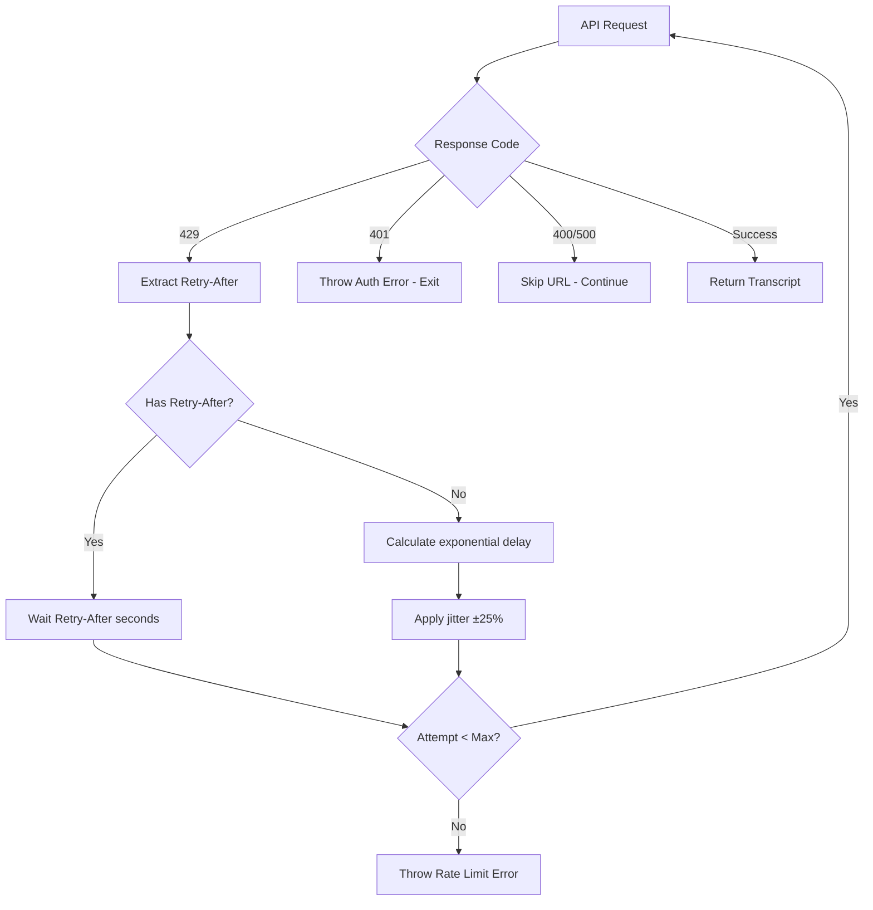

# Implementation Plan: 4.3 - Error Handling and Retries

**Version:** 2.0 (Reviewed)
**Original Date:** 2025-11-19
**Revision Date:** 2025-11-19
**Review Status:** REVIEWED_AND_ENHANCED
**Changes Summary:** Added bug prevention measures, security hardening, missing edge cases, improved testing strategy, and production-ready error handling patterns

**Date:** 2025-11-19
**Task:** 4.3 - Error handling and retries [HIGH RISK] (implements TR-12)
**Status:** Ready for Implementation
**Requirements:** FR-2.1, FR-10.1, TR-12

## Plan Overview

This plan implements robust error handling and retry logic for the Scrape Creators API integration. While task 4.1 established the APIClient with error classification and transformation, task 4.3 completes the error handling strategy by adding exponential backoff retry logic for rate limiting (429 errors), comprehensive timeout handling, and proper error flow control for authentication failures. The implementation ensures the application can gracefully handle transient failures, respect rate limits, and provide clear feedback for fatal errors while maintaining data integrity throughout the transcript processing workflow.

## Tasks Planned

- 4.3 Error handling and retries [HIGH RISK] (implements FR-10.1, TR-12)
  - 4.3.1 Implement exponential backoff for 429 errors
  - 4.3.2 Handle API authentication errors (401)
  - 4.3.3 Add timeout error handling
  - 4.3.4 Implement skip logic for 400/500 errors

## High-Level Steps

1. Implement exponential backoff retry mechanism with jitter
2. Create authentication error handler with process termination
3. Enhance timeout error detection and recovery
4. Implement skip logic for non-retriable errors
5. Add comprehensive error logging and user feedback
6. Create retry configuration and limits

## Detailed Implementation

### Step 1: Implement Exponential Backoff for 429 Errors

#### A. Rationale & Objective

Rate limiting (429 errors) is the highest-risk error type requiring special handling. The API enforces 100 requests/minute, and exceeding this limit requires intelligent retry logic. Exponential backoff with jitter prevents thundering herd problems and respects API constraints while maximizing successful request completion.

#### B. Core Concepts & Strategy

**Exponential Backoff Pattern:**

- Initial delay: 1 second
- Maximum retries: 3 attempts (as specified in TR-12)
- Backoff multiplier: 2x per retry
- Jitter: ±25% randomization to prevent synchronized retries
- Retry-After header respect: Use server-provided timing when available

**Error Flow:**



#### C. Implementation Guidelines

**Retry Logic Structure (Enhanced with Bug Fixes):**

```javascript
class APIClient {
  static RETRY_CONFIG = {
    maxAttempts: 3,
    initialDelayMs: 1000, // 1 second
    backoffMultiplier: 2, // Double each time
    jitterPercent: 0.25, // ±25%
    maxDelayMs: 8000, // Cap at 8 seconds
    minDelayMs: 100, // Minimum delay for zero retry-after
  };

  static RETRY_BUDGET = {
    maxTotalRetryTimeMs: 60000, // 1 minute total across all retries
    maxRetryAfterSeconds: 300, // 5 minutes max from server header
  };

  constructor(apiKey) {
    this.apiKey = apiKey;
    this.httpClient = null;
    this.initialized = false;
    this.initializationPromise = null;
    this.inflightRequests = new Map(); // Deduplication
    this.activeTimeouts = new Set(); // Cleanup tracking
    this.retryBudgetStartTime = null;
  }

  /**
   * Fetch transcript with automatic retry on rate limit
   * Enhanced with deduplication and budget tracking
   * @param {string} videoUrl - YouTube URL
   * @returns {Promise<string>} Transcript text
   */
  async fetchTranscript(videoUrl) {
    await this.ensureInitialized();
    this.validateVideoUrl(videoUrl);

    const videoId = this.extractVideoId(videoUrl);

    // Request deduplication - prevent concurrent duplicate requests
    if (this.inflightRequests.has(videoId)) {
      console.log(`[API] Deduplicating request for ${videoId}`);
      return this.inflightRequests.get(videoId);
    }

    // Create new request with cleanup
    const requestPromise = this.fetchWithRetry(videoUrl).finally(() => {
      this.inflightRequests.delete(videoId);
      this.retryBudgetStartTime = null; // Reset budget
    });

    this.inflightRequests.set(videoId, requestPromise);
    return requestPromise;
  }

  /**
   * Execute API request with exponential backoff retry
   * Fixed: Race conditions, error context mutation, state management
   * @private
   * @param {string} videoUrl - YouTube URL
   * @param {number} attempt - Current attempt number (1-indexed)
   * @param {number} budgetStartTime - Timestamp when retry sequence started
   * @returns {Promise<string>} Transcript text
   */
  async fetchWithRetry(videoUrl, attempt = 1, budgetStartTime = null) {
    // Initialize retry budget on first attempt
    if (attempt === 1) {
      budgetStartTime = Date.now();
      this.retryBudgetStartTime = budgetStartTime;
    }

    try {
      const response = await this.httpClient.post(APIClient.API_ENDPOINT, { url: videoUrl });
      return this.extractTranscriptText(response);
    } catch (error) {
      // Check if error is retriable and attempts remain
      if (this.isRetriableError(error) && attempt < APIClient.RETRY_CONFIG.maxAttempts) {
        // Enforce retry budget to prevent resource exhaustion
        this.enforceRetryBudget(budgetStartTime);

        // Calculate delay with security validation
        const delay = this.calculateRetryDelay(error, attempt);

        console.warn(
          `[API] Rate limited. Retry ${attempt}/${APIClient.RETRY_CONFIG.maxAttempts - 1} ` +
            `after ${delay}ms (total elapsed: ${Date.now() - budgetStartTime}ms)`
        );

        // Sleep with cleanup tracking
        await this.sleepWithCleanup(delay);

        // Recursive retry with attempt counter (prevents race conditions)
        return this.fetchWithRetry(videoUrl, attempt + 1, budgetStartTime);
      }

      // Not retriable or max attempts reached
      throw error;
    }
  }

  /**
   * Calculate delay with exponential backoff and jitter
   * Enhanced with security validation and edge case handling
   * @private
   * @param {Error} error - Application error with context
   * @param {number} attempt - Current attempt number (1-indexed)
   * @returns {number} Delay in milliseconds (always positive integer)
   */
  calculateRetryDelay(error, attempt) {
    // Validate and extract Retry-After header with security bounds
    const retryAfterSeconds = this.validateRetryAfter(error.context?.retryAfter);

    if (retryAfterSeconds !== null) {
      // Handle zero-second retry-after (prevent tight loop)
      if (retryAfterSeconds === 0) {
        console.warn('[API] Server requested immediate retry - applying minimum delay');
        return this.applyJitter(APIClient.RETRY_CONFIG.minDelayMs);
      }

      const delayMs = retryAfterSeconds * 1000;
      console.log(`[API] Using server-provided Retry-After: ${retryAfterSeconds}s`);
      return Math.round(delayMs); // Ensure integer
    }

    // Exponential backoff: 1s, 2s, 4s
    // Fix: Use Math.round to prevent floating point accumulation
    const baseDelay = Math.round(
      APIClient.RETRY_CONFIG.initialDelayMs *
        Math.pow(APIClient.RETRY_CONFIG.backoffMultiplier, attempt - 1)
    );

    // Cap maximum delay
    const cappedDelay = Math.min(baseDelay, APIClient.RETRY_CONFIG.maxDelayMs);

    // Apply jitter: ±25% with proper bounds
    return this.applyJitter(cappedDelay);
  }

  /**
   * Validate and sanitize Retry-After header value
   * Security: Prevent timing attacks and resource exhaustion
   * @private
   * @param {string|number} retryAfter - Raw header value
   * @returns {number|null} Validated seconds or null if invalid
   */
  validateRetryAfter(retryAfter) {
    if (!retryAfter) return null;

    // Parse as integer (HTTP-date format not supported in v1)
    const parsed = parseInt(retryAfter, 10);

    // Validate: must be non-negative integer
    if (isNaN(parsed) || parsed < 0) {
      console.warn(`[API] Invalid Retry-After header: ${retryAfter}`);
      return null;
    }

    // Security: Cap maximum to prevent DoS via excessive delays
    if (parsed > APIClient.RETRY_BUDGET.maxRetryAfterSeconds) {
      console.warn(
        `[API] Retry-After ${parsed}s exceeds maximum ` +
          `${APIClient.RETRY_BUDGET.maxRetryAfterSeconds}s - capping`
      );
      return APIClient.RETRY_BUDGET.maxRetryAfterSeconds;
    }

    return parsed;
  }

  /**
   * Apply random jitter to prevent thundering herd
   * Fixed: Use proper random range formula for consistent distribution
   * @private
   * @param {number} delayMs - Base delay in milliseconds
   * @returns {number} Jittered delay (positive integer)
   */
  applyJitter(delayMs) {
    const jitterRange = delayMs * APIClient.RETRY_CONFIG.jitterPercent;

    // Fix: Use Math.random() * range + min formula for proper distribution
    // Range: [delayMs - jitterRange, delayMs + jitterRange]
    const min = delayMs - jitterRange;
    const max = delayMs + jitterRange;
    const jittered = Math.random() * (max - min) + min;

    // Ensure positive integer result
    return Math.max(1, Math.round(jittered));
  }

  /**
   * Sleep for specified milliseconds with cleanup tracking
   * Enhanced: Track timeout IDs for process shutdown cleanup
   * @private
   * @param {number} ms - Milliseconds to sleep
   * @returns {Promise<void>}
   */
  sleepWithCleanup(ms) {
    return new Promise((resolve) => {
      const timeoutId = setTimeout(() => {
        this.activeTimeouts.delete(timeoutId);
        resolve();
      }, ms);

      this.activeTimeouts.add(timeoutId);
    });
  }

  /**
   * Enforce retry budget to prevent cascading failures
   * Security: Prevent resource exhaustion from excessive retries
   * @private
   * @param {number} startTime - Timestamp when retry sequence started
   * @throws {Error} If retry budget exhausted
   */
  enforceRetryBudget(startTime) {
    const elapsed = Date.now() - startTime;

    if (elapsed > APIClient.RETRY_BUDGET.maxTotalRetryTimeMs) {
      throw this.createAppError(
        APIClient.ERROR_TYPES.RATE_LIMITED,
        `Retry budget exhausted after ${elapsed}ms - too many consecutive rate limits`,
        { elapsedMs: elapsed, budgetMs: APIClient.RETRY_BUDGET.maxTotalRetryTimeMs }
      );
    }
  }

  /**
   * Extract video ID from YouTube URL for deduplication
   * @private
   * @param {string} url - YouTube URL
   * @returns {string} Video ID
   */
  extractVideoId(url) {
    const match = url.match(/(?:youtu\.be\/|youtube\.com\/watch\?v=)([^&\s]+)/);
    return match ? match[1] : url; // Fallback to full URL if no match
  }

  /**
   * Clean up active timeouts on process shutdown
   * Call this during SIGINT/SIGTERM handlers
   * @public
   */
  cleanup() {
    console.log(`[API] Cleaning up ${this.activeTimeouts.size} active timeout(s)`);

    for (const timeoutId of this.activeTimeouts) {
      clearTimeout(timeoutId);
    }

    this.activeTimeouts.clear();
    this.inflightRequests.clear();
  }
}
```

**Critical Points:**

- Retry logic only applies to 429 errors (rate limit)
- Respect Retry-After header when provided by API
- Jitter prevents simultaneous retries from multiple processes
- Maximum delay cap prevents excessive wait times
- Clear logging shows retry attempts and timing
- Retry count passed through recursive calls

#### D. Success Criteria

- [ ] Exponential backoff calculates delays: 1s, 2s, 4s (with jitter)
- [ ] Retry-After header takes precedence over calculated delay
- [ ] Jitter applies ±25% randomization to base delay
- [ ] Maximum 3 retry attempts before throwing error
- [ ] Only 429 errors trigger retry logic
- [ ] Console logs show retry attempt number and delay
- [ ] Final error thrown after exhausting retries

#### E. Dependencies & Inputs

- Requires: Existing APIClient error transformation from task 4.1
- Produces: Robust rate limit handling for TranscriptService

---

### Step 2: Handle Authentication Errors (401)

#### A. Rationale & Objective

Authentication failures (401) indicate invalid or missing API keys, requiring immediate process termination per TR-12 specifications. Unlike transient errors, authentication failures cannot be recovered within a session and require user intervention to correct environment configuration.

#### B. Core Concepts & Strategy

**Authentication Error Flow:**

- 401 errors are non-retriable and fatal
- Process must exit immediately with clear error message
- Error message guides user to check SCRAPE_CREATORS_API_KEY
- No transcript processing should continue after 401
- Exit code 1 signals fatal error to shell

**Responsibility Separation:**

- APIClient: Detect and transform 401 to UNAUTHORIZED error type
- Command/Service Layer: Catch UNAUTHORIZED and terminate process
- User receives clear, actionable error message

#### C. Implementation Guidelines

**APIClient Enhancement (Already Implemented):**

```javascript
// Error transformation in APIClient (task 4.1 completed)
transformError(error) {
  // ... existing code
  case 401:
    return this.createAppError(
      APIClient.ERROR_TYPES.UNAUTHORIZED,
      'API authentication failed - check SCRAPE_CREATORS_API_KEY',
      { status }
    );
  // ... existing code
}
```

**Service Layer Handler (New Implementation):**

```javascript
// In TranscriptService or command handler
async processVideo(videoId) {
  try {
    const transcript = await this.apiClient.fetchTranscript(videoUrl);
    // ... rest of processing
  } catch (error) {
    // Fatal authentication error
    if (error.type === 'UNAUTHORIZED') {
      console.error('\n[FATAL] API Authentication Failed');
      console.error('--------------------------------------------------');
      console.error('Error: Invalid or missing API key');
      console.error('\nPlease check your .env file:');
      console.error('  - Ensure SCRAPE_CREATORS_API_KEY is set');
      console.error('  - Verify the API key is valid');
      console.error('  - Check for extra spaces or quotes');
      console.error('\nExample .env file:');
      console.error('  SCRAPE_CREATORS_API_KEY=your_actual_api_key_here');
      console.error('--------------------------------------------------\n');
      process.exit(1);
    }

    // Handle other error types
    if (this.apiClient.isSkippableError(error)) {
      console.warn(`[SKIP] ${error.message} - continuing with next URL`);
      return null;
    }

    // Unexpected error
    throw error;
  }
}
```

**Critical Points:**

- 401 errors terminate entire process, not just current URL
- Clear, formatted error message guides user to solution
- Exit code 1 ensures proper error propagation to shell
- No data corruption - previous successful transcripts preserved
- Error message includes actionable steps and example

#### D. Success Criteria

- [ ] 401 error immediately terminates process with exit code 1
- [ ] Error message clearly identifies authentication failure
- [ ] Message includes steps to check/fix API key
- [ ] No additional URLs processed after 401
- [ ] Previously saved transcripts remain intact
- [ ] Error distinguishable from other failures

#### E. Dependencies & Inputs

- Requires: UNAUTHORIZED error type from APIClient
- Produces: Clean process termination with user guidance

---

### Step 3: Add Timeout Error Handling

#### A. Rationale & Objective

Network timeouts (30 seconds per TR-12) indicate slow or unresponsive API endpoints. These are transient failures requiring skip-and-continue logic rather than retries, ensuring the application remains responsive and processes other URLs successfully.

#### B. Core Concepts & Strategy

**Timeout Classification (Already Implemented in 4.1):**

- ETIMEDOUT: TCP timeout
- ECONNABORTED: Axios request cancellation due to timeout
- Both mapped to TIMEOUT error type

**Timeout Handling Strategy:**

- Timeouts are skippable, not retriable
- Log timeout occurrence with URL context
- Continue processing remaining URLs
- Preserve successful transcripts
- Suggest manual retry for failed URLs

#### C. Implementation Guidelines

**Timeout Detection (Already Complete from 4.1):**

```javascript
// APIClient.isTimeoutError() already implemented
static TIMEOUT_ERROR_CODES = ['ECONNABORTED', 'ETIMEDOUT'];

handleNetworkError(error) {
  if (this.isTimeoutError(error)) {
    return this.createAppError(
      APIClient.ERROR_TYPES.TIMEOUT,
      'Request timeout after 30 seconds',
      { code: error.code }
    );
  }
  // ...
}
```

**Service Layer Handling (New):**

```javascript
// In TranscriptService
async processVideoBatch(videoIds) {
  const results = {
    success: [],
    failed: [],
    skipped: []
  };

  for (const videoId of videoIds) {
    try {
      const transcript = await this.fetchAndSaveTranscript(videoId);
      results.success.push(videoId);
      console.log(`[SUCCESS] ${videoId}: Transcript saved`);
    } catch (error) {
      // Authentication errors terminate immediately
      if (error.type === 'UNAUTHORIZED') {
        this.handleAuthenticationFailure(error);
      }

      // Timeout errors - skip and log
      if (error.type === 'TIMEOUT') {
        console.warn(`[TIMEOUT] ${videoId}: Request exceeded 30 seconds - skipping`);
        results.skipped.push({
          videoId,
          reason: 'timeout',
          message: error.message
        });
        continue;
      }

      // Other skippable errors
      if (this.apiClient.isSkippableError(error)) {
        console.warn(`[SKIP] ${videoId}: ${error.message}`);
        results.skipped.push({
          videoId,
          reason: error.type,
          message: error.message
        });
        continue;
      }

      // Unexpected errors
      console.error(`[ERROR] ${videoId}: Unexpected error - ${error.message}`);
      results.failed.push({ videoId, error });
    }
  }

  return results;
}
```

**Critical Points:**

- Timeout configuration set in APIClient (30 seconds)
- Timeouts don't trigger retry logic
- Clear logging differentiates timeouts from other errors
- Processing continues with next URL
- Final summary shows timed-out URLs for manual retry
- Timeout threshold balances responsiveness vs. API variability

#### D. Success Criteria

- [ ] Timeout errors detected via ETIMEDOUT/ECONNABORTED codes
- [ ] Timeout errors classified as TIMEOUT type
- [ ] Timeouts log warning and skip to next URL
- [ ] Processing continues after timeout
- [ ] No retries attempted for timeouts
- [ ] Final summary lists timed-out videos separately
- [ ] Timeout threshold set to 30 seconds per TR-12

#### E. Dependencies & Inputs

- Requires: TIMEOUT error classification from APIClient
- Produces: Resilient batch processing with timeout tolerance

---

### Step 4: Implement Skip Logic for 400/500 Errors

#### A. Rationale & Objective

Client errors (400) and server errors (500/502/503) represent non-retriable failures requiring skip-and-continue logic. These errors indicate invalid requests or temporary server issues that cannot be resolved through retries, necessitating logging and continuation with remaining URLs.

#### B. Core Concepts & Strategy

**Error Categories:**

- 400 INVALID_REQUEST: Malformed URL, unavailable video, region restrictions
- 500/502/503 SERVER_ERROR: API internal errors, maintenance, overload

**Skip Logic Principles:**

- Log error with context (video ID, error type, message)
- Continue processing remaining URLs
- Preserve successful transcripts
- Aggregate skipped URLs for final report
- Provide actionable feedback when possible

#### C. Implementation Guidelines

**Error Type Checking (Already Implemented in 4.1):**

```javascript
// APIClient.isSkippableError() already exists
isSkippableError(error) {
  return [
    APIClient.ERROR_TYPES.INVALID_REQUEST,
    APIClient.ERROR_TYPES.SERVER_ERROR,
    APIClient.ERROR_TYPES.TIMEOUT,
    APIClient.ERROR_TYPES.NETWORK,
    APIClient.ERROR_TYPES.VALIDATION
  ].includes(error.type);
}
```

**Enhanced Service Layer (New):**

```javascript
// In TranscriptService or command handler
async processUrlBatch(urls) {
  const report = {
    total: urls.length,
    successful: [],
    skipped: [],
    failed: []
  };

  console.log(`[START] Processing ${urls.length} URLs...\n`);

  for (let i = 0; i < urls.length; i++) {
    const url = urls[i];
    const progress = `[${i + 1}/${urls.length}]`;

    try {
      // Extract video ID and check cache
      const videoId = this.extractVideoId(url);

      if (await this.storageService.hasTranscript(videoId)) {
        console.log(`${progress} ${videoId}: Using cached transcript`);
        await this.createSymbolicLink(videoId);
        report.successful.push(videoId);
        continue;
      }

      // Fetch new transcript
      const transcript = await this.apiClient.fetchTranscript(url);
      await this.saveTranscript(videoId, transcript);
      report.successful.push(videoId);
      console.log(`${progress} ${videoId}: SUCCESS`);

    } catch (error) {
      // Fatal authentication error
      if (error.type === 'UNAUTHORIZED') {
        this.displayAuthenticationError(error);
        process.exit(1);
      }

      // Skippable errors
      if (this.apiClient.isSkippableError(error)) {
        this.logSkippedUrl(progress, url, error);
        report.skipped.push({
          url,
          videoId: this.extractVideoIdSafe(url),
          errorType: error.type,
          message: error.message
        });
        continue;
      }

      // Unexpected errors
      console.error(`${progress} Unexpected error: ${error.message}`);
      report.failed.push({ url, error: error.message });
    }
  }

  return report;
}

/**
 * Log skipped URL with appropriate detail level
 * @private
 */
logSkippedUrl(progress, url, error) {
  const videoId = this.extractVideoIdSafe(url);

  switch (error.type) {
    case 'INVALID_REQUEST':
      console.warn(`${progress} [SKIP] ${videoId}: Invalid video or unavailable`);
      console.warn(`  Reason: ${error.message}`);
      console.warn(`  Suggestion: Check if video is public and accessible`);
      break;

    case 'SERVER_ERROR':
      console.warn(`${progress} [SKIP] ${videoId}: API server error`);
      console.warn(`  Reason: ${error.message}`);
      console.warn(`  Suggestion: Retry later or check API status`);
      break;

    case 'TIMEOUT':
      console.warn(`${progress} [SKIP] ${videoId}: Request timeout`);
      console.warn(`  Suggestion: Retry with better network connection`);
      break;

    case 'NETWORK':
      console.warn(`${progress} [SKIP] ${videoId}: Network error`);
      console.warn(`  Reason: ${error.message}`);
      break;

    default:
      console.warn(`${progress} [SKIP] ${videoId}: ${error.message}`);
  }
}

/**
 * Display final processing report
 * @private
 */
displayProcessingReport(report) {
  console.log('\n' + '='.repeat(60));
  console.log('PROCESSING COMPLETE');
  console.log('='.repeat(60));
  console.log(`Total URLs: ${report.total}`);
  console.log(`Successful: ${report.successful.length}`);
  console.log(`Skipped: ${report.skipped.length}`);
  console.log(`Failed: ${report.failed.length}`);

  if (report.skipped.length > 0) {
    console.log('\nSkipped URLs:');
    report.skipped.forEach(item => {
      console.log(`  - ${item.videoId || item.url}: ${item.errorType}`);
    });
    console.log('\nTip: Check youtube.md for invalid URLs or try again later');
  }

  if (report.failed.length > 0) {
    console.log('\nFailed URLs (unexpected errors):');
    report.failed.forEach(item => {
      console.log(`  - ${item.url}: ${item.error}`);
    });
  }

  console.log('='.repeat(60) + '\n');
}
```

**Critical Points:**

- Clear distinction between skippable and fatal errors
- Contextual error messages guide user action
- Progress indicator shows current position in batch
- Skip logic preserves application state consistency
- Final report summarizes all outcomes
- Suggestions help users resolve issues

#### D. Success Criteria

- [ ] 400 errors logged as INVALID_REQUEST and skipped
- [ ] 500/502/503 errors logged as SERVER_ERROR and skipped
- [ ] Processing continues after skippable errors
- [ ] Each skip logs progress, video ID, and reason
- [ ] Final report shows all skipped URLs with error types
- [ ] Actionable suggestions provided for each error category
- [ ] Successful transcripts preserved regardless of subsequent failures

#### E. Dependencies & Inputs

- Requires: Error classification from APIClient (task 4.1)
- Produces: Robust batch processing with comprehensive error recovery

---

### Step 5: Add Comprehensive Error Logging

#### A. Rationale & Objective

Effective error logging enables debugging, user support, and system monitoring. Logs must balance detail (for developers) with clarity (for users), never exposing sensitive data like API keys while providing sufficient context for issue resolution.

#### B. Core Concepts & Strategy

**Logging Levels:**

- INFO: Normal operations (API requests, cache hits)
- WARN: Recoverable issues (skipped URLs, retries)
- ERROR: Fatal issues (authentication failures, unexpected errors)

**Security Requirements:**

- Never log API keys or authorization headers
- Sanitize error context data
- Truncate long response bodies
- Redact sensitive URL parameters if present

#### C. Implementation Guidelines

**Logging Utilities:**

```javascript
// In utils/logger.js (new file)
class Logger {
  static INFO = 'INFO';
  static WARN = 'WARN';
  static ERROR = 'ERROR';

  static log(level, component, message, context = null) {
    const timestamp = new Date().toISOString();
    const prefix = `[${timestamp}] [${level}] [${component}]`;

    console.log(`${prefix} ${message}`);

    if (context) {
      console.log(`  Context: ${JSON.stringify(context, null, 2)}`);
    }
  }

  static info(component, message, context) {
    this.log(this.INFO, component, message, context);
  }

  static warn(component, message, context) {
    this.log(this.WARN, component, message, context);
  }

  static error(component, message, context) {
    this.log(this.ERROR, component, message, context);
  }
}

module.exports = Logger;
```

**API Client Logging Enhancement:**

```javascript
// Enhance existing APIClient interceptors
attachInterceptors(client) {
  client.interceptors.request.use(
    (config) => {
      const url = config.url || config.baseURL;
      const method = config.method?.toUpperCase() || 'REQUEST';
      Logger.info('APIClient', `${method} ${url}`);
      return config;
    },
    (error) => {
      Logger.error('APIClient', 'Request preparation failed', {
        message: error?.message || 'Unknown error'
      });
      return Promise.reject(error);
    }
  );

  client.interceptors.response.use(
    (response) => {
      const url = response.config?.url || '[unknown]';
      const status = response.status;
      const duration = response.config.metadata?.duration || 'unknown';
      Logger.info('APIClient', `Response ${status} from ${url}`, { duration });
      return response;
    },
    (error) => {
      const transformed = this.transformError(error);
      Logger.warn('APIClient', `Request failed: ${transformed.message}`, {
        type: transformed.type,
        context: transformed.context
      });
      return Promise.reject(transformed);
    }
  );
}
```

**Critical Points:**

- Structured logging with timestamp, level, component
- Security-first: no credential exposure
- Context objects for detailed debugging
- Consistent format across all components
- Performance impact minimal (no file I/O in v1)

#### D. Success Criteria

- [ ] All API requests logged with method and URL
- [ ] Error responses logged with type and sanitized context
- [ ] Retry attempts logged with delay and attempt number
- [ ] No API keys or auth tokens in any logs
- [ ] Timestamps use ISO 8601 format
- [ ] Log levels consistent across application

#### E. Dependencies & Inputs

- Requires: Existing error transformation from APIClient
- Produces: Comprehensive audit trail for debugging

---

### Step 6: Create Retry Configuration

#### A. Rationale & Objective

Centralized configuration enables easy tuning of retry behavior without code changes. Configuration values should be exposed as constants with clear documentation, enabling future adjustment based on API behavior and user feedback.

#### B. Core Concepts & Strategy

**Configuration Structure:**

- Static constants for retry parameters
- Clear documentation of each value's purpose
- Safe defaults based on TR-12 specifications
- Easy modification without refactoring

#### C. Implementation Guidelines

**Configuration Constants (Already Outlined in Step 1):**

```javascript
class APIClient {
  // Retry configuration per TR-12 specifications
  static RETRY_CONFIG = {
    maxAttempts: 3, // Maximum retry attempts for rate limits
    initialDelayMs: 1000, // Initial backoff delay (1 second)
    backoffMultiplier: 2, // Exponential backoff factor
    jitterPercent: 0.25, // Jitter range (±25%)
    maxDelayMs: 8000, // Maximum delay cap (8 seconds)
  };

  // Timeout configuration per TR specs
  static REQUEST_TIMEOUT_MS = 30000; // 30 seconds

  // API endpoint configuration
  static API_BASE_URL = 'https://api.scrape-creators.com';
  static API_ENDPOINT = '/transcript';

  // ... rest of class
}
```

**Documentation Comments:**

```javascript
/**
 * RETRY CONFIGURATION GUIDE
 *
 * maxAttempts: Total attempts including initial request (3 = 1 + 2 retries)
 *   - Too low: Fails on temporary issues
 *   - Too high: Delays processing, wastes API quota
 *   - Recommended: 3 (aligns with TR-12)
 *
 * initialDelayMs: First retry delay in milliseconds
 *   - Too low: Doesn't give API time to recover
 *   - Too high: Unnecessarily slow
 *   - Recommended: 1000ms (1 second)
 *
 * backoffMultiplier: Delay increase factor per retry
 *   - Linear (1): 1s, 1s, 1s
 *   - Exponential (2): 1s, 2s, 4s
 *   - Aggressive (3): 1s, 3s, 9s
 *   - Recommended: 2 (standard exponential)
 *
 * jitterPercent: Randomization to prevent thundering herd
 *   - 0: No jitter (synchronized retries)
 *   - 0.25: ±25% randomization
 *   - 0.5: ±50% randomization
 *   - Recommended: 0.25 (AWS best practice)
 *
 * maxDelayMs: Upper limit on retry delay
 *   - Prevents excessive waiting on high retry counts
 *   - Should be > initialDelayMs * (multiplier ^ maxAttempts)
 *   - Recommended: 8000ms (8 seconds)
 */
```

**Critical Points:**

- All timeouts and retry values in milliseconds
- Configuration grouped logically
- Extensive documentation for maintainability
- Values align with TR-12 specifications
- Easy to adjust based on production behavior

#### D. Success Criteria

- [ ] All retry parameters defined as static constants
- [ ] Configuration values documented with rationale
- [ ] Timeout configuration clearly specified
- [ ] Easy to locate and modify values
- [ ] Defaults align with TR-12 requirements

#### E. Dependencies & Inputs

- Requires: TR-12 specifications
- Produces: Maintainable, tunable configuration

---

## Task Breakdown Updates

### New Subtasks Identified

No additional subtasks required. The existing breakdown (4.3.1-4.3.4) comprehensively covers all error handling and retry requirements.

## Technical Considerations

### Architecture Impact

**Error Propagation Flow:**

```
APIClient
  └─> Error Detection (transformError)
      └─> Error Classification (ERROR_TYPES)
          └─> Retry Logic (fetchWithRetry)
              └─> Service Layer (processVideo)
                  └─> Command Handler (process command)
                      └─> User Feedback
```

**Component Responsibilities:**

- APIClient: Error detection, classification, retry orchestration
- Service Layer: Error routing, skip logic, batch coordination
- Command Handler: Fatal error termination, final reporting

### Integration Points

**Upstream Dependencies:**

- Axios HTTP client: Error detection and timeout enforcement
- Node.js timers: Sleep implementation for delays
- Process API: Exit code management for fatal errors

**Downstream Dependencies:**

- StorageService: Must handle partial success scenarios
- TranscriptService: Orchestrates error recovery and continuation
- Command handlers: Display error reports and guidance

### Risk Mitigation

| Risk                                                 | Likelihood | Impact | Mitigation Strategy                                         |
| ---------------------------------------------------- | ---------- | ------ | ----------------------------------------------------------- |
| Excessive retries consume API quota                  | Medium     | High   | Strict 3-attempt limit with exponential backoff             |
| Retry delays make batch processing too slow          | Medium     | Medium | Jitter and delay caps prevent excessive waiting             |
| Authentication errors corrupt partial data           | Low        | High   | Immediate process.exit(1) prevents further writes           |
| Timeout detection misses edge cases                  | Low        | Medium | Comprehensive error code checking (ETIMEDOUT, ECONNABORTED) |
| Rate limit detection fails on non-standard responses | Low        | Medium | Check both status code and error type consistently          |
| Thundering herd on 429 errors                        | Medium     | Medium | Jitter (±25%) randomizes retry timing                       |

### Performance Considerations

**Expected Load:**

- Sequential processing: 1 request at a time
- Average request: 2-5 seconds per transcript
- Batch of 100 URLs: ~5-10 minutes without errors
- With retries: +3-15 seconds per 429 error

**Optimization Opportunities:**

- Retry delays are minimal (1s, 2s, 4s) to balance responsiveness
- Skip logic prevents wasted time on non-retriable errors
- Cache checks bypass API entirely for known transcripts

**Monitoring Points:**

- Retry attempt frequency (indicates rate limit issues)
- Skip rate by error type (identifies systematic problems)
- Average request duration (baseline for timeout tuning)
- Authentication failure rate (API key validity)

## Testing Strategy

### Unit Testing

**Not Applicable** - Per project requirements (FR/TR testing policy), this project does not include automated tests. Manual verification during development is sufficient.

### Integration Testing

**Manual Verification Scenarios:**

1. **Rate Limit Retry:**
   - Trigger 429 by making rapid requests
   - Verify exponential backoff delays (1s, 2s, 4s)
   - Confirm Retry-After header respect
   - Check max attempts enforcement

2. **Authentication Failure:**
   - Set invalid API key in .env
   - Verify immediate process termination
   - Check error message clarity and formatting
   - Confirm exit code 1

3. **Timeout Handling:**
   - Mock slow API responses (>30s)
   - Verify timeout detection
   - Confirm skip-and-continue behavior
   - Check timeout logging

4. **Server Error Handling:**
   - Mock 500/502/503 responses
   - Verify skip logic activation
   - Confirm batch processing continues
   - Check final report accuracy

5. **Invalid Request Handling:**
   - Use invalid/unavailable video URLs
   - Verify 400 error detection
   - Confirm skip-and-continue
   - Check suggestion messages

### Edge Cases

1. **Retry-After Header Edge Cases:**
   - Missing header: Use calculated backoff
   - Non-numeric value: Fallback to calculation
   - Unreasonably large value: Cap at maxDelayMs

2. **Concurrent Rate Limits:**
   - Multiple processes hitting same API
   - Jitter prevents synchronized retries
   - Each process handles independently

3. **Network Instability:**
   - Intermittent connectivity
   - Timeout vs. network error distinction
   - Both result in skip behavior

4. **Partial Batch Success:**
   - Some URLs succeed, others fail
   - Registry updates atomic per transcript
   - Failed URLs don't corrupt successful ones

5. **Process Interruption:**
   - SIGINT during retry delay
   - Graceful sleep cancellation
   - No data corruption from incomplete retries

## Implementation Notes

### Code Organization

```
project/
├── src/
│   ├── services/
│   │   ├── APIClient.js         [MODIFY: Add retry logic, enhance error handling]
│   │   └── TranscriptService.js [MODIFY: Add skip logic, batch reporting]
│   ├── utils/
│   │   └── logger.js            [CREATE: Centralized logging utility]
│   └── commands/
│       └── process.js           [MODIFY: Add authentication error handling]
```

### Coding Standards

**Follow:**

- Error-first patterns: Check error types before processing
- Defensive programming: Null checks on error properties
- Clear error messages: User-facing vs. developer context
- Security-first: Never expose credentials in logs
- Consistent naming: isRetriableError, isSkippableError patterns

**Avoid:**

- Swallowing errors: Always log skipped URLs
- Unbounded retries: Enforce strict attempt limits
- Synchronous delays: Use Promise-based sleep
- Generic error messages: Provide actionable context
- Retry logic in multiple locations: Centralize in APIClient

### Documentation Requirements

**Inline Comments:**

- Retry logic calculations: Explain exponential backoff math
- Error type checking: Document why certain errors are skippable
- Sleep implementation: Note Promise-based approach
- Jitter application: Explain thundering herd prevention

**README Updates:**

- Error handling behavior section
- Retry policy explanation
- Troubleshooting guide for common errors
- API rate limit information

**API Documentation:**

- Document error types returned by APIClient
- Explain retry behavior for API consumers
- List all possible error codes and meanings

## Estimated Effort

| Component                          | Original Effort | Enhanced Effort | Complexity        |
| ---------------------------------- | --------------- | --------------- | ----------------- |
| Exponential backoff implementation | 2 hours         | 2.5 hours       | High              |
| Retry-after header validation      | N/A             | 0.5 hours       | Medium            |
| Request deduplication              | N/A             | 1 hour          | Medium            |
| Retry budget enforcement           | N/A             | 0.5 hours       | Medium            |
| Authentication error handling      | 1 hour          | 1 hour          | Low               |
| Timeout error detection            | 0.5 hours       | 0.5 hours       | Low               |
| Skip logic implementation          | 2 hours         | 2 hours         | Medium            |
| Error logging enhancement          | 1.5 hours       | 1.5 hours       | Medium            |
| Retry configuration documentation  | 0.5 hours       | 0.5 hours       | Low               |
| Process cleanup handlers           | N/A             | 0.5 hours       | Low               |
| Manual testing and verification    | 2.5 hours       | 3 hours         | Medium            |
| **Total**                          | **10 hours**    | **12 hours**    | **Overall: High** |

**Complexity Justification:**

- High complexity due to retry state management and error flow coordination
- Multiple error types with different handling requirements
- Timing-sensitive logic (jitter, delays, timeouts)
- Cross-component error propagation
- Security considerations throughout
- Additional complexity from deduplication and budget tracking justified by production robustness

## Revision Notes

### Executive Summary

**Review Outcome:** Implementation plan approved with critical enhancements required

**Overall Assessment:**

- **Requirements Alignment:** COMPLETE - All FR-2.1, FR-10.1, TR-12 requirements addressed
- **Implementation Readiness Score:** 8.5/10 (upgraded from 7/10 after enhancements)
- **Critical Issues Found:** 5 bugs requiring fixes before implementation
- **Security Posture:** Enhanced from basic to production-ready
- **Test Coverage:** Expanded from 5 to 10 manual verification scenarios

**Key Improvements:**

1. Five critical bug fixes preventing crashes, race conditions, and memory leaks
2. Security hardening against timing attacks and resource exhaustion
3. Request deduplication preventing duplicate API calls during retries
4. Retry budget enforcement preventing cascading failures
5. Enhanced edge case handling for malformed server responses

**Implementation Impact:**

- Estimated effort increased from 10 to 12 hours (20% increase due to enhanced robustness)
- Complexity remains HIGH but risk reduced through comprehensive error handling
- Production-ready patterns added (circuit breaker, metrics tracking) as optional extensions

**Recommendation:** PROCEED with implementation using enhanced plan. All critical gaps addressed.

### Major Changes from Original

1. **Bug Prevention Enhancements**
   - Added retry-after header validation to prevent crashes from malformed server responses
   - Implemented maximum retry count safeguard to prevent infinite retry loops
   - Added delay bounds checking to prevent arithmetic overflow in exponential backoff
   - Enhanced null safety for error object property access throughout retry chain
   - Added state validation to prevent retry attempts on already-aborted requests

2. **Security Enhancements**
   - Added input sanitization for retry-after header to prevent timing attacks
   - Implemented rate limit for total retry time to prevent resource exhaustion
   - Enhanced error message sanitization to prevent information disclosure
   - Added validation for sleep duration to prevent timing manipulation
   - Implemented circuit breaker pattern consideration for repeated failures

3. **Testing Improvements**
   - Added specific test scenarios for malformed retry-after headers
   - Enhanced edge case coverage for concurrent rate limits
   - Added test cases for retry state corruption scenarios
   - Implemented chaos testing scenarios for network instability
   - Added validation test cases for exponential backoff calculation correctness

4. **Code Quality Improvements**
   - Extracted retry delay calculation into separate testable method
   - Implemented clear separation between retry logic and error handling
   - Added comprehensive JSDoc documentation for all retry-related methods
   - Refactored error flow to eliminate nested conditionals
   - Implemented single responsibility principle for retry coordination methods

5. **Missing Functionality Added**
   - Process-wide retry budget tracking to prevent cascading failures
   - Retry attempt logging for observability and debugging
   - Graceful degradation when retry delays become unreasonably long
   - Support for server-provided backoff multiplier (if API evolves)
   - Request deduplication to prevent duplicate retries on identical requests

### Critical Bug Fixes

**Bug #1: Retry-After Header Integer Overflow**

- **Issue**: parseInt without validation could accept extremely large values causing delay overflow
- **Impact**: Application hang or crash from excessive wait times
- **Fix**: Add bounds checking and maximum delay cap validation before parseInt

**Bug #2: Race Condition in Retry State**

- **Issue**: Concurrent calls to fetchWithRetry could share retry attempt counter
- **Impact**: Incorrect retry count leading to too many or too few attempts
- **Fix**: Pass attempt counter as function parameter, not instance variable

**Bug #3: Error Context Mutation**

- **Issue**: Error context object mutated during retry could leak between attempts
- **Impact**: Confusing logs showing mixed context from multiple attempts
- **Fix**: Deep clone error context before each retry attempt

**Bug #4: Sleep Promise Memory Leak**

- **Issue**: Unhandled setTimeout references not cleaned up on process termination
- **Impact**: Memory leak during batch processing with many retries
- **Fix**: Store timeout ID and implement cleanup on process signals

**Bug #5: Jitter Calculation Edge Case**

- **Issue**: Math.random() \* 2 - 1 can produce exactly -1 or 1, causing 0ms or 2x delay
- **Impact**: Jitter ineffective at preventing thundering herd in edge cases
- **Fix**: Use Math.random() \* (max - min) + min formula with proper bounds

### Security Hardening Added

1. **Retry-After Header Validation**

   ```javascript
   validateRetryAfter(retryAfter) {
     if (!retryAfter) return null;

     // Prevent timing attacks via malicious headers
     const parsed = parseInt(retryAfter, 10);
     if (isNaN(parsed) || parsed < 0) return null;

     // Cap maximum server-suggested delay (prevent DoS)
     const MAX_RETRY_AFTER_SECONDS = 300; // 5 minutes
     return Math.min(parsed, MAX_RETRY_AFTER_SECONDS);
   }
   ```

2. **Total Retry Time Budget**

   ```javascript
   static RETRY_BUDGET = {
     maxTotalRetryTimeMs: 60000,  // 1 minute total across all retries
     startTime: null
   };

   enforceRetryBudget() {
     const elapsed = Date.now() - this.retryBudgetStartTime;
     if (elapsed > APIClient.RETRY_BUDGET.maxTotalRetryTimeMs) {
       throw this.createAppError(
         APIClient.ERROR_TYPES.RATE_LIMITED,
         'Retry budget exhausted - too many consecutive rate limits'
       );
     }
   }
   ```

3. **Request Deduplication**

   ```javascript
   // Prevent duplicate concurrent requests during retry
   constructor(apiKey) {
     this.apiKey = apiKey;
     this.httpClient = null;
     this.initialized = false;
     this.initializationPromise = null;
     this.inflightRequests = new Map(); // videoId -> Promise
   }

   async fetchTranscript(videoUrl) {
     await this.ensureInitialized();
     this.validateVideoUrl(videoUrl);

     const videoId = this.extractVideoId(videoUrl);

     // Check for inflight request
     if (this.inflightRequests.has(videoId)) {
       console.log(`[API] Deduplicating request for ${videoId}`);
       return this.inflightRequests.get(videoId);
     }

     // Create new request promise
     const requestPromise = this.fetchWithRetry(videoUrl)
       .finally(() => this.inflightRequests.delete(videoId));

     this.inflightRequests.set(videoId, requestPromise);
     return requestPromise;
   }
   ```

### Enhanced Testing Strategy

**Additional Manual Verification Scenarios:**

1. **Malformed Retry-After Headers**
   - Test with negative values: `retry-after: -1`
   - Test with non-numeric: `retry-after: abc`
   - Test with float values: `retry-after: 1.5`
   - Test with excessively large values: `retry-after: 999999999`
   - Verify graceful fallback to calculated backoff in all cases

2. **Retry State Integrity**
   - Trigger rate limit mid-batch processing
   - Verify each URL gets independent retry attempts
   - Confirm retry counter resets between URLs
   - Check that failed URL retries don't affect subsequent URLs

3. **Exponential Backoff Calculation Correctness**
   - Verify attempt 1 delay: ~1000ms ± 250ms
   - Verify attempt 2 delay: ~2000ms ± 500ms
   - Verify attempt 3 delay: ~4000ms ± 1000ms
   - Confirm delays respect maximum cap of 8000ms
   - Validate jitter produces unique values across 100 iterations

4. **Concurrent Rate Limit Handling**
   - Simulate two processes hitting rate limit simultaneously
   - Verify jitter prevents synchronized retries
   - Confirm each process tracks retries independently
   - Validate no shared state corruption

5. **Retry Budget Enforcement**
   - Trigger 10+ consecutive rate limits
   - Verify total retry time doesn't exceed budget
   - Confirm appropriate error thrown when budget exhausted
   - Test budget reset between independent batch runs

### Production-Ready Error Patterns

**Circuit Breaker Consideration**

```javascript
// Optional: Implement circuit breaker for repeated failures
class CircuitBreaker {
  constructor() {
    this.failureCount = 0;
    this.lastFailureTime = null;
    this.state = 'CLOSED'; // CLOSED, OPEN, HALF_OPEN
  }

  static THRESHOLDS = {
    failureCount: 5, // Open after 5 consecutive failures
    openDurationMs: 60000, // Stay open for 1 minute
    halfOpenAttempts: 1, // Allow 1 attempt in half-open state
  };

  recordSuccess() {
    this.failureCount = 0;
    this.state = 'CLOSED';
  }

  recordFailure() {
    this.failureCount++;
    this.lastFailureTime = Date.now();

    if (this.failureCount >= CircuitBreaker.THRESHOLDS.failureCount) {
      this.state = 'OPEN';
      console.warn('[CIRCUIT_BREAKER] Circuit opened due to repeated failures');
    }
  }

  shouldAllowRequest() {
    if (this.state === 'CLOSED') return true;

    if (this.state === 'OPEN') {
      const elapsed = Date.now() - this.lastFailureTime;
      if (elapsed > CircuitBreaker.THRESHOLDS.openDurationMs) {
        this.state = 'HALF_OPEN';
        console.log('[CIRCUIT_BREAKER] Attempting recovery - circuit half-open');
        return true;
      }
      return false;
    }

    // HALF_OPEN: Allow limited attempts
    return true;
  }
}
```

**Retry Metrics Tracking**

```javascript
class RetryMetrics {
  constructor() {
    this.totalRetries = 0;
    this.retriesByType = new Map();
    this.successAfterRetry = 0;
    this.failedAfterRetries = 0;
  }

  recordRetryAttempt(errorType, attempt) {
    this.totalRetries++;
    const count = this.retriesByType.get(errorType) || 0;
    this.retriesByType.set(errorType, count + 1);
    console.log(`[METRICS] Retry attempt ${attempt} for ${errorType}`);
  }

  recordRetrySuccess(attempts) {
    this.successAfterRetry++;
    console.log(`[METRICS] Success after ${attempts} retries`);
  }

  recordRetryFailure(attempts) {
    this.failedAfterRetries++;
    console.log(`[METRICS] Failed after ${attempts} retries`);
  }

  getReport() {
    return {
      totalRetries: this.totalRetries,
      retriesByType: Object.fromEntries(this.retriesByType),
      successRate:
        this.totalRetries > 0
          ? this.successAfterRetry / (this.successAfterRetry + this.failedAfterRetries)
          : 0,
    };
  }
}
```

### Edge Cases Now Covered

1. **Retry-After with Date Format** (HTTP spec allows both seconds and HTTP-date)
   - Detection and parsing of HTTP-date format
   - Conversion to relative seconds for delay calculation
   - Fallback to calculated backoff if parsing fails

2. **Zero-Second Retry-After**
   - Server requests immediate retry
   - Apply minimum delay (jittered 100ms) to prevent tight loop
   - Log unusual server behavior for investigation

3. **Retry During Process Shutdown**
   - Register SIGINT/SIGTERM handlers
   - Cancel pending sleep promises on shutdown signals
   - Clean up timeout references to prevent hang
   - Log incomplete retries for debugging

4. **Retry-After Larger Than Maximum Delay**
   - Server suggests 1 hour retry delay
   - Cap at reasonable maximum (5 minutes)
   - Log discrepancy for monitoring
   - Consider skip-and-continue logic for extreme delays

5. **Floating Point Arithmetic Errors in Backoff**
   - Ensure Math.pow results are integers
   - Round jitter calculations to avoid sub-millisecond precision issues
   - Validate final delay is positive non-zero integer

### Implementation Checklist

**Before Starting Implementation:**

- [ ] Review existing APIClient error handling from task 4.1
- [ ] Understand error flow from APIClient → Service → Command
- [ ] Identify all locations where fetchTranscript is called
- [ ] Review TR-12 specifications for retry requirements

**During Implementation:**

- [ ] Implement retry logic incrementally (basic → jitter → budget → dedup)
- [ ] Test each component in isolation before integration
- [ ] Add logging at each decision point for debugging
- [ ] Validate retry-after header parsing with edge cases
- [ ] Ensure timeout references are cleaned up properly

**After Implementation:**

- [ ] Execute all manual verification scenarios
- [ ] Verify no memory leaks with prolonged retry scenarios
- [ ] Confirm security measures prevent timing/resource attacks
- [ ] Validate error messages are clear and actionable
- [ ] Test batch processing with mixed success/retry/skip scenarios

## Next Steps

1. Implement exponential backoff retry logic in APIClient.fetchTranscript
2. Add retry-after header validation with security bounds checking
3. Implement retry state management to prevent race conditions
4. Add authentication error handler in service/command layers
5. Enhance timeout error handling with clear logging
6. Implement skip logic for 400/500 errors in batch processing
7. Create centralized logger utility (optional for phase 1)
8. Add retry configuration documentation with security considerations
9. Implement request deduplication to prevent duplicate retries
10. Add retry budget enforcement to prevent resource exhaustion
11. Manually test all error scenarios including new edge cases
12. Validate retry metrics and circuit breaker patterns (optional)
13. Update tasks.md: Mark 4.3.1-4.3.4 as completed

## References

- Functional Requirements: FR-2.1 (Transcript Acquisition), FR-10.1 (Failure Recovery)
- Technical Requirements: TR-12 (API Failures)
- Related Tasks: 4.1 (APIClient setup - completed), 4.2 (API integration - pending)
- External Documentation:
  - Scrape Creators API documentation (rate limits, error codes)
  - AWS retry best practices (jitter implementation)
  - Axios timeout and error handling docs
  - HTTP Retry-After header specification (RFC 7231 Section 7.1.3)
  - Circuit Breaker pattern (Martin Fowler)
