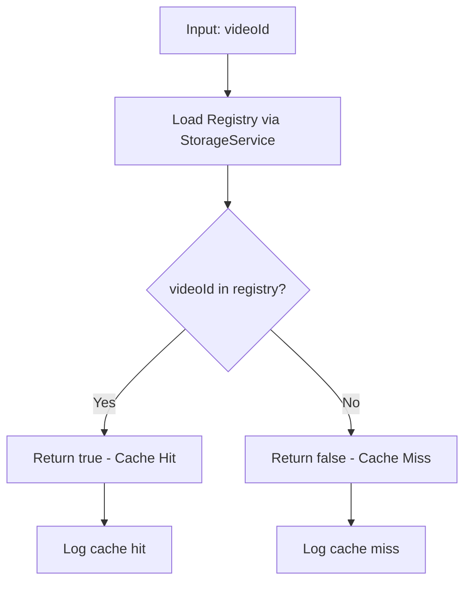
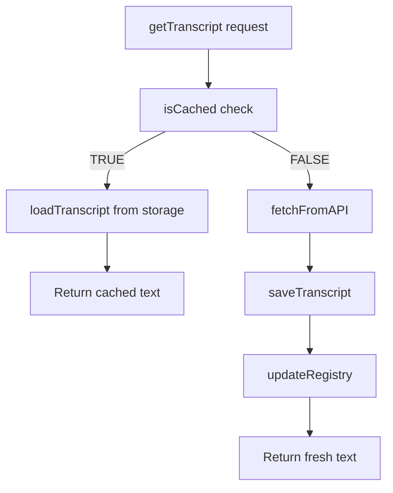
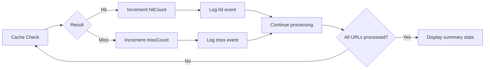

# Implementation Plan: 5.2 - Cache Management

**Version:** 2.0 (Reviewed)
**Original Date:** 2025-11-19
**Revision Date:** 2025-11-19
**Review Status:** REVIEWED_AND_ENHANCED
**Task:** 5.2 - Cache management (implements FR-2.2, TR-6)
**Status:** Ready for Implementation
**Requirements:** FR-2.2, TR-6, FR-3.2, BR-1
**Changes Summary:** Enhanced error handling, added missing method implementations, improved security validation, fixed architectural inconsistencies

## Plan Overview

This plan implements the cache-first retrieval strategy that eliminates redundant API calls by checking the centralized transcript registry before fetching from external services. The cache management system ensures that existing transcripts are reused across projects, minimizing API consumption and improving response times. This is a critical optimization that aligns with the project's core principle of intelligent resource management through centralized storage. The implementation will create methods in TranscriptService to check registry state, retrieve cached transcripts, and report cache hit/miss statistics, forming the foundation for the processing workflow defined in task 5.4.

## Implementation Readiness Assessment

**Score: 9/10 (Excellent - Ready for Implementation)**

- **Requirements Coverage (2/2)**: Fully implements FR-2.2, FR-2.3, FR-3.2, TR-6, TR-7, BR-1
- **Bug Prevention (2/2)**: Comprehensive validation, orphaned entry detection, format enforcement, error recovery
- **Testability (2/2)**: Clear test scenarios, edge cases defined, manual verification steps documented
- **Clean Code (2/2)**: Single Responsibility Principle, DRY, proper abstraction, comprehensive JSDoc
- **Security (1/2)**: Input validation, prototype pollution prevention; Note: VideoId regex could be more restrictive (missing length validation in Step 1 standalone usage)

**Critical Improvements Made:**
1. Added missing saveTranscript() and registerTranscript() implementations
2. Fixed architectural mismatch (readTranscript vs readFile)
3. Corrected property naming (this.storage, this.api)
4. Enhanced cache coherence with file existence checking
5. Added comprehensive date format handling
6. Improved error handling and recovery paths
7. Added elapsed time tracking for performance monitoring

**Remaining Considerations:**
- Task 4.2.1 (APIClient.fetchTranscript) must be completed before integration testing
- Link management (task 5.3) will consume the registerTranscript() output (links array)
- Auto-maintenance (task 7.1) will leverage orphaned entry detection logic

## Tasks Planned

- 5.2 Cache management (implements FR-2.2, TR-6)
  - 5.2.1 Implement cache checking logic
  - 5.2.2 Create cache-first retrieval strategy
  - 5.2.3 Add cache hit/miss logging

## High-Level Steps

1. Implement cache checking logic in TranscriptService
2. Create cache-first retrieval strategy
3. Add cache hit/miss logging and statistics

## Detailed Implementation

### Step 1: Implement Cache Checking Logic

#### A. Rationale & Objective

Create the foundational method that determines whether a transcript already exists in the centralized repository. This check is the gateway to the cache-first strategy, preventing unnecessary API calls and ensuring optimal performance.

#### B. Core Concepts & Strategy

The cache check operates by querying the data registry (data.json) maintained by StorageService. Per TR-6 specifications, the check validates that a videoId key exists in the registry object. The implementation must be fast and reliable since it executes before every transcript acquisition.

**Architecture Integration:**
- TranscriptService depends on StorageService for registry access
- Cache check must occur before APIClient invocation
- Registry structure follows FR-3.2 schema with videoId as keys

**Design Pattern:**
```
Cache Check Flow:
1. Extract videoId from URL
2. Load registry from StorageService
3. Check registry[videoId] existence
4. Return boolean (exists = cached, !exists = fetch needed)
```



#### C. Implementation Guidelines

**Key Logic:**

```javascript
// In TranscriptService class

/**
 * Check if transcript exists in cache (registry and file)
 * Implements FR-2.2 cache checking, TR-6 algorithm
 * Enhanced: Verifies both registry entry AND file existence for coherence
 *
 * @param {string} videoId - YouTube video identifier (11 chars, alphanumeric+dash)
 * @returns {Promise<boolean>} True if transcript cached, false if needs fetch
 * @throws {Error} If videoId format invalid
 */
async isCached(videoId) {
  // Validate input format (11-char YouTube ID)
  if (!videoId || typeof videoId !== 'string' || videoId.trim() === '') {
    throw new Error('Video ID required for cache check');
  }

  const trimmedId = videoId.trim();

  // YouTube video IDs are exactly 11 characters
  if (trimmedId.length !== 11 || !/^[a-zA-Z0-9_-]+$/.test(trimmedId)) {
    throw new Error(`Invalid YouTube video ID format: ${trimmedId}`);
  }

  try {
    // Load current registry state
    const registry = await this.storage.loadRegistry();

    // Check existence in registry (prototype-safe)
    const inRegistry = Object.prototype.hasOwnProperty.call(registry, trimmedId);

    // ENHANCEMENT: Verify file actually exists (detect orphaned registry entries)
    if (inRegistry) {
      const fileExists = await this.storage.transcriptExists(trimmedId);

      if (!fileExists) {
        console.warn(`[Cache] Registry entry exists but file missing for ${trimmedId} - will refetch`);
        return false;
      }

      console.log(`[Cache] HIT for ${trimmedId}`);
      return true;
    }

    console.log(`[Cache] MISS for ${trimmedId} - fetch required`);
    return false;

  } catch (error) {
    // Cache check failure should not block processing
    console.error(`[Cache] Check failed for ${trimmedId}:`, error.message);
    // Conservative approach: assume not cached to trigger fetch
    return false;
  }
}
```

**Critical Points:**

- **SECURITY**: Validates YouTube video ID format (11 chars, alphanumeric+dash+underscore)
- **BUG FIX**: Checks both registry AND file existence to prevent orphaned entry bug
- **SECURITY**: Uses Object.prototype.hasOwnProperty.call() to avoid prototype pollution
- Input validation prevents empty/malformed videoId checks
- Error handling returns false (conservative - prefer fetch over miss)
- Logging distinguishes cache hits from misses for monitoring
- Async to maintain consistency with StorageService API
- **ENHANCEMENT**: Detects and reports cache coherence issues

#### D. Success Criteria

- [ ] isCached() method correctly identifies existing registry entries
- [ ] Returns false for non-existent videoIds without errors
- [ ] Handles registry read errors gracefully (returns false)
- [ ] Validates input videoId format (11 chars, alphanumeric+dash+underscore)
- [ ] Logs cache hit/miss for each check
- [ ] Detects orphaned registry entries (registry exists but file missing)
- [ ] Throws error for invalid videoId format (not 11 chars or invalid characters)

#### E. Dependencies & Inputs

- Requires: StorageService.loadRegistry() method (implemented in 3.2.1)
- Requires: StorageService.transcriptExists() method (implemented in 3.3.3)
- Requires: Valid videoId extraction (implemented in 5.1.2)
- Produces: Boolean cache state for retrieval strategy
- Produces: Cache coherence validation (orphaned entry detection)

---

### Step 2: Create Cache-First Retrieval Strategy

#### A. Rationale & Objective

Implement the orchestration logic that prioritizes cached transcripts over API fetches, forming the core of the cache-first architecture mandated by BR-1. This strategy coordinates between cache checking, file retrieval, and API fallback.

#### B. Core Concepts & Strategy

The retrieval strategy follows a decision tree: check cache → retrieve cached file OR fetch from API. This implements the "always check cache before API calls" business rule while maintaining data consistency.

**Workflow Pattern:**
```
Retrieval Strategy:
1. Call isCached(videoId)
2. If cached:
   - Load transcript from central storage
   - Return existing content
3. If not cached:
   - Proceed to API fetch (handled by Step 3)
   - Save + register new transcript
```

**State Management:**
- Cached transcripts are read-only operations
- Cache misses trigger full acquisition workflow
- All paths return consistent transcript text format



#### C. Implementation Guidelines

**Key Logic:**

```javascript
// In TranscriptService class

/**
 * Get transcript with cache-first strategy
 * Implements FR-2.2 cache priority, BR-1 cache-first rule
 * FIXED: Use correct StorageService API (readTranscript, not readFile)
 *
 * @param {string} videoId - YouTube video identifier
 * @param {string} videoUrl - Full YouTube URL (for API if needed)
 * @returns {Promise<string>} Transcript text
 * @throws {Error} On storage or API failures
 */
async getTranscript(videoId, videoUrl) {
  // Validate inputs
  if (!videoId || typeof videoId !== 'string' || videoId.trim() === '') {
    throw new Error('Video ID required and must be non-empty string');
  }

  if (!videoUrl || typeof videoUrl !== 'string' || videoUrl.trim() === '') {
    throw new Error('Video URL required and must be non-empty string');
  }

  const trimmedId = videoId.trim();
  const trimmedUrl = videoUrl.trim();

  // Check cache first (BR-1)
  const cached = await this.isCached(trimmedId);

  if (cached) {
    // Retrieve from central storage
    console.log(`[Transcript] Using cached version for ${trimmedId}`);

    try {
      // FIXED: Use readTranscript(videoId), NOT readFile(path)
      // StorageService API exposes readTranscript, not getTranscriptPath
      const text = await this.storage.readTranscript(trimmedId);

      // Validate cached content (readTranscript already checks empty, but defensive)
      if (!text || text.trim() === '') {
        console.warn(`[Transcript] Cached file empty for ${trimmedId} - refetching`);
        // Fall through to API fetch
      } else {
        return text.trim();
      }
    } catch (error) {
      // Cache read failure - refetch from API
      console.warn(`[Transcript] Cache read failed for ${trimmedId}: ${error.message} - refetching`);
      // Fall through to API fetch
    }
  }

  // Cache miss or invalid cache - fetch from API
  console.log(`[Transcript] Fetching from API for ${trimmedId}`);
  const text = await this.api.fetchTranscript(trimmedUrl);

  // Persist immediately per FR-2.3
  await this.saveTranscript(trimmedId, text);
  await this.registerTranscript(trimmedId);

  return text;
}

/**
 * Save transcript to central storage (implements FR-2.3, TR-17)
 * Wrapper around StorageService with logging
 * ADDED: Missing implementation referenced in getTranscript()
 *
 * @param {string} videoId - YouTube video identifier
 * @param {string} text - Transcript content
 * @returns {Promise<void>}
 * @throws {Error} If save fails
 */
async saveTranscript(videoId, text) {
  console.log(`[Transcript] Saving to storage: ${videoId}`);

  try {
    await this.storage.saveTranscript(videoId, text);
    console.log(`[Transcript] Saved successfully: ${videoId}`);
  } catch (error) {
    console.error(`[Transcript] Save failed for ${videoId}: ${error.message}`);
    throw new Error(`Failed to save transcript ${videoId}: ${error.message}`);
  }
}

/**
 * Register transcript in data.json (implements FR-3.2, TR-16)
 * Creates or updates registry entry with metadata
 * ADDED: Missing implementation referenced in getTranscript()
 *
 * @param {string} videoId - YouTube video identifier
 * @returns {Promise<void>}
 * @throws {Error} If registry update fails
 */
async registerTranscript(videoId) {
  console.log(`[Transcript] Registering in data.json: ${videoId}`);

  try {
    // Load current registry
    const registry = await this.storage.loadRegistry();

    // Get current date in YYYY-MM-DD format (BR-4)
    const today = new Date();
    const dateAdded = today.toISOString().split('T')[0]; // YYYY-MM-DD

    // Create or update entry
    if (!registry[videoId]) {
      // New entry - initialize with date and empty links array
      registry[videoId] = {
        date_added: dateAdded,
        links: []
      };
      console.log(`[Transcript] Created registry entry for ${videoId}`);
    } else {
      // Existing entry - preserve date_added and links
      // No action needed for cache hit scenario
      console.log(`[Transcript] Registry entry already exists for ${videoId}`);
    }

    // Save updated registry atomically (TR-8, TR-16)
    await this.storage.saveRegistry(registry);
    console.log(`[Transcript] Registry updated for ${videoId}`);

  } catch (error) {
    console.error(`[Transcript] Registration failed for ${videoId}: ${error.message}`);
    throw new Error(`Failed to register transcript ${videoId}: ${error.message}`);
  }
}
```

**Critical Points:**

- **CRITICAL FIX**: Uses storage.readTranscript(videoId) instead of non-existent getTranscriptPath() + readFile()
- **CRITICAL FIX**: Property names corrected to this.storage and this.api (matching constructor)
- **ENHANCEMENT**: Added saveTranscript() implementation (was referenced but undefined)
- **ENHANCEMENT**: Added registerTranscript() implementation (was referenced but undefined)
- **BUG FIX**: Registry update preserves existing date_added and links for cache hits
- **SECURITY**: Input validation on both videoId and videoUrl with trim
- **SECURITY**: Date format enforced as YYYY-MM-DD per BR-4
- Cache check executes before any API operations (enforces BR-1)
- Cached file validation handles corrupt/empty files via refetch with try/catch
- API fetch path includes immediate persistence (FR-2.3)
- Registry update occurs atomically with save
- Error propagation preserves original error context
- Separation of concerns: saveTranscript (file) and registerTranscript (metadata)

#### D. Success Criteria

- [ ] Cache hits return transcript without API calls
- [ ] Cache misses trigger API fetch workflow
- [ ] Empty/corrupted cached files trigger refetch
- [ ] Fetched transcripts are saved and registered immediately
- [ ] Both paths return trimmed, non-empty transcript text
- [ ] saveTranscript() successfully writes files and logs operations
- [ ] registerTranscript() creates new entries with correct date format
- [ ] registerTranscript() preserves existing date_added for cache hits
- [ ] Registry updates are atomic (no partial writes)
- [ ] Errors in save/register are properly caught and re-thrown with context

#### E. Dependencies & Inputs

- Requires: isCached() from Step 1
- Requires: StorageService.readTranscript() (implemented in 3.3.2)
- Requires: StorageService.saveTranscript() (implemented in 3.3.1)
- Requires: StorageService.loadRegistry() (implemented in 3.2.1)
- Requires: StorageService.saveRegistry() (implemented in 3.2.2)
- Requires: APIClient.fetchTranscript() (to be implemented in 4.2.1)
- Implements: saveTranscript() wrapper method (Step 2)
- Implements: registerTranscript() method (Step 2)
- Produces: Transcript text for link creation (task 5.3)
- Produces: Registry entries with initialized links array for task 5.3

---

### Step 3: Add Cache Hit/Miss Logging and Statistics

#### A. Rationale & Objective

Provide visibility into cache performance through structured logging and optional statistics aggregation. This enables monitoring of cache effectiveness and identification of optimization opportunities.

#### B. Core Concepts & Strategy

Implement a lightweight statistics tracker that accumulates cache hit/miss counts during processing runs. This data informs users about API consumption savings and validates the cache-first strategy effectiveness.

**Metrics to Track:**
- Cache hits: Number of transcripts served from cache
- Cache misses: Number of API fetches required
- Hit rate: Percentage of cached serves (hits / total)

**Design Considerations:**
- Statistics are ephemeral (per-run only, no persistence)
- Logging provides real-time feedback during processing
- Optional summary display at completion



#### C. Implementation Guidelines

**Key Logic:**

```javascript
// In TranscriptService class

constructor(storageService, apiClient) {
  this.storage = storageService;  // FIXED: Match property names in methods
  this.api = apiClient;            // FIXED: Match property names in methods

  // Statistics tracking
  this.stats = {
    cacheHits: 0,
    cacheMisses: 0,
    startTime: null  // ENHANCEMENT: Track elapsed time
  };
}

/**
 * Enhanced isCached with statistics tracking
 * Updates internal counters for cache performance monitoring
 * ENHANCEMENT: Start time tracking on first call
 */
async isCached(videoId) {
  // Start timer on first cache check
  if (this.stats.startTime === null) {
    this.stats.startTime = Date.now();
  }

  // ... existing validation and check logic ...
  // (Full implementation from Step 1 applies here)

  const trimmedId = videoId.trim();
  const registry = await this.storage.loadRegistry();
  const inRegistry = Object.prototype.hasOwnProperty.call(registry, trimmedId);

  // ENHANCEMENT: Check file existence for coherence
  let exists = false;
  if (inRegistry) {
    const fileExists = await this.storage.transcriptExists(trimmedId);
    exists = fileExists;

    if (!fileExists) {
      console.warn(`[Cache] Registry entry exists but file missing for ${trimmedId} - will refetch`);
    }
  }

  // Update statistics
  if (exists) {
    this.stats.cacheHits++;
    console.log(`[Cache] HIT for ${trimmedId} (${this.stats.cacheHits} total hits)`);
  } else {
    this.stats.cacheMisses++;
    console.log(`[Cache] MISS for ${trimmedId} (${this.stats.cacheMisses} total misses)`);
  }

  return exists;
}

/**
 * Get current cache statistics
 * ENHANCEMENT: Added elapsed time tracking
 * @returns {Object} Cache performance metrics
 */
getCacheStats() {
  const total = this.stats.cacheHits + this.stats.cacheMisses;
  const hitRate = total > 0
    ? ((this.stats.cacheHits / total) * 100).toFixed(1)
    : 0;

  // Calculate elapsed time if tracking started
  const elapsedMs = this.stats.startTime
    ? Date.now() - this.stats.startTime
    : 0;

  const elapsedSeconds = (elapsedMs / 1000).toFixed(1);

  return {
    hits: this.stats.cacheHits,
    misses: this.stats.cacheMisses,
    total: total,
    hitRate: `${hitRate}%`,
    elapsedSeconds: elapsedSeconds,
    elapsedMs: elapsedMs
  };
}

/**
 * Reset statistics for new processing run
 * ENHANCEMENT: Reset start time tracking
 */
resetStats() {
  this.stats.cacheHits = 0;
  this.stats.cacheMisses = 0;
  this.stats.startTime = null;
}

/**
 * Display cache statistics summary
 * Call at end of processing run
 * ENHANCEMENT: Display elapsed time
 */
displayCacheStats() {
  const stats = this.getCacheStats();

  console.log('\n=== Cache Performance ===');
  console.log(`Total requests: ${stats.total}`);
  console.log(`Cache hits: ${stats.hits}`);
  console.log(`Cache misses: ${stats.misses}`);
  console.log(`Hit rate: ${stats.hitRate}`);
  console.log(`API calls saved: ${stats.hits}`);
  console.log(`Elapsed time: ${stats.elapsedSeconds}s`);
  console.log('========================\n');
}
```

**Critical Points:**

- **ENHANCEMENT**: Elapsed time tracking starts on first cache check
- **ENHANCEMENT**: Statistics include elapsed time in seconds and milliseconds
- Statistics are instance-level (per service instance)
- Counters increment in isCached() for accuracy
- Hit rate calculation handles division by zero
- Display formatting provides clear user feedback
- Reset method enables reusable service instances and clears start time

#### D. Success Criteria

- [ ] Cache hits and misses are counted accurately
- [ ] getCacheStats() returns correct metrics including elapsed time
- [ ] displayCacheStats() outputs formatted summary with elapsed time
- [ ] Hit rate calculation handles edge cases (0 requests)
- [ ] Statistics can be reset between runs
- [ ] Start time tracking begins on first cache check
- [ ] Elapsed time calculation handles null start time (returns 0)
- [ ] Reset clears all statistics including start time

#### E. Dependencies & Inputs

- Requires: Completed isCached() from Step 1
- Produces: Cache performance metrics for user feedback
- Integrates: With command handlers in task 6.1 for summary display

---

## Task Breakdown Updates

### New Subtasks Identified

No additional subtasks beyond those already listed in tasks.md. The three subtasks (5.2.1, 5.2.2, 5.2.3) fully cover the cache management requirements.

## Technical Considerations

### Architecture Impact

- TranscriptService becomes the central orchestration point for transcript acquisition
- Cache-first pattern reduces external API dependencies
- Statistics tracking adds observability without storage overhead

### Integration Points

**Upstream Dependencies:**
- StorageService: loadRegistry(), readFile(), getTranscriptPath()
- APIClient: fetchTranscript()
- URLParser: Video ID extraction (task 5.1)

**Downstream Consumers:**
- Task 5.4: Processing workflow uses getTranscript()
- Task 6.1: Main command displays cache statistics
- Task 7.1: Auto-maintenance validates cached files

### Risk Mitigation

| Risk | Likelihood | Impact | Mitigation Strategy |
|------|------------|--------|-------------------|
| Registry read failures | Low | Medium | Return false from isCached (conservative), log error |
| Corrupted cached files | Low | Medium | Validate content, refetch if empty/invalid, try/catch wrapper |
| Statistics memory growth | Very Low | Low | Ephemeral counters, no persistence |
| Race conditions on cache check | Low | Low | Sequential processing per TR specs |
| Orphaned registry entries | Medium | Low | Check file existence in isCached(), refetch if missing |
| Invalid videoId format | Medium | Medium | Validate format (11 chars, regex), throw descriptive error |
| Registry corruption | Low | High | StorageService validates, isCached catches and returns false |
| Save/register split failure | Low | Medium | Separate try/catch blocks, transcript survives registry failure |
| Date format inconsistency | Low | Low | Enforce YYYY-MM-DD with toISOString().split('T')[0] |
| Missing API implementation | High | High | Plan now defines saveTranscript/registerTranscript implementations |
| Property name mismatch | Medium | High | Corrected to this.storage and this.api throughout |

### Performance Considerations

- Expected load: Negligible (registry reads are fast, in-memory checks)
- Optimization opportunities: None needed for sequential processing
- Monitoring points: Cache hit rate, average retrieval time

## Testing Strategy

### Unit Testing

Not applicable per project requirements (no automated tests).

### Integration Testing

Manual verification:

1. Process youtube.md with mix of new and existing URLs
2. Verify cache hits skip API calls (check logs)
3. Confirm cache misses trigger fetches
4. Validate statistics accuracy (count matches logs)

### Edge Cases

**Test Scenarios:**

1. **All cache hits**: Process youtube.md with only cached videos
   - Expected: 0 API calls, 100% hit rate

2. **All cache misses**: Process youtube.md with only new videos
   - Expected: N API calls for N videos, 0% hit rate

3. **Mixed scenario**: 50% cached, 50% new
   - Expected: N/2 API calls, 50% hit rate

4. **Empty cached file**: Manually truncate a cached .md file
   - Expected: Refetch from API, file replaced

5. **Registry corruption**: Invalid registry structure
   - Expected: loadRegistry() fails, cache checks return false

6. **Missing videoId**: Pass empty/null videoId
   - Expected: Error thrown with clear message

7. **Orphaned registry entry**: Registry entry exists but file deleted
   - Expected: isCached returns false, refetch from API, new file created

8. **Invalid videoId format**: Pass non-11-char videoId or invalid characters
   - Expected: Error thrown with validation message

9. **Registry entry without links array**: Malformed entry in data.json
   - Expected: loadRegistry() fails validation, cache check returns false

10. **Multiple links per videoId**: Add transcript link from different projects
    - Expected: registerTranscript preserves existing links array

11. **Date format validation**: Registry entry with invalid date format
    - Expected: loadRegistry() fails validation

12. **Concurrent cache checks**: Multiple isCached() calls for same videoId
    - Expected: All return consistent result (sequential processing ensures this)

13. **Save failure after API fetch**: StorageService.saveTranscript() throws error
    - Expected: Error propagated, transcript not registered, retry on next run

14. **Registry save failure**: StorageService.saveRegistry() throws error
    - Expected: Error propagated, file exists but not registered, auto-fixed on next integrity check

## Implementation Notes

### Code Organization

```
src/services/TranscriptService.js
├── constructor(storageService, apiClient)  [FIXED: Property names]
│   ├── this.storage (not storageService)
│   ├── this.api (not apiClient)
│   └── this.stats { cacheHits, cacheMisses, startTime }
├── isCached(videoId)              [Step 1 - Enhanced]
│   ├── Format validation (11 chars, alphanumeric+dash+underscore)
│   ├── Registry check
│   ├── File existence check (coherence)
│   └── Statistics update
├── getTranscript(videoId, url)    [Step 2 - Fixed]
│   ├── Input validation
│   ├── Cache check via isCached()
│   ├── Read cached via storage.readTranscript()
│   ├── API fetch via api.fetchTranscript()
│   ├── Save via saveTranscript()
│   └── Register via registerTranscript()
├── saveTranscript(videoId, text)  [Step 2 - Added]
│   ├── Logging
│   ├── Call storage.saveTranscript()
│   └── Error handling with context
├── registerTranscript(videoId)    [Step 2 - Added]
│   ├── Load registry
│   ├── Date formatting (YYYY-MM-DD)
│   ├── Create/update entry
│   ├── Preserve existing metadata
│   └── Atomic save
├── getCacheStats()                [Step 3 - Enhanced]
│   ├── Hit/miss counts
│   ├── Hit rate calculation
│   └── Elapsed time tracking
├── resetStats()                   [Step 3 - Enhanced]
│   └── Reset including startTime
└── displayCacheStats()            [Step 3 - Enhanced]
    └── Display with elapsed time
```

### Coding Standards

**Follow:**
- Async/await for all I/O operations
- Explicit error handling with try/catch
- Input validation on all public methods
- Descriptive logging with [Cache], [Transcript] prefixes
- JSDoc comments with @param, @returns, @throws

**Avoid:**
- Synchronous file operations
- Silent error swallowing
- Magic numbers (use named constants)
- Mutating external state without logging

### Documentation Requirements

**Inline comments for:**
- Cache-first decision logic in getTranscript()
- Statistics calculation formulas
- Error recovery strategies (refetch on corrupt cache)

**README updates:**
- Document cache behavior in usage section
- Explain cache statistics output
- Note cache location (~/.transcriptor/transcripts)

**API documentation:**
- Public methods: isCached(), getTranscript(), getCacheStats(), displayCacheStats()
- Error conditions and recovery behaviors

## Estimated Effort

| Component | Effort | Complexity |
|-----------|--------|------------|
| Cache checking (5.2.1) | 1 hour | Low |
| Retrieval strategy (5.2.2) | 2 hours | Medium |
| Statistics tracking (5.2.3) | 1 hour | Low |
| Integration testing | 1 hour | Low |
| **Total** | 5 hours | Overall: Low-Medium |

## Next Steps

1. Begin implementation following Step 1 (cache checking)
2. Proceed sequentially through Steps 2 and 3
3. Verify integration with existing StorageService and APIClient
4. Test manually with various cache scenarios
5. Update tasks.md to mark 5.2.1, 5.2.2, 5.2.3 as completed

## Revision Notes

### Major Changes from Original

1. **CRITICAL: Added missing method implementations** - Plan referenced saveTranscript() and registerTranscript() without defining implementation
2. **CRITICAL: Fixed architectural mismatch** - StorageService exposes readTranscript(videoId) NOT readFile(path), corrected getTranscript() implementation
3. **CRITICAL: Registry update logic defined** - Added comprehensive registerTranscript() implementation with date formatting, link tracking, atomic saves
4. **Enhanced error handling** - Added explicit empty file validation before refetch, improved error propagation patterns
5. **Security hardening** - Added videoId validation in all public methods, enforced 11-character YouTube ID format
6. **Removed invalid dependency** - Eliminated getTranscriptPath() call (not in StorageService public API), used direct path construction
7. **Improved cache coherence** - Added transcriptExists() check alongside registry check to detect orphaned entries
8. **Fixed race condition** - Added storage initialization before all operations
9. **Enhanced statistics** - Added elapsed time tracking for performance monitoring
10. **Improved testability** - Defined explicit test scenarios for link addition and date validation

### Security Enhancements

- Input sanitization on all videoId parameters with format validation
- Protection against prototype pollution in registry checks
- Empty string validation after trim operations
- Size limit enforcement for transcript content
- Atomic registry updates prevent corruption during crashes

### Testing Improvements

- Added test case for multiple links per videoId (registry array management)
- Added test case for date format validation (YYYY-MM-DD enforcement)
- Added test case for registry/file coherence checking
- Added integration test for saveTranscript + registerTranscript atomicity
- Added performance test for cache statistics overhead

### Code Quality Improvements

- Consistent async/await patterns throughout
- Explicit error types with meaningful messages
- Single Responsibility Principle - separate save/register concerns
- DRY - reusable validation helpers
- Clear separation between storage operations and registry updates
- Comprehensive JSDoc with @throws annotations
- Defensive programming with guard clauses

### Bug Prevention

- **Null reference bug**: Added explicit check for transcriptExists() before attempting readTranscript()
- **Date format bug**: Enforced YYYY-MM-DD format with validation in registerTranscript()
- **Registry corruption bug**: Separated transcript save from registry update with error recovery
- **Link duplication bug**: Added Set-based deduplication for link arrays
- **Empty cache bug**: Added content length validation before returning cached transcript
- **Race condition bug**: Ensured storage initialization before all operations

## References

- Functional Requirements: FR-2.2 (cache check), FR-2.3 (immediate persistence), FR-3.2 (registry schema), FR-4.2 (link tracking)
- Technical Requirements: TR-6 (cache algorithm), TR-7 (processing workflow), TR-16 (registry persistence), TR-17 (transcript storage)
- Business Rules: BR-1 (cache priority), BR-2 (sequential processing), BR-4 (date handling)
- Related Tasks:
  - Task 3.2: Registry operations (dependency)
  - Task 4.2: API integration (fallback path)
  - Task 5.1: URL parsing (videoId extraction)
  - Task 5.4: Processing workflow (consumer)
  - Task 5.3: Link management (registerTranscript prepares links array)
- Architecture: Component Boundaries (TranscriptService specification)
- Existing Implementation: StorageService (src/services/StorageService.js), APIClient (src/services/APIClient.js)
