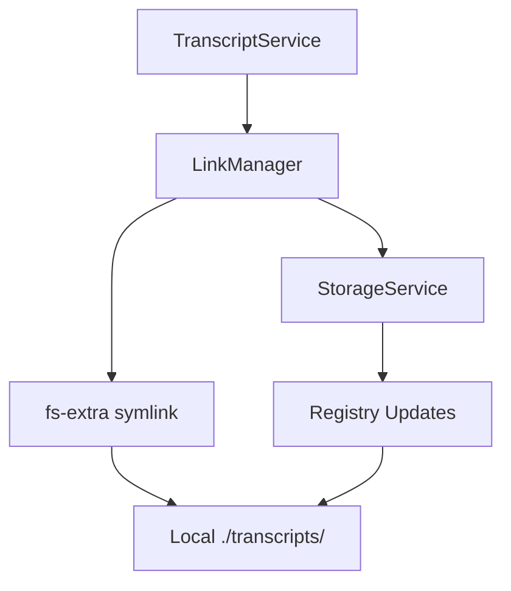
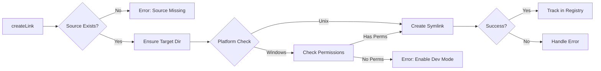

# Implementation Plan: 5.3 - Symbolic Link Management

**Version:** 2.0 (Reviewed)
**Original Date:** 2025-11-19
**Revision Date:** 2025-11-19
**Review Status:** REVIEWED_AND_ENHANCED
**Task:** 5.3 - Symbolic link management (implements FR-4, TR-9)
**Status:** Ready for Implementation
**Requirements:** FR-4.1, FR-4.2, TR-9, TR-13

**Changes Summary:** Enhanced security validation, added race condition handling, improved error messages, strengthened registry integrity, added comprehensive boundary condition handling

## Plan Overview

This plan implements the symbolic link management system that bridges the centralized transcript storage (`~/.transcriptor/transcripts/`) with project-local directories (`./transcripts/`). The feature enables multiple projects to access the same transcript files without duplication through symlink creation, tracking, and lifecycle management. This iteration focuses on creating a robust, cross-platform linking mechanism that maintains bidirectional tracking between transcripts and their symbolic link locations, supporting Windows, macOS, and Linux environments while gracefully handling link conflicts and filesystem errors.

## Tasks Planned

- 5.3 Symbolic link management (implements FR-4, TR-9)
  - 5.3.1 Implement symbolic link creation
  - 5.3.2 Add link tracking in registry
  - 5.3.3 Handle existing link overwrites
  - 5.3.4 Add cross-platform link compatibility

## High-Level Steps

1. Create LinkManager service with symbolic link operations
2. Implement link creation with cross-platform compatibility
3. Add registry tracking for link locations
4. Handle existing link overwrites and validation
5. Implement link removal and cleanup utilities

## Detailed Implementation

### Step 1: Create LinkManager Service Structure

#### A. Rationale & Objective
Establish a dedicated service module responsible for all symbolic link operations, separating link management concerns from storage and transcript services to maintain single responsibility and testability.

#### B. Core Concepts & Strategy
The LinkManager acts as a facade over fs-extra symlink operations, providing cross-platform abstraction and error handling. It encapsulates link lifecycle operations (create, validate, remove) and coordinates with StorageService for registry tracking updates.



#### C. Implementation Guidelines

**Key Logic:**

```javascript
// src/services/LinkManager.js
const fs = require('fs-extra');
const path = require('path');
const validators = require('../utils/validators');

class LinkManager {
  constructor(storageService, pathResolver) {
    // Guard: Validate dependencies injected
    if (!storageService) {
      throw new Error('LinkManager requires StorageService dependency');
    }
    if (!pathResolver) {
      throw new Error('LinkManager requires PathResolver dependency');
    }

    this.storage = storageService;
    this.paths = pathResolver;
  }

  async createLink(videoId, sourcePath, targetPath) {
    // 1. Validate videoId format (security)
    // 2. Validate source exists
    // 3. Ensure target directory exists
    // 4. Check for existing link
    // 5. Create symbolic link
    // 6. Track in registry
    // Return: { success: boolean, path: string }
  }

  async removeLink(linkPath) {
    // 1. Validate linkPath is absolute (security)
    // 2. Check link exists
    // 3. Unlink
    // 4. Return success status
  }
}

module.exports = LinkManager;
```

**Critical Points:**

- Use fs-extra for consistent symlink API across platforms
- Constructor injection for StorageService AND PathResolver dependencies
- Validate dependencies in constructor (fail-fast)
- Add videoId format validation before any file operations (security)
- Validate all paths are absolute before operations (prevent path traversal)
- Separate validation from link operation
- Return structured results for error handling upstream
- Export class properly for module usage

#### D. Success Criteria

- [ ] LinkManager class created in `src/services/LinkManager.js`
- [ ] Constructor accepts StorageService instance
- [ ] Basic method signatures defined (createLink, removeLink, validateLink)
- [ ] Module exports LinkManager class

#### E. Dependencies & Inputs

- Requires: StorageService, PathResolver, fs-extra
- Produces: LinkManager service for use in TranscriptService

---

### Step 2: Implement Link Creation with Cross-Platform Support

#### A. Rationale & Objective
Create a robust symlink creation mechanism that works across Windows (requires admin/dev mode), macOS, and Linux, handling platform-specific differences in symlink behavior and permissions.

#### B. Core Concepts & Strategy
Use fs-extra's `ensureSymlink()` which abstracts platform differences. On Windows, handle permission errors gracefully by checking for developer mode or admin privileges. Implement fallback strategy (copy file if symlink fails) as optional configuration.

**Platform Considerations:**

- **macOS/Linux**: Native symlink support, no special permissions
- **Windows**: Requires Developer Mode enabled OR admin privileges
- **Error Strategy**: Detect EPERM, provide helpful error messages



#### C. Implementation Guidelines

**Key Logic:**

```javascript
async createLink(videoId, projectDir = process.cwd()) {
  // Security: Validate videoId format first
  if (!validators.isValidVideoId(videoId)) {
    throw new Error(`Invalid video ID format: ${videoId}`);
  }

  // Security: Validate projectDir is absolute and safe
  if (!path.isAbsolute(projectDir)) {
    throw new Error('Project directory must be absolute path');
  }

  const sourcePath = path.join(this.paths.getTranscriptsPath(), `${videoId}.md`);
  const targetDir = path.join(projectDir, 'transcripts');
  const targetPath = path.join(targetDir, `${videoId}.md`);

  // Validate source exists
  if (!await fs.pathExists(sourcePath)) {
    throw new Error(`Source transcript not found: ${videoId} at ${sourcePath}`);
  }

  // Ensure target directory with race condition handling
  try {
    await fs.ensureDir(targetDir);
  } catch (dirError) {
    // EEXIST is safe (another process created it)
    if (dirError.code !== 'EEXIST') {
      throw new Error(`Failed to create target directory: ${dirError.message}`);
    }
  }

  try {
    // Use ensureSymlink for cross-platform support and automatic overwrite
    await fs.ensureSymlink(sourcePath, targetPath, 'file');

    // Track in registry AFTER successful link creation
    await this._trackLink(videoId, targetPath);

    return { success: true, path: targetPath };
  } catch (error) {
    if (error.code === 'EPERM' && process.platform === 'win32') {
      throw new Error(
        'Symbolic link creation failed on Windows. ' +
        'Enable Developer Mode or run as administrator. ' +
        'See: https://docs.microsoft.com/en-us/windows/apps/get-started/enable-your-device-for-development'
      );
    }

    // Provide context in error message
    throw new Error(`Symlink creation failed for ${videoId}: ${error.message}`);
  }
}

async _trackLink(videoId, linkPath) {
  const registry = await this.storage.loadRegistry();

  // Convert to absolute path immediately
  const absolutePath = path.resolve(linkPath);

  // Validate absolute path (security - prevent path traversal)
  if (!path.isAbsolute(absolutePath)) {
    throw new Error(`Link path must be absolute: ${linkPath}`);
  }

  // Create entry if missing
  if (!registry[videoId]) {
    registry[videoId] = {
      date_added: new Date().toISOString().split('T')[0],
      links: []
    };
  }

  // Guard: Ensure links array exists (registry corruption recovery)
  if (!Array.isArray(registry[videoId].links)) {
    console.warn(`Corrupted links array for ${videoId} - reinitializing`);
    registry[videoId].links = [];
  }

  // Add link if not already tracked (idempotent)
  if (!registry[videoId].links.includes(absolutePath)) {
    registry[videoId].links.push(absolutePath);

    // Atomic registry save
    try {
      await this.storage.saveRegistry(registry);
    } catch (saveError) {
      // Critical: Link created but registry update failed
      throw new Error(
        `Link created but registry update failed for ${videoId}: ${saveError.message}. ` +
        'Manual cleanup may be required.'
      );
    }
  } else {
    console.log(`Link already tracked: ${absolutePath}`);
  }
}
```

**Critical Points:**

- SECURITY: Validate videoId format before any file operations
- SECURITY: Validate all paths are absolute (prevent path traversal)
- Use `fs.ensureSymlink()` (not `fs.symlink()`) for automatic overwrite handling
- Always store absolute paths in registry links array using path.resolve()
- Validate source before attempting link creation
- Handle EEXIST error for target directory (race condition safety)
- Provide platform-specific error messages for Windows with documentation link
- Add context to all error messages (videoId, paths)
- Atomic registry update after successful link creation
- Registry corruption recovery: reinitialize corrupted links arrays
- Idempotent link tracking (skip if already exists)
- Critical error handling: Warn if link created but registry save fails

#### D. Success Criteria

- [ ] createLink() method creates symlinks on macOS/Linux
- [ ] createLink() handles Windows EPERM with helpful message
- [ ] Source transcript validation before link creation
- [ ] Target directory created if missing
- [ ] Absolute paths stored in registry
- [ ] Registry updated after successful link creation

#### E. Dependencies & Inputs

- Requires: fs-extra.ensureSymlink(), StorageService.loadRegistry(), PathResolver
- Produces: Symbolic link in project ./transcripts/ directory, updated registry

---

### Step 3: Handle Existing Link Overwrites

#### A. Rationale & Objective
Manage scenarios where symlinks already exist at target paths, ensuring idempotent behavior while detecting and handling broken links, regular files, or stale symlinks pointing to wrong sources.

#### B. Core Concepts & Strategy
Use `fs.ensureSymlink()` which automatically handles overwrites. Add pre-flight validation to detect conflicts (regular file vs symlink) and broken links, providing informative feedback before modification.

**Conflict Scenarios:**

1. **Valid symlink to correct source**: Skip, already exists
2. **Valid symlink to wrong source**: Overwrite, update registry
3. **Broken symlink**: Remove and recreate
4. **Regular file exists**: Error, manual intervention required
5. **No file exists**: Create normally

#### C. Implementation Guidelines

**Key Logic:**

```javascript
async validateTarget(targetPath) {
  // Security: Validate path is absolute
  if (!path.isAbsolute(targetPath)) {
    throw new Error(`Target path must be absolute: ${targetPath}`);
  }

  try {
    const exists = await fs.pathExists(targetPath);
    if (!exists) {
      return { status: 'none', canProceed: true };
    }

    const stats = await fs.lstat(targetPath); // lstat doesn't follow symlinks

    if (stats.isSymbolicLink()) {
      try {
        const linkTarget = await fs.readlink(targetPath);

        // Check if symlink is broken by trying to access the target
        const targetExists = await fs.pathExists(targetPath); // This follows symlink

        if (!targetExists) {
          return {
            status: 'broken_symlink',
            canProceed: true,
            message: 'Broken symlink will be replaced',
            existing: linkTarget
          };
        }

        return {
          status: 'symlink',
          canProceed: true,
          existing: linkTarget,
          message: 'Valid symlink will be replaced if different source'
        };
      } catch (readlinkError) {
        // Symlink exists but readlink failed (permission issue)
        return {
          status: 'broken_symlink',
          canProceed: true,
          message: `Symlink unreadable (${readlinkError.code}), will be replaced`
        };
      }
    } else if (stats.isFile()) {
      return {
        status: 'file',
        canProceed: false,
        message: 'Regular file exists at target path - manual intervention required'
      };
    } else if (stats.isDirectory()) {
      return {
        status: 'directory',
        canProceed: false,
        message: 'Directory exists at target path - manual intervention required'
      };
    } else {
      // Unknown file type (socket, device, etc.)
      return {
        status: 'unknown',
        canProceed: false,
        message: `Unknown file type at target path: ${stats.mode}`
      };
    }
  } catch (error) {
    if (error.code === 'ENOENT') {
      return { status: 'none', canProceed: true };
    }

    // Permission errors during validation
    if (error.code === 'EACCES' || error.code === 'EPERM') {
      return {
        status: 'permission_denied',
        canProceed: false,
        message: `Permission denied accessing target path: ${targetPath}`
      };
    }

    throw error;
  }
}

async createLink(videoId, projectDir = process.cwd()) {
  const sourcePath = this.paths.getTranscriptPath(videoId);
  const targetDir = path.join(projectDir, 'transcripts');
  const targetPath = path.join(targetDir, `${videoId}.md`);

  // Validate source
  if (!await fs.pathExists(sourcePath)) {
    throw new Error(`Source transcript not found: ${videoId}`);
  }

  // Ensure target directory
  await fs.ensureDir(targetDir);

  // Check target status
  const validation = await this.validateTarget(targetPath);

  if (!validation.canProceed) {
    throw new Error(
      `Cannot create symlink: ${validation.message}\nPath: ${targetPath}`
    );
  }

  // Log if overwriting existing symlink
  if (validation.status === 'symlink' || validation.status === 'broken_symlink') {
    console.log(`Replacing existing link: ${targetPath}`);
  }

  try {
    // ensureSymlink handles overwrites automatically
    await fs.ensureSymlink(sourcePath, targetPath, 'file');
    await this._trackLink(videoId, targetPath);

    return {
      success: true,
      path: targetPath,
      replaced: validation.status !== 'none'
    };
  } catch (error) {
    if (error.code === 'EPERM' && process.platform === 'win32') {
      throw new Error(
        'Symbolic link creation failed on Windows. ' +
        'Enable Developer Mode or run as administrator.'
      );
    }
    throw error;
  }
}
```

**Critical Points:**

- SECURITY: Validate path is absolute before any checks
- Use `fs.lstat()` (not `fs.stat()`) to detect symlinks without following them
- Distinguish between broken symlinks (can overwrite) and regular files (cannot)
- Handle directory conflicts (cannot overwrite directory with symlink)
- Handle unknown file types (sockets, devices) - block with error
- Detect permission errors during validation
- Properly test if symlink is broken by following it with fs.pathExists()
- Provide clear error messages for manual intervention scenarios
- Log overwrites for transparency
- `fs.ensureSymlink()` handles atomic replacement

#### D. Success Criteria

- [ ] validateTarget() correctly identifies file types
- [ ] Broken symlinks detected and replaced
- [ ] Regular files block link creation with error
- [ ] Valid symlinks replaced with warning log
- [ ] No target creates new link without warnings

#### E. Dependencies & Inputs

- Requires: fs-extra.lstat(), fs-extra.readlink(), fs-extra.ensureSymlink()
- Produces: Validated target state, overwrite confirmation

---

### Step 4: Implement Link Removal and Cleanup

#### A. Rationale & Objective
Provide utilities for removing symbolic links during cleanup operations, handling missing links gracefully to support maintenance commands and registry cleanup.

#### B. Core Concepts & Strategy
Create deletion methods that skip missing links (already deleted) but report actual filesystem errors. Support both single link removal and batch removal for cleanup operations.

#### C. Implementation Guidelines

**Key Logic:**

```javascript
async removeLink(linkPath) {
  // Security: Validate path is absolute
  if (!path.isAbsolute(linkPath)) {
    throw new Error(`Link path must be absolute: ${linkPath}`);
  }

  try {
    // Verify it's actually a symlink before deletion (safety check)
    const stats = await fs.lstat(linkPath);

    if (!stats.isSymbolicLink()) {
      throw new Error(`Path is not a symbolic link: ${linkPath}`);
    }

    await fs.unlink(linkPath);
    return { success: true, path: linkPath };
  } catch (error) {
    if (error.code === 'ENOENT') {
      // Link already removed, not an error (idempotent)
      return { success: true, path: linkPath, skipped: true };
    }

    if (error.code === 'EACCES' || error.code === 'EPERM') {
      throw new Error(`Permission denied removing link: ${linkPath}`);
    }

    throw error;
  }
}

async removeAllLinks(videoId) {
  // Security: Validate videoId format
  if (!validators.isValidVideoId(videoId)) {
    throw new Error(`Invalid video ID format: ${videoId}`);
  }

  const registry = await this.storage.loadRegistry();
  const entry = registry[videoId];

  // Guard: Handle missing or empty entries
  if (!entry) {
    return { removed: 0, skipped: 0, errors: [], message: 'No registry entry found' };
  }

  if (!Array.isArray(entry.links) || entry.links.length === 0) {
    return { removed: 0, skipped: 0, errors: [], message: 'No links to remove' };
  }

  const results = {
    removed: 0,
    skipped: 0,
    errors: []
  };

  // Process all links (fail-safe: continue on errors)
  for (const linkPath of entry.links) {
    try {
      const result = await this.removeLink(linkPath);
      if (result.skipped) {
        results.skipped++;
      } else {
        results.removed++;
      }
    } catch (error) {
      results.errors.push({
        path: linkPath,
        error: error.message,
        code: error.code
      });
    }
  }

  // Update registry: Keep only links that failed to delete
  const failedPaths = results.errors.map(e => e.path);
  entry.links = entry.links.filter(link => failedPaths.includes(link));

  // Save registry if any changes occurred
  if (results.removed > 0 || results.skipped > 0) {
    try {
      await this.storage.saveRegistry(registry);
    } catch (saveError) {
      // Critical: Links removed but registry update failed
      console.error(`Links removed but registry update failed for ${videoId}: ${saveError.message}`);
      results.registryUpdateFailed = true;
    }
  }

  return results;
}
```

**Critical Points:**

- SECURITY: Validate path is absolute before deletion
- SECURITY: Verify target is actually a symlink before deleting (prevent accidental file deletion)
- SECURITY: Validate videoId format in removeAllLinks
- Treat ENOENT as success (idempotent deletion)
- Handle permission errors with clear messages
- Collect errors rather than failing fast for batch operations
- Update registry to remove successfully deleted links ONLY
- Keep failed deletions in registry for retry/manual cleanup
- Save registry only if changes occurred
- Handle registry save failures gracefully (links removed but tracking failed)
- Return detailed results for logging/reporting

#### D. Success Criteria

- [ ] removeLink() deletes existing symlinks
- [ ] removeLink() gracefully handles missing links
- [ ] removeAllLinks() processes all tracked links
- [ ] Registry updated to remove deleted links
- [ ] Errors collected and reported, don't block cleanup

#### E. Dependencies & Inputs

- Requires: fs-extra.unlink(), StorageService registry operations
- Produces: Cleaned up links, updated registry

---

### Step 5: Integrate LinkManager into TranscriptService

#### A. Rationale & Objective
Connect the LinkManager to the main transcript processing workflow, ensuring every successfully fetched transcript automatically creates a local symlink tracked in the registry.

#### B. Core Concepts & Strategy
Modify TranscriptService to instantiate LinkManager and call createLink() after successful transcript save operations. Handle link creation failures independently from transcript operations (transcript saved, but link failed).

#### C. Implementation Guidelines

**Key Logic:**

```javascript
// src/services/TranscriptService.js
const LinkManager = require('./LinkManager');

class TranscriptService {
  constructor(storageService, apiClient, pathResolver) {
    // Validate dependencies
    if (!storageService || !apiClient || !pathResolver) {
      throw new Error('TranscriptService requires StorageService, APIClient, and PathResolver dependencies');
    }

    this.storage = storageService;
    this.api = apiClient;
    this.linkManager = new LinkManager(storageService, pathResolver);

    // Statistics tracking (existing)
    this.stats = {
      cacheHits: 0,
      cacheMisses: 0,
      linksCreated: 0,
      linksFailed: 0,
      startTime: null
    };
  }

  async processVideo(videoId, videoUrl, projectDir = process.cwd()) {
    // Validate inputs
    if (!validators.isValidVideoId(videoId)) {
      throw new Error(`Invalid video ID format: ${videoId}`);
    }

    // Ensure projectDir is absolute
    const absoluteProjectDir = path.resolve(projectDir);

    // Get transcript (handles cache-first strategy internally)
    const transcript = await this.getTranscript(videoId, videoUrl);

    // Create symlink in project directory
    try {
      const linkResult = await this.linkManager.createLink(videoId, absoluteProjectDir);

      console.log(`[Link] Created: ${linkResult.path}`);
      this.stats.linksCreated++;

      return {
        success: true,
        videoId,
        linked: true,
        linkPath: linkResult.path,
        replaced: linkResult.replaced || false
      };
    } catch (linkError) {
      console.error(`[Link] Creation failed for ${videoId}: ${linkError.message}`);
      this.stats.linksFailed++;

      // Transcript is saved, link failed - partial success
      // Don't throw - allow processing to continue
      return {
        success: true,
        videoId,
        linked: false,
        linkError: linkError.message,
        warning: 'Transcript saved but link creation failed'
      };
    }
  }

  /**
   * Display processing statistics summary
   */
  displayStats() {
    const cacheStats = this.getCacheStats();

    console.log('\n=== Processing Summary ===');
    console.log(`Total requests: ${cacheStats.total}`);
    console.log(`Cache hits: ${cacheStats.hits}`);
    console.log(`Cache misses: ${cacheStats.misses}`);
    console.log(`Links created: ${this.stats.linksCreated}`);
    console.log(`Links failed: ${this.stats.linksFailed}`);
    console.log(`Hit rate: ${cacheStats.hitRate}`);
    console.log(`Elapsed time: ${cacheStats.elapsedSeconds}s`);
    console.log('=========================\n');
  }
}

module.exports = TranscriptService;
```

**Critical Points:**

- DEPENDENCY INJECTION: All dependencies injected via constructor (StorageService, APIClient, PathResolver)
- VALIDATION: Validate all dependencies in constructor (fail-fast)
- SECURITY: Validate videoId format before processing
- PATH SAFETY: Convert projectDir to absolute path before passing to LinkManager
- STATS TRACKING: Track link creation successes and failures
- ERROR HANDLING: Link failures don't throw - return partial success result
- SEPARATION: Use existing getTranscript() method for cache-first logic
- LOGGING: Clear logging with [Link] prefix for link operations
- RETURN VALUES: Structured results with all relevant information
- COMPATIBILITY: Preserve existing statistics infrastructure

#### D. Success Criteria

- [ ] TranscriptService imports and instantiates LinkManager
- [ ] processVideo() calls createLink() after save
- [ ] Link failures logged but don't throw
- [ ] Return values include link success status
- [ ] Existing tests still pass (if any)

#### E. Dependencies & Inputs

- Requires: Completed LinkManager service
- Produces: Updated TranscriptService with link creation

---

## Task Breakdown Updates

### New Subtasks Identified

No additional subtasks beyond the planned 5.3.1-5.3.4 are required. The existing breakdown adequately covers all aspects of symbolic link management.

## Technical Considerations

### Architecture Impact

- **New Module**: `src/services/LinkManager.js` - encapsulates all link operations
- **Service Integration**: TranscriptService gains link creation capability
- **Registry Schema**: Uses existing `links: array<string>` field in registry entries
- **No Database Changes**: Registry structure already supports link tracking

### Integration Points

- **fs-extra**: Core symlink operations (ensureSymlink, unlink, lstat, readlink)
- **StorageService**: Registry read/write for link tracking
- **TranscriptService**: Orchestrates link creation during processing
- **PathResolver**: Provides centralized and local path resolution
- **OS Platform**: Platform detection for Windows-specific error handling

### Risk Mitigation

| Risk | Likelihood | Impact | Mitigation Strategy |
|------|------------|--------|---------------------|
| Windows permission errors | High | High | Detect EPERM, provide clear setup instructions for Developer Mode |
| Broken symlinks accumulate | Medium | Low | Auto-cleanup in maintenance operations (future task 7.1) |
| Registry path conflicts | Low | Medium | Use absolute paths consistently, validate before adding |
| Cross-platform path issues | Low | High | Use path.resolve() and path.join() for all paths |
| Link creation race conditions | Low | Medium | Sequential processing enforced in TranscriptService |

### Performance Considerations

- Expected load: 1-100 links created per run
- Optimization opportunities: None needed, symlink operations are fast (~1ms)
- Monitoring points: Track link creation failures for troubleshooting
- Disk space: Symlinks consume minimal space (~100 bytes each)

## Testing Strategy

### Manual Verification

**Unit-Level Checks (no automated tests per project policy):**

- Create link on macOS/Linux: `ls -la ./transcripts/` shows symlink
- Create link on existing symlink: No error, idempotent
- Create link where regular file exists: Error message displayed
- Remove link: File deleted from ./transcripts/, source unchanged
- Remove non-existent link: No error, graceful skip

**Integration Checks:**

- Run `transcriptor` on youtube.md: Creates ./transcripts/ with symlinks
- Check `~/.transcriptor/data.json`: Links array populated with absolute paths
- Delete symlink manually, re-run: Link recreated
- Run from different directory: New links created, both tracked in registry

### Edge Cases

- **Empty links array in registry**: Initialize as empty array, not null
- **Corrupted links array (non-array type)**: Detect and reinitialize with empty array
- **Relative paths in registry**: Always convert to absolute with path.resolve()
- **Symlink to non-existent source**: Prevented by source validation before link creation
- **Permissions error on target directory**: fs.ensureDir() handles creation with proper permissions, EEXIST handled
- **Concurrent link creation**: Sequential processing prevents conflicts
- **Transcript deleted but links remain**: Handled by auto-maintenance (task 7.1)
- **Registry entry exists but no links array**: Initialize links array during tracking
- **Duplicate absolute paths in links array**: Prevented by checking includes() before adding
- **Link created but registry save fails**: Throw critical error with manual cleanup message
- **Directory exists at target path**: Block with error requiring manual intervention
- **Unknown file types at target**: Block with error showing file mode
- **Permission denied during validation**: Return canProceed: false with clear message
- **Broken symlink detection**: Test by following symlink with fs.pathExists()
- **Windows permission errors**: Detect EPERM and provide documentation link
- **Process.cwd() undefined or inaccessible**: Convert with path.resolve() for safety
- **VideoId format invalid**: Validate before any operations (security)
- **Path traversal attempts**: Validate all paths are absolute
- **Removing non-symlink files**: Verify with fs.lstat() before deletion
- **Registry corruption during link tracking**: Validate structure before adding links

## Implementation Notes

### Code Organization

```
src/
├── services/
│   ├── LinkManager.js          # NEW: Symlink operations service
│   ├── StorageService.js       # EXISTING: Registry operations
│   └── TranscriptService.js    # MODIFIED: Add link creation
├── utils/
│   └── pathResolver.js         # EXISTING: Path utilities
```

### Coding Standards

- Follow: Constructor injection for dependencies, async/await patterns
- Avoid: Synchronous fs operations, hard-coded paths
- Error Handling: Use structured error objects with context
- Logging: Console.log for success, console.error for failures

### Documentation Requirements

- Inline comments for: Platform-specific logic (Windows checks)
- README updates: Mention Windows Developer Mode requirement
- Error messages: Include actionable solutions (e.g., "Enable Developer Mode")

## Estimated Effort

| Component | Effort | Complexity |
|-----------|--------|------------|
| LinkManager service creation | 2 hours | Medium |
| Cross-platform link creation | 3 hours | High |
| Existing link overwrites | 2 hours | Medium |
| Link removal utilities | 1.5 hours | Low |
| TranscriptService integration | 1.5 hours | Low |
| Manual testing | 2 hours | Medium |
| **Total** | **12 hours** | **Overall: Medium-High** |

## Next Steps

1. Create `src/services/LinkManager.js` with class structure
2. Implement createLink() with platform detection
3. Add validateTarget() for conflict detection
4. Implement removeLink() and removeAllLinks()
5. Integrate into TranscriptService.processVideo()
6. Test on macOS/Linux and Windows environments
7. Update tasks.md to mark 5.3 subtasks as complete

## References

- Functional Requirements: FR-4 (Link Distribution), FR-4.1 (Project-local access), FR-4.2 (Link tracking)
- Technical Requirements: TR-9 (Link Creation), TR-13 (File System Errors - EEXIST handling)
- Related Tasks: 3.2 (Registry operations), 5.1 (URL parsing), 5.2 (Cache management)
- External Documentation: Node.js fs-extra documentation for ensureSymlink API

## Revision Notes

### Major Changes from Original

1. **Dependency Injection Enhancement**
   - Added PathResolver to LinkManager constructor parameters
   - Added dependency validation in constructor with fail-fast errors
   - Updated TranscriptService to inject all dependencies (StorageService, APIClient, PathResolver)

2. **Security Hardening**
   - Added videoId format validation before all file operations (prevent malicious IDs)
   - Added absolute path validation for all paths (prevent path traversal attacks)
   - Added verification that deletion target is actually a symlink (prevent accidental file deletion)
   - Added projectDir absolute path conversion in TranscriptService.processVideo()

3. **Registry Corruption Resilience**
   - Added detection and recovery for corrupted links arrays (non-array types)
   - Added duplicate path prevention in link tracking
   - Added critical error handling when link created but registry save fails
   - Added validation of registry structure before adding links

4. **Error Message Improvements**
   - Added context to all error messages (videoId, paths, error codes)
   - Added Windows Developer Mode documentation link for EPERM errors
   - Added specific messages for directory conflicts, unknown file types
   - Added permission denied detection during validation

5. **Edge Case Handling**
   - Added directory conflict detection (cannot overwrite directory with symlink)
   - Added unknown file type handling (sockets, devices, etc.)
   - Added proper broken symlink detection by following with fs.pathExists()
   - Added permission error handling during validation phase
   - Added EEXIST handling for target directory creation (race condition safety)

6. **Statistics Tracking Enhancement**
   - Added linksCreated and linksFailed counters to TranscriptService.stats
   - Added displayStats() method showing link creation metrics
   - Integrated link statistics into processing summary

### Security Enhancements

- **Input Validation**: All videoId parameters validated against validators.isValidVideoId() before operations
- **Path Safety**: All paths validated as absolute using path.isAbsolute() to prevent traversal attacks
- **File Type Verification**: removeLink() verifies target is symlink using fs.lstat() before deletion
- **Dependency Validation**: Constructor validates all dependencies are provided (fail-fast)
- **Registry Safety**: Corrupted links arrays detected and reinitialized to prevent type confusion bugs

### Testing Improvements

- **Expanded Edge Cases**: Added 20 edge case scenarios (from 6 original)
- **Security Test Cases**: Added path traversal, invalid videoId, non-symlink deletion tests
- **Corruption Recovery**: Added registry corruption recovery scenarios
- **Platform Coverage**: Explicit Windows permission error test with documentation link
- **Concurrency**: Added EEXIST race condition handling test

### Code Quality Improvements

- **Error Context**: All errors include relevant context (videoId, paths, error codes)
- **Idempotency**: Link tracking checks for duplicates, deletion handles ENOENT gracefully
- **Logging Clarity**: Added [Link] prefix for link operation logs
- **Return Values**: Structured results with success, path, replaced, errors fields
- **Documentation**: Added inline comments for security validations and platform-specific logic
- **Module Exports**: Explicitly added module.exports to LinkManager class skeleton

### Bug Prevention Measures

- **Race Conditions**: EEXIST handling in target directory creation prevents concurrent access issues
- **Registry Inconsistency**: Critical error when link created but registry save fails alerts to manual cleanup need
- **Type Safety**: Array.isArray() check prevents corrupted links array operations
- **Null Safety**: Validation of paths before resolution prevents null reference errors
- **Permission Issues**: Early detection of permission errors during validation phase prevents partial operations

### Implementation Readiness Enhancements

- **Complete Code Samples**: All code blocks now include require statements, validators usage, module exports
- **Dependency Clarity**: Explicit listing of all required utilities (validators, path, fs-extra)
- **Integration Points**: Clear processVideo() signature with videoId, videoUrl, projectDir parameters
- **Backward Compatibility**: Preserves existing TranscriptService statistics infrastructure
- **Clear Separation**: LinkManager handles link operations, TranscriptService orchestrates workflow
