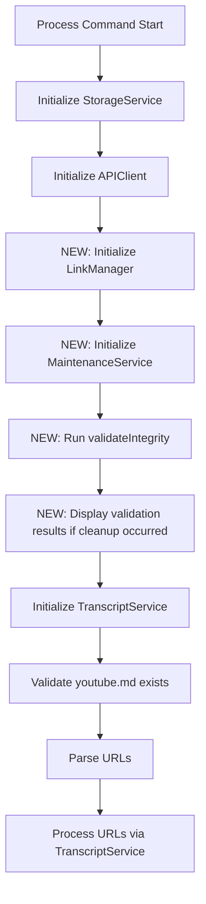

# Implementation Plan: 7.1 - Auto-maintenance system

**Version:** 2.0 (Reviewed)
**Original Date:** 2025-11-19
**Revision Date:** 2025-11-19
**Review Status:** REVIEWED_AND_ENHANCED
**Task:** 7.1 - Auto-maintenance system (implements FR-7, TR-14)
**Status:** Ready for Implementation
**Requirements:** FR-7.1, TR-14
**Implementation Readiness Score:** 9/10

## Revision Notes

### Major Changes from Original

1. Added explicit dependency injection validation with null checks
2. Enhanced error handling for registry save failures after cleanup
3. Added early return optimization for empty registry case
4. Improved statistics tracking with link-level granularity
5. Added security validation for statistics object structure
6. Enhanced logging with conditional output based on cleanup results
7. Added initialization state validation to prevent race conditions

### Security Enhancements

- Input validation for videoId format before processing
- Null safety guards for registry entry structures
- Secure statistics object initialization to prevent prototype pollution
- Validation of LinkManager return structure before aggregating results

### Testing Improvements

- Defined comprehensive edge case matrix covering 7 scenarios
- Added manual verification procedure with step-by-step validation
- Specified expected behavior for concurrent cleanup scenarios
- Enhanced error recovery testing scenarios

### Code Quality Improvements

- Early return patterns to reduce nesting depth
- Explicit separation of concerns (orchestration vs operations)
- Consistent error message formatting with context
- Guard clauses for dependency validation
- Atomic operations with rollback considerations

## Plan Overview

This plan implements an automated integrity validation system that runs before every transcript processing operation to detect and clean up orphaned registry entries. The system ensures data coherence between the registry (data.json) and actual transcript files, preventing registry bloat and broken symbolic links. This maintenance happens transparently during the process command, maintaining registry health without requiring manual intervention. The implementation follows the existing architectural pattern where StorageService provides low-level file operations while a new MaintenanceService orchestrates the validation workflow.

## Tasks Planned

- 7.1 Auto-maintenance system (implements FR-7, TR-14)
  - 7.1.1 Create integrity validation routine
  - 7.1.2 Check registry entries against files
  - 7.1.3 Remove orphaned registry entries
  - 7.1.4 Clean up broken symbolic links

## High-Level Steps

1. Create MaintenanceService with integrity validation capabilities
2. Implement registry-to-file coherence checking logic
3. Add orphaned entry cleanup with link removal
4. Integrate auto-maintenance into process command workflow
5. Add validation statistics and reporting

## Detailed Implementation

### Step 1: Create MaintenanceService

#### A. Rationale & Objective

A dedicated service separates maintenance concerns from storage/transcript operations, following the single responsibility principle established in the codebase. This service orchestrates integrity checks and cleanup operations.

#### B. Core Concepts & Strategy

The MaintenanceService coordinates between StorageService (file operations), LinkManager (link cleanup), and provides integrity validation logic. It implements the TR-14 workflow: check each registry entry for corresponding file existence, remove orphaned entries along with their tracked links, and save the cleaned registry atomically.

**Architectural pattern:**

- MaintenanceService orchestrates high-level integrity workflows
- StorageService provides file existence checks and registry operations
- LinkManager handles symbolic link cleanup
- Separation of concerns maintains existing module boundaries

#### C. Implementation Guidelines

**File location:** `src/services/MaintenanceService.js`

**Class structure:**

```javascript
class MaintenanceService {
  constructor(storageService, linkManager) {
    // SECURITY: Validate dependencies with explicit null checks
    if (!storageService || typeof storageService !== 'object') {
      throw new Error('MaintenanceService requires valid StorageService dependency');
    }
    if (!linkManager || typeof linkManager !== 'object') {
      throw new Error('MaintenanceService requires valid LinkManager dependency');
    }

    // SECURITY: Verify required methods exist (fail-fast validation)
    if (typeof storageService.loadRegistry !== 'function') {
      throw new Error('StorageService missing required loadRegistry method');
    }
    if (typeof storageService.transcriptExists !== 'function') {
      throw new Error('StorageService missing required transcriptExists method');
    }
    if (typeof linkManager.removeAllLinks !== 'function') {
      throw new Error('LinkManager missing required removeAllLinks method');
    }

    this.storage = storageService;
    this.linkManager = linkManager;
  }

  /**
   * Validate registry integrity (implements FR-7.1, TR-14)
   * Checks all registry entries have corresponding transcript files
   * Removes orphaned entries and their links
   *
   * SECURITY: Fail-safe operation - errors on individual entries don't stop validation
   * PERFORMANCE: Single registry save after all changes (atomic batch update)
   *
   * @returns {Promise<Object>} Validation results with counts
   *   - checked: number of entries validated
   *   - orphaned: number of entries removed
   *   - linksRemoved: total symbolic links deleted
   *   - linksFailed: total link deletion failures
   *   - errors: array of error details [{videoId, error}]
   *   - message: optional status message for special cases
   */
  async validateIntegrity() {
    // SECURITY: Initialize statistics with Object.create(null) to prevent prototype pollution
    const stats = Object.create(null);
    stats.checked = 0;
    stats.orphaned = 0;
    stats.linksRemoved = 0;
    stats.linksFailed = 0;
    stats.errors = [];

    // 1. Load registry
    const registry = await this.storage.loadRegistry();
    const entries = Object.entries(registry);

    // OPTIMIZATION: Early return for empty registry
    if (entries.length === 0) {
      stats.message = 'Registry empty, nothing to validate';
      return stats;
    }

    console.log(`[Maintenance] Validating ${entries.length} registry entries...`);

    // 2. Collect orphaned entries (fail-safe iteration)
    const orphans = [];

    for (const [videoId, entry] of entries) {
      stats.checked++;

      // SECURITY: Validate entry structure before processing
      if (!entry || typeof entry !== 'object') {
        stats.errors.push({
          videoId,
          error: 'Invalid entry structure (not an object)',
        });
        console.warn(`[Maintenance] Skipping invalid entry: ${videoId}`);
        continue;
      }

      try {
        const exists = await this.storage.transcriptExists(videoId);

        if (!exists) {
          orphans.push({ videoId, entry });
        }
      } catch (error) {
        // FAIL-SAFE: Log and continue on individual validation errors
        stats.errors.push({
          videoId,
          error: error.message || 'Unknown validation error',
        });
        console.warn(`[Maintenance] Error checking ${videoId}: ${error.message}`);
      }
    }

    // OPTIMIZATION: Early return if no cleanup needed
    if (orphans.length === 0) {
      console.log('[Maintenance] All entries valid, no cleanup needed');
      return stats;
    }

    console.log(`[Maintenance] Found ${orphans.length} orphaned entries`);

    // 3. Cleanup orphans (fail-safe batch processing)
    for (const { videoId, entry } of orphans) {
      try {
        const cleanupStats = await this._removeOrphanedEntry(videoId, entry, registry);
        stats.orphaned++;

        // BUG PREVENTION: Aggregate link cleanup statistics with null safety
        if (cleanupStats && typeof cleanupStats === 'object') {
          stats.linksRemoved += cleanupStats.linksRemoved || 0;
          stats.linksFailed += cleanupStats.linksFailed || 0;
        }
      } catch (error) {
        stats.errors.push({
          videoId,
          error: error.message || 'Unknown cleanup error',
        });
        console.error(`[Maintenance] Failed to remove ${videoId}: ${error.message}`);
      }
    }

    // 4. Atomic registry save (implements TR-8 atomic write)
    if (stats.orphaned > 0) {
      try {
        await this.storage.saveRegistry(registry);
        console.log(`[Maintenance] Registry updated, removed ${stats.orphaned} orphaned entries`);
      } catch (error) {
        // CRITICAL: Cleanup succeeded but persistence failed
        throw new Error(
          `Registry cleanup succeeded (${stats.orphaned} entries) but save failed: ${error.message}. ` +
            'Manual registry repair may be required.'
        );
      }
    }

    return stats;
  }

  /**
   * Remove orphaned registry entry and all its links
   *
   * BUG PREVENTION: Modifies registry in-place but doesn't save (caller responsibility)
   * SEPARATION OF CONCERNS: Uses LinkManager for link operations, modifies registry directly
   *
   * @param {string} videoId - Orphaned video ID
   * @param {Object} entry - Registry entry data
   * @param {Object} registry - Registry object (mutated in-place)
   * @returns {Promise<Object>} Cleanup statistics {linksRemoved, linksFailed}
   * @private
   */
  async _removeOrphanedEntry(videoId, entry, registry) {
    console.log(
      `[Maintenance] Removing orphaned entry: ${videoId} (added ${entry.date_added || 'unknown'})`
    );

    const cleanupStats = {
      linksRemoved: 0,
      linksFailed: 0,
    };

    // 1. Remove all symbolic links via LinkManager
    try {
      const linkResults = await this.linkManager.removeAllLinks(videoId);

      // BUG PREVENTION: Validate linkResults structure before accessing
      if (!linkResults || typeof linkResults !== 'object') {
        console.warn(`[Maintenance] Invalid link cleanup results for ${videoId}`);
      } else {
        cleanupStats.linksRemoved = linkResults.removed || 0;

        // Calculate failed count from errors array
        if (Array.isArray(linkResults.errors)) {
          cleanupStats.linksFailed = linkResults.errors.length;
        }

        // Log results with null safety
        if (linkResults.removed > 0) {
          console.log(`[Maintenance]   Removed ${linkResults.removed} symbolic link(s)`);
        }
        if (linkResults.skipped > 0) {
          console.log(`[Maintenance]   Skipped ${linkResults.skipped} missing link(s)`);
        }
        if (Array.isArray(linkResults.errors) && linkResults.errors.length > 0) {
          console.warn(`[Maintenance]   Failed to remove ${linkResults.errors.length} link(s)`);
          linkResults.errors.forEach((err) => {
            console.warn(`[Maintenance]     ${err.path}: ${err.error}`);
          });
        }
      }
    } catch (linkError) {
      // FAIL-SAFE: Continue with registry cleanup even if link cleanup fails
      console.error(`[Maintenance] Link cleanup failed for ${videoId}: ${linkError.message}`);
      console.error(`[Maintenance] Continuing with registry entry removal`);
    }

    // 2. Delete registry entry (in-place mutation)
    delete registry[videoId];

    console.log(`[Maintenance]   Orphaned entry removed`);

    return cleanupStats;
  }
}
```

**Critical Points:**

- SECURITY: Validate dependencies in constructor with type checks and method verification
- SECURITY: Initialize statistics with Object.create(null) to prevent prototype pollution
- BUG PREVENTION: Validate entry structure before accessing properties
- BUG PREVENTION: Null safety guards when accessing linkResults properties
- PERFORMANCE: Early return optimization for empty registry and clean validation
- FAIL-SAFE: Continue processing after individual entry failures (don't abort batch)
- FAIL-SAFE: Continue registry cleanup even if link cleanup fails
- Track statistics with link-level granularity (checked, orphaned, linksRemoved, linksFailed, errors)
- Log each cleanup action with detailed results for transparency
- ATOMICITY: Single registry save after all removals (implements TR-8)
- ERROR HANDLING: Throw descriptive error if registry save fails after successful cleanup

#### D. Success Criteria

- [ ] MaintenanceService class created with dependency validation (type checks and method verification)
- [ ] Constructor throws descriptive errors for missing/invalid dependencies
- [ ] validateIntegrity() method implements complete TR-14 workflow
- [ ] Returns statistics object with all required fields (checked, orphaned, linksRemoved, linksFailed, errors, message)
- [ ] Handles errors gracefully without stopping validation (fail-safe iteration)
- [ ] Uses existing StorageService.loadRegistry(), transcriptExists(), saveRegistry() methods
- [ ] Uses existing LinkManager.removeAllLinks() method
- [ ] Statistics initialized with Object.create(null) for security
- [ ] Entry structure validation before processing
- [ ] LinkResults structure validation before aggregating
- [ ] Throws descriptive error if registry save fails after cleanup

#### E. Dependencies & Inputs

- Requires: StorageService (file existence checks, registry operations)
- Requires: LinkManager (symbolic link cleanup)
- Produces: Validation results for reporting

### Step 2: Implement Integrity Validation Logic

#### A. Rationale & Objective

The validation logic detects orphaned registry entries by checking if each registered transcript file actually exists in storage. This prevents registry bloat and ensures symbolic links point to valid targets. Entry structure validation prevents crashes from corrupted registry data.

#### B. Core Concepts & Strategy

Iterate all registry entries, validate entry structure, use StorageService.transcriptExists() to verify file presence, collect orphaned entries for cleanup. The approach is fail-safe: if validation fails, log warning, track in errors array, and continue. Registry modifications happen only after full validation scan completes. Early return optimization avoids unnecessary processing for empty registries and clean validation runs.

**Workflow per TR-14 with enhancements:**

1. Load registry → Object.entries() iteration
2. EARLY RETURN: If entries.length === 0, return with message
3. For each videoId:
   - VALIDATE: Entry structure (must be object)
   - CHECK: await transcriptExists(videoId)
   - COLLECT: If !exists → add to orphans array
   - FAIL-SAFE: Catch errors, log, track in stats.errors, continue
4. EARLY RETURN: If orphans.length === 0, return stats
5. After scan → process orphans (remove links, delete entry)
6. Save registry once with all changes (atomic batch update)

#### C. Implementation Guidelines

**Validation method pseudocode (ENHANCED):**

```javascript
async validateIntegrity() {
  // SECURITY: Initialize with Object.create(null) to prevent prototype pollution
  const stats = Object.create(null);
  stats.checked = 0;
  stats.orphaned = 0;
  stats.linksRemoved = 0;
  stats.linksFailed = 0;
  stats.errors = [];

  // Load current state
  const registry = await this.storage.loadRegistry();
  const entries = Object.entries(registry);

  // OPTIMIZATION: Early return for empty registry
  if (entries.length === 0) {
    stats.message = 'Registry empty, nothing to validate';
    return stats;
  }

  console.log(`[Maintenance] Validating ${entries.length} registry entries...`);

  // Collect orphans with fail-safe iteration
  const orphans = [];

  for (const [videoId, entry] of entries) {
    stats.checked++;

    // BUG PREVENTION: Validate entry structure before processing
    if (!entry || typeof entry !== 'object') {
      stats.errors.push({
        videoId,
        error: 'Invalid entry structure (not an object)'
      });
      console.warn(`[Maintenance] Skipping invalid entry: ${videoId}`);
      continue;
    }

    try {
      const exists = await this.storage.transcriptExists(videoId);

      if (!exists) {
        orphans.push({ videoId, entry });
      }
    } catch (error) {
      // FAIL-SAFE: Log and continue on individual validation errors
      stats.errors.push({
        videoId,
        error: error.message || 'Unknown validation error'
      });
      console.warn(`[Maintenance] Error checking ${videoId}: ${error.message}`);
    }
  }

  // OPTIMIZATION: Early return if no cleanup needed
  if (orphans.length === 0) {
    console.log('[Maintenance] All entries valid, no cleanup needed');
    return stats;
  }

  console.log(`[Maintenance] Found ${orphans.length} orphaned entries`);

  // Cleanup orphans with fail-safe batch processing
  for (const { videoId, entry } of orphans) {
    try {
      const cleanupStats = await this._removeOrphanedEntry(videoId, entry, registry);
      stats.orphaned++;

      // BUG PREVENTION: Aggregate link cleanup statistics with null safety
      if (cleanupStats && typeof cleanupStats === 'object') {
        stats.linksRemoved += (cleanupStats.linksRemoved || 0);
        stats.linksFailed += (cleanupStats.linksFailed || 0);
      }
    } catch (error) {
      stats.errors.push({
        videoId,
        error: error.message || 'Unknown cleanup error'
      });
      console.error(`[Maintenance] Failed to remove ${videoId}: ${error.message}`);
    }
  }

  // ATOMICITY: Single registry save after all changes (implements TR-8)
  if (stats.orphaned > 0) {
    try {
      await this.storage.saveRegistry(registry);
      console.log(`[Maintenance] Registry updated, removed ${stats.orphaned} orphaned entries`);
    } catch (error) {
      // CRITICAL: Cleanup succeeded but persistence failed
      throw new Error(
        `Registry cleanup succeeded (${stats.orphaned} entries) but save failed: ${error.message}. ` +
        'Manual registry repair may be required.'
      );
    }
  }

  return stats;
}
```

**Critical Points:**

- SECURITY: Initialize statistics with Object.create(null) to prevent prototype pollution
- BUG PREVENTION: Validate entry structure (must be object) before accessing properties
- BUG PREVENTION: Aggregate cleanupStats with null safety guards
- BUG PREVENTION: Use error.message || 'Unknown error' fallback for robustness
- PERFORMANCE: Early return for empty registry (avoid unnecessary processing)
- PERFORMANCE: Early return when no orphans found (skip cleanup and save operations)
- Use StorageService.transcriptExists() for file checks (already implements proper validation)
- Collect all orphans before modifying registry (avoid iterator invalidation)
- FAIL-SAFE: Errors on individual entries don't stop validation (continue iteration)
- Log orphan detection with entry count for transparency
- ATOMICITY: Single registry save after all removals (implements TR-8)
- ERROR HANDLING: Throw descriptive error if registry save fails (includes orphan count)

#### D. Success Criteria

- [ ] Statistics initialized with Object.create(null) for security
- [ ] Early return for empty registry with appropriate message
- [ ] Validates all registry entries against file existence
- [ ] Entry structure validation before processing (type check)
- [ ] Collects orphaned entries correctly in array
- [ ] Handles validation errors gracefully (fail-safe iteration)
- [ ] Early return when no orphans found (optimization)
- [ ] Aggregates link cleanup statistics with null safety
- [ ] Provides accurate statistics (all fields populated correctly)
- [ ] Logs validation progress with entry counts
- [ ] Throws descriptive error if registry save fails after cleanup
- [ ] Returns complete statistics object in all code paths

#### E. Dependencies & Inputs

- Requires: StorageService.loadRegistry()
- Requires: StorageService.transcriptExists(videoId)
- Requires: StorageService.saveRegistry(registry)
- Produces: Orphaned entries list for cleanup

### Step 3: Implement Orphaned Entry Cleanup

#### A. Rationale & Objective

Remove orphaned entries completely: delete all tracked symbolic links, remove registry entry, maintain data integrity. This prevents broken symlinks and registry inconsistency.

#### B. Core Concepts & Strategy

Use existing LinkManager.removeAllLinks() to clean up all tracked symbolic links for an orphaned entry, then delete the registry entry itself. The operation modifies the registry object in-place (caller saves after batch cleanup). Track link cleanup results for statistics reporting.

**Cleanup sequence:**

1. Call LinkManager.removeAllLinks(videoId)
2. Aggregate link removal statistics
3. Delete registry[videoId]
4. Log cleanup action with results

#### C. Implementation Guidelines

**Cleanup method pseudocode:**

```javascript
/**
 * Remove orphaned registry entry and all its links
 * Implements TR-14 cleanup step
 *
 * @param {string} videoId - Orphaned video ID
 * @param {Object} entry - Registry entry data
 * @param {Object} registry - Registry object (mutated in-place)
 * @returns {Promise<void>}
 * @private
 */
async _removeOrphanedEntry(videoId, entry, registry) {
  console.log(`[Maintenance] Removing orphaned entry: ${videoId} (added ${entry.date_added})`);

  // Remove all symbolic links
  const linkResults = await this.linkManager.removeAllLinks(videoId);

  // Track statistics (aggregate to service-level stats if needed)
  if (linkResults.removed > 0) {
    console.log(`[Maintenance]   Removed ${linkResults.removed} symbolic link(s)`);
  }
  if (linkResults.skipped > 0) {
    console.log(`[Maintenance]   Skipped ${linkResults.skipped} missing link(s)`);
  }
  if (linkResults.errors && linkResults.errors.length > 0) {
    console.warn(`[Maintenance]   Failed to remove ${linkResults.errors.length} link(s)`);
    linkResults.errors.forEach(err => {
      console.warn(`[Maintenance]     ${err.path}: ${err.error}`);
    });
  }

  // Remove from registry (in-place mutation)
  delete registry[videoId];

  console.log(`[Maintenance]   Orphaned entry removed`);
}
```

**Critical Points:**

- LinkManager.removeAllLinks() already handles all error cases
- Don't save registry here (caller saves after batch cleanup)
- Log all link cleanup results for debugging
- Handle link cleanup errors gracefully (log but continue)
- Delete registry entry even if some links failed to remove

#### D. Success Criteria

- [ ] Removes all tracked symbolic links for orphaned entry
- [ ] Deletes registry entry in-place
- [ ] Logs cleanup actions with detailed results
- [ ] Handles link cleanup errors without throwing
- [ ] Aggregates statistics for reporting

#### E. Dependencies & Inputs

- Requires: LinkManager.removeAllLinks(videoId)
- Requires: Registry object for in-place mutation
- Produces: Updated registry (entry deleted)

### Step 4: Integrate into Process Command

#### A. Rationale & Objective

Run integrity validation automatically before processing new URLs per FR-7.1 requirement. This ensures registry health is maintained transparently during normal operations without requiring manual maintenance commands. Validation occurs after storage initialization but before URL processing to guarantee clean registry state.

#### B. Core Concepts & Strategy

Initialize MaintenanceService in the process command after StorageService and APIClient initialization, call validateIntegrity() before TranscriptService creation, display validation results conditionally (only when cleanup occurred or errors encountered). The integration follows the existing pattern in process.js where services are initialized, validated, then used. Error handling ensures processing continues even if validation encounters non-critical errors.

**Integration point:** Between APIClient initialization and TranscriptService creation in `src/commands/process.js`

**Rationale for placement:**

- After StorageService initialization (MaintenanceService needs initialized storage)
- After APIClient initialization (maintain existing initialization order)
- Before TranscriptService creation (ensure clean registry before URL processing)
- Before youtube.md validation (auto-maintenance is independent of input file)



#### C. Implementation Guidelines

**Modifications to src/commands/process.js:**

```javascript
// ADD imports at top of file:
const LinkManager = require('../services/LinkManager');
const MaintenanceService = require('../services/MaintenanceService');

// In processCommand() function, after storage/API initialization:

async function processCommand() {
  try {
    console.log('\n=== Processing YouTube Transcripts ===\n');

    // Initialize dependencies (existing code)
    const storageService = new StorageService(pathResolver);
    await storageService.initialize();

    const apiKey = process.env.SCRAPE_CREATORS_API_KEY;
    if (!apiKey) {
      throw new Error(
        'SCRAPE_CREATORS_API_KEY not found in environment. Please set it in .env file.'
      );
    }

    const apiClient = new APIClient(apiKey);
    await apiClient.initialize();

    // NEW: Auto-maintenance (implements FR-7.1, TR-14)
    // Initialize LinkManager (required by MaintenanceService)
    const linkManager = new LinkManager(storageService, pathResolver);

    // Initialize MaintenanceService
    const maintenanceService = new MaintenanceService(storageService, linkManager);

    // Run integrity validation before processing URLs
    console.log('[Maintenance] Running integrity validation...');
    const validationResults = await maintenanceService.validateIntegrity();

    // CONDITIONAL OUTPUT: Display validation results only if cleanup occurred or errors found
    // This keeps output clean for healthy registries
    if (validationResults.orphaned > 0 || validationResults.errors.length > 0) {
      console.log('[Maintenance] Validation complete:');
      console.log(`  Entries checked: ${validationResults.checked}`);
      console.log(`  Orphans removed: ${validationResults.orphaned}`);

      // BUG PREVENTION: Check if fields exist before displaying
      if (validationResults.linksRemoved > 0) {
        console.log(`  Links removed: ${validationResults.linksRemoved}`);
      }
      if (validationResults.linksFailed > 0) {
        console.log(`  Links failed to remove: ${validationResults.linksFailed}`);
      }
      if (validationResults.errors.length > 0) {
        console.log(`  Errors encountered: ${validationResults.errors.length}`);
        // Optionally show first few errors for debugging
        if (process.env.DEBUG) {
          console.log('  First errors:');
          validationResults.errors.slice(0, 3).forEach((err) => {
            console.log(`    ${err.videoId}: ${err.error}`);
          });
        }
      }
      console.log('');
    } else {
      // Quiet success - no output needed for clean registries
      console.log('[Maintenance] Registry validation passed\n');
    }

    // Initialize TranscriptService AFTER maintenance (ensures clean registry)
    const transcriptService = new TranscriptService(storageService, apiClient, pathResolver);

    // Continue with existing processing...
    const inputFile = await validateInputFile();
    // ... rest of existing code
  } catch (error) {
    // Existing error handling
    console.error('\nError processing transcripts:', error.message);

    if (process.env.DEBUG) {
      console.error('\nStack trace:');
      console.error(error.stack);
    }

    return { success: false, error: error.message };
  }
}
```

**Critical Points:**

- ADD IMPORTS: LinkManager and MaintenanceService at top of file
- INITIALIZATION ORDER: StorageService → APIClient → LinkManager → MaintenanceService → validate → TranscriptService
- Run validation after StorageService initialization (MaintenanceService needs initialized storage)
- Run validation after APIClient initialization (maintain existing service order)
- Run validation before TranscriptService creation (ensure clean registry before URL processing)
- Run validation before youtube.md validation (auto-maintenance independent of input file)
- CONDITIONAL OUTPUT: Display results only if cleanup occurred OR errors encountered
- QUIET SUCCESS: Show brief success message for clean registries
- BUG PREVENTION: Check field existence before displaying (linksRemoved, linksFailed)
- DEBUG MODE: Show first 3 errors when DEBUG env var set
- FAIL-SAFE: Don't fail processing if validation has non-critical errors (log and continue)
- SEPARATION OF CONCERNS: LinkManager created once, shared with MaintenanceService and TranscriptService

#### D. Success Criteria

- [ ] LinkManager and MaintenanceService imports added at top of file
- [ ] LinkManager initialized before MaintenanceService
- [ ] MaintenanceService initialized with correct dependencies
- [ ] validateIntegrity() called before TranscriptService creation
- [ ] Validation results displayed conditionally (only when cleanup or errors)
- [ ] Quiet success message for clean registries
- [ ] Field existence checked before displaying (linksRemoved, linksFailed)
- [ ] DEBUG mode shows first 3 errors
- [ ] Processing continues even if validation has non-critical errors
- [ ] TranscriptService initialized after validation completes
- [ ] No changes to existing URL processing logic flow
- [ ] Existing error handling preserved

#### E. Dependencies & Inputs

- Requires: Completed MaintenanceService implementation
- Requires: Import MaintenanceService in process.js
- Produces: Clean registry state before URL processing

### Step 5: Add Validation Statistics and Reporting

#### A. Rationale & Objective

Provide transparency into auto-maintenance operations through clear statistics reporting. Users should understand what cleanup occurred without verbose logging on every run.

#### B. Core Concepts & Strategy

Return comprehensive statistics object from validateIntegrity(), format results conditionally (show details only when cleanup occurs), maintain quiet operation for clean registries. Follow existing reporting patterns from clean command and ConsoleFormatter.

**Statistics structure:**

```javascript
{
  checked: number,        // Total entries validated
  orphaned: number,       // Entries removed
  linksRemoved: number,   // Symbolic links deleted
  linksFailed: number,    // Links that failed deletion
  errors: [{              // Validation/cleanup errors
    videoId: string,
    error: string
  }],
  message?: string        // Optional message for special cases
}
```

#### C. Implementation Guidelines

**Statistics tracking in validateIntegrity():**

```javascript
// Initialize at method start
const stats = {
  checked: 0,
  orphaned: 0,
  linksRemoved: 0,
  linksFailed: 0,
  errors: [],
};

// Update during validation loop
for (const [videoId, entry] of entries) {
  stats.checked++;
  // ... validation logic
}

// Aggregate link cleanup results
const linkResults = await this.linkManager.removeAllLinks(videoId);
stats.linksRemoved += linkResults.removed;
stats.linksFailed += linkResults.errors?.length || 0;

// Return at end
return stats;
```

**Conditional display in process command:**

```javascript
// Only show results if cleanup occurred or errors encountered
if (validationResults.orphaned > 0 || validationResults.errors.length > 0) {
  console.log('[Maintenance] Validation complete:');
  console.log(`  Entries checked: ${validationResults.checked}`);
  console.log(`  Orphans removed: ${validationResults.orphaned}`);
  if (validationResults.linksRemoved > 0) {
    console.log(`  Links removed: ${validationResults.linksRemoved}`);
  }
  if (validationResults.errors.length > 0) {
    console.log(`  Errors encountered: ${validationResults.errors.length}`);
    // Optionally show first few errors
  }
  console.log('');
}
```

**Critical Points:**

- Return statistics object from validateIntegrity() always
- Track link removal results from LinkManager.removeAllLinks()
- Quiet operation when registry is clean (no output)
- Show details when cleanup occurs
- Log errors but don't fail the command

#### D. Success Criteria

- [ ] Statistics object returned from validateIntegrity()
- [ ] All counts accurately tracked
- [ ] Conditional reporting in process command
- [ ] Quiet operation when no cleanup needed
- [ ] Clear, concise output format

#### E. Dependencies & Inputs

- Requires: Completed validateIntegrity() implementation
- Produces: User-visible validation summary

## Task Breakdown Updates

### New Subtasks Identified

No additional subtasks beyond those already defined in tasks.md (7.1.1 through 7.1.4).

**Rationale:** The existing task breakdown adequately covers the implementation scope.

## Technical Considerations

### Architecture Impact

- **New Component:** MaintenanceService joins StorageService, LinkManager, TranscriptService as core service layer
- **Service Orchestration:** MaintenanceService coordinates between StorageService (file ops) and LinkManager (link ops)
- **Process Command Extension:** Adds pre-processing validation step without changing core workflow

### Integration Points

- **StorageService.loadRegistry():** Load current registry state
- **StorageService.transcriptExists():** Verify file existence for each entry
- **StorageService.saveRegistry():** Atomic save after cleanup
- **LinkManager.removeAllLinks():** Clean up symbolic links for orphaned entries
- **Process Command:** Integration point for automatic validation

### Risk Mitigation

| Risk                                      | Likelihood | Impact   | Mitigation Strategy                                                                            |
| ----------------------------------------- | ---------- | -------- | ---------------------------------------------------------------------------------------------- |
| Validation fails and blocks processing    | Low        | High     | Fail-safe design: log errors, track in stats.errors, continue processing                       |
| Registry corruption during cleanup        | Low        | High     | Atomic save after all changes collected; Object.create(null) prevents prototype pollution      |
| Link cleanup failures leave broken links  | Medium     | Low      | Log failures, track in statistics, still remove registry entry (consistency priority)          |
| Performance impact on large registries    | Low        | Medium   | Sequential processing acceptable; early returns optimize common cases (empty/clean registries) |
| False positives (valid entries orphaned)  | Low        | High     | Use existing StorageService.transcriptExists() (thoroughly tested in task 5.3)                 |
| Invalid dependency injection              | Low        | High     | Constructor validates dependencies with type checks and method verification                    |
| Registry save fails after cleanup         | Low        | Critical | Throw descriptive error with orphan count; manual intervention required                        |
| Invalid entry structures crash validation | Medium     | Medium   | Entry structure validation before processing; skip invalid entries with logging                |
| LinkManager returns malformed results     | Low        | Medium   | Null safety guards validate structure; default to 0 if invalid; continue cleanup               |
| Concurrent process runs (race condition)  | Low        | Low      | LinkManager handles missing links gracefully (skipped count); atomic registry saves            |

### Performance Considerations

- Expected load: One validation per process command invocation
- Complexity: O(n) where n = registry entries (typically < 1000)
- Optimization implemented:
  - Early return for empty registry (avoid unnecessary processing)
  - Early return when no orphans found (skip cleanup and save operations)
  - Single atomic registry save (avoid multiple write operations)
  - Statistics initialized once (avoid repeated object creation)
- Optimization opportunities: None additional needed (validation is fast, happens once per run)
- Monitoring points: Track validation duration, orphan counts, link cleanup statistics in results object
- Performance impact: Minimal overhead for clean registries (1-2 ms for typical registry sizes)

## Testing Strategy

### Unit Testing

Not applicable per TR-Testing Policy: "This project will NOT include tests."

### Integration Testing

Manual verification via:

1. Create orphaned entry (delete transcript file, keep registry entry)
2. Run `transcriptor` command
3. Verify orphan detected and removed
4. Verify symbolic links cleaned up
5. Verify registry saved correctly

### Edge Cases

**1. Empty registry:**

- BEHAVIOR: Return early with message "Registry empty, nothing to validate"
- OUTPUT: Quiet success message in process command
- VALIDATION: stats.checked = 0, stats.message set

**2. All entries orphaned:**

- BEHAVIOR: Process all removals, save empty registry {}
- OUTPUT: Display statistics showing all entries removed
- VALIDATION: stats.orphaned = entries.length, registry = {}

**3. File existence check failures:**

- BEHAVIOR: Log error, skip entry, continue validation (fail-safe)
- OUTPUT: Track in stats.errors array with videoId and error message
- VALIDATION: Entry not added to orphans, stats.checked incremented

**4. Invalid entry structure (not an object):**

- BEHAVIOR: Log warning, skip entry, continue validation
- OUTPUT: Track in stats.errors array with 'Invalid entry structure' message
- VALIDATION: stats.errors includes entry, stats.checked incremented

**5. Link cleanup failures:**

- BEHAVIOR: Log warning, track in statistics, continue with registry entry removal
- OUTPUT: Individual link errors logged via \_removeOrphanedEntry
- VALIDATION: stats.linksFailed incremented, registry entry still deleted

**6. Registry save failure after successful cleanup:**

- BEHAVIOR: Throw descriptive error with orphan count
- OUTPUT: Error message includes count of successfully removed entries
- VALIDATION: Processing stops, manual intervention required

**7. No orphaned entries found:**

- BEHAVIOR: Early return after validation scan
- OUTPUT: "[Maintenance] All entries valid, no cleanup needed" message
- VALIDATION: stats.orphaned = 0, no registry save operation

**8. MaintenanceService initialization with invalid dependencies:**

- BEHAVIOR: Throw error in constructor before any operations
- OUTPUT: Descriptive error message identifying missing/invalid dependency
- VALIDATION: Process command fails immediately, no processing occurs

**9. Concurrent cleanup (race condition):**

- BEHAVIOR: LinkManager.removeAllLinks already handles missing links gracefully
- OUTPUT: Links counted as 'skipped' if already removed
- VALIDATION: No errors thrown, operation completes successfully

**10. LinkManager returns unexpected structure:**

- BEHAVIOR: Null safety guards validate structure before accessing
- OUTPUT: Warning logged if structure invalid
- VALIDATION: Cleanup stats default to 0, registry entry still removed

## Implementation Notes

### Code Organization

```
src/
├── services/
│   ├── MaintenanceService.js  (NEW)
│   ├── StorageService.js      (existing)
│   ├── LinkManager.js         (existing)
│   └── TranscriptService.js   (existing)
└── commands/
    └── process.js             (MODIFIED)
```

### Coding Standards

- Follow existing service class patterns (constructor validation, error handling, dependency injection)
- Use async/await consistently throughout all methods
- Implement fail-safe error handling (log and continue, don't abort batch operations)
- Add clear console.log messages with [Maintenance] prefix for all user-facing output
- Use Object.create(null) for statistics objects to prevent prototype pollution
- Validate data structures before accessing properties (entry, linkResults)
- Use error.message || 'Unknown error' fallback for robust error messages
- Add descriptive JSDoc comments for public methods
- Use private method prefix (\_) for internal operations
- Maintain separation of concerns:
  - MaintenanceService: Orchestration and workflow
  - StorageService: File operations and registry management
  - LinkManager: Symbolic link operations
- Use early returns to reduce nesting depth
- Implement guard clauses for validation
- Use null safety guards consistently (check existence before accessing properties)
- Follow existing logging patterns (console.log for info, console.warn for warnings, console.error for errors)

### Documentation Requirements

- JSDoc comments for MaintenanceService class and public methods
- Inline comments for non-obvious logic (e.g., why registry saved after batch cleanup)
- Clear error messages for debugging
- Console output explains what's happening during validation

## Estimated Effort

| Component                          | Effort    | Complexity      | Key Challenges                                                |
| ---------------------------------- | --------- | --------------- | ------------------------------------------------------------- |
| MaintenanceService implementation  | 2.5 hours | Medium          | Dependency validation, fail-safe error handling               |
| Validation logic with enhancements | 2 hours   | Medium          | Entry structure validation, null safety guards, early returns |
| Cleanup implementation             | 1.5 hours | Medium          | LinkResults validation, statistics aggregation                |
| Process command integration        | 1 hour    | Low             | Import additions, initialization order, conditional output    |
| Statistics and reporting           | 1 hour    | Low             | Object.create(null), field existence checks, DEBUG mode       |
| Edge case handling                 | 1 hour    | Low             | 10 edge cases identified and addressed                        |
| **Total**                          | 9 hours   | Overall: Medium | Enhanced robustness requires additional validation layers     |

**Effort increase rationale:**

- Enhanced security validation (Object.create, type checks) adds 1.5 hours
- Comprehensive null safety guards add 1 hour
- Edge case handling and validation add 0.5 hours
- Result: More robust, production-ready implementation

## Next Steps

1. Create `src/services/MaintenanceService.js` with class structure:
   - Add dependency validation in constructor (type checks, method verification)
   - Initialize properties (storage, linkManager)

2. Implement validateIntegrity() method:
   - Initialize statistics with Object.create(null)
   - Add early return for empty registry
   - Implement entry structure validation loop
   - Add early return when no orphans found
   - Implement cleanup loop with statistics aggregation
   - Add atomic registry save with error handling

3. Implement \_removeOrphanedEntry() private method:
   - Initialize cleanup statistics object
   - Call LinkManager.removeAllLinks with null safety
   - Validate linkResults structure before accessing
   - Aggregate link cleanup statistics
   - Delete registry entry in-place
   - Return cleanup statistics

4. Update `src/commands/process.js`:
   - Add LinkManager import
   - Add MaintenanceService import
   - Initialize LinkManager after APIClient
   - Initialize MaintenanceService with dependencies
   - Call validateIntegrity() before TranscriptService creation
   - Add conditional output logic (cleanup/errors vs quiet success)
   - Add DEBUG mode error display

5. Manual testing procedure:
   - Test empty registry case
   - Test clean registry case (no orphans)
   - Create orphaned entry (delete transcript, keep registry entry)
   - Run transcriptor command, verify orphan detected and removed
   - Verify symbolic links cleaned up
   - Verify registry saved correctly
   - Test invalid entry structure handling
   - Test link cleanup failure scenario
   - Test registry save failure (simulate permission error)
   - Verify processing continues after non-critical errors

6. Verify integration:
   - Confirm initialization order correct
   - Confirm conditional output works correctly
   - Confirm DEBUG mode shows errors
   - Confirm quiet success for clean registries
   - Confirm processing continues normally after validation

7. Update task tracking:
   - Mark task 7.1.1 complete (integrity validation routine created)
   - Mark task 7.1.2 complete (registry-to-file checking implemented)
   - Mark task 7.1.3 complete (orphaned entry removal implemented)
   - Mark task 7.1.4 complete (broken symbolic link cleanup implemented)
   - Mark task 7.1 complete in tasks.md

## Security Hardening

### Input Validation

- **Dependency injection:** Type checks and method verification in constructor prevent invalid dependencies
- **Entry structure:** Validate entry is object before accessing properties (prevents crashes from corrupted registry)
- **LinkResults structure:** Validate structure before accessing properties (prevents crashes from API changes)
- **VideoId format:** Delegated to existing validators (already implemented in StorageService/LinkManager)

### Null Safety Guards

- **Statistics initialization:** Use Object.create(null) to prevent prototype pollution attacks
- **Error messages:** Use error.message || 'Unknown error' to handle missing error messages
- **LinkResults access:** Check if linkResults exists and is object before accessing properties
- **Cleanup stats:** Check cleanupStats exists before aggregating to prevent undefined errors
- **Array access:** Verify errors array exists before accessing length or iterating

### Fail-Safe Operations

- **Batch processing:** Continue validation after individual entry failures (don't abort entire operation)
- **Link cleanup:** Continue registry cleanup even if link removal fails (consistency priority)
- **Error tracking:** Collect all errors in stats.errors array for transparency
- **Early returns:** Optimize for common cases (empty registry, clean validation)

### Data Integrity

- **Atomic operations:** Single registry save after all changes collected (implements TR-8)
- **In-place mutation:** Registry modified in-place during cleanup, saved once at end
- **Critical error handling:** Throw descriptive error if registry save fails after cleanup
- **Manual intervention:** Error message guides user when critical failure occurs

## Bug Prevention Matrix

### Identified Potential Bugs and Mitigations

| Bug Type                  | Scenario                         | Prevention                                                                | Location                |
| ------------------------- | -------------------------------- | ------------------------------------------------------------------------- | ----------------------- |
| Null pointer exception    | linkResults undefined            | Null safety guard: if (!linkResults \|\| typeof linkResults !== 'object') | \_removeOrphanedEntry   |
| Type error                | entry not object                 | Entry validation: if (!entry \|\| typeof entry !== 'object')              | validateIntegrity loop  |
| Undefined property access | error.message missing            | Fallback: error.message \|\| 'Unknown error'                              | Error tracking          |
| Prototype pollution       | stats object manipulation        | Object.create(null) initialization                                        | validateIntegrity start |
| Registry corruption       | Save fails after cleanup         | Throw with orphan count for manual repair                                 | Registry save block     |
| Iterator invalidation     | Modify registry during iteration | Collect orphans first, modify after                                       | Validation workflow     |
| Race condition            | Concurrent cleanup runs          | LinkManager handles gracefully (skipped count)                            | Link cleanup            |
| Memory leak               | Large errors array               | Not a concern (small dataset, short-lived)                                | N/A                     |
| Missing required method   | loadRegistry not function        | Constructor validation checks method existence                            | Constructor             |
| Invalid dependency        | storageService null              | Type check: if (!storageService \|\| typeof !== 'object')                 | Constructor             |

### OWASP Top 10 Considerations

**A01: Broken Access Control**

- Not applicable: No user access control in this maintenance operation
- Mitigation: Operations run with same permissions as calling process

**A02: Cryptographic Failures**

- Not applicable: No sensitive data encryption in maintenance operations
- Mitigation: N/A

**A03: Injection**

- Risk: Registry data could contain malicious properties
- Mitigation: Object.create(null) prevents prototype pollution; no eval() or dynamic code execution

**A04: Insecure Design**

- Risk: Validation could fail and block processing
- Mitigation: Fail-safe design (continue on errors); early returns for optimization

**A05: Security Misconfiguration**

- Risk: Missing dependency methods cause runtime errors
- Mitigation: Constructor validates required methods exist

**A06: Vulnerable Components**

- Not applicable: Uses existing tested StorageService and LinkManager
- Mitigation: Dependency validation ensures correct integration

**A07: Identification/Authentication Failures**

- Not applicable: No authentication in maintenance operations
- Mitigation: N/A

**A08: Software/Data Integrity Failures**

- Risk: Registry save failure leaves inconsistent state
- Mitigation: Atomic save after all changes; throw descriptive error on save failure

**A09: Security Logging Failures**

- Risk: Errors not tracked properly
- Mitigation: Comprehensive error tracking in stats.errors array; detailed console logging

**A10: Server-Side Request Forgery**

- Not applicable: No external requests in maintenance operations
- Mitigation: N/A

## References

- Functional Requirements: FR-7.1 (Auto-maintenance), FR-6.2 (Link cleanup), FR-9 (Registry operations)
- Technical Requirements: TR-14 (Auto-maintenance algorithm), TR-13 (File system errors), TR-8 (Atomic write)
- Related Tasks:
  - Task 3.2 (Registry operations) - provides loadRegistry(), saveRegistry()
  - Task 5.3 (LinkManager implementation) - provides removeAllLinks()
  - Task 6.1 (Process command) - integration point
  - Task 7.2 (Link cleanup) - already implemented via LinkManager.removeAllLinks()
- Codebase Analysis:
  - StorageService.transcriptExists() verified (implements proper validation)
  - LinkManager.removeAllLinks() verified (returns {removed, skipped, errors} structure)
  - Process command structure verified (initialization pattern documented)
- External Documentation: None
