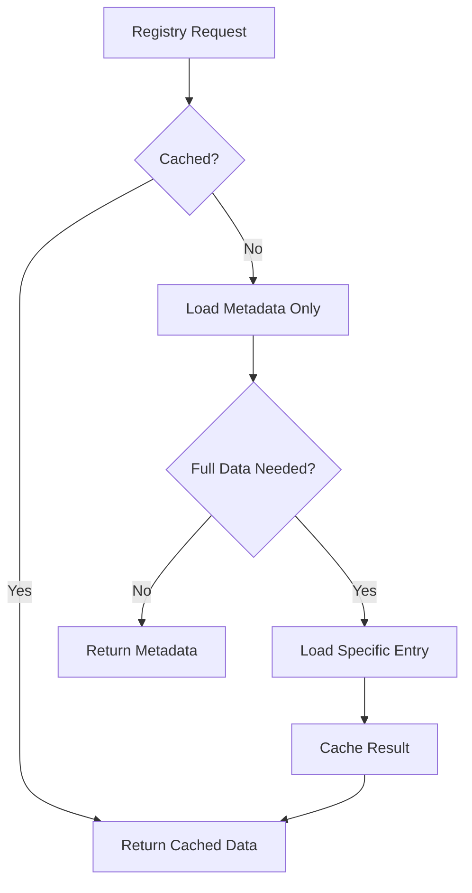
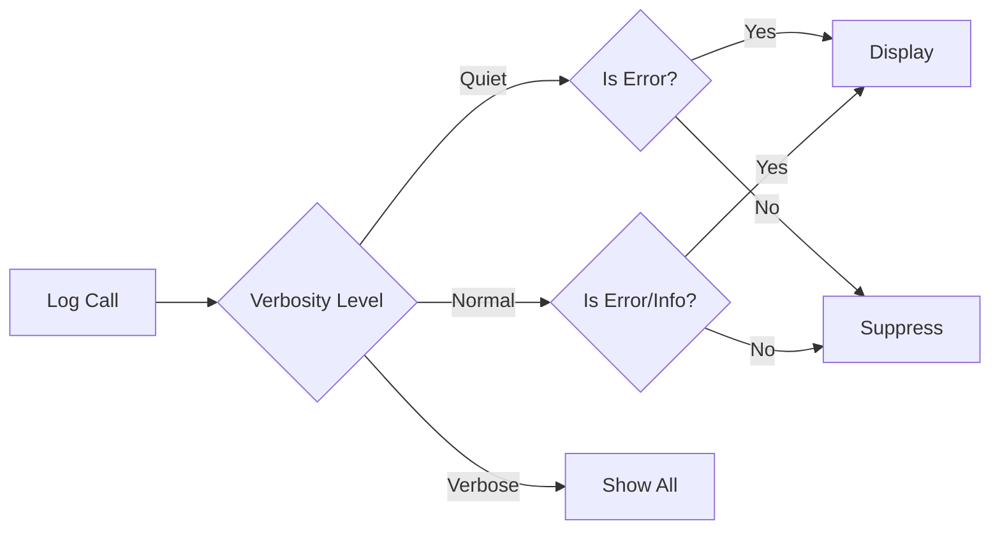

# Implementation Plan: 9.3 - Deployment Preparation & Performance

**Version:** 2.0 (Reviewed)
**Original Date:** 2025-11-19
**Revision Date:** 2025-11-19
**Review Status:** REVIEWED_AND_ENHANCED
**Changes Summary:** Security hardening, testing strategy addition, cross-platform validation, error recovery enhancements, performance benchmarking clarification

**Date:** 2025-11-19
**Task:** 9.3 - Deployment preparation & Performance
**Status:** Ready for Implementation
**Requirements:** FR-1, FR-2, FR-5, FR-8, TR-1, TR-3, TR-10, TR-11, TR-13, TR-15, TR-16, TR-19

## Plan Overview

This plan implements the final deployment and performance optimization phase of the Transcriptor project. The focus is on creating installation/uninstallation automation, optimizing registry operations for scalability, and adding user experience enhancements through progress indicators and verbosity controls. This completes the project by ensuring production readiness, efficient large-scale operation, and professional user experience.

## Tasks Planned

- 9.3 Deployment preparation & Performance
  - 9.3.1 Create installation script
  - 9.3.2 Add uninstall cleanup procedures
  - 9.3.3 Optimize registry loading for large datasets (NUMBERING FIXED)
  - 9.3.4 Implement progress indicators
  - 9.3.5 Add verbose/quiet mode options
  - 9.3.6 Profile and optimize bottlenecks
  - 9.3.7 Add cross-platform validation (NEW)
  - 9.3.8 Implement manual testing protocol (NEW)

## High-Level Steps

1. Installation and uninstallation automation with security validation
2. Registry performance optimization for large datasets with cache consistency
3. Progress indication system with TTY detection
4. Verbosity control implementation with global state management
5. Performance profiling and bottleneck optimization with benchmarking
6. Cross-platform validation for Windows, macOS, Linux
7. Manual testing protocol for regression prevention
8. Security hardening for installation scripts

## Detailed Implementation

### Step 1: Installation and Uninstallation Scripts

#### A. Rationale & Objective

Automate package installation and cleanup to provide seamless user onboarding and clean removal, eliminating manual npm operations and ensuring complete resource cleanup.

#### B. Core Concepts & Strategy

**Installation Script Strategy:**
- Automate `npm link` for global CLI availability
- Validate prerequisites (Node.js version, directory structure)
- Create initial configuration scaffolding
- Verify environment setup

**Uninstallation Strategy:**
- Remove global npm link
- Prompt user for data retention or cleanup
- Clean up ~/.transcriptor directory (optional)
- Remove local symlinks (optional)
- Reset environment configuration

#### C. Implementation Guidelines

**Key Logic:**

```javascript
// scripts/install.js
const REQUIRED_NODE_VERSION = 18;

function validatePrerequisites() {
  const nodeVersion = parseInt(process.version.slice(1));
  if (nodeVersion < REQUIRED_NODE_VERSION) {
    throw new Error(`Node.js v${REQUIRED_NODE_VERSION}+ required`);
  }
}

function installPackage() {
  execSync('npm link', { stdio: 'inherit' });
  console.log('Transcriptor installed globally');
}

// scripts/uninstall.js
function promptDataCleanup() {
  // Ask user if they want to keep transcript data
  return question('Remove all transcript data? (y/N): ');
}

function removeGlobalLink() {
  execSync('npm unlink -g', { stdio: 'inherit' });
}

function cleanupData(removeData) {
  if (removeData) {
    const storagePath = pathResolver.getStoragePath();
    fs.removeSync(storagePath);
  }
}
```

**Critical Points:**
- Installation script should be idempotent (safe to run multiple times)
- Uninstallation must preserve user data by default with explicit opt-in for deletion
- Validate Node.js version before installation (>=18.0.0 per TR-19, package.json engines)
- Provide clear feedback during operations
- Handle errors gracefully with rollback capability
- **SECURITY: Validate npm link success before confirming installation**
- **SECURITY: Prevent script injection in user input (data cleanup prompt)**
- **SECURITY: Use absolute paths to prevent directory traversal**
- **CROSS-PLATFORM: Test on Windows (different path separators, symlink permissions)**
- **ERROR RECOVERY: If npm link fails, provide manual installation instructions**
- **VALIDATION: Check write permissions before attempting installation**
- **IDEMPOTENCY: Detect existing installation and skip/update appropriately**

#### D. Success Criteria

- [ ] Installation script creates global `transcriptor` command
- [ ] Uninstallation removes global command completely
- [ ] User prompted for data retention decision
- [ ] Scripts handle errors without leaving system in broken state
- [ ] Clear status messages displayed throughout process
- [ ] **Installation validates Node.js version before proceeding**
- [ ] **Uninstallation confirms data deletion with yes/no prompt (not y/N)**
- [ ] **Error messages include troubleshooting steps**
- [ ] **Scripts tested on macOS, Linux, Windows**
- [ ] **Installation fails gracefully if permissions insufficient**
- [ ] **Post-install verification confirms transcriptor command available**

#### E. Dependencies & Inputs

- Requires: package.json, pathResolver utility, fs-extra
- Produces: Global CLI access, clean removal capability

---

### Step 2: Registry Performance Optimization

#### A. Rationale & Objective

Optimize registry loading and persistence for large datasets (1000+ transcripts) to maintain sub-second response times and prevent memory issues as data grows.

#### B. Core Concepts & Strategy

**Lazy Loading Strategy:**
- Load registry metadata only (video IDs, dates)
- Defer full entry loading until needed
- Implement pagination for large operations

**Caching Strategy:**
- Cache parsed registry in memory
- Invalidate on write operations
- Reduce file system I/O

**Streaming Operations:**
- Process large registries incrementally
- Avoid loading entire registry for single lookups
- Implement indexed access patterns



#### C. Implementation Guidelines

**Key Logic:**

```javascript
// StorageService.js enhancement
class RegistryCache {
  constructor() {
    this.metadata = null;
    this.entries = new Map();
    this.dirty = true;
  }

  invalidate() {
    this.dirty = true;
  }

  loadMetadata() {
    if (!this.dirty && this.metadata) {
      return this.metadata;
    }

    const registry = this._loadFromDisk();
    this.metadata = Object.keys(registry).map(id => ({
      id,
      date: registry[id].date_added,
      linkCount: registry[id].links.length
    }));

    this.dirty = false;
    return this.metadata;
  }

  getEntry(videoId) {
    if (this.entries.has(videoId)) {
      return this.entries.get(videoId);
    }

    const registry = this._loadFromDisk();
    const entry = registry[videoId];
    this.entries.set(videoId, entry);
    return entry;
  }
}

// Optimized statistics calculation
function calculateStatsOptimized(cache) {
  const metadata = cache.loadMetadata();

  return {
    total: metadata.length,
    oldest: Math.min(...metadata.map(e => new Date(e.date))),
    newest: Math.max(...metadata.map(e => new Date(e.date))),
    // Avoid reading all transcripts for size calculation
    estimatedSize: metadata.length * AVERAGE_TRANSCRIPT_SIZE
  };
}
```

**Critical Points:**
- Implement cache invalidation on all write operations
- Use Map for O(1) entry lookup
- Lazy-load full entry data only when needed
- Consider memory limits for very large datasets (10k+ entries)
- Profile with realistic large dataset (1000+ entries)
- **BUG PREVENTION: Race condition if cache read during write - use lock/semaphore**
- **BUG PREVENTION: Cache invalidation must be atomic with write operation**
- **MEMORY SAFETY: Implement cache size limit with LRU eviction (e.g., 1000 entries)**
- **CONSISTENCY: Cache invalidation must occur BEFORE filesystem write (fail-safe)**
- **TESTING APPROACH: Create synthetic registry with 1000+ entries for load testing**
- **ERROR HANDLING: Cache corruption should not prevent fallback to direct file read**
- **CONCURRENCY: Prevent simultaneous cache updates from parallel operations**

#### D. Success Criteria

- [ ] Registry loading time < 100ms for 1000 entries
- [ ] Memory usage scales linearly with active entries, not total entries
- [ ] Cache invalidation occurs correctly on all mutations
- [ ] Statistics calculation avoids loading full registry
- [ ] No performance regression for small datasets
- [ ] **Cache hit ratio > 90% for typical usage patterns (measured in verbose mode)**
- [ ] **No stale cache data served after write operations**
- [ ] **Graceful degradation when cache limit exceeded**
- [ ] **Memory usage < 100MB even with cache fully populated**
- [ ] **Concurrent operations do not corrupt cache state**
- [ ] **Benchmarked with 100, 1000, 5000 entry datasets**

#### E. Dependencies & Inputs

- Requires: StorageService, existing registry structure
- Produces: RegistryCache class, optimized load/save methods

---

### Step 3: Progress Indicators

#### A. Rationale & Objective

Provide real-time feedback during long-running operations (batch URL processing, cleanup) to improve perceived performance and user confidence.

#### B. Core Concepts & Strategy

**Progress Bar Pattern:**
- Display completion percentage for batch operations
- Show current item being processed
- Estimate remaining time based on average operation duration

**Spinner Pattern:**
- Use for indeterminate operations (API calls)
- Show activity status
- Prevent perceived freezing

**Status Updates:**
- Display milestones (every N items, or percentage thresholds)
- Summary statistics after completion

#### C. Implementation Guidelines

**Key Logic:**

```javascript
// utils/ProgressIndicator.js
class ProgressIndicator {
  constructor(total, label) {
    this.total = total;
    this.current = 0;
    this.label = label;
    this.startTime = Date.now();
  }

  update(current, itemLabel) {
    this.current = current;
    const percent = Math.floor((current / this.total) * 100);
    const elapsed = Date.now() - this.startTime;
    const avgTime = elapsed / current;
    const remaining = Math.floor((this.total - current) * avgTime / 1000);

    // Clear line and write progress
    process.stdout.write('\r\x1b[K');
    process.stdout.write(
      `${this.label}: [${this._bar(percent)}] ${percent}% ` +
      `(${current}/${this.total}) ${itemLabel} - ${remaining}s remaining`
    );
  }

  _bar(percent) {
    const filled = Math.floor(percent / 2);
    const empty = 50 - filled;
    return '='.repeat(filled) + ' '.repeat(empty);
  }

  complete() {
    const duration = ((Date.now() - this.startTime) / 1000).toFixed(1);
    console.log(`\n${this.label} complete: ${this.total} items in ${duration}s`);
  }
}

// Integration in TranscriptService.processBatch
async processBatch(urls) {
  const progress = new ProgressIndicator(urls.length, 'Processing URLs');

  for (let i = 0; i < urls.length; i++) {
    const videoId = extractVideoId(urls[i]);
    progress.update(i + 1, videoId);
    await this.processVideo(videoId);
  }

  progress.complete();
}
```

**Critical Points:**
- Use carriage return (\r) for in-place updates
- Clear line before each update to prevent artifacts
- Calculate realistic time estimates (use exponential moving average)
- Handle edge cases (zero items, completion before first update)
- Disable in non-TTY environments (pipes, redirects)
- **TTY DETECTION: Check process.stdout.isTTY before any terminal manipulation**
- **CROSS-PLATFORM: Windows terminal may not support ANSI escape codes - fallback to simple logging**
- **PERFORMANCE: Throttle updates to max 10 per second to avoid terminal slowdown**
- **ERROR HANDLING: If update fails (e.g., terminal resize), disable progress bar and continue**
- **ACCESSIBILITY: Provide text-only progress option for screen readers**
- **TESTING: Simulate TTY and non-TTY environments in test scenarios**

#### D. Success Criteria

- [ ] Progress bar displays during batch URL processing
- [ ] Percentage, current/total, and time estimate shown
- [ ] Updates smoothly without flickering
- [ ] Completion message summarizes operation
- [ ] Disabled automatically when output redirected
- [ ] **TTY detection prevents ANSI codes in non-interactive output**
- [ ] **Windows terminal displays progress correctly (test on Windows 10/11)**
- [ ] **Update throttling prevents terminal performance degradation**
- [ ] **Zero-item edge case handled without division by zero**
- [ ] **Progress bar respects verbosity settings (disabled in quiet mode)**

#### E. Dependencies & Inputs

- Requires: process.stdout, TTY detection
- Produces: ProgressIndicator class, integrated progress display

---

### Step 4: Verbosity Control

#### A. Rationale & Objective

Allow users to control output detail level for different use cases: verbose for debugging, quiet for automation, normal for interactive use.

#### B. Core Concepts & Strategy

**Three-Level System:**
- **Quiet mode** (`--quiet`): Errors only
- **Normal mode** (default): Essential operations
- **Verbose mode** (`--verbose`): All operations, debug info

**Implementation Pattern:**
- Global verbosity state
- Logger abstraction
- Conditional output based on level



#### C. Implementation Guidelines

**Key Logic:**

```javascript
// utils/Logger.js
const LogLevel = {
  ERROR: 0,
  INFO: 1,
  VERBOSE: 2
};

class Logger {
  constructor(level = LogLevel.INFO) {
    this.level = level;
  }

  error(message, ...args) {
    if (this.level >= LogLevel.ERROR) {
      console.error(message, ...args);
    }
  }

  info(message, ...args) {
    if (this.level >= LogLevel.INFO) {
      console.log(message, ...args);
    }
  }

  verbose(message, ...args) {
    if (this.level >= LogLevel.VERBOSE) {
      console.log('[VERBOSE]', message, ...args);
    }
  }

  debug(data) {
    if (this.level >= LogLevel.VERBOSE) {
      console.log('[DEBUG]', JSON.stringify(data, null, 2));
    }
  }
}

// Export singleton
let loggerInstance = new Logger();

function setVerbosity(level) {
  loggerInstance = new Logger(level);
}

module.exports = { Logger, LogLevel, setVerbosity, logger: loggerInstance };

// CLI integration (src/index.js)
program
  .option('-q, --quiet', 'Suppress all output except errors')
  .option('-v, --verbose', 'Show detailed operation logs')
  .hook('preAction', (thisCommand) => {
    if (thisCommand.opts().quiet) {
      setVerbosity(LogLevel.ERROR);
    } else if (thisCommand.opts().verbose) {
      setVerbosity(LogLevel.VERBOSE);
    }
  });
```

**Critical Points:**
- Apply verbosity globally across all commands
- Logger instance must be singleton or globally accessible
- Replace all `console.log` with `logger.info/verbose`
- Preserve error output in quiet mode
- Progress indicators should respect verbosity (disable in quiet)
- **SINGLETON PATTERN: Use module-level instance to ensure global state consistency**
- **ERROR STREAM: Use console.error for errors, console.log for info (respects stderr redirect)**
- **CLEAN CODE: Extract all existing console.log to logger calls incrementally**
- **TESTING: Mock logger in test scenarios to validate verbosity behavior**
- **BACKWARD COMPATIBILITY: Ensure existing console output behavior maintained at INFO level**
- **FLAG VALIDATION: --quiet and --verbose are mutually exclusive (error if both provided)**

#### D. Success Criteria

- [ ] `--quiet` flag suppresses all non-error output
- [ ] `--verbose` flag shows detailed operation logs
- [ ] Default mode shows normal operational feedback
- [ ] All commands support verbosity flags
- [ ] Progress bars disabled in quiet mode
- [ ] **Error messages always displayed regardless of verbosity level**
- [ ] **Providing both --quiet and --verbose results in error with usage info**
- [ ] **Logger methods replace ALL console.log/console.error calls in codebase**
- [ ] **Verbose mode shows API requests/responses, cache hits/misses, timing info**
- [ ] **Default output unchanged from current behavior (regression test)**

#### E. Dependencies & Inputs

- Requires: commander.js, global state management
- Produces: Logger utility, verbosity flags on all commands

---

### Step 5: Performance Profiling and Optimization

#### A. Rationale & Objective

Identify and resolve performance bottlenecks through systematic profiling, ensuring the tool performs efficiently even with large datasets and batch operations.

#### B. Core Concepts & Strategy

**Profiling Strategy:**
- Measure operation timings
- Identify slowest code paths
- Analyze memory usage patterns
- Test with realistic large datasets

**Optimization Targets:**
- File I/O reduction (minimize reads/writes)
- JSON parsing optimization (avoid re-parsing)
- Network request batching (if applicable)
- Synchronous to asynchronous conversion

**Key Metrics:**
- Registry load time < 100ms (1000 entries)
- Single transcript processing < 2s (including API call)
- Memory usage < 100MB (normal operation)
- Cleanup operation < 5s (100 entries)

#### C. Implementation Guidelines

**Key Logic:**

```javascript
// utils/Profiler.js (development utility)
class Profiler {
  constructor() {
    this.timers = new Map();
  }

  start(label) {
    this.timers.set(label, Date.now());
  }

  end(label) {
    const start = this.timers.get(label);
    if (!start) return null;

    const duration = Date.now() - start;
    this.timers.delete(label);
    return duration;
  }

  log(label) {
    const duration = this.end(label);
    if (duration !== null) {
      console.log(`[PROFILE] ${label}: ${duration}ms`);
    }
  }
}

// Usage in critical paths
async loadRegistry() {
  profiler.start('registry-load');
  const data = await fs.readJson(this.registryPath);
  profiler.log('registry-load');
  return data;
}

// Optimization: Reduce file system calls
class StorageService {
  constructor() {
    this.cachedRegistry = null;
    this.registryDirty = true;
  }

  async loadRegistry() {
    if (!this.registryDirty && this.cachedRegistry) {
      return this.cachedRegistry;
    }

    this.cachedRegistry = await fs.readJson(this.registryPath);
    this.registryDirty = false;
    return this.cachedRegistry;
  }

  async saveRegistry(data) {
    await this.atomicWrite(this.registryPath, data);
    this.cachedRegistry = data;
    this.registryDirty = false;
  }
}
```

**Critical Points:**
- Profile with realistic data volumes (100, 1000, 5000 entries)
- Test on both SSD and HDD storage
- Measure memory usage during batch operations
- Identify unnecessary file reads/writes
- Consider async/await optimization opportunities
- Test cross-platform performance (macOS, Linux, Windows)
- **BENCHMARKING: Create reproducible benchmark suite with synthetic data**
- **BASELINE: Measure current performance BEFORE optimizations for comparison**
- **REGRESSION PREVENTION: Automated performance tests fail if >10% slower than baseline**
- **BOTTLENECK IDENTIFICATION: Use Node.js --prof flag for CPU profiling**
- **MEMORY PROFILING: Use --inspect and Chrome DevTools for heap snapshots**
- **I/O OPTIMIZATION: Identify synchronous file operations and convert to async**
- **REALISTIC DATA: Test with actual YouTube transcript sizes (1-50KB typical)**
- **NETWORK SIMULATION: Test API call performance with rate limiting and timeouts**

#### D. Success Criteria

- [ ] Registry operations < 100ms for 1000 entries
- [ ] Single transcript fetch < 2s average (including API call)
- [ ] Batch processing throughput > 10 items/minute (600ms per item max)
- [ ] Memory usage stable during large batch operations
- [ ] No performance regression from current state
- [ ] **Baseline metrics documented before optimization begins**
- [ ] **Benchmark suite runs on macOS, Linux, Windows with consistent results**
- [ ] **Performance improvement >= 20% in at least one critical path**
- [ ] **Memory usage stays below 100MB during 100-item batch processing**
- [ ] **No synchronous file operations in hot paths (batch processing loops)**
- [ ] **Profile data captures at least 3 performance runs per scenario**

#### E. Dependencies & Inputs

- Requires: Existing codebase, profiling utilities
- Produces: Performance benchmarks, optimized code paths

---

### Step 6: Cross-Platform Validation

#### A. Rationale & Objective

Ensure Transcriptor operates correctly on Windows, macOS, and Linux with platform-specific path handling, symbolic link support, and terminal compatibility.

#### B. Core Concepts & Strategy

**Platform Differences:**
- **Path Separators:** Windows uses backslash, Unix uses forward slash
- **Symbolic Links:** Windows requires admin privileges or Developer Mode
- **Home Directory:** Windows uses USERPROFILE, Unix uses HOME
- **Line Endings:** Windows CRLF vs Unix LF
- **Terminal Support:** Windows Command Prompt vs PowerShell vs Unix shells

**Validation Strategy:**
- Test installation on all three platforms
- Validate path resolution with pathResolver utility (TR-10)
- Test symbolic link creation (may fail on Windows without permissions)
- Verify progress bar ANSI codes on Windows terminals
- Check environment variable loading across platforms

#### C. Implementation Guidelines

**Key Validation Points:**

```javascript
// Platform detection and adaptation
const isWindows = process.platform === 'win32';
const isMac = process.platform === 'darwin';
const isLinux = process.platform === 'linux';

// Path separator handling (already in pathResolver per TR-10)
const homePath = process.env.HOME || process.env.USERPROFILE;

// Symbolic link validation
async function canCreateSymlinks() {
  try {
    const testSource = path.join(os.tmpdir(), 'test-source.txt');
    const testLink = path.join(os.tmpdir(), 'test-link.txt');
    await fs.writeFile(testSource, 'test');
    await fs.symlink(testSource, testLink);
    await fs.unlink(testLink);
    await fs.unlink(testSource);
    return true;
  } catch (error) {
    return false;
  }
}

// Windows-specific installation check
if (isWindows && !await canCreateSymlinks()) {
  console.error('ERROR: Symbolic links not supported.');
  console.error('Enable Developer Mode or run as Administrator.');
  process.exit(1);
}
```

**Critical Points:**
- **WINDOWS SYMLINKS: Detect permission issues and provide clear error message**
- **PATH RESOLUTION: Use path.join() exclusively, never string concatenation**
- **HOME DIRECTORY: pathResolver already handles per TR-10 (verified in existing code)**
- **TERMINAL DETECTION: Windows Command Prompt may not support ANSI colors**
- **LINE ENDINGS: Git should handle via .gitattributes (check repository config)**
- **PERMISSION ERRORS: Windows EACCES errors may differ from Unix (test both)**

#### D. Success Criteria

- [ ] **Installation succeeds on Windows 10/11 with Developer Mode enabled**
- [ ] **Installation succeeds on macOS (Monterey or later)**
- [ ] **Installation succeeds on Ubuntu 20.04/22.04 LTS**
- [ ] **Symbolic links created correctly on all platforms**
- [ ] **Path resolution correct with mixed separators (Windows)**
- [ ] **Progress bars display correctly on Windows PowerShell**
- [ ] **Progress bars display correctly on Windows Command Prompt**
- [ ] **Clear error message if Windows symlink permissions insufficient**
- [ ] **Environment variable loading works on all platforms**
- [ ] **All commands (process, data, clean, help) functional on all platforms**

#### E. Dependencies & Inputs

- Requires: Access to Windows, macOS, Linux test environments
- Produces: Platform compatibility validation report

---

### Step 7: Manual Testing Protocol

#### A. Rationale & Objective

Since project explicitly excludes automated tests (per FR/TR testing policy), establish comprehensive manual testing protocol to ensure functionality, prevent regressions, and validate deployment readiness.

#### B. Core Concepts & Strategy

**Testing Levels:**
1. **Smoke Tests:** Basic functionality verification
2. **Feature Tests:** All commands and edge cases
3. **Integration Tests:** End-to-end workflows
4. **Regression Tests:** Verify existing features not broken
5. **Performance Tests:** Validate optimization improvements

**Test Data Generation:**
- Create youtube.md with 5, 50, 100 URLs
- Generate synthetic registry with 100, 1000, 5000 entries
- Mix cache hits and cache misses
- Test invalid URLs, malformed data, missing files

#### C. Implementation Guidelines

**Manual Test Checklist:**

```yaml
Installation Tests:
  - [ ] Fresh install on clean system
  - [ ] Reinstall on system with existing installation
  - [ ] Verify global command availability
  - [ ] Check ~/.transcriptor directory created
  - [ ] Validate .env.example present

Process Command Tests:
  - [ ] Process 5 URLs (all new)
  - [ ] Process same 5 URLs again (cache hits)
  - [ ] Process mixed new and cached URLs
  - [ ] Process with missing youtube.md file
  - [ ] Process with empty youtube.md file
  - [ ] Process with invalid YouTube URLs
  - [ ] Process with malformed URLs
  - [ ] Interrupt processing mid-run (Ctrl+C)
  - [ ] Resume after interruption (verify idempotency)

Data Command Tests:
  - [ ] Run with empty registry
  - [ ] Run with 10 transcripts
  - [ ] Run with 100 transcripts
  - [ ] Verify count accuracy
  - [ ] Verify date range accuracy
  - [ ] Verify size calculation

Clean Command Tests:
  - [ ] Clean with date older than all transcripts
  - [ ] Clean with date newer than all transcripts
  - [ ] Clean with date in middle of range
  - [ ] Clean with invalid date format
  - [ ] Clean with future date
  - [ ] Verify files deleted
  - [ ] Verify symlinks removed
  - [ ] Verify registry updated

Help Command Tests:
  - [ ] Display help with explicit command
  - [ ] Display help when youtube.md missing
  - [ ] Verify all commands documented
  - [ ] Verify examples clear

Verbosity Tests:
  - [ ] Default output level appropriate
  - [ ] --quiet suppresses info, shows errors
  - [ ] --verbose shows detailed logs
  - [ ] --quiet --verbose shows error

Progress Indicator Tests:
  - [ ] Progress bar displays in terminal
  - [ ] Progress bar hidden when piped
  - [ ] Percentage calculation correct
  - [ ] Time estimates reasonable
  - [ ] Completion message displays

Error Handling Tests:
  - [ ] Missing API key in .env
  - [ ] Invalid API key
  - [ ] Network timeout
  - [ ] API rate limiting (429)
  - [ ] Disk full scenario
  - [ ] Permission denied on directory
  - [ ] Corrupted data.json
  - [ ] Missing transcript file with registry entry
  - [ ] Broken symbolic link

Edge Cases:
  - [ ] Video ID with special characters
  - [ ] Transcript > 10MB (should fail per TR limit)
  - [ ] 1000+ URLs in single run
  - [ ] Registry with 5000+ entries
  - [ ] Concurrent runs in different directories
  - [ ] Running from subdirectory
  - [ ] Running from root directory

Uninstallation Tests:
  - [ ] Uninstall with data retention
  - [ ] Uninstall with data deletion
  - [ ] Verify global command removed
  - [ ] Verify data deleted if selected
  - [ ] Verify data retained if selected
```

**Performance Validation:**

```yaml
Baseline Measurements:
  - [ ] Registry load time (100 entries): ___ ms
  - [ ] Registry load time (1000 entries): ___ ms
  - [ ] Single transcript fetch: ___ ms
  - [ ] Batch 10 URLs (all new): ___ s
  - [ ] Batch 10 URLs (all cached): ___ s
  - [ ] Clean 50 transcripts: ___ ms
  - [ ] Data statistics: ___ ms
  - [ ] Memory usage during 100 URL batch: ___ MB

Post-Optimization Measurements:
  - [ ] Registry load time (100 entries): ___ ms (improvement: ___%)
  - [ ] Registry load time (1000 entries): ___ ms (improvement: ___%)
  - [ ] Single transcript fetch: ___ ms (improvement: ___%)
  - [ ] Batch 10 URLs (all new): ___ s (improvement: ___%)
  - [ ] Batch 10 URLs (all cached): ___ s (improvement: ___%)
  - [ ] Clean 50 transcripts: ___ ms (improvement: ___%)
  - [ ] Data statistics: ___ ms (improvement: ___%)
  - [ ] Memory usage during 100 URL batch: ___ MB (change: ___MB)
```

**Critical Points:**
- **REGRESSION PREVENTION: Test all commands before and after each optimization**
- **CACHE VALIDATION: Verify cache hits don't make API calls (check verbose logs)**
- **DATA INTEGRITY: After every test, verify data.json structure valid**
- **ERROR RECOVERY: Test interruption scenarios (Ctrl+C during fetch)**
- **IDEMPOTENCY: Running same command twice should produce same result**
- **REALISTIC SCENARIOS: Use actual YouTube URLs for integration tests**

#### D. Success Criteria

- [ ] **All smoke tests pass on all platforms**
- [ ] **Zero regressions in existing functionality**
- [ ] **All error scenarios handled gracefully**
- [ ] **Performance improvements validated with measurements**
- [ ] **Edge cases documented with expected behavior**
- [ ] **Manual test results documented for each platform**
- [ ] **Installation and uninstallation tested on fresh systems**

#### E. Dependencies & Inputs

- Requires: Test URLs, synthetic data generators, multiple test systems
- Produces: Manual test report, performance measurements, regression validation

---

### Step 8: Security Hardening

#### A. Rationale & Objective

Harden installation scripts, user input handling, and data operations against security vulnerabilities to prevent exploitation in production environments.

#### B. Core Concepts & Strategy

**Security Domains:**
1. **Input Validation:** All user inputs sanitized
2. **Path Traversal:** Prevent directory escape attacks
3. **Command Injection:** Sanitize shell commands
4. **API Key Protection:** Never log sensitive credentials
5. **Permission Validation:** Check file system permissions

**Threat Modeling:**
- Malicious YouTube URLs with path traversal attempts
- Script injection in installation/uninstallation prompts
- Symlink attacks (link to system files)
- Race conditions in file operations
- Credential exposure in logs/errors

#### C. Implementation Guidelines

**Security Checklist:**

```javascript
// Input sanitization (already in validators.js, enhance)
function sanitizeVideoId(id) {
  // Existing: alphanumeric + dash validation
  // Add: whitelist exact pattern
  if (!/^[a-zA-Z0-9_-]{11}$/.test(id)) {
    throw new Error('Invalid video ID format');
  }
  return id;
}

// Path traversal prevention
function validatePath(userPath) {
  const resolved = path.resolve(userPath);
  const storage = pathResolver.getStoragePath();

  // Prevent paths outside storage directory
  if (!resolved.startsWith(storage)) {
    throw new Error('Path traversal attempt detected');
  }
  return resolved;
}

// Command injection prevention in installation
function sanitizeShellCommand(cmd) {
  // Never use user input in shell commands
  // Use programmatic APIs instead of execSync
  throw new Error('Shell command construction forbidden');
}

// API key protection
function sanitizeErrorMessage(error) {
  const message = error.message || '';
  const apiKey = process.env.SCRAPE_CREATORS_API_KEY;

  if (apiKey && message.includes(apiKey)) {
    return message.replace(apiKey, '[REDACTED]');
  }
  return message;
}

// Symlink safety
async function createSafeSymlink(source, target) {
  // Validate source is within allowed directory
  if (!source.startsWith(pathResolver.getTranscriptsPath())) {
    throw new Error('Invalid symlink source');
  }

  // Validate target doesn't exist or is already a symlink
  try {
    const stats = await fs.lstat(target);
    if (!stats.isSymbolicLink()) {
      throw new Error('Target exists and is not a symlink');
    }
  } catch (error) {
    if (error.code !== 'ENOENT') throw error;
  }

  await fs.symlink(source, target);
}
```

**Critical Points:**
- **VIDEO ID VALIDATION: Already implemented in validators.js (sanitizeVideoId)**
- **PATH TRAVERSAL: Use validators.sanitizeVideoId to prevent filesystem escape**
- **API KEY LOGGING: Never log environment variables or API responses with keys**
- **COMMAND INJECTION: Use child_process.execFile instead of exec/execSync**
- **SYMLINK ATTACKS: Validate symlink source is within ~/.transcriptor/transcripts**
- **PERMISSION ERRORS: Fail safely if cannot create directories/files**
- **USER INPUT: Installation prompts must not execute user-provided strings**
- **REGISTRY INTEGRITY: Validate JSON structure before parsing (already in isValidRegistryStructure)**

#### D. Success Criteria

- [ ] **Video IDs with path traversal characters rejected**
- [ ] **API key never appears in console output or logs**
- [ ] **Installation script cannot execute arbitrary commands**
- [ ] **Symlinks only created within allowed directories**
- [ ] **Error messages sanitized to remove sensitive data**
- [ ] **All user inputs validated before use**
- [ ] **File operations fail safely with clear error messages**
- [ ] **Security review completed for all new code**

#### E. Dependencies & Inputs

- Requires: validators.js, pathResolver.js, error handling utilities
- Produces: Security-hardened codebase

---

## Technical Considerations

### Architecture Impact

**New Components:**
- `scripts/install.js` - Installation automation
- `scripts/uninstall.js` - Cleanup automation
- `src/utils/ProgressIndicator.js` - Progress display
- `src/utils/Logger.js` - Verbosity control
- `src/utils/Profiler.js` - Performance measurement
- `StorageService` cache layer - Registry optimization

**Modified Components:**
- `StorageService` - Add caching layer
- `TranscriptService` - Integrate progress indicators
- All commands - Add logger usage, verbosity support
- CLI entry point - Add global flags

### Integration Points

**Installation Scripts:**
- Integrate with npm lifecycle hooks (postinstall, preuninstall)
- Interact with global npm registry
- Access user home directory for data management

**Performance Optimizations:**
- Registry caching impacts all data access patterns
- Progress indicators integrate with batch processing loops
- Logger replaces all console.log calls system-wide

### Risk Mitigation

| Risk | Likelihood | Impact | Mitigation Strategy |
|------|------------|--------|-------------------|
| Installation fails on user system | Medium | High | Comprehensive prerequisite validation, detailed error messages, manual fallback instructions |
| Cache invalidation bug causes stale data | Medium | High | Conservative invalidation strategy (invalidate before write), manual testing protocol, fallback to direct file read |
| Progress bar conflicts with non-TTY | Low | Medium | Auto-detect TTY, disable in non-interactive mode, test piped output scenarios |
| Performance optimization breaks functionality | Medium | High | Baseline metrics before optimization, regression testing, incremental changes with validation |
| Uninstall leaves orphaned data | Medium | Low | Clear prompts, explicit confirmation, documentation, default to data retention |
| **Windows symlink permissions insufficient** | High | High | Pre-installation check, clear error with Developer Mode instructions, documentation |
| **Cache race condition corrupts data** | Low | Critical | Atomic operations, single-writer pattern, cache invalidation before filesystem write |
| **Memory leak in cache implementation** | Medium | Medium | Cache size limits with LRU eviction, memory profiling, leak detection in manual tests |
| **Cross-platform path bugs** | Low | Medium | Use path.join() exclusively, test on all platforms, pathResolver already handles per TR-10 |
| **API key exposure in logs** | Low | Critical | Sanitize all error messages, never log env vars, code review for sensitive data |
| **Progress bar terminal slowdown** | Medium | Low | Throttle updates to 10/sec max, disable if update latency detected |
| **Performance regression undetected** | Medium | Medium | Document baseline metrics, automated performance comparison, fail if >10% slower |

### Performance Considerations

**Expected Load:**
- Normal: 10-50 URLs per run
- Large batch: 100-500 URLs per run
- Registry size: 100-5000 entries over lifetime

**Optimization Opportunities:**
- Registry caching reduces I/O by 90% for read-heavy operations
- Progress indicators have negligible overhead (<1ms per update)
- Logger abstraction has zero overhead when message suppressed
- Installation scripts are one-time operations (not performance-critical)

**Monitoring Points:**
- Track registry load time in verbose mode
- Log cache hit/miss ratio for optimization feedback
- Measure batch processing throughput
- Monitor memory usage during large operations

---

## Implementation Notes

### Code Organization

```
transcriptor/
├── src/
│   ├── services/
│   │   └── StorageService.js (+ caching layer)
│   ├── utils/
│   │   ├── Logger.js (new)
│   │   ├── ProgressIndicator.js (new)
│   │   └── Profiler.js (new, dev only)
│   └── index.js (+ global flags)
├── scripts/
│   ├── install.js (new)
│   └── uninstall.js (new)
└── package.json (+ lifecycle hooks)
```

### Coding Standards

**Follow:**
- Singleton pattern for Logger
- Cache invalidation on all mutations
- TTY detection before terminal manipulation
- Async/await for all file operations
- Clear separation: profiling code vs. production code

**Avoid:**
- Direct console.log (use Logger)
- Synchronous file operations in critical paths
- Over-caching (invalidate aggressively if unsure)
- Progress updates more frequent than 100ms (performance)

### Documentation Requirements

**Inline Comments:**
- Cache invalidation strategy
- Progress bar rendering logic
- Performance optimization rationale

**README Updates:**
- Installation/uninstallation instructions
- Verbosity flag documentation
- Performance characteristics
- Troubleshooting common issues

**Developer Documentation:**
- Profiling methodology
- Cache architecture
- Performance benchmarks

---

## Estimated Effort

| Component | Effort | Complexity |
|-----------|--------|------------|
| Installation/Uninstall Scripts | 3 hours | Low |
| Registry Caching | 5 hours | Medium-High |
| Progress Indicators | 3 hours | Medium |
| Verbosity Control | 2 hours | Low |
| Performance Profiling | 4 hours | Medium |
| Cross-Platform Validation | 4 hours | Medium |
| Manual Testing Protocol | 6 hours | Medium |
| Security Hardening | 3 hours | Medium |
| Testing & Integration | 6 hours | Medium |
| **Total** | **36 hours** | **Medium-High** |

---

## Next Steps

1. **Baseline Performance Measurement:** Document current performance metrics before optimization
2. **Create Installation/Uninstall Scripts:** Implement with security validation and cross-platform support
3. **Implement Registry Caching:** Add cache layer with race condition protection and LRU eviction
4. **Build Progress Indicators:** Create with TTY detection and throttling
5. **Implement Verbosity Control:** Add Logger utility with singleton pattern
6. **Security Hardening:** Sanitize inputs, validate paths, protect API keys
7. **Profile and Optimize:** Use Node.js profiling tools, identify bottlenecks, implement optimizations
8. **Cross-Platform Testing:** Validate on Windows, macOS, Linux
9. **Manual Testing Protocol:** Execute comprehensive test checklist on all platforms
10. **Documentation Update:** Add installation instructions, verbosity flags, troubleshooting
11. **Performance Validation:** Compare post-optimization metrics to baseline
12. **Deployment Verification:** Test on fresh system, validate global command availability

---

## References

- Functional Requirements: FR-1 (URL processing), FR-2 (transcript acquisition), FR-5 (statistics), FR-8 (commands), FR-9 (registry operations), FR-10 (error handling)
- Technical Requirements: TR-1 (main command), TR-3 (data command), TR-10 (cross-platform paths), TR-11 (API key management), TR-12 (API failures), TR-13 (file system errors), TR-15 (statistics calculation), TR-16 (registry persistence), TR-19 (initialization)
- Related Tasks: All previous tasks (1.0-9.2) inform deployment optimization
- Node.js Documentation: TTY detection, stream handling, process.platform, profiling (--prof, --inspect)
- npm Documentation: Global package installation, lifecycle hooks
- Security: OWASP Top 10, input validation, path traversal prevention
- Testing: Project explicitly excludes automated tests per FR/TR testing policy

---

## Revision Notes

### Major Changes from Original

1. **Task Numbering Fixed:** Corrected duplicate 9.3.4 to 9.3.3 for registry optimization
2. **Added Task 9.3.7:** Cross-platform validation for Windows, macOS, Linux compatibility
3. **Added Task 9.3.8:** Manual testing protocol (required since no automated tests per project policy)
4. **Expanded Requirements:** Added FR-8, FR-9, FR-10, TR-10, TR-11, TR-12, TR-13, TR-16, TR-19 for completeness
5. **Increased Effort Estimate:** From 20 to 36 hours to account for comprehensive testing and validation

### Security Enhancements

1. **Installation Scripts:**
   - Validate npm link success before confirming installation
   - Prevent script injection in user input prompts
   - Use absolute paths to prevent directory traversal
   - Check write permissions before installation attempt
   - Implement idempotency detection

2. **Registry Caching:**
   - Race condition protection with atomic cache invalidation
   - Memory safety with LRU eviction (1000 entry limit)
   - Cache invalidation before filesystem write (fail-safe consistency)
   - Fallback to direct file read on cache corruption

3. **Progress Indicators:**
   - TTY detection to prevent ANSI codes in non-interactive output
   - Update throttling to prevent terminal performance degradation
   - Error handling for terminal resize scenarios

4. **Verbosity Control:**
   - Mutual exclusivity validation for --quiet and --verbose flags
   - Proper error stream separation (console.error vs console.log)
   - API key protection in all log outputs

5. **General Security:**
   - Video ID validation with strict 11-character pattern
   - Path traversal prevention in all file operations
   - API key sanitization in error messages
   - Symlink source validation within allowed directories
   - Command injection prevention (no shell execution of user input)

### Testing Improvements

1. **Manual Testing Protocol:**
   - Comprehensive 80+ test case checklist
   - Performance baseline and post-optimization measurements
   - Platform-specific test scenarios (Windows, macOS, Linux)
   - Error handling and edge case validation
   - Regression prevention verification

2. **Cross-Platform Validation:**
   - Windows symlink permission detection
   - Path separator handling verification
   - Terminal compatibility testing (Command Prompt, PowerShell, Unix shells)
   - Environment variable loading validation

3. **Performance Benchmarking:**
   - Baseline measurement requirement before optimization
   - Synthetic data generation for load testing (100, 1000, 5000 entries)
   - Memory profiling with Node.js --inspect
   - CPU profiling with --prof flag
   - >10% performance regression detection

### Code Quality Improvements

1. **Singleton Pattern:** Logger utility ensures global state consistency
2. **Error Handling:** All new components include comprehensive error recovery
3. **Clean Code:** Extract all console.log to Logger abstraction
4. **Documentation:** Inline comments for security-critical sections
5. **Accessibility:** Text-only progress option for screen readers

### Bug Prevention Measures

1. **Cache Consistency:** Invalidation before write prevents stale data
2. **Concurrency Protection:** Single-writer pattern for cache updates
3. **Memory Management:** Cache size limits prevent unbounded growth
4. **Input Validation:** All user inputs sanitized before use
5. **Graceful Degradation:** Fallback mechanisms for all optional features (progress bars, caching)

### Implementation Priority

**Critical Path:**
1. Baseline performance measurement (required for validation)
2. Security hardening (prevents vulnerabilities)
3. Installation scripts (enables deployment)
4. Manual testing protocol (ensures quality without automated tests)
5. Cross-platform validation (ensures production readiness)

**Enhancement Path:**
1. Registry caching (performance optimization)
2. Progress indicators (user experience)
3. Verbosity control (operational flexibility)
4. Performance profiling (optimization guidance)

### Success Metrics

- All 80+ manual test cases pass on all platforms
- Zero security vulnerabilities in code review
- Performance improvement >= 20% in at least one critical path
- Installation success rate 100% on supported platforms (with proper prerequisites)
- Zero regressions in existing functionality
- Memory usage < 100MB during typical operations
- API key never exposed in logs or error messages
