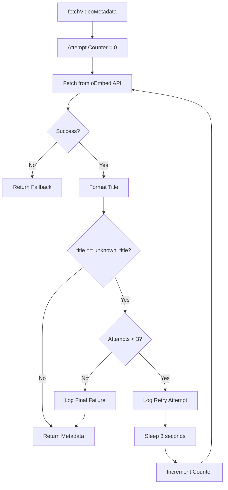
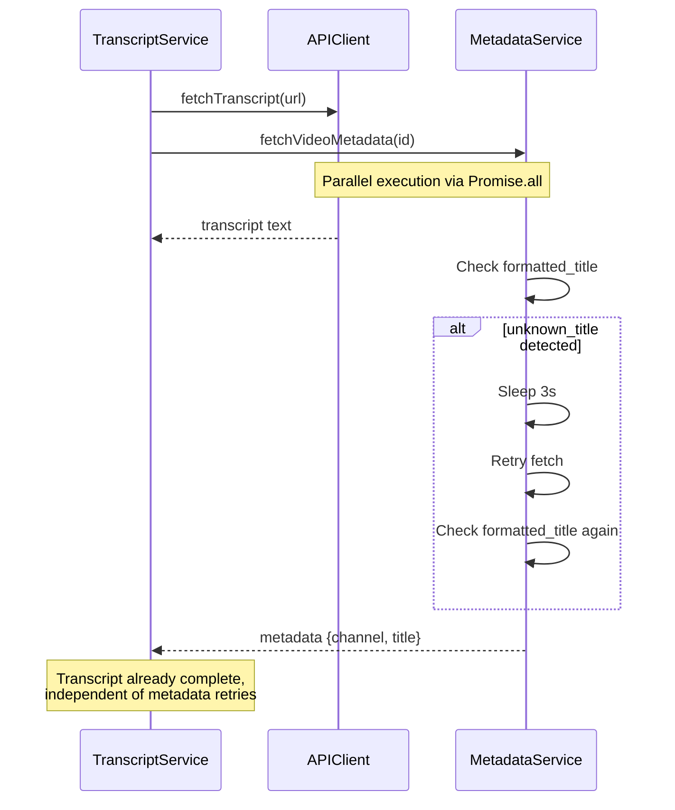

# Implementation Plan: 12.1 - Retry Mechanism Implementation

**Date:** 2025-11-22
**Task:** 12.1 - Retry mechanism implementation (implements FR-2.6, TR-34)
**Status:** Ready for Implementation
**Requirements:** FR-2.6, TR-34

## Plan Overview

This plan implements an intelligent retry mechanism for metadata fetching when the YouTube oEmbed API returns fallback values resulting in "unknown_title" formatted titles. The current implementation already has exponential backoff for 503 errors, but lacks specific retry logic for the scenario where the API returns valid responses with missing title/channel data. This enhancement adds a targeted retry loop that detects when formatted_title equals "unknown_title", sleeps for 3 seconds, and retries up to 3 times before accepting the fallback value. The retry logic is isolated to metadata fetching only and does not affect transcript acquisition, maintaining the parallel fetch architecture while improving metadata reliability.

## Tasks Planned

- 12.1 Retry mechanism implementation (implements FR-2.6, TR-34)
  - 12.1.1 Create retry utility function with sleep and max attempts
  - 12.1.2 Update MetadataService.fetchVideoMetadata to check for unknown_title
  - 12.1.3 Implement 3-second sleep between retry attempts
  - 12.1.4 Add retry counter and max retry limit (3 attempts)
  - 12.1.5 Add console logging for each retry attempt
  - 12.1.6 Add console logging when retries exhausted
  - 12.1.7 Ensure retries only apply to metadata, not transcript fetch

## High-Level Steps

1. Create sleep utility function
2. Refactor MetadataService.fetchVideoMetadata to add unknown_title retry loop
3. Add comprehensive logging for retry attempts and outcomes
4. Verify retry isolation from transcript fetching

## Detailed Implementation

### Step 1: Create Sleep Utility Function

#### A. Rationale & Objective

MetadataService needs a sleep utility to introduce delays between retry attempts. While JavaScript provides setTimeout, a Promise-based sleep function provides cleaner async/await syntax and is reusable for future delay requirements.

#### B. Core Concepts & Strategy

Create a simple Promise-based sleep utility that resolves after a specified millisecond delay. This utility will be used between retry attempts to avoid overwhelming the YouTube oEmbed API with rapid successive requests.

**Key principles:**
- Promise-based for async/await compatibility
- Accepts delay in milliseconds for flexibility
- No external dependencies (native setTimeout)
- Defensive validation of input parameters

#### C. Implementation Guidelines

**Location:** `/Users/teazyou/dev/nodejs-youtube-transcriptor/src/utils/sleep.js`

**Key Logic:**

```javascript
/**
 * Sleep utility for async/await delay
 * @param {number} ms - Milliseconds to sleep
 * @returns {Promise<void>} Resolves after delay
 */
function sleep(ms) {
  // Validate input
  if (typeof ms !== 'number' || ms < 0) {
    throw new Error(`Invalid sleep duration: ${ms}`);
  }

  return new Promise((resolve) => setTimeout(resolve, ms));
}

module.exports = sleep;
```

**Critical Points:**

- Input validation prevents negative delays or non-numeric values
- Promise-based design integrates cleanly with async/await
- Simple, focused utility with single responsibility
- No need for rejection logic (sleep always succeeds)

#### D. Success Criteria

- [ ] sleep.js file created in src/utils/
- [ ] Function accepts milliseconds as parameter
- [ ] Returns Promise that resolves after delay
- [ ] Validates input and throws error for invalid values
- [ ] Exports function for use in MetadataService

#### E. Dependencies & Inputs

- Requires: None (uses native setTimeout)
- Produces: Reusable sleep utility for retry delays

### Step 2: Refactor MetadataService.fetchVideoMetadata for unknown_title Retry

#### A. Rationale & Objective

The current MetadataService.fetchVideoMetadata method (lines 36-94) handles 503 retry logic but does not retry when the API returns valid responses with missing metadata (resulting in "unknown_title" after formatting). This step adds a secondary retry loop that checks the formatted title value and retries if it equals "unknown_title".

#### B. Core Concepts & Strategy

Wrap the existing fetchVideoMetadata logic in an outer retry loop that:
1. Calls the existing fetch logic (which already handles 503 retries)
2. Formats the returned title using this.formatTitle()
3. Checks if formatted_title === "unknown_title"
4. If true and retry attempts remaining, sleeps 3s and retries
5. If false or retries exhausted, returns the metadata

**Architecture decision:** Keep 503 retry logic separate from unknown_title retry logic. The 503 retries use exponential backoff (1s, 2s, 4s), while unknown_title retries use fixed 3s delays per FR-2.6.



#### C. Implementation Guidelines

**Current structure (lines 36-94):**
- Outer for-loop handles 503 retries (MAX_RETRIES = 3, exponential backoff)
- Inner try-catch fetches metadata and formats immediately
- Returns formatted metadata or fallback on error

**New structure:**

```javascript
async fetchVideoMetadata(videoId) {
  // CRITICAL: Validate videoId format first (existing code)
  if (!videoId || videoId.length !== VIDEO_ID_LENGTH || !VIDEO_ID_PATTERN.test(videoId)) {
    console.warn(`[MetadataService] Invalid video ID: ${videoId}`);
    return {
      channel: this.formatChannel(this.FALLBACK_CHANNEL),
      title: this.formatTitle(this.FALLBACK_TITLE),
    };
  }

  // NEW: Outer retry loop for unknown_title scenario
  const MAX_UNKNOWN_TITLE_RETRIES = 3;
  const UNKNOWN_TITLE_RETRY_DELAY_MS = 3000; // 3 seconds per FR-2.6

  for (let unknownTitleAttempt = 0; unknownTitleAttempt <= MAX_UNKNOWN_TITLE_RETRIES; unknownTitleAttempt++) {
    // Fetch metadata (includes existing 503 retry logic)
    const metadata = await this._fetchMetadataWithRetry(videoId);

    // Format the title
    const formattedTitle = this.formatTitle(metadata.title);

    // Check if retry needed
    if (formattedTitle !== 'unknown_title') {
      // Success - return formatted metadata
      return {
        channel: this.formatChannel(metadata.channel),
        title: formattedTitle,
      };
    }

    // unknown_title detected
    if (unknownTitleAttempt < MAX_UNKNOWN_TITLE_RETRIES) {
      // Retry available
      console.warn(
        `[MetadataService] API returned unknown_title for ${videoId}, retrying in 3s (attempt ${unknownTitleAttempt + 1}/${MAX_UNKNOWN_TITLE_RETRIES})`
      );
      await sleep(UNKNOWN_TITLE_RETRY_DELAY_MS);
    } else {
      // All retries exhausted
      console.warn(
        `[MetadataService] Still unknown_title after ${MAX_UNKNOWN_TITLE_RETRIES} retries for ${videoId}, proceeding with this title`
      );
    }
  }

  // Fallback: Return formatted fallback values
  return {
    channel: this.formatChannel(this.FALLBACK_CHANNEL),
    title: this.formatTitle(this.FALLBACK_TITLE),
  };
}

// NEW: Extract existing fetch logic into separate method
async _fetchMetadataWithRetry(videoId) {
  // Move existing 503 retry loop here (lines 47-93)
  // Returns raw metadata: { channel: string, title: string }
  // On error, returns fallback values: { channel: FALLBACK_CHANNEL, title: FALLBACK_TITLE }
}
```

**Critical Points:**

- **Two-layer retry:** 503 errors (exponential backoff) inside unknown_title retries (fixed 3s delay)
- **Format before check:** Must call formatTitle() before checking for "unknown_title"
- **Retry counter:** unknownTitleAttempt tracks 0-3 (4 total attempts: initial + 3 retries)
- **Logging:** Distinguish between retry attempts and final failure
- **Return consistency:** Always return formatted metadata (both channel and title)

#### D. Success Criteria

- [ ] fetchVideoMetadata refactored to include unknown_title retry loop
- [ ] Existing 503 retry logic extracted to _fetchMetadataWithRetry
- [ ] Retry counter tracks attempts (max 3 retries = 4 total attempts)
- [ ] Sleep called between retry attempts (3000ms delay)
- [ ] Formatted title checked against "unknown_title" string
- [ ] Returns metadata immediately on successful title fetch
- [ ] Returns formatted fallback values after exhausting retries

#### E. Dependencies & Inputs

- Requires: sleep utility from Step 1
- Requires: Existing formatTitle, formatChannel, FALLBACK_CHANNEL, FALLBACK_TITLE
- Produces: Enhanced metadata fetching with unknown_title retry capability

### Step 3: Add Comprehensive Logging for Retry Workflow

#### A. Rationale & Objective

Users and developers need visibility into retry behavior to understand metadata fetch reliability and diagnose persistent API issues. Logging provides transparency into when retries occur, why they're triggered, and final outcomes.

#### B. Core Concepts & Strategy

Implement structured console logging at key decision points:
1. **Retry trigger:** When unknown_title detected and retry initiated
2. **Final failure:** When all retries exhausted but still unknown_title
3. **Success after retry:** When retry succeeds (implicit - no special log needed)

**Logging format consistency:**
- Prefix: `[MetadataService]` for service identification
- Include video ID for traceability
- Show attempt counter (X/MAX) for progress tracking
- State reason clearly (API returned unknown_title)

#### C. Implementation Guidelines

**Retry Attempt Log (Step 2, inside retry loop):**

```javascript
console.warn(
  `[MetadataService] API returned unknown_title for ${videoId}, retrying in 3s (attempt ${unknownTitleAttempt + 1}/${MAX_UNKNOWN_TITLE_RETRIES})`
);
```

**Final Failure Log (Step 2, after retry exhaustion):**

```javascript
console.warn(
  `[MetadataService] Still unknown_title after ${MAX_UNKNOWN_TITLE_RETRIES} retries for ${videoId}, proceeding with this title`
);
```

**Example output sequence:**

```
[MetadataService] API returned unknown_title for dQw4w9WgXcQ, retrying in 3s (attempt 1/3)
[MetadataService] API returned unknown_title for dQw4w9WgXcQ, retrying in 3s (attempt 2/3)
[MetadataService] API returned unknown_title for dQw4w9WgXcQ, retrying in 3s (attempt 3/3)
[MetadataService] Still unknown_title after 3 retries for dQw4w9WgXcQ, proceeding with this title
```

**Critical Points:**

- Use console.warn (not console.log) to indicate non-fatal issue
- Include video ID in every log for correlation with transcript processing
- Show attempt number as "X/MAX" for user-friendly progress
- Final log states "proceeding with this title" to clarify non-blocking behavior
- No log needed on immediate success (reduces noise)

#### D. Success Criteria

- [ ] Console log displays on each retry attempt
- [ ] Log includes video ID, attempt number, and reason
- [ ] Console log displays when retries exhausted
- [ ] Logs use console.warn severity level
- [ ] Log messages match TR-34 specification format
- [ ] No duplicate or redundant logging

#### E. Dependencies & Inputs

- Requires: Video ID from parent scope
- Requires: Retry counter and max retry constant
- Produces: Transparent visibility into retry behavior

### Step 4: Verify Retry Isolation from Transcript Fetching

#### A. Rationale & Objective

The retry mechanism must only affect metadata fetching (MetadataService.fetchVideoMetadata) and must not introduce delays or retries to transcript fetching (APIClient.fetchTranscript). This verification ensures the parallel fetch architecture (TR-25) remains intact and transcript processing is unaffected.

#### B. Core Concepts & Strategy

Review the call chain to confirm isolation:

1. **TranscriptService._fetchTranscriptAndMetadata (line 307-351):** Uses Promise.all to fetch transcript and metadata in parallel
2. **Metadata branch:** Calls this.metadata.fetchVideoMetadata(videoId) - THIS IS WHERE RETRY HAPPENS
3. **Transcript branch:** Calls this.api.fetchTranscript(videoUrl) - NO RETRY CHANGES

Since Promise.all runs both operations concurrently, the metadata retry logic (sleeps and re-fetches) happens independently from the transcript fetch. The transcript fetch completes normally while metadata retries continue in parallel.

**Key verification points:**
- fetchVideoMetadata is only called from _fetchTranscriptAndMetadata
- No changes to APIClient.fetchTranscript
- No shared retry counters or sleep calls between services
- TranscriptService catches metadata errors defensively (line 325-331)

#### C. Implementation Guidelines

**No code changes required for this step - verification only**

**Verification checklist:**

```yaml
Isolation Verification:
  - MetadataService.fetchVideoMetadata: Contains retry logic ✓
  - APIClient.fetchTranscript: No retry changes ✓
  - Promise.all structure: Unchanged ✓
  - Error isolation: Metadata errors caught, don't propagate ✓
  - Sleep impact: Only affects metadata fetch timing ✓
```

**Architecture diagram:**



**Critical Points:**

- Transcript fetch completes independently while metadata retries
- Total processing time may increase by up to 9s (3 retries × 3s) for metadata failures
- Transcript processing never delayed by metadata retries (parallel execution)
- Metadata fallback values ensure processing continues even after retry exhaustion

#### D. Success Criteria

- [ ] Verified MetadataService.fetchVideoMetadata is only metadata retry location
- [ ] Confirmed APIClient.fetchTranscript unchanged
- [ ] Reviewed TranscriptService._fetchTranscriptAndMetadata for parallel fetch preservation
- [ ] Confirmed Promise.all structure unchanged
- [ ] Verified metadata errors don't propagate to transcript processing
- [ ] Documented retry isolation in code comments

#### E. Dependencies & Inputs

- Requires: Existing codebase analysis
- Produces: Verification documentation and code comments confirming isolation

## Technical Considerations

### Architecture Impact

- **No structural changes:** Retry logic encapsulated within MetadataService
- **Service boundary preserved:** TranscriptService continues using same fetchVideoMetadata interface
- **Parallel fetch intact:** Promise.all execution model unchanged

### Integration Points

- **MetadataService:** Primary modification target
- **TranscriptService:** No changes required (consumer of MetadataService)
- **APIClient:** Unaffected (transcript fetching isolated)

### Risk Mitigation

| Risk | Likelihood | Impact | Mitigation Strategy |
|------|------------|--------|-------------------|
| Increased processing time | High | Medium | Acceptable - metadata quality improvement justifies delay (max 9s per video) |
| Infinite retry loops | Low | High | Hard-coded max retry limit (3) with counter bounds checking |
| Blocking transcript fetch | Low | High | Verification step confirms Promise.all parallelism maintained |
| API rate limiting | Medium | Medium | 3-second delay provides natural rate limiting between retries |

### Performance Considerations

- Expected load: 1 video at a time (sequential processing per TR-7)
- Worst case delay: 9 seconds (3 retries × 3s) per video with persistent unknown_title
- Best case: No delay (immediate success on first attempt)
- Average case: 0-3s additional delay for videos requiring 1 retry
- Monitoring points: Count of retry attempts, retry success rate, videos stuck at unknown_title

## Implementation Notes

### Code Organization

```
src/
├── utils/
│   └── sleep.js                    # NEW: Sleep utility
└── services/
    └── MetadataService.js          # MODIFIED: Add retry logic
```

### Coding Standards

- Follow existing MetadataService patterns (axios, error handling)
- Use existing constants pattern (MAX_UNKNOWN_TITLE_RETRIES, UNKNOWN_TITLE_RETRY_DELAY_MS)
- Maintain defensive validation (videoId format checks)
- Preserve formatted output (always return formatted channel and title)

### Documentation Requirements

- Add JSDoc comments to sleep.js explaining purpose and parameters
- Update MetadataService.fetchVideoMetadata JSDoc to document retry behavior
- Add inline comments explaining retry loop logic
- Document TR-34 implementation in code comments

## Estimated Effort

| Component | Effort | Complexity |
|-----------|--------|------------|
| Sleep utility | 0.5 hours | Low |
| Refactor fetchVideoMetadata | 2 hours | Medium |
| Add logging | 0.5 hours | Low |
| Verification and testing | 1 hour | Low |
| **Total** | 4 hours | Overall: Low-Medium |

## Next Steps

1. Create src/utils/sleep.js with Promise-based delay function
2. Refactor MetadataService.fetchVideoMetadata to add unknown_title retry loop
3. Extract existing 503 retry logic to _fetchMetadataWithRetry helper method
4. Add console.warn logging for retry attempts and final failures
5. Verify isolation by reviewing TranscriptService call chain
6. Test with test-transcriptor/youtube.md containing known problematic videos
7. Observe console output for retry logs during processing
8. Verify unknown_title files saved after retry exhaustion

## References

- Functional Requirements: FR-2.6 (Metadata retry on unknown_title)
- Technical Requirements: TR-34 (Retry metadata fetch logic specification)
- Related Tasks: 10.1 (MetadataService implementation), 11.0 (Data structure migration)
- External Documentation: YouTube oEmbed API (https://www.youtube.com/oembed)
