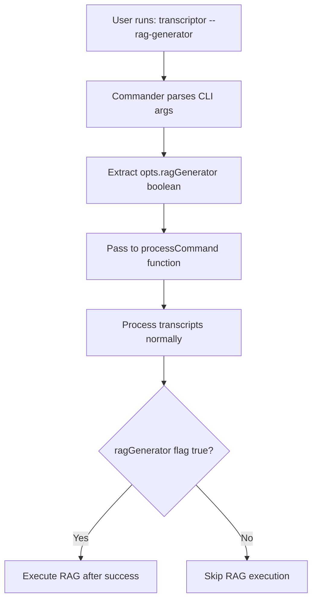
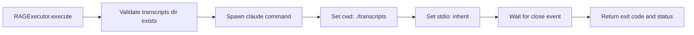
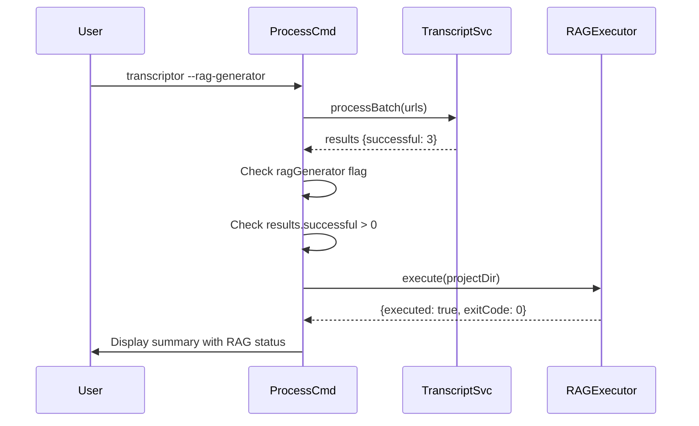

# Implementation Plan: 13.0 - RAG Generator Integration Feature

**Date:** 2025-11-22
**Task:** 13.0 - RAG Generator Integration Feature
**Status:** Ready for Implementation
**Requirements:** FR-12.1, FR-12.2, FR-12.3, TR-35, TR-36, TR-37, TR-38, TR-39, TR-40, TR-41, TR-42, TR-43, TR-44

## Plan Overview

This plan implements automated RAG (Retrieval-Augmented Generation) processing integration that executes after successful transcript processing. The feature adds a `--rag-generator` CLI flag that, when enabled, spawns a child process running the claude-code RAG generator command within the local `./transcripts` directory. This enables automated processing of freshly fetched transcripts without manual intervention, while maintaining failure isolation to ensure RAG errors don't impact core transcript functionality.

The implementation involves three key areas: CLI argument parsing using Commander.js, process spawning using Node.js child_process module with proper working directory configuration, and integration into the existing process workflow with comprehensive error handling for command-not-found scenarios.

## Tasks Planned

- 13.0 RAG Generator Integration Feature (implements FR-12, TR-35 through TR-44)
  - 13.1 CLI argument parsing implementation
  - 13.2 RAG process execution implementation
  - 13.3 Integration with processing workflow
  - 13.4 Error handling and logging
  - 13.5 Documentation and verification

## High-Level Steps

1. Add --rag-generator CLI option to Commander.js configuration
2. Create RAGExecutor utility class for process spawning
3. Integrate RAG execution into process command workflow
4. Implement comprehensive error handling with non-fatal failures
5. Update documentation with usage examples

## Detailed Implementation

### Step 1: CLI Argument Parsing Implementation

#### A. Rationale & Objective

Enable users to opt-in to RAG processing via command-line flag, providing declarative control over automated transcript processing workflows.

#### B. Core Concepts & Strategy

Commander.js supports boolean options with `.option()` method. The flag must be accessible in the default action handler (main process command). The implementation adds a global option that gets parsed by Commander before command execution, making it available via `program.opts()`.

**Key architectural decision:** Use global option (defined on `program` itself) rather than command-specific option to keep syntax clean (`transcriptor --rag-generator` vs `transcriptor process --rag-generator`).



#### C. Implementation Guidelines

**File:** `/Users/teazyou/dev/nodejs-youtube-transcriptor/src/index.js`

**Key Logic:**

```javascript
// Add to program configuration section (after existing .option() calls)
program
  .name('transcriptor')
  .description('YouTube transcript extraction and management tool')
  .version(version)
  .option('-q, --quiet', 'Suppress all output except errors')
  .option('-v, --verbose', 'Show detailed operation logs')
  .option('--rag-generator', 'Execute RAG generator after processing transcripts'); // NEW

// Update default action handler to extract and pass flag
program.action(
  asyncHandler(async () => {
    const opts = program.opts(); // Extract all flags
    const processCommand = require('./commands/process');
    await processCommand(opts); // Pass options object to command
  })
);
```

**Critical Points:**

- Add option AFTER existing `-q, --quiet` and `-v, --verbose` options
- Use long-form flag only (`--rag-generator`) - no short form needed
- Flag defaults to `false` (boolean option without value)
- Description should match FR-8.5 specification exactly
- Pass entire `opts` object to processCommand for extensibility

#### D. Success Criteria

- [ ] `transcriptor --help` displays `--rag-generator` option with description
- [ ] `program.opts().ragGenerator` is `false` by default
- [ ] `program.opts().ragGenerator` is `true` when flag provided
- [ ] Flag works with existing `-q` and `-v` flags without conflicts
- [ ] Non-process commands (help, data, clean) ignore the flag gracefully

#### E. Dependencies & Inputs

- Requires: Existing Commander.js configuration in `src/index.js`
- Produces: Options object with `ragGenerator` boolean property for process command

---

### Step 2: RAG Process Execution Implementation

#### A. Rationale & Objective

Encapsulate RAG generator spawning logic in a dedicated utility module for separation of concerns, testability, and reusability. The module must handle process lifecycle, working directory configuration, and exit code capture.

#### B. Core Concepts & Strategy

Use Node.js `child_process.spawn()` for non-blocking process execution with real-time output streaming. Configure spawn with `stdio: 'inherit'` to pipe child process stdout/stderr directly to parent console, providing seamless user experience. Set `cwd` option to `./transcripts` directory to ensure RAG generator executes in correct context.

**Pattern:** Promise-based wrapper around spawn events for async/await compatibility in command handlers.



#### C. Implementation Guidelines

**File:** `/Users/teazyou/dev/nodejs-youtube-transcriptor/src/utils/RAGExecutor.js` (NEW)

**Key Logic:**

```javascript
const { spawn } = require('child_process');
const path = require('path');
const fs = require('fs-extra');

class RAGExecutor {
  /**
   * Execute RAG generator in ./transcripts directory
   * Implements FR-12.2, TR-37, TR-38, TR-39
   *
   * @param {string} projectDir - Project root directory (defaults to cwd)
   * @returns {Promise<Object>} Result object with executed, exitCode, error
   */
  static async execute(projectDir = process.cwd()) {
    const transcriptsDir = path.resolve(projectDir, 'transcripts');

    // TR-39: Validate working directory exists
    const dirExists = await fs.pathExists(transcriptsDir);
    if (!dirExists) {
      throw new Error(`Transcripts directory not found: ${transcriptsDir}`);
    }

    return new Promise((resolve) => {
      // TR-38: Spawn configuration
      const childProcess = spawn(
        'claude',
        ['--dangerously-skip-permissions', '-p', '/rag-generator'],
        {
          cwd: transcriptsDir,
          stdio: 'inherit', // Direct console output
          shell: true,      // Enable shell parsing
          env: process.env  // Pass environment variables
        }
      );

      // TR-42: Track process state
      const result = {
        executed: true,
        exitCode: null,
        error: null
      };

      // Handle process completion
      childProcess.on('close', (code, signal) => {
        result.exitCode = code;
        if (signal) {
          result.error = `Process terminated by signal: ${signal}`;
        }
        resolve(result);
      });

      // TR-40: Handle spawn errors (command not found, etc.)
      childProcess.on('error', (err) => {
        result.error = err.message;
        result.exitCode = -1;
        resolve(result); // Non-fatal - always resolve, never reject
      });
    });
  }
}

module.exports = RAGExecutor;
```

**Critical Points:**

- Use `spawn()` not `exec()` - better for long-running processes with large output
- `stdio: 'inherit'` pipes output directly to terminal (no buffering)
- `shell: true` enables proper command parsing
- `cwd` must be absolute path (use `path.resolve()`)
- NEVER reject promise - RAG failures must be non-fatal per FR-12.3
- Return structured result object for logging in caller

#### D. Success Criteria

- [ ] `execute()` spawns claude command in ./transcripts directory
- [ ] Child process output appears in parent console in real-time
- [ ] Exit code captured correctly (0 for success, non-zero for failure)
- [ ] ENOENT error (command not found) captured in result.error
- [ ] Promise resolves (never rejects) regardless of spawn outcome
- [ ] Environment variables passed to child process

#### E. Dependencies & Inputs

- Requires: `child_process`, `path`, `fs-extra` modules
- Requires: `./transcripts` directory exists (validated before spawn)
- Produces: Result object with execution status for logging in process command

---

### Step 3: Integration with Processing Workflow

#### A. Rationale & Objective

Integrate RAG execution into the main process command flow after successful transcript processing, ensuring RAG only runs when transcripts were actually fetched or cached.

#### B. Core Concepts & Strategy

Add conditional RAG execution gate after `TranscriptService.processBatch()` completes. Check two conditions: (1) `ragGenerator` flag is true, (2) at least one transcript was processed successfully (`results.processed > 0` or `results.successful > 0`). If both conditions met, call `RAGExecutor.execute()` and log results.

**Integration point:** After `displayResults()` but before final return in `processCommand()`.



#### C. Implementation Guidelines

**File:** `/Users/teazyou/dev/nodejs-youtube-transcriptor/src/commands/process.js`

**Signature Change:**

```javascript
// OLD
async function processCommand() {

// NEW
async function processCommand(options = {}) {
  const { ragGenerator = false } = options;
```

**Integration Logic (add after displayResults call):**

```javascript
// Step 4: Display results
displayResults(results, uniqueUrls.length);

// Step 5: Execute RAG generator if requested (implements FR-12.2, TR-41)
if (ragGenerator && results.processed > 0) {
  try {
    console.log('\n[RAG-GENERATOR] Executing RAG generator in ./transcripts...');

    const RAGExecutor = require('../utils/RAGExecutor');
    const ragResult = await RAGExecutor.execute(process.cwd());

    if (ragResult.error) {
      // TR-40: Non-fatal error logging
      console.error(`[RAG-GENERATOR] Error: ${ragResult.error}`);
    } else if (ragResult.exitCode === 0) {
      console.log('[RAG-GENERATOR] Completed successfully');
    } else {
      console.warn(`[RAG-GENERATOR] Exited with code ${ragResult.exitCode}`);
    }

    // TR-42: Add RAG status to results object
    results.ragGenerator = ragResult;

  } catch (error) {
    // TR-40: Catch any unexpected errors, log and continue
    console.error(`[RAG-GENERATOR] Unexpected error: ${error.message}`);
  }
}

return { success: true, results };
```

**Critical Points:**

- Check `results.processed > 0` OR `results.successful > 0` (depending on which property TranscriptService uses)
- Wrap RAG execution in try-catch for defense-in-depth error handling
- Use `[RAG-GENERATOR]` prefix for all log messages per TR-44
- Log before execution ("Executing...") and after completion (status)
- Add `ragResult` to results object for potential future reporting
- NEVER throw or return early on RAG failure - continue to final return

#### D. Success Criteria

- [ ] RAG executes only when `--rag-generator` flag provided
- [ ] RAG skipped if no transcripts processed successfully
- [ ] RAG executes after all transcripts processed (not during)
- [ ] Console shows "Executing RAG generator..." before spawn
- [ ] Console shows completion status after spawn finishes
- [ ] Errors logged but don't crash process command
- [ ] Final return statement always reached regardless of RAG outcome

#### E. Dependencies & Inputs

- Requires: RAGExecutor utility module (Step 2)
- Requires: `options.ragGenerator` from CLI parsing (Step 1)
- Requires: `results.processed` from TranscriptService
- Produces: Enhanced results object with RAG execution status

---

### Step 4: Error Handling and Logging

#### A. Rationale & Objective

Provide comprehensive error handling for all RAG failure scenarios with informative user-facing messages, ensuring failures never impact core transcript functionality.

#### B. Core Concepts & Strategy

Implement multi-layered error handling: (1) spawn error handler in RAGExecutor for command-not-found scenarios, (2) exit code checking for RAG process failures, (3) try-catch wrapper in process command for unexpected errors. Use descriptive error messages that guide users toward resolution (e.g., "claude command not found - install claude-code").

**Error categories per TR-40:**

- **ENOENT**: Command not found (claude not installed)
- **EACCES**: Permission denied (rare, executable permissions)
- **Spawn failure**: Process failed to start
- **Exit non-zero**: RAG process ran but failed

#### C. Implementation Guidelines

**Enhanced RAGExecutor error handling:**

```javascript
// In RAGExecutor.execute() method

childProcess.on('error', (err) => {
  result.error = err.message;
  result.exitCode = -1;

  // TR-40: Provide actionable error messages
  if (err.code === 'ENOENT') {
    result.error = 'Command not found: claude. Please install claude-code CLI tool.';
  } else if (err.code === 'EACCES') {
    result.error = 'Permission denied executing claude command. Check executable permissions.';
  }

  resolve(result); // Always resolve, never reject
});
```

**Enhanced process.js error logging:**

```javascript
if (ragResult.error) {
  console.error(`[RAG-GENERATOR] Error: ${ragResult.error}`);

  // Provide installation hint for common error
  if (ragResult.error.includes('not found')) {
    console.error('[RAG-GENERATOR] Hint: Install with: npm install -g @anthropic-ai/claude-code');
  }
} else if (ragResult.exitCode !== 0) {
  console.warn(`[RAG-GENERATOR] Process exited with code ${ragResult.exitCode}`);
  console.warn('[RAG-GENERATOR] Check ./transcripts directory for partial output');
}
```

**Critical Points:**

- Distinguish between spawn errors (command issues) and exit errors (RAG logic issues)
- Provide installation hints for ENOENT errors
- Use `console.error()` for fatal errors, `console.warn()` for non-zero exits
- Prefix all messages with `[RAG-GENERATOR]` for log filtering
- NEVER use `process.exit()` in RAG error handlers
- Log enough context for debugging but keep messages concise

#### D. Success Criteria

- [ ] ENOENT error shows "Command not found" message with install hint
- [ ] EACCES error shows "Permission denied" message
- [ ] Non-zero exit code shows warning with exit code number
- [ ] All RAG errors logged but don't stop process command
- [ ] Error messages are actionable (tell user what to do)
- [ ] Success case (exit 0) shows "Completed successfully" message

#### E. Dependencies & Inputs

- Requires: Error result from RAGExecutor.execute()
- Requires: Console logging infrastructure
- Produces: User-facing error messages with resolution guidance

---

### Step 5: Documentation and Verification

#### A. Rationale & Objective

Document the new feature for end users and verify correct behavior through manual testing across success and failure scenarios.

#### B. Core Concepts & Strategy

Update README.md with `--rag-generator` flag documentation in the "Usage" section. Include examples showing the flag in action, explain what the RAG generator does, and document error scenarios. Manual verification covers: flag parsing, RAG execution, error handling, and interaction with other flags.

#### C. Implementation Guidelines

**README.md Updates (add to Usage section):**

```markdown
### RAG Generator Integration

Transcriptor can automatically execute RAG (Retrieval-Augmented Generation) processing on fetched transcripts using the `--rag-generator` flag:

\`\`\`bash
# Process transcripts and run RAG generator
transcriptor --rag-generator
\`\`\`

**How it works:**

1. Transcripts are fetched/cached normally
2. If at least one transcript was processed successfully, the RAG generator executes
3. The command `claude --dangerously-skip-permissions -p /rag-generator` runs in `./transcripts` directory
4. RAG output appears directly in your console

**Requirements:**

- Claude Code CLI must be installed: `npm install -g @anthropic-ai/claude-code`
- RAG generator slash command must exist: `/rag-generator`

**Error handling:**

If the RAG generator fails, transcript processing is not affected. Errors are logged but do not prevent transcripts from being saved. Common errors:

- "Command not found" - Install claude-code CLI
- "Exit code N" - RAG processing failed, check output for details

**Combining with other flags:**

\`\`\`bash
# Verbose output with RAG
transcriptor --verbose --rag-generator

# Quiet mode with RAG (only shows RAG output and errors)
transcriptor --quiet --rag-generator
\`\`\`
```

**Verification Test Plan:**

```plaintext
Test 1: Flag parsing
- Run: transcriptor --help
- Verify: --rag-generator appears in options list

Test 2: Successful execution
- Setup: Valid youtube.md with 1 URL, claude-code installed
- Run: transcriptor --rag-generator
- Verify: Transcripts fetched, RAG executes, "Completed successfully" shown

Test 3: No transcripts processed
- Setup: Empty youtube.md
- Run: transcriptor --rag-generator
- Verify: RAG does not execute (no "Executing RAG generator..." message)

Test 4: Command not found error
- Setup: Rename/remove claude binary temporarily
- Run: transcriptor --rag-generator
- Verify: "Command not found" error shown, install hint provided, process completes

Test 5: Flag ignored for other commands
- Run: transcriptor data --rag-generator
- Verify: Data command runs normally, flag ignored (no error)

Test 6: RAG process failure (non-zero exit)
- Setup: Break /rag-generator slash command intentionally
- Run: transcriptor --rag-generator
- Verify: Transcripts succeed, RAG fails with exit code, summary still shown

Test 7: Interaction with verbosity flags
- Run: transcriptor --verbose --rag-generator
- Verify: Verbose transcript logs + RAG output both shown
```

**Critical Points:**

- Explain prerequisites clearly (claude-code installation)
- Document non-fatal failure behavior explicitly
- Show examples combining with existing flags
- Verification must cover both happy path and error scenarios
- Test interaction with existing features (quiet/verbose modes)

#### D. Success Criteria

- [ ] README.md documents `--rag-generator` flag with examples
- [ ] Prerequisites (claude-code installation) documented
- [ ] Error scenarios documented with resolutions
- [ ] All 7 verification tests pass
- [ ] Help text shows flag description
- [ ] Flag works with `-q` and `-v` flags without conflicts

#### E. Dependencies & Inputs

- Requires: Completed implementation from Steps 1-4
- Requires: Working claude-code installation for testing
- Produces: Updated documentation and verified functionality

---

## Task Breakdown Updates

### New Subtasks Identified

No additional subtasks beyond those already defined in task 13.0 (subtasks 13.1 through 13.5).

**Rationale:** Task 13.0 is already well-decomposed in tasks.md with 5 subtasks covering all necessary implementation areas. The plan provides detailed implementation guidance for each subtask without requiring further breakdown.

---

## Technical Considerations

### Architecture Impact

**New Components:**

- **RAGExecutor utility class**: Standalone module in `src/utils/` for process spawning logic
- **CLI option extension**: Adds boolean flag to Commander.js configuration
- **Process command enhancement**: Adds optional RAG execution phase after transcript processing

**No architectural changes:** Integration uses existing patterns (utility modules, command handler updates, error handling conventions). RAG execution is completely isolated - failure does not affect core transcript functionality.

### Integration Points

**Commander.js (src/index.js):**

- Add `.option('--rag-generator')` to program configuration
- Extract `opts.ragGenerator` and pass to processCommand

**Process Command (src/commands/process.js):**

- Accept `options` parameter with `ragGenerator` flag
- Call RAGExecutor after displayResults() when flag is true
- Add try-catch for defensive error handling

**Child Process Spawning:**

- Use `child_process.spawn()` for non-blocking execution
- Configure `cwd: ./transcripts` for correct execution context
- Use `stdio: 'inherit'` for seamless output streaming

**External Command:**

- Executes: `claude --dangerously-skip-permissions -p /rag-generator`
- Depends on: claude-code CLI installed globally
- Runs in: `./transcripts` directory relative to project root

### Risk Mitigation

| Risk | Likelihood | Impact | Mitigation Strategy |
|------|------------|--------|-------------------|
| claude command not installed | High | Low | Graceful error with install instructions, non-fatal |
| RAG process hangs indefinitely | Low | Medium | No timeout needed - user can Ctrl+C, future enhancement |
| ./transcripts directory missing | Low | Low | Validate dir exists before spawn, create if missing |
| RAG process writes to cwd incorrectly | Low | Medium | Explicitly set cwd option, validate in testing |
| Spawn error crashes process command | Low | High | Wrap in try-catch, use Promise pattern that never rejects |
| Flag conflicts with other options | Low | Low | Test with -q and -v flags, document incompatibilities |

**High-priority mitigation:** Non-fatal error handling is critical. All RAG failures must log errors but allow process command to complete successfully.

### Performance Considerations

**Expected load:** RAG execution is user-initiated (opt-in flag), runs sequentially after transcripts, no concurrent concerns.

**Optimization opportunities:**

- RAG runs in background while user reviews transcript output (stdio: inherit shows progress)
- No polling needed - event-driven completion via close event
- Minimal memory overhead - child process isolated, no buffering (inherit stdio)

**Monitoring points:**

- RAG execution time (not logged, but visible to user via console output)
- Exit codes (logged for debugging)
- Spawn errors (logged immediately)

**Performance impact:** Negligible on transcript processing (RAG runs after). RAG execution time depends on claude-code performance, not this implementation.

---

## Implementation Notes

### Code Organization

```
nodejs-youtube-transcriptor/
├── bin/
│   └── transcriptor          # No changes - delegates to src/index.js
├── src/
│   ├── index.js              # MODIFY: Add --rag-generator option, pass to processCommand
│   ├── commands/
│   │   └── process.js        # MODIFY: Accept options param, call RAGExecutor conditionally
│   └── utils/
│       └── RAGExecutor.js    # CREATE: New utility for spawn logic
└── README.md                 # MODIFY: Document new flag
```

### Coding Standards

**Follow existing patterns:**

- Utility classes use static methods (see ValidationHelpers.js, URLValidator.js)
- Error messages use consistent prefixing (`[SERVICE-NAME]` format)
- Commander options use long-form flags with descriptive help text
- Async functions use try-catch with error logging, not throwing to caller
- JSDoc comments required for all public methods

**Avoid anti-patterns:**

- Do NOT use `exec()` or `execSync()` - use `spawn()` for better control
- Do NOT reject promises in RAGExecutor - always resolve with error status
- Do NOT use hardcoded paths - use `path.resolve()` for portability
- Do NOT buffer stdio - use `stdio: 'inherit'` for real-time output
- Do NOT add testing code - project excludes tests per agents.md

### Documentation Requirements

**Inline comments for:**

- RAGExecutor.execute() method explaining spawn configuration options
- Error handling branches in both RAGExecutor and process.js
- Conditional RAG execution logic in process.js (why each condition matters)

**README updates:**

- Add "RAG Generator Integration" subsection to Usage section
- Include prerequisites, examples, error scenarios
- Show flag combinations with existing options

**No API documentation needed:** RAGExecutor is internal utility, not exposed as public API.

---

## Estimated Effort

| Component | Effort | Complexity |
|-----------|--------|------------|
| CLI argument parsing (Step 1) | 1 hour | Low |
| RAGExecutor utility class (Step 2) | 3 hours | Medium |
| Process command integration (Step 3) | 2 hours | Low |
| Error handling implementation (Step 4) | 2 hours | Medium |
| Documentation and verification (Step 5) | 4 hours | Low |
| **Total** | **12 hours** | **Overall: Medium** |

**Complexity justification:**

- **Low components:** Straightforward Commander.js API usage, well-defined integration points
- **Medium components:** Child process spawning requires careful configuration, error handling spans multiple layers

**Risk buffer:** 2 hours for unexpected issues (spawn behavior differences across platforms, edge cases in error handling)

---

## Next Steps

1. Implement Step 1: Add `--rag-generator` option to `src/index.js`, update processCommand signature
2. Implement Step 2: Create `src/utils/RAGExecutor.js` with spawn logic and error handling
3. Implement Step 3: Update `src/commands/process.js` to call RAGExecutor conditionally
4. Implement Step 4: Enhance error messages in both RAGExecutor and process.js
5. Implement Step 5: Update README.md and perform verification testing
6. Mark subtasks 13.1 through 13.5 as completed in `dev/tasks.md`

---

## References

- **Functional Requirements:** FR-12.1 (CLI argument), FR-12.2 (RAG execution), FR-12.3 (error handling)
- **Technical Requirements:** TR-35 through TR-44 (CLI parsing, spawn config, error handling, logging)
- **Related Tasks:** Task 6.1 (process command structure), Task 9.3.5 (verbosity flags pattern)
- **External Documentation:**
  - Node.js child_process.spawn: https://nodejs.org/api/child_process.html#child_processspawncommand-args-options
  - Commander.js options: https://github.com/tj/commander.js#options
