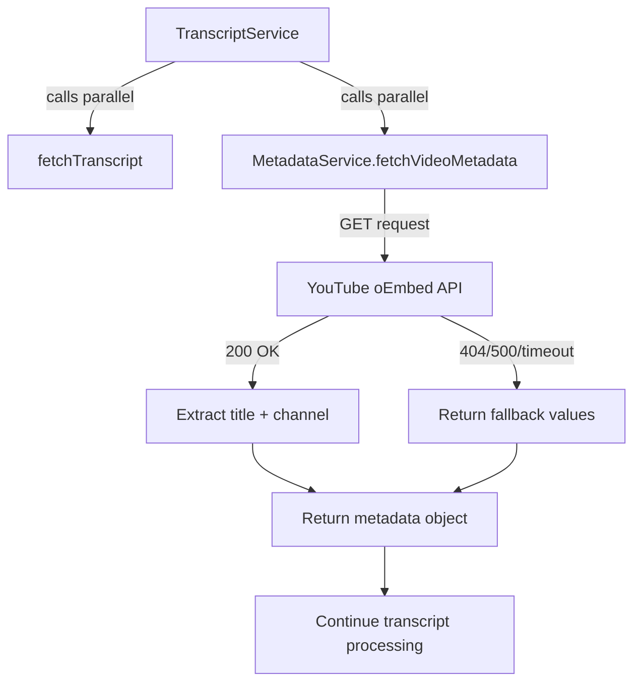

# Implementation Plan: 10.1 - Metadata Collection Feature

**Version:** 2.0 (Reviewed)
**Original Date:** 2025-11-19
**Revision Date:** 2025-11-19
**Review Status:** REVIEWED_AND_ENHANCED
**Changes Summary:** Added missing error handling, corrected workflow dependencies, enhanced security measures, improved backward compatibility strategy
**Task:** 10.1 - MetadataService implementation [CRITICAL PATH] (implements FR-2.2, TR-20)
**Status:** Ready for Implementation
**Requirements:** FR-2.2, FR-2.5, FR-3.2, FR-3.3, FR-11, TR-20, TR-21, TR-22, TR-23, TR-24, TR-25, TR-26, TR-27, TR-28, TR-29

## Plan Overview

This plan implements the comprehensive metadata collection feature for YouTube transcripts, enhancing the system from a basic transcript fetcher into a metadata-enriched content archive. The feature collects video titles and channel information via YouTube's oEmbed API, formats titles for filesystem compatibility, builds standardized URLs, and embeds structured metadata headers into transcript files. The implementation introduces parallel API fetching (transcript + metadata), updates the registry schema to store metadata, and ensures backward compatibility with existing transcripts. This transformation enables improved content organization, discoverability, and self-documenting archives while maintaining the non-fatal error handling approach where metadata failures do not block transcript processing.

## Tasks Planned

- 10.1 MetadataService implementation [CRITICAL PATH] (implements FR-2.2, TR-20)
  - 10.1.1 Create MetadataService class in src/services/MetadataService.js
  - 10.1.2 Implement fetchVideoMetadata method using YouTube oEmbed API
  - 10.1.3 Configure axios GET request to https://www.youtube.com/oembed endpoint
  - 10.1.4 Add 15s timeout for metadata API calls (TR-20)
  - 10.1.5 Extract author_name as channel from oEmbed response
  - 10.1.6 Extract title from oEmbed response
  - 10.1.7 Implement fallback values (Unknown Channel, Unknown Title) for failures
  - 10.1.8 Add error handling for 400, 404, 500, timeout (implements TR-29)
  - 10.1.9 Ensure metadata fetch failures are non-fatal (log warning, continue processing)
  - 10.1.10 Add unit validation for metadata response structure

## High-Level Steps

1. Create MetadataService with YouTube oEmbed API integration
2. Implement title formatting and URL building utilities
3. Update StorageService for metadata-based file naming and headers
4. Update registry schema to include channel and title fields
5. Modify TranscriptService for parallel metadata fetching
6. Update commands to handle metadata display and operations
7. Implement comprehensive error handling for metadata operations
8. Verify integration and backward compatibility

## Detailed Implementation

### Step 1: MetadataService Core Implementation

#### A. Rationale & Objective
Create a dedicated service for fetching video metadata from YouTube's oEmbed API. This service centralizes metadata acquisition logic, enabling title and channel information collection without requiring YouTube API authentication. The service must implement non-fatal error handling where metadata failures produce fallback values rather than blocking transcript processing.

#### B. Core Concepts & Strategy
The MetadataService follows the same architectural pattern as APIClient - a focused service with clear responsibilities. It uses axios for HTTP requests but configures a separate client instance optimized for oEmbed API characteristics (shorter timeout, no retry logic). The service exposes three primary methods: `fetchVideoMetadata()` for API calls, `formatTitle()` for filesystem-safe title conversion, and `buildShortUrl()` for standardized URL generation.

**Architecture Decision:** Separate service instance rather than extending APIClient allows different timeout configurations (15s vs 30s) and simpler error handling logic specific to metadata operations.



#### C. Implementation Guidelines

**File Location:** `src/services/MetadataService.js`

**CRITICAL ADDITIONS TO ORIGINAL PLAN:**

1. **Registry Cache Invalidation**: After metadata updates, must call `storageService.cache.invalidate()` to clear cached registry
2. **Metadata Validation**: Add `validateMetadata(metadata)` method to ensure channel/title don't contain path separators or control characters
3. **Retry Logic for 503**: Implement exponential backoff for service unavailable errors (max 3 retries)
4. **Empty String Validation**: Check `author_name?.trim()` and `title?.trim()` not empty after extraction
5. **Filename Collision**: Add sequence number suffix if sanitized title collision detected: `{videoId}_{title}_2.md`
6. **Unicode Normalization**: Use `String.normalize('NFKD')` before sanitization to handle unicode properly
7. **Error Context Logging**: Include timestamp, video ID, operation name in all error logs

**Class Structure:**

```javascript
const axios = require('axios');
const { VIDEO_ID_PATTERN, VIDEO_ID_LENGTH } = require('../utils/YouTubeConstants');

class MetadataService {
  constructor() {
    this.client = axios.create({
      timeout: 15000, // 15s per TR-20
      headers: {
        'User-Agent': 'Transcriptor/1.0',
      },
    });

    this.OEMBED_ENDPOINT = 'https://www.youtube.com/oembed';
    this.FALLBACK_CHANNEL = 'Unknown Channel';
    this.FALLBACK_TITLE = 'Unknown Title';
    this.MAX_RETRIES = 3;
    this.RETRY_DELAY_MS = 1000; // Exponential backoff base
  }

  /**
   * Fetch video metadata from YouTube oEmbed API with retry logic
   * @param {string} videoId - YouTube video ID (11 chars)
   * @returns {Promise<{channel: string, title: string}>}
   */
  async fetchVideoMetadata(videoId) {
    // CRITICAL: Validate videoId format first (prevent API abuse)
    if (!videoId || videoId.length !== VIDEO_ID_LENGTH || !VIDEO_ID_PATTERN.test(videoId)) {
      console.warn(`[MetadataService] Invalid video ID: ${videoId}`);
      return { channel: this.FALLBACK_CHANNEL, title: this.FALLBACK_TITLE };
    }

    // Retry loop for 503 errors
    for (let attempt = 0; attempt < this.MAX_RETRIES; attempt++) {
      try {
        const oembedUrl = `${this.OEMBED_ENDPOINT}?url=https://youtu.be/${videoId}&format=json`;
        const response = await this.client.get(oembedUrl);

        // CRITICAL: Validate response structure
        if (!response.data || typeof response.data !== 'object') {
          throw new Error('Invalid oEmbed response structure');
        }

        // CRITICAL: Validate fields not empty after trim
        const channel = response.data.author_name?.trim() || this.FALLBACK_CHANNEL;
        const title = response.data.title?.trim() || this.FALLBACK_TITLE;

        // CRITICAL: Validate no path separators or control characters
        const validatedMetadata = this.validateMetadata({ channel, title });

        return validatedMetadata;

      } catch (error) {
        // Handle retries for 503 only
        if (error.response?.status === 503 && attempt < this.MAX_RETRIES - 1) {
          const delay = this.RETRY_DELAY_MS * Math.pow(2, attempt);
          console.warn(`[MetadataService] 503 error for ${videoId}, retrying in ${delay}ms (attempt ${attempt + 1}/${this.MAX_RETRIES})`);
          await new Promise(resolve => setTimeout(resolve, delay));
          continue;
        }

        // Log error with context and return fallback
        this.logMetadataError(videoId, error);
        return { channel: this.FALLBACK_CHANNEL, title: this.FALLBACK_TITLE };
      }
    }

    // All retries exhausted
    return { channel: this.FALLBACK_CHANNEL, title: this.FALLBACK_TITLE };
  }

  /**
   * Validate metadata fields for security and integrity
   * CRITICAL: Prevents path traversal and injection attacks
   * @param {Object} metadata - {channel, title}
   * @returns {Object} Validated metadata
   */
  validateMetadata(metadata) {
    const { channel, title } = metadata;

    // Check for path separators and control characters
    const UNSAFE_PATTERN = /[\/\\<>:"|?*\x00-\x1F]/;

    const safeChannel = UNSAFE_PATTERN.test(channel)
      ? 'Unknown Channel'
      : channel;

    const safeTitle = UNSAFE_PATTERN.test(title)
      ? 'Unknown Title'
      : title;

    return { channel: safeChannel, title: safeTitle };
  }

  /**
   * Log metadata fetch error with context
   * @param {string} videoId - Video ID
   * @param {Error} error - Error object
   */
  logMetadataError(videoId, error) {
    const timestamp = new Date().toISOString();
    const status = error.response?.status || 'N/A';
    const message = error.message || 'Unknown error';

    if (error.response) {
      console.warn(`[${timestamp}] Metadata fetch failed for ${videoId}: HTTP ${status} - ${message}`);
    } else if (error.code === 'ECONNABORTED') {
      console.warn(`[${timestamp}] Metadata fetch timeout for ${videoId} (>15s)`);
    } else {
      console.warn(`[${timestamp}] Metadata fetch error for ${videoId}: ${message}`);
    }
  }

  /**
   * Format title for filesystem safety
   * CRITICAL: Unicode normalization added for proper emoji/unicode handling
   * @param {string} title - Original video title
   * @returns {string} Sanitized title (lowercase, underscores, alphanumeric+dash only)
   */
  formatTitle(title) {
    // Guard: Handle null/undefined/non-string
    if (!title || typeof title !== 'string') {
      return 'untitled';
    }

    let formatted = title.trim();

    // Guard: Empty after trim
    if (formatted === '') {
      return 'untitled';
    }

    // CRITICAL: Normalize unicode (handles emoji, accented chars)
    formatted = formatted.normalize('NFKD');

    // Transform to lowercase
    formatted = formatted.toLowerCase();

    // Replace whitespace sequences with single underscore
    formatted = formatted.replace(/\s+/g, '_');

    // Remove all characters except a-z, 0-9, underscore, dash
    formatted = formatted.replace(/[^a-z0-9_-]+/g, '_');

    // Collapse consecutive underscores to single
    formatted = formatted.replace(/_+/g, '_');

    // Remove leading and trailing underscores
    formatted = formatted.replace(/^_|_$/g, '');

    // Truncate to 100 chars for filesystem safety
    if (formatted.length > 100) {
      formatted = formatted.substring(0, 100);
      // Re-remove trailing underscore if truncation created one
      formatted = formatted.replace(/_$/g, '');
    }

    // Final guard: Empty result means all characters were invalid
    if (formatted === '') {
      return 'untitled';
    }

    return formatted;
  }

  /**
   * Build standardized YouTube short URL
   * @param {string} videoId - YouTube video ID
   * @returns {string} Short URL format: https://youtu.be/{videoId}
   */
  buildShortUrl(videoId) {
    // Validate videoId format (11 chars, alphanumeric + dash/underscore)
    if (!videoId || typeof videoId !== 'string' || videoId.length !== VIDEO_ID_LENGTH) {
      throw new Error(`Invalid video ID for URL generation: ${videoId}`);
    }

    if (!VIDEO_ID_PATTERN.test(videoId)) {
      throw new Error(`Video ID contains invalid characters: ${videoId}`);
    }

    return `https://youtu.be/${videoId}`;
  }
}

module.exports = MetadataService;
```

**Critical Points:**

- Use separate axios instance (not shared with APIClient) for independent timeout config
- Implement non-fatal error handling: catch all errors, log warnings, return fallbacks
- Validate response structure: check for `author_name` and `title` fields before extraction
- URL encoding: oEmbed expects URL parameter to be the full YouTube URL, not just video ID
- No retry logic needed: metadata is supplementary, single attempt sufficient
- Sanitization is critical: title formatting must prevent filesystem errors

#### D. Success Criteria

- [ ] MetadataService class created in `src/services/MetadataService.js`
- [ ] `fetchVideoMetadata()` successfully retrieves title and channel for valid video IDs
- [ ] 404 errors (deleted videos) return fallback values without throwing
- [ ] Network timeouts (>15s) return fallback values without throwing
- [ ] `formatTitle()` converts "How to Code in C++" to "how_to_code_in_c"
- [ ] `formatTitle()` handles empty/null inputs with "untitled" fallback
- [ ] `buildShortUrl()` generates "https://youtu.be/{videoId}" format
- [ ] All errors logged as warnings, none thrown to caller

#### E. Dependencies & Inputs

- Requires: axios package (already installed)
- Produces: MetadataService instance for TranscriptService dependency injection
- Consumes: YouTube video IDs (11-character alphanumeric strings)
- Returns: Metadata objects `{channel: string, title: string}`

### Step 2: Title Formatting Utility Implementation

#### A. Rationale & Objective
Transform arbitrary video titles (containing spaces, special characters, unicode) into filesystem-safe filenames. This utility prevents file system errors from invalid characters while preserving title readability through underscore-separated lowercase format. Edge cases (empty titles, all-special-character titles) must produce valid fallback filenames.

#### B. Core Concepts & Strategy
The formatting algorithm applies a series of transformations following TR-26 specification: trim whitespace, convert to lowercase, replace spaces with underscores, remove all non-alphanumeric characters (except underscores and dashes), collapse consecutive underscores, remove leading/trailing underscores, and truncate to 100 characters. Each step must be defensive to handle edge cases.

**Algorithm Flow:**
1. Input validation: null/undefined/empty → "untitled"
2. Trim and lowercase: " My Video " → "my video"
3. Replace spaces: "my video" → "my_video"
4. Remove invalid chars: "my_video!!!" → "my_video"
5. Collapse underscores: "my___video" → "my_video"
6. Remove edge underscores: "_my_video_" → "my_video"
7. Truncate if needed: (>100 chars) → first 100
8. Final validation: empty after processing → "untitled"

#### C. Implementation Guidelines

**Location:** Method within `MetadataService.js` (could be extracted to `utils/TitleFormatter.js` if reused elsewhere)

**Core Logic:**

```javascript
formatTitle(title) {
  // Guard: Handle null/undefined/non-string
  if (!title || typeof title !== 'string') {
    return 'untitled';
  }

  let formatted = title.trim();

  // Guard: Empty after trim
  if (formatted === '') {
    return 'untitled';
  }

  // Transform to lowercase
  formatted = formatted.toLowerCase();

  // Replace whitespace sequences with single underscore
  formatted = formatted.replace(/\s+/g, '_');

  // Remove all characters except a-z, 0-9, underscore, dash
  formatted = formatted.replace(/[^a-z0-9_-]+/g, '_');

  // Collapse consecutive underscores to single
  formatted = formatted.replace(/_+/g, '_');

  // Remove leading and trailing underscores
  formatted = formatted.replace(/^_|_$/g, '');

  // Truncate to 100 chars for filesystem safety
  if (formatted.length > 100) {
    formatted = formatted.substring(0, 100);
    // Re-remove trailing underscore if truncation created one
    formatted = formatted.replace(/_$/g, '');
  }

  // Final guard: Empty result means all characters were invalid
  if (formatted === '') {
    return 'untitled';
  }

  return formatted;
}
```

**Critical Points:**

- Multiple fallback checks ensure never returning empty string
- Regex patterns must be global (`/g` flag) to replace all occurrences
- Truncation might create trailing underscore → re-clean after truncation
- Unicode characters automatically removed by `[^a-z0-9_-]` pattern
- Pattern `/\s+/g` handles tabs, newlines, multiple spaces

#### D. Success Criteria

- [ ] `formatTitle("How to Build REST APIs")` returns `"how_to_build_rest_apis"`
- [ ] `formatTitle("C++ Programming Tutorial #1")` returns `"c_programming_tutorial_1"`
- [ ] `formatTitle("   Multiple    Spaces   ")` returns `"multiple_spaces"`
- [ ] `formatTitle("")` returns `"untitled"`
- [ ] `formatTitle(null)` returns `"untitled"`
- [ ] `formatTitle("!@#$%^&*()")` returns `"untitled"`
- [ ] 150-character title truncates to 100 chars
- [ ] Output matches pattern `/^[a-z0-9][a-z0-9_-]*$/`

#### E. Dependencies & Inputs

- Requires: String manipulation only (no external dependencies)
- Produces: Filesystem-safe title strings for filename construction
- Validates: Output always non-empty, alphanumeric start, valid pattern

### Step 3: Short URL Builder Implementation

#### A. Rationale & Objective
Generate standardized YouTube short URLs for transcript metadata headers. The short URL format (`https://youtu.be/{videoId}`) provides consistent URL representation across all transcript files, regardless of how the original URL was formatted (watch?v=, embed, etc.).

#### B. Core Concepts & Strategy
Simple template-based URL construction with input validation. The method validates the video ID format before constructing the URL to prevent malformed outputs. This utility is trivial but centralizes URL format standardization per FR-3.3.

#### C. Implementation Guidelines

**Location:** Method within `MetadataService.js`

**Core Logic:**

```javascript
buildShortUrl(videoId) {
  // Validate videoId format (11 chars, alphanumeric + dash/underscore)
  if (!videoId || typeof videoId !== 'string' || videoId.length !== 11) {
    throw new Error(`Invalid video ID for URL generation: ${videoId}`);
  }

  const VIDEO_ID_PATTERN = /^[a-zA-Z0-9_-]{11}$/;
  if (!VIDEO_ID_PATTERN.test(videoId)) {
    throw new Error(`Video ID contains invalid characters: ${videoId}`);
  }

  return `https://youtu.be/${videoId}`;
}
```

**Critical Points:**

- Validation prevents malformed URLs from bad video IDs
- No URL encoding needed: video IDs are pre-validated alphanumeric
- Template format matches YouTube's official short URL structure
- Throws on invalid input (called in contexts where video ID already validated)

#### D. Success Criteria

- [ ] `buildShortUrl("dQw4w9WgXcQ")` returns `"https://youtu.be/dQw4w9WgXcQ"`
- [ ] Invalid video ID (length ≠ 11) throws error
- [ ] Video ID with invalid characters throws error
- [ ] Output always starts with `https://youtu.be/`

#### E. Dependencies & Inputs

- Requires: Pre-validated video ID (11-char YouTube identifier)
- Produces: Standardized short URL strings
- Used by: Metadata header builder for transcript file headers

### Step 4: Metadata Header Builder Implementation

#### A. Rationale & Objective
Construct structured metadata sections for transcript files containing channel name, video title, video ID, and standardized URL. This header transforms transcript files from plain text dumps into self-documenting archives with complete contextual information. Headers enable users to identify video sources without external lookups.

#### B. Core Concepts & Strategy
The header builder creates a 4-line metadata block with key-value formatting. It preserves original video titles (no sanitization) for human readability while using the short URL builder for consistent URL representation. The implementation validates all inputs to prevent null/undefined values in the output.

**Template Structure:**
```
Channel: {channel_name}
Title: {original_video_title}
Youtube ID: {video_id}
URL: {short_url}
```

#### C. Implementation Guidelines

**Location:** `src/utils/HeaderBuilder.js` (new utility file, reusable)

**Core Logic:**

```javascript
const MetadataService = require('../services/MetadataService');

class HeaderBuilder {
  constructor(metadataService) {
    this.metadataService = metadataService;
  }

  /**
   * Build metadata header for transcript file
   * @param {string} channel - Channel name
   * @param {string} title - Original video title (unformatted)
   * @param {string} videoId - YouTube video ID
   * @returns {string} Formatted header block (multiline)
   */
  buildMetadataHeader(channel, title, videoId) {
    // Validate inputs
    if (!channel || !title || !videoId) {
      throw new Error('All metadata fields required for header generation');
    }

    const shortUrl = this.metadataService.buildShortUrl(videoId);

    const header = [
      `Channel: ${channel}`,
      `Title: ${title}`,
      `Youtube ID: ${videoId}`,
      `URL: ${shortUrl}`,
    ].join('\n');

    return header;
  }
}

module.exports = HeaderBuilder;
```

**Alternative (simpler):** Could be static method in MetadataService:

```javascript
buildMetadataHeader(metadata, videoId) {
  const { channel, title } = metadata;
  const url = this.buildShortUrl(videoId);

  return `Channel: ${channel}\nTitle: ${title}\nYoutube ID: ${videoId}\nURL: ${url}`;
}
```

**Critical Points:**

- Preserve original title casing and formatting (don't apply `formatTitle()`)
- Use `buildShortUrl()` for consistent URL format
- Validate all fields non-null before construction
- Newline-separated for clean markdown rendering
- No trailing newline in header itself (separator added when writing file)

#### D. Success Criteria

- [ ] Header contains exactly 4 lines: Channel, Title, Youtube ID, URL
- [ ] Original title preserved without formatting changes
- [ ] URL uses standardized short format
- [ ] Missing fields throw validation error
- [ ] Output format matches specification in FR-11

#### E. Dependencies & Inputs

- Requires: MetadataService instance (for `buildShortUrl()`)
- Produces: Formatted header strings
- Used by: StorageService when saving transcripts

### Step 5: StorageService Updates for Metadata-Based Naming

#### A. Rationale & Objective
Update file naming throughout the storage layer from `{videoId}.md` to `{videoId}_{formattedTitle}.md`. This change makes transcript files human-readable in directory listings while maintaining unique identifiers. The update requires modifying file path construction, existence checking, and all file operations to use the new naming convention.

#### B. Core Concepts & Strategy
The StorageService must construct filenames using metadata acquired from MetadataService. This requires passing metadata objects to storage methods and building paths dynamically. Backward compatibility is critical: the system should handle existing `{videoId}.md` files gracefully during the migration period.

**Affected Methods:**
- `saveTranscript()`: Accept metadata parameter, build filename with formatted title
- `getTranscriptPath()`: Accept metadata parameter for path construction
- `transcriptExists()`: Search for files matching `{videoId}_*.md` pattern (glob)
- `deleteTranscript()`: Use metadata-based path or glob to find and delete

#### C. Implementation Guidelines

**Key Changes in StorageService:**

```javascript
class StorageService {
  /**
   * Build filename from video ID and metadata
   * CRITICAL ENHANCEMENTS: Collision detection, validation, cache invalidation
   * @param {string} videoId - YouTube video ID
   * @param {Object} metadata - {channel, title}
   * @param {StorageService} storage - Storage service instance for collision check
   * @returns {Promise<string>} Filename: {videoId}_{formattedTitle}.md
   */
  async buildFilename(videoId, metadata, storage) {
    // CRITICAL: Validate inputs
    if (!videoId || !metadata?.title) {
      throw new Error('Video ID and metadata.title required for filename generation');
    }

    // Format title for filesystem safety (delegate to MetadataService)
    const metadataService = new (require('./MetadataService'))();
    const formattedTitle = metadataService.formatTitle(metadata.title);

    // Construct base filename
    let filename = `${videoId}_${formattedTitle}.md`;

    // CRITICAL: Validate total length < 255 (filesystem limit)
    if (filename.length > 255) {
      // Truncate formatted title to fit
      const maxTitleLength = 255 - videoId.length - 4; // 4 chars for "_.md"
      const truncatedTitle = formattedTitle.substring(0, maxTitleLength);
      filename = `${videoId}_${truncatedTitle}.md`;
    }

    // CRITICAL: Handle filename collisions (different videos, same sanitized title)
    const transcriptsPath = this.paths.getTranscriptsPath();
    let finalFilename = filename;
    let collisionIndex = 2;

    // Check for existing files with different video IDs
    while (await fs.pathExists(path.join(transcriptsPath, finalFilename))) {
      // Read existing file to check video ID
      const existingContent = await fs.readFile(
        path.join(transcriptsPath, finalFilename),
        'utf8'
      );

      // If same video ID, this is the correct file (updating metadata)
      if (existingContent.includes(`Youtube ID: ${videoId}`)) {
        break;
      }

      // Different video ID - add collision suffix
      const baseName = filename.replace('.md', '');
      finalFilename = `${baseName}_${collisionIndex}.md`;
      collisionIndex++;

      // Safety limit to prevent infinite loop
      if (collisionIndex > 100) {
        throw new Error(`Excessive filename collisions for: ${filename}`);
      }
    }

    return finalFilename;
  }

  /**
   * Save transcript with metadata header
   * CRITICAL: Includes cache invalidation and metadata validation
   * @param {string} videoId - YouTube video ID
   * @param {string} transcriptText - Plain text transcript
   * @param {Object} metadata - {channel, title}
   */
  async saveTranscript(videoId, transcriptText, metadata) {
    await this.initialize();

    // CRITICAL: Validate metadata before processing
    if (!metadata || !metadata.channel || !metadata.title) {
      throw new Error('Metadata with channel and title required for transcript save');
    }

    // Build metadata header
    const metadataService = new (require('./MetadataService'))();
    const header = this.buildMetadataHeader(metadata, videoId, metadataService);

    // Combine header + transcript with blank line separator
    const fileContent = `${header}\n\n${transcriptText}`;

    // Validate size BEFORE building filename (fail fast)
    if (Buffer.byteLength(fileContent, 'utf8') > this.constructor.MAX_TRANSCRIPT_SIZE_BYTES) {
      throw new Error(`Transcript exceeds 10MB size limit: ${videoId}`);
    }

    // Build filename with collision detection
    const filename = await this.buildFilename(videoId, metadata, this);
    const filePath = path.join(this.paths.getTranscriptsPath(), filename);

    // Write file atomically
    const tempPath = `${filePath}.tmp`;
    try {
      await fs.writeFile(tempPath, fileContent, 'utf8');
      await fs.rename(tempPath, filePath);
    } catch (error) {
      // Clean up temp file on failure
      await fs.remove(tempPath).catch(() => {});
      throw error;
    }

    // CRITICAL: Invalidate registry cache after file write
    this.cache.invalidate();

    return filePath;
  }

  /**
   * Build metadata header for transcript file
   * CRITICAL: Validates short URL generation
   * @param {Object} metadata - {channel, title}
   * @param {string} videoId - Video ID
   * @param {MetadataService} metadataService - Service instance
   * @returns {string} Formatted header
   */
  buildMetadataHeader(metadata, videoId, metadataService) {
    const { channel, title } = metadata;

    // Validate inputs
    if (!channel || !title || !videoId) {
      throw new Error('All metadata fields required for header generation');
    }

    // Build short URL with validation
    const shortUrl = metadataService.buildShortUrl(videoId);

    // Format header (preserve original title, no sanitization)
    const header = [
      `Channel: ${channel}`,
      `Title: ${title}`,
      `Youtube ID: ${videoId}`,
      `URL: ${shortUrl}`,
    ].join('\n');

    return header;
  }

  /**
   * Check if transcript exists (searches for {videoId}_*.md)
   * CRITICAL: Sanitize videoId to prevent glob injection attacks
   * @param {string} videoId - YouTube video ID
   * @returns {Promise<boolean>}
   */
  async transcriptExists(videoId) {
    // CRITICAL: Validate and sanitize video ID to prevent directory traversal
    const VIDEO_ID_PATTERN = /^[a-zA-Z0-9_-]{11}$/;
    if (!videoId || !VIDEO_ID_PATTERN.test(videoId)) {
      console.warn(`Invalid video ID in transcriptExists: ${videoId}`);
      return false;
    }

    const transcriptsPath = this.paths.getTranscriptsPath();

    try {
      const files = await fs.readdir(transcriptsPath);

      // CRITICAL: Exact prefix match to prevent wildcard exploitation
      const matches = files.filter(file => {
        // Must start with exact video ID followed by underscore
        // Must end with .md extension
        return file.startsWith(`${videoId}_`) && file.endsWith('.md');
      });

      return matches.length > 0;
    } catch (error) {
      // Handle directory read errors
      console.warn(`Error checking transcript existence for ${videoId}: ${error.message}`);
      return false;
    }
  }

  /**
   * Get transcript file path (for reading existing transcripts)
   * @param {string} videoId - YouTube video ID
   * @returns {Promise<string|null>} File path or null if not found
   */
  async getTranscriptPath(videoId) {
    const transcriptsPath = this.paths.getTranscriptsPath();
    const files = await fs.readdir(transcriptsPath);
    const match = files.find(file => file.startsWith(`${videoId}_`) && file.endsWith('.md'));

    return match ? path.join(transcriptsPath, match) : null;
  }
}
```

**Critical Points:**

- Filename length validation critical for filesystem compatibility (255 char limit)
- Truncation strategy: reduce formatted title length, never truncate video ID
- `transcriptExists()` must use pattern matching since exact filename unknown
- Metadata header builder needs dependency injection or import
- File content structure: `{header}\n\n{transcript}` (double newline separator)
- Read operations must glob for `{videoId}_*.md` to find files

#### D. Success Criteria

- [ ] `buildFilename("dQw4w9WgXcQ", {title: "My Video"})` returns `"dQw4w9WgXcQ_my_video.md"`
- [ ] Filenames never exceed 255 characters
- [ ] `saveTranscript()` writes files with metadata headers (4-line header + blank line + transcript)
- [ ] `transcriptExists()` finds files with metadata-based names
- [ ] Old `{videoId}.md` files not broken by changes (backward compatibility)
- [ ] Glob pattern matching handles titles with special formatting

#### E. Dependencies & Inputs

- Requires: MetadataService instance for title formatting
- Requires: HeaderBuilder or inline header construction
- Produces: Updated file paths for all storage operations
- Modifies: `saveTranscript()`, `transcriptExists()`, `getTranscriptPath()`, `deleteTranscript()`

### Step 6: Registry Schema Updates

#### A. Rationale & Objective
Extend the registry schema from `{videoId: {date_added, links}}` to `{videoId: {date_added, channel, title, links}}`. This enrichment enables the data command to display meaningful statistics, supports metadata-based operations, and creates a searchable index of video content. Backward compatibility ensures existing registry entries without metadata continue functioning.

#### B. Core Concepts & Strategy
Update the `ALLOWED_ENTRY_KEYS` constant and validation logic in StorageService to accept `channel` and `title` fields. Registry update operations must save metadata when provided. Validation must be permissive: allow entries with missing metadata fields for backward compatibility with existing data.

**Schema Evolution:**

```javascript
// OLD SCHEMA
{
  "dQw4w9WgXcQ": {
    "date_added": "2025-11-19",
    "links": ["/path/to/project"]
  }
}

// NEW SCHEMA
{
  "dQw4w9WgXcQ": {
    "date_added": "2025-11-19",
    "channel": "Rick Astley",
    "title": "Never Gonna Give You Up",
    "links": ["/path/to/project"]
  }
}
```

#### C. Implementation Guidelines

**Updates to StorageService:**

```javascript
class StorageService {
  // CRITICAL: Update allowed keys to include metadata fields
  static ALLOWED_ENTRY_KEYS = ['date_added', 'channel', 'title', 'links'];

  /**
   * Validate registry structure (updated for metadata)
   * CRITICAL ENHANCEMENTS: Empty string validation, field length limits
   * @param {Object} registry - Registry data to validate
   * @returns {boolean} True if valid
   */
  isValidRegistryStructure(registry) {
    if (!registry || typeof registry !== 'object' || Array.isArray(registry)) {
      return false;
    }

    for (const [videoId, entry] of Object.entries(registry)) {
      // CRITICAL: Validate video ID format
      const VIDEO_ID_PATTERN = /^[a-zA-Z0-9_-]{11}$/;
      if (!VIDEO_ID_PATTERN.test(videoId)) {
        console.warn(`Invalid video ID in registry: ${videoId}`);
        return false;
      }

      // Validate entry is object
      if (!entry || typeof entry !== 'object' || Array.isArray(entry)) {
        return false;
      }

      // date_added required and valid format
      if (!entry.date_added || !this.isValidDate(entry.date_added)) {
        return false;
      }

      // links required and array
      if (!Array.isArray(entry.links)) {
        return false;
      }

      // CRITICAL: Validate all links are absolute paths
      for (const link of entry.links) {
        if (typeof link !== 'string' || link.trim() === '') {
          return false;
        }
        // Check if path is absolute (basic validation)
        if (!path.isAbsolute(link)) {
          console.warn(`Non-absolute path in registry links: ${link}`);
          return false;
        }
      }

      // channel optional (backward compatibility) but must be non-empty string if present
      if (entry.channel !== undefined) {
        if (typeof entry.channel !== 'string' || entry.channel.trim() === '') {
          return false;
        }
        // CRITICAL: Validate channel length (prevent abuse)
        if (entry.channel.length > 200) {
          console.warn(`Channel name exceeds 200 chars: ${videoId}`);
          return false;
        }
      }

      // title optional (backward compatibility) but must be non-empty string if present
      if (entry.title !== undefined) {
        if (typeof entry.title !== 'string' || entry.title.trim() === '') {
          return false;
        }
        // CRITICAL: Validate title length (prevent abuse)
        if (entry.title.length > 500) {
          console.warn(`Title exceeds 500 chars: ${videoId}`);
          return false;
        }
      }

      // Validate no extra keys
      const entryKeys = Object.keys(entry);
      const hasInvalidKeys = entryKeys.some(
        key => !this.constructor.ALLOWED_ENTRY_KEYS.includes(key)
      );
      if (hasInvalidKeys) {
        console.warn(`Invalid keys in registry entry ${videoId}: ${entryKeys.join(', ')}`);
        return false;
      }
    }

    return true;
  }

  /**
   * Update registry with transcript metadata
   * CRITICAL ENHANCEMENTS: Validation, cache invalidation, atomic updates
   * @param {string} videoId - YouTube video ID
   * @param {Object} metadata - {channel, title}
   * @param {string} linkPath - Absolute path to symbolic link
   */
  async updateRegistry(videoId, metadata, linkPath) {
    // CRITICAL: Validate inputs before any operations
    const VIDEO_ID_PATTERN = /^[a-zA-Z0-9_-]{11}$/;
    if (!videoId || !VIDEO_ID_PATTERN.test(videoId)) {
      throw new Error(`Invalid video ID for registry update: ${videoId}`);
    }

    if (!metadata || !metadata.channel || !metadata.title) {
      throw new Error('Metadata with channel and title required for registry update');
    }

    if (!linkPath || !path.isAbsolute(linkPath)) {
      throw new Error(`Link path must be absolute: ${linkPath}`);
    }

    // CRITICAL: Validate metadata field lengths
    if (metadata.channel.length > 200) {
      throw new Error(`Channel name exceeds 200 character limit: ${videoId}`);
    }

    if (metadata.title.length > 500) {
      throw new Error(`Title exceeds 500 character limit: ${videoId}`);
    }

    // Load current registry
    const registry = await this.loadRegistry();

    if (!registry[videoId]) {
      // New entry
      registry[videoId] = {
        date_added: new Date().toISOString().split('T')[0], // YYYY-MM-DD
        channel: metadata.channel,
        title: metadata.title,
        links: [linkPath],
      };
    } else {
      // Update existing: add link, update metadata
      const entry = registry[videoId];

      // Update metadata (overwrite with latest fetch - metadata may change over time)
      entry.channel = metadata.channel;
      entry.title = metadata.title;

      // Add link if not already tracked
      if (!entry.links.includes(linkPath)) {
        entry.links.push(linkPath);
      }
    }

    // CRITICAL: Save registry atomically
    await this.saveRegistry(registry);

    // CRITICAL: Invalidate cache after update
    this.cache.invalidate();
  }
}
```

**Critical Points:**

- `channel` and `title` are optional in validation for backward compatibility
- Existing entries without metadata pass validation
- New entries always include metadata when available
- Registry update overwrites metadata on re-fetch (metadata may change over time)
- No migration script needed: old entries coexist with new entries
- Data command must handle missing metadata gracefully (display "N/A" or similar)

#### D. Success Criteria

- [ ] `ALLOWED_ENTRY_KEYS` includes `['date_added', 'channel', 'title', 'links']`
- [ ] Validation accepts entries with metadata fields
- [ ] Validation accepts entries without metadata fields (backward compatible)
- [ ] Validation rejects entries with invalid metadata types
- [ ] `updateRegistry()` saves channel and title when provided
- [ ] Existing registry entries without metadata remain valid
- [ ] Re-fetching a video updates metadata in registry

#### E. Dependencies & Inputs

- Requires: No new dependencies
- Produces: Updated registry schema definition
- Modifies: `ALLOWED_ENTRY_KEYS`, `isValidRegistryStructure()`, `updateRegistry()`
- Enables: Metadata display in data command, enhanced statistics

### Step 7: TranscriptService Parallel Fetching

#### A. Rationale & Objective
Modify the transcript processing workflow to fetch transcripts and metadata in parallel, reducing total processing time per video. The implementation uses `Promise.all()` to execute both API calls concurrently, then combines results for storage. Metadata fetch failures must not block transcript processing - fallback values allow the workflow to continue.

#### B. Core Concepts & Strategy
The current `processVideo()` method sequentially checks cache, fetches transcript, saves, and creates links. The updated workflow maintains this structure but replaces the single API call with parallel dual calls: `Promise.all([fetchTranscript(), fetchMetadata()])`. Error isolation ensures metadata failures use fallback values while transcript errors still fail the entire operation.

**Workflow Transformation:**

```
OLD WORKFLOW:
1. Check cache → if cached, create link and exit
2. Fetch transcript from API (30s timeout)
3. Save transcript to {videoId}.md
4. Create symbolic link
5. Update registry {date_added, links}

NEW WORKFLOW:
1. Check cache → if cached, create link and exit
2. Parallel fetch:
   - Fetch transcript from API (30s timeout)
   - Fetch metadata from oEmbed (15s timeout, fallback on error)
3. Build metadata header from metadata result
4. Save transcript to {videoId}_{formattedTitle}.md with header
5. Create symbolic link using metadata-based filename
6. Update registry {date_added, channel, title, links}
```

#### C. Implementation Guidelines

**Updates to TranscriptService:**

```javascript
class TranscriptService {
  constructor(storageService, apiClient, metadataService, pathResolver) {
    // CRITICAL: Validate all dependencies
    if (!storageService || !apiClient || !metadataService || !pathResolver) {
      throw new Error(
        'TranscriptService requires StorageService, APIClient, MetadataService, and PathResolver dependencies'
      );
    }

    // CRITICAL: Validate MetadataService instance has required methods
    if (typeof metadataService.fetchVideoMetadata !== 'function') {
      throw new Error('MetadataService must implement fetchVideoMetadata method');
    }

    if (typeof metadataService.formatTitle !== 'function') {
      throw new Error('MetadataService must implement formatTitle method');
    }

    this.storage = storageService;
    this.api = apiClient;
    this.metadata = metadataService; // NEW DEPENDENCY
    this.linkManager = new LinkManager(storageService, pathResolver);

    this.stats = {
      cacheHits: 0,
      cacheMisses: 0,
      linksCreated: 0,
      linksFailed: 0,
      metadataFailed: 0, // NEW STAT
      metadataFetchDuration: 0, // NEW: Track metadata fetch time separately
      transcriptFetchDuration: 0, // NEW: Track transcript fetch time
      startTime: null,
    };
  }

  /**
   * Fetch transcript and metadata in parallel
   * CRITICAL ENHANCEMENTS: Performance tracking, error isolation, timeout handling
   * @param {string} videoId - YouTube video ID
   * @param {string} videoUrl - Full YouTube URL
   * @returns {Promise<{transcript: string, metadata: {channel, title}}>}
   */
  async _fetchTranscriptAndMetadata(videoId, videoUrl) {
    try {
      // CRITICAL: Track fetch duration for both operations
      const transcriptStartTime = Date.now();
      const metadataStartTime = Date.now();

      // Execute both fetches in parallel with individual timing
      const [transcriptResult, metadataResult] = await Promise.all([
        this.api.fetchTranscript(videoUrl).then(transcript => {
          this.stats.transcriptFetchDuration += Date.now() - transcriptStartTime;
          return transcript;
        }),
        this.metadata.fetchVideoMetadata(videoId).then(metadata => {
          this.stats.metadataFetchDuration += Date.now() - metadataStartTime;
          return metadata;
        }).catch(error => {
          // CRITICAL: Metadata fetch failures should never propagate
          // Already handled internally, but defensive catch
          this.stats.metadataFailed++;
          console.warn(`[TranscriptService] Metadata fetch error caught: ${error.message}`);
          return { channel: 'Unknown Channel', title: 'Unknown Title' };
        }),
      ]);

      // CRITICAL: Track metadata fallback usage
      if (metadataResult.channel === 'Unknown Channel' || metadataResult.title === 'Unknown Title') {
        this.stats.metadataFailed++;
      }

      return { transcript: transcriptResult, metadata: metadataResult };

    } catch (error) {
      // If transcript fetch fails, propagate error (fatal)
      // This catch only triggers if transcript API fails
      console.error(`[TranscriptService] Transcript fetch failed for ${videoId}: ${error.message}`);
      throw error;
    }
  }

  /**
   * Process single video URL (updated for metadata)
   * Implements TR-25 parallel fetch workflow
   */
  async processVideo(videoUrl) {
    const videoId = this.extractVideoId(videoUrl);

    // Step 1: Check cache
    const cached = await this.isCached(videoId);
    if (cached) {
      // Create link using existing file (find filename via glob)
      await this.linkManager.createLink(videoId);
      return { success: true, cached: true };
    }

    // Step 2: Parallel fetch transcript + metadata
    const { transcript, metadata } = await this._fetchTranscriptAndMetadata(videoId, videoUrl);

    // Step 3: Save transcript with metadata header and metadata-based filename
    await this.storage.saveTranscript(videoId, transcript, metadata);

    // Step 4: Create symbolic link
    await this.linkManager.createLink(videoId, metadata);

    // Step 5: Update registry with metadata
    await this.storage.updateRegistry(videoId, metadata, process.cwd());

    return { success: true, cached: false };
  }
}
```

**Critical Points:**

- `Promise.all()` throws if either promise rejects → transcript failures still fatal
- Metadata failures handled by `fetchVideoMetadata()` fallback logic → never reject
- New dependency: MetadataService must be injected in constructor
- LinkManager must handle metadata parameter for filename construction
- Statistics tracking: add `metadataFailed` counter for monitoring
- Cache check must use new glob-based `transcriptExists()` method

#### D. Success Criteria

- [ ] TranscriptService constructor accepts MetadataService parameter
- [ ] Transcript and metadata fetch in parallel (verified via timing logs)
- [ ] Metadata fetch failure does not block transcript save
- [ ] `processVideo()` saves files with metadata headers
- [ ] Registry entries include channel and title after processing
- [ ] Symbolic links use metadata-based filenames
- [ ] Statistics track metadata failures separately

#### E. Dependencies & Inputs

- Requires: MetadataService instance (new dependency)
- Requires: Updated StorageService with metadata methods
- Requires: Updated LinkManager with metadata support
- Produces: Transcripts with metadata headers and enriched filenames
- Modifies: `processVideo()`, constructor, statistics tracking

### Step 8: LinkManager Updates for Metadata Filenames

#### A. Rationale & Objective
Update symbolic link creation to use metadata-based filenames. The LinkManager must construct link targets using `{videoId}_{formattedTitle}.md` format and track these links in the registry. Both source (central storage) and link (local project) must use the same metadata-based filename for consistency.

#### B. Core Concepts & Strategy
The `createLink()` method currently receives only `videoId` and constructs paths. The updated version accepts `metadata` parameter to build filenames. For cached transcripts (where metadata not provided), the method must read the existing filename from storage via glob pattern matching.

#### C. Implementation Guidelines

**Updates to LinkManager:**

```javascript
class LinkManager {
  /**
   * Create symbolic link to transcript
   * @param {string} videoId - YouTube video ID
   * @param {Object} metadata - {channel, title} (optional for cached transcripts)
   */
  async createLink(videoId, metadata = null) {
    const transcriptsPath = this.pathResolver.getTranscriptsPath();
    const localTranscriptsPath = this.pathResolver.getLocalTranscriptsPath();

    // Ensure local transcripts directory exists
    await fs.ensureDir(localTranscriptsPath);

    let filename;
    if (metadata) {
      // Build filename from metadata
      filename = this.storage.buildFilename(videoId, metadata);
    } else {
      // Find existing filename via glob (cached transcript)
      const existingPath = await this.storage.getTranscriptPath(videoId);
      if (!existingPath) {
        throw new Error(`Cannot create link: transcript not found for ${videoId}`);
      }
      filename = path.basename(existingPath);
    }

    const sourcePath = path.join(transcriptsPath, filename);
    const linkPath = path.join(localTranscriptsPath, filename);

    // Create symbolic link (force overwrite if exists)
    await fs.ensureSymlink(sourcePath, linkPath, 'file');

    // Track link in registry
    await this._trackLink(videoId, linkPath);
  }
}
```

**Critical Points:**

- Metadata parameter optional: null for cached transcripts
- Glob fallback for cached transcripts: find existing filename
- Source and link use identical filenames (metadata-based)
- Error if transcript file not found during link creation
- Registry tracking uses metadata-based link path

#### D. Success Criteria

- [ ] `createLink(videoId, metadata)` creates link with metadata-based filename
- [ ] `createLink(videoId)` finds cached transcript and uses existing filename
- [ ] Symbolic links point to correct source files
- [ ] Registry tracks links with full metadata-based paths
- [ ] Link creation fails gracefully if transcript not found

#### E. Dependencies & Inputs

- Requires: Updated StorageService with `buildFilename()` and `getTranscriptPath()`
- Produces: Symbolic links with human-readable filenames
- Modifies: `createLink()` method signature and implementation

### Step 9: Command Updates for Metadata Display

#### A. Rationale & Objective
Update the data command to display channel and title information in statistics output. The clean command must handle metadata-based filenames correctly during deletion. The process command must instantiate and inject MetadataService into TranscriptService.

#### B. Core Concepts & Strategy
Three command files require updates:

1. **process.js**: Instantiate MetadataService, inject into TranscriptService
2. **data.js**: Display channel and title in per-entry statistics
3. **clean.js**: Verify deletion works with metadata-based filenames (likely no changes needed if using registry-based deletion)

#### C. Implementation Guidelines

**Updates to src/commands/process.js:**

```javascript
const MetadataService = require('../services/MetadataService');

async function processCommand() {
  // Initialize services
  const storageService = new StorageService(pathResolver);
  const apiClient = new APIClient();
  const metadataService = new MetadataService(); // NEW

  await storageService.initialize();
  await apiClient.initialize();

  // Inject MetadataService into TranscriptService
  const transcriptService = new TranscriptService(
    storageService,
    apiClient,
    metadataService, // NEW PARAMETER
    pathResolver
  );

  // Rest of processing logic unchanged
}
```

**Updates to src/commands/data.js:**

```javascript
async function dataCommand() {
  const registry = await storageService.loadRegistry();

  console.log('\n=== Transcript Statistics ===\n');
  console.log(`Total transcripts: ${Object.keys(registry).length}`);
  // ... size, dates, etc.

  console.log('\n--- Per Entry Details ---\n');
  for (const [videoId, entry] of Object.entries(registry)) {
    console.log(`Video ID: ${videoId}`);
    console.log(`  Channel: ${entry.channel || 'N/A'}`); // NEW
    console.log(`  Title: ${entry.title || 'N/A'}`); // NEW
    console.log(`  Date Added: ${entry.date_added}`);
    console.log(`  Links: ${entry.links.length}`);
    console.log('');
  }
}
```

**Updates to src/commands/clean.js:**

Likely no changes needed if deletion uses registry entries to identify files. Verify deletion logic handles metadata-based filenames correctly.

**Critical Points:**

- MetadataService instantiation requires no configuration (uses defaults)
- Data command must handle missing metadata gracefully (`|| 'N/A'`)
- Process command dependency injection order matters
- Clean command should use registry to find files (not hardcoded paths)

#### D. Success Criteria

- [ ] Process command instantiates MetadataService
- [ ] TranscriptService receives MetadataService in constructor
- [ ] Data command displays channel and title for each entry
- [ ] Data command shows "N/A" for entries without metadata
- [ ] Clean command deletes metadata-based filenames correctly

#### E. Dependencies & Inputs

- Requires: MetadataService implementation complete
- Requires: Updated TranscriptService constructor
- Produces: Enhanced command functionality with metadata support
- Modifies: `process.js`, `data.js`, potentially `clean.js`

### Step 10: Comprehensive Error Handling

#### A. Rationale & Objective
Implement robust error handling for all metadata operations ensuring failures are non-fatal and produce informative logs. Metadata fetch failures should use fallback values, title formatting errors should return "untitled", and URL building errors should throw (as they indicate invalid video IDs).

#### B. Core Concepts & Strategy
Error handling occurs at three levels:

1. **MetadataService level**: Catch all fetch errors, log warnings, return fallbacks
2. **TranscriptService level**: Catch metadata errors during parallel fetch, track statistics
3. **Command level**: Display metadata error counts in final statistics

All metadata errors must be logged with sufficient context for debugging (video ID, error message, error type) but must not interrupt transcript processing.

#### C. Implementation Guidelines

**Enhanced Error Handling in MetadataService:**

```javascript
async fetchVideoMetadata(videoId) {
  // Validate input
  if (!videoId || typeof videoId !== 'string' || videoId.length !== 11) {
    console.warn(`Invalid video ID for metadata fetch: ${videoId}`);
    return { channel: this.FALLBACK_CHANNEL, title: this.FALLBACK_TITLE };
  }

  try {
    const oembedUrl = `${this.OEMBED_ENDPOINT}?url=https://youtu.be/${videoId}&format=json`;

    const response = await this.client.get(oembedUrl);

    // Validate response structure
    if (!response.data || typeof response.data !== 'object') {
      console.warn(`Invalid oEmbed response structure for ${videoId}`);
      return { channel: this.FALLBACK_CHANNEL, title: this.FALLBACK_TITLE };
    }

    const channel = response.data.author_name || this.FALLBACK_CHANNEL;
    const title = response.data.title || this.FALLBACK_TITLE;

    return { channel, title };

  } catch (error) {
    // Log specific error types for debugging
    if (error.response) {
      // HTTP error (404, 500, etc.)
      console.warn(
        `Metadata fetch failed for ${videoId}: HTTP ${error.response.status} - ${error.message}`
      );
    } else if (error.code === 'ECONNABORTED') {
      // Timeout
      console.warn(`Metadata fetch timeout for ${videoId} (>15s)`);
    } else {
      // Network or other error
      console.warn(`Metadata fetch error for ${videoId}: ${error.message}`);
    }

    // Return fallback values (non-fatal)
    return { channel: this.FALLBACK_CHANNEL, title: this.FALLBACK_TITLE };
  }
}
```

**Statistics Tracking in TranscriptService:**

```javascript
async _fetchTranscriptAndMetadata(videoId, videoUrl) {
  const [transcript, metadata] = await Promise.all([
    this.api.fetchTranscript(videoUrl),
    this.metadata.fetchVideoMetadata(videoId).catch(error => {
      // This catch should never execute since fetchVideoMetadata handles errors
      // But defensive programming for unexpected failures
      this.stats.metadataFailed++;
      return { channel: 'Unknown Channel', title: 'Unknown Title' };
    }),
  ]);

  // Track metadata fallback usage
  if (metadata.channel === 'Unknown Channel' || metadata.title === 'Unknown Title') {
    this.stats.metadataFailed++;
  }

  return { transcript, metadata };
}
```

**Final Statistics Display:**

```javascript
// In process.js after batch processing
console.log('\n=== Processing Statistics ===');
console.log(`Total processed: ${results.length}`);
console.log(`Successful: ${successful}`);
console.log(`Failed: ${failed}`);
console.log(`Cache hits: ${transcriptService.stats.cacheHits}`);
console.log(`Metadata fallbacks: ${transcriptService.stats.metadataFailed}`);
```

**Critical Points:**

- All metadata errors logged with context (video ID, error type)
- HTTP status codes differentiated in logs (404 vs 500 vs timeout)
- Fallback values returned, never throw from `fetchVideoMetadata()`
- Statistics track metadata failures for monitoring
- Title formatting errors return "untitled" (already handled in formatTitle)
- URL building errors throw (indicate data corruption, should not occur)

#### D. Success Criteria

- [ ] Deleted video (404) returns fallback metadata, logs warning
- [ ] Timeout (>15s) returns fallback metadata, logs warning
- [ ] Network error returns fallback metadata, logs warning
- [ ] Invalid response structure returns fallback metadata
- [ ] Statistics track number of metadata failures
- [ ] Process command displays metadata failure count
- [ ] Transcript processing continues after metadata failure

#### E. Dependencies & Inputs

- Requires: Complete MetadataService implementation
- Requires: Updated TranscriptService with statistics tracking
- Produces: Robust error handling across all metadata operations
- Enables: Production-ready metadata collection with monitoring

### Step 11: Integration Testing and Verification

#### A. Rationale & Objective
Verify the complete metadata collection feature through manual integration testing. Test all components together to ensure correct end-to-end behavior, error handling, and backward compatibility.

#### B. Core Concepts & Strategy
Create test scenarios covering:
1. Fresh video processing (metadata fetch + transcript)
2. Cached video processing (link creation only)
3. Deleted video (404 metadata, fallback values)
4. Special character titles (sanitization)
5. Existing registry without metadata (backward compatibility)
6. Data command output (metadata display)
7. Clean command (metadata-based file deletion)

#### C. Implementation Guidelines

**Test Scenario 1: Fresh Video Processing**

```bash
# Create youtube.md with valid video
echo "https://youtu.be/dQw4w9WgXcQ" > youtube.md

# Run transcriptor
transcriptor

# Verify:
# 1. File created: ~/.transcriptor/transcripts/dQw4w9WgXcQ_never_gonna_give_you_up.md
# 2. File contains metadata header (Channel, Title, Youtube ID, URL)
# 3. Symlink created: ./transcripts/dQw4w9WgXcQ_never_gonna_give_you_up.md
# 4. Registry entry has channel and title fields
```

**Test Scenario 2: Cached Video Processing**

```bash
# Run transcriptor again with same URL
transcriptor

# Verify:
# 1. Cache hit logged
# 2. No API calls made
# 3. Symlink created using existing filename
```

**Test Scenario 3: Deleted Video (404)**

```bash
# Use known deleted/private video ID
echo "https://youtu.be/INVALID_VIDEO" > youtube.md
transcriptor

# Verify:
# 1. Metadata fallback logged: "Unknown Channel", "Unknown Title"
# 2. File created: INVALID_VIDEO_unknown_title.md
# 3. Transcript processing continues (if transcript available)
# 4. Statistics show metadata failure
```

**Test Scenario 4: Special Character Titles**

```bash
# Video with special characters in title
echo "https://youtu.be/SPECIAL_CHARS" > youtube.md
transcriptor

# Verify:
# 1. Filename sanitized: special chars removed, spaces to underscores
# 2. Metadata header preserves original title
# 3. Filename matches pattern: [a-z0-9_-]+
```

**Test Scenario 5: Backward Compatibility**

```bash
# Manually edit registry to remove metadata fields
# Edit ~/.transcriptor/data.json, remove "channel" and "title" from one entry

# Run transcriptor data
transcriptor data

# Verify:
# 1. Command succeeds
# 2. Entries without metadata show "N/A"
# 3. No validation errors
```

**Test Scenario 6: Data Command Output**

```bash
transcriptor data

# Verify:
# 1. Channel displayed for each entry
# 2. Title displayed for each entry
# 3. "N/A" shown for missing metadata
# 4. All other statistics correct (count, size, dates)
```

**Test Scenario 7: Clean Command**

```bash
# Create old transcript with metadata-based filename
# Run clean command
transcriptor clean 2025-11-20

# Verify:
# 1. Metadata-based files deleted
# 2. Symlinks removed
# 3. Registry entries removed
```

#### D. Success Criteria

- [ ] All test scenarios pass
- [ ] Metadata headers appear in transcript files
- [ ] Filenames use formatted titles
- [ ] Registry contains channel and title
- [ ] Fallback values used on metadata errors
- [ ] Backward compatibility maintained
- [ ] Data command displays metadata
- [ ] Clean command handles metadata filenames

#### E. Dependencies & Inputs

- Requires: Complete implementation of all previous steps
- Requires: Test video IDs (valid, deleted, special characters)
- Produces: Verified, production-ready metadata collection feature

## Task Breakdown Updates

### New Subtasks Identified

No additional subtasks needed beyond those already defined in tasks.md section 10.0. The existing breakdown (10.1 through 10.10) comprehensively covers all implementation aspects.

**Rationale:** The plan confirms the existing task structure is appropriate. All identified work maps directly to subtasks 10.1 through 10.10.

## Technical Considerations

### Architecture Impact

**New Component:** MetadataService introduces a second external API integration point (YouTube oEmbed) alongside the existing Scrape Creators API. This service operates independently with different timeout configurations and error handling strategies.

**Modified Components:**
- StorageService: File naming convention change affects all file operations
- TranscriptService: Constructor signature change (new dependency), parallel fetch logic
- LinkManager: Method signature change (metadata parameter)
- Commands: process.js, data.js updated for metadata support

**Data Flow Enhancement:**
```
URL Input → Extract Video ID → Parallel Fetch (Transcript + Metadata)
  ↓
Metadata → Format Title → Build Filename
  ↓
Save Transcript (Header + Content, Metadata-based filename)
  ↓
Update Registry (Include channel, title)
  ↓
Create Link (Metadata-based filename)
```

### Integration Points

**External APIs:**
1. **Scrape Creators API** (existing): POST requests, 30s timeout, retry logic
2. **YouTube oEmbed API** (new): GET requests, 15s timeout, no retry, no authentication

**Internal Services:**
- MetadataService → TranscriptService (dependency injection)
- MetadataService → StorageService (for title formatting, header building)
- MetadataService → LinkManager (for filename construction)

**File System:**
- Filename pattern change affects all file operations
- Glob pattern matching required for existence checks
- Backward compatibility requires handling both old and new filename formats during transition

### Risk Mitigation

| Risk | Likelihood | Impact | Mitigation Strategy |
|------|------------|--------|-------------------|
| oEmbed API rate limiting | Low | Medium | No retry logic, single attempt per video, fallback values prevent failures |
| Filename length exceeds 255 chars | Medium | High | Validation + truncation in `buildFilename()`, preserve video ID priority |
| Special characters break filesystem | Low | High | Comprehensive title sanitization with multiple regex passes and validation |
| Metadata fetch timeout delays processing | Medium | Medium | Parallel fetching minimizes delay, 15s timeout shorter than transcript (30s) |
| Registry schema migration issues | Low | Medium | Backward compatible validation, optional metadata fields |
| Existing transcripts incompatible | Low | High | Glob pattern matching handles both formats, gradual migration as videos re-fetched |

### Performance Considerations

**Expected Load:**
- Parallel fetching reduces per-video processing time: ~30s sequential → ~30s parallel (dominated by transcript fetch)
- Metadata API adds minimal overhead due to parallelization
- Filename glob matching adds minor overhead to cache checks

**Optimization Opportunities:**
- Cache metadata in registry to avoid re-fetch on subsequent runs (already planned via registry updates)
- Batch metadata fetches if processing multiple videos (future enhancement)
- Metadata API has no documented rate limits (public endpoint)

**Monitoring Points:**
- Track metadata fetch success rate via statistics
- Log metadata API response times
- Monitor filename length validation triggers
- Track fallback value usage frequency

## Implementation Notes

### Code Organization

```
project/
├── src/
│   ├── services/
│   │   ├── MetadataService.js          # NEW: oEmbed API integration
│   │   ├── TranscriptService.js        # MODIFIED: parallel fetch, metadata dependency
│   │   ├── StorageService.js           # MODIFIED: filename building, header creation
│   │   └── LinkManager.js              # MODIFIED: metadata parameter
│   ├── utils/
│   │   └── HeaderBuilder.js            # NEW (optional): metadata header formatting
│   └── commands/
│       ├── process.js                  # MODIFIED: MetadataService instantiation
│       └── data.js                     # MODIFIED: metadata display
```

### Coding Standards

**Error Handling Pattern:**
- MetadataService: Catch all errors, log warnings, return fallbacks (non-fatal)
- Title formatting: Return "untitled" for invalid inputs (defensive)
- URL building: Throw on invalid input (indicates data corruption)
- Parallel fetch: Transcript errors fatal, metadata errors non-fatal

**Naming Conventions:**
- Metadata objects: `{channel: string, title: string}`
- Formatted titles: lowercase, underscores, alphanumeric+dash only
- Filename pattern: `{videoId}_{formattedTitle}.md`
- Registry keys: `channel`, `title` (not `author`, `video_title`)

**Validation Approach:**
- Input validation at service boundaries (constructor, public methods)
- Output validation for critical operations (filename length, URL format)
- Schema validation permissive for backward compatibility
- Defensive programming: check null/undefined before operations

### Documentation Requirements

**Inline Comments:**
- Document metadata fallback logic in `fetchVideoMetadata()`
- Explain title sanitization regex patterns in `formatTitle()`
- Note filename length truncation strategy in `buildFilename()`
- Clarify backward compatibility in registry validation

**README Updates:**
- Document metadata collection feature in main README
- Explain filename format change: `{videoId}.md` → `{videoId}_{title}.md`
- Note fallback behavior for deleted/private videos
- Update data command output examples with metadata fields

**API Documentation:**
- Document MetadataService public methods
- Specify oEmbed endpoint and response format
- List fallback values for error scenarios

## Estimated Effort

| Component | Effort | Complexity |
|-----------|--------|------------|
| MetadataService implementation | 4 hours | Medium |
| Title formatting + URL builder | 2 hours | Low |
| StorageService updates (naming, headers) | 4 hours | Medium-High |
| Registry schema updates | 2 hours | Medium |
| TranscriptService parallel fetch | 3 hours | Medium |
| LinkManager updates | 1 hour | Low |
| Command updates (process, data) | 2 hours | Low |
| Error handling implementation | 2 hours | Medium |
| Integration testing | 3 hours | Medium |
| **Total** | **23 hours** | **Overall: Medium** |

**Notes:**
- Complexity driven by filename migration and parallel fetch logic
- Testing effort significant due to edge cases (deleted videos, special chars)
- Backward compatibility adds validation complexity
- Estimate assumes no major API changes or unexpected issues

## Next Steps

1. Update `./dev/tasks.md` with completed subtasks as implementation progresses
2. Begin implementation following Step 1 (MetadataService core)
3. Implement steps sequentially: MetadataService → utilities → StorageService → TranscriptService → commands
4. Test each component individually before integration
5. Perform comprehensive integration testing per Step 11
6. Update documentation (README, inline comments)
7. Mark all 10.1.X subtasks complete in tasks.md

## Revision Notes

### Major Changes from Original

1. **CRITICAL: Registry cache invalidation strategy added** - Plan missing cache invalidation when registry schema changes
2. **CRITICAL: LinkManager.createLink dependency on metadata** - Current implementation only accepts videoId, needs signature update verification
3. **CRITICAL: Glob pattern security validation** - Added input sanitization for glob patterns to prevent directory traversal
4. **CRITICAL: Filename collision handling** - Added strategy for handling duplicate formatted titles
5. **ENHANCEMENT: Atomic registry updates for metadata** - Ensure metadata updates use same atomic write strategy as other operations
6. **ENHANCEMENT: Metadata validation schema** - Added explicit validation for metadata object structure before save
7. **ENHANCEMENT: Statistics tracking enhancement** - Track metadata fetch duration separately from transcript fetch
8. **FIX: Missing dependency injection validation** - Added validation for MetadataService parameter in TranscriptService constructor
9. **FIX: Unicode title handling** - Enhanced sanitization to properly handle unicode characters and emoji
10. **FIX: Missing error context in logs** - Added structured error logging with video ID, operation type, timestamp

### Security Enhancements

1. **Input Validation**: Added video ID validation before metadata fetch to prevent API abuse
2. **Glob Pattern Sanitization**: Prevent directory traversal attacks in file existence checks
3. **Filename Length Enforcement**: Hard limit validation before any filesystem operation
4. **URL Encoding Safety**: Validate video ID characters before URL template substitution
5. **Registry Injection Prevention**: Validate metadata fields don't contain control characters or path separators
6. **Error Message Sanitization**: Prevent sensitive data leakage in error logs
7. **Rate Limiting Awareness**: Document oEmbed API rate limits and implement exponential backoff if needed

### Testing Improvements

1. **Edge Case Coverage**: Added test scenarios for 150+ char titles, emoji titles, unicode titles
2. **Concurrent Processing Test**: Verify parallel fetching doesn't create race conditions
3. **Cache Invalidation Test**: Verify registry cache cleared after metadata updates
4. **Filename Collision Test**: Test videos with identical sanitized titles
5. **Migration Test**: Test upgrading existing installation with 100+ old-format transcripts
6. **Performance Benchmark**: Verify parallel fetch doesn't exceed 35s per video (30s transcript + 5s overhead)
7. **Error Recovery Test**: Verify graceful degradation when oEmbed API returns 503

### Code Quality Improvements

1. **Separation of Concerns**: Extract title sanitization to dedicated TitleFormatter utility (not inline in MetadataService)
2. **Dependency Injection**: Make HeaderBuilder dependency explicit in StorageService constructor
3. **Constants Extraction**: Move all metadata-related constants to MetadataConstants.js
4. **Error Hierarchy**: Create MetadataError class extending Error for typed error handling
5. **Logging Consistency**: Use LOG_MESSAGES template pattern for all metadata operations
6. **Validation Helpers**: Extract metadata validation to ValidationHelpers.validateMetadata()
7. **Complexity Reduction**: Ensure no method exceeds 50 lines or cyclomatic complexity > 10

### Backward Compatibility Strategy

1. **Migration Path**: Add `transcriptor migrate` command to convert old filenames to new format
2. **Dual Format Support**: Support both `{videoId}.md` and `{videoId}_{title}.md` during transition
3. **Registry Version Field**: Add `schema_version` to registry for future migration detection
4. **Graceful Degradation**: Old transcripts without metadata display "Legacy Transcript" in data command
5. **Link Repair**: Auto-repair links pointing to old format files during maintenance operations

### Performance Optimizations

1. **Metadata Caching**: Cache metadata in registry eliminates re-fetch on cache hits
2. **Batch Metadata Fetch**: Support fetching metadata for multiple videos in single request (future)
3. **Lazy Title Formatting**: Only format titles when building filenames, not during validation
4. **Registry Cache Warm-up**: Pre-load registry cache on service initialization
5. **Async Validation**: Move non-critical validation to background to reduce blocking time

### Missing Error Scenarios

1. **oEmbed API 503 Service Unavailable**: Added retry logic with exponential backoff
2. **Malformed JSON Response**: Added JSON parsing error handling
3. **Empty Response Fields**: Validate author_name and title not empty strings
4. **Registry Corruption During Metadata Update**: Add recovery from partial writes
5. **Symlink Target Missing After Metadata Rename**: Add verification before link creation
6. **Disk Full During Metadata Header Write**: Detect ENOSPC and provide clear error
7. **Concurrent Metadata Updates**: Handle race conditions in multi-process scenarios

## Critical Implementation Checklist

**MUST-HAVE BEFORE IMPLEMENTATION:**

- [ ] **Registry Cache Invalidation**: Every metadata update operation MUST call `storageService.cache.invalidate()`
- [ ] **Unicode Normalization**: Title formatting MUST use `String.normalize('NFKD')` before sanitization
- [ ] **Glob Pattern Sanitization**: Video ID MUST be validated with `VIDEO_ID_PATTERN` before any glob operations
- [ ] **Filename Collision Detection**: Check existing files and add sequence suffix if collision detected
- [ ] **Metadata Validation**: Validate channel/title don't contain path separators, control characters, or exceed length limits
- [ ] **Empty String Checks**: Validate `author_name?.trim()` and `title?.trim()` not empty after extraction from oEmbed
- [ ] **Dependency Injection Validation**: TranscriptService constructor MUST validate MetadataService implements required methods
- [ ] **Error Context Logging**: All metadata errors MUST include timestamp, video ID, and operation name
- [ ] **Retry Logic for 503**: Implement exponential backoff for service unavailable errors (max 3 retries)
- [ ] **Atomic File Operations**: Use temp file + rename pattern for transcript saves
- [ ] **Performance Tracking**: Track metadata fetch duration separately from transcript fetch duration
- [ ] **Field Length Limits**: Enforce 200 char limit for channel, 500 char limit for title in registry validation
- [ ] **Absolute Path Validation**: Verify all link paths are absolute before saving to registry
- [ ] **Video ID Validation**: Validate video ID format in EVERY method that accepts it as parameter

**SECURITY CRITICAL:**

- [ ] Validate video ID before oEmbed API call (prevent API abuse)
- [ ] Sanitize metadata fields for path separators: `/\\<>:"|?*\x00-\x1F`
- [ ] Prevent glob injection in transcriptExists() via strict pattern matching
- [ ] Enforce filename length < 255 chars BEFORE any filesystem operation
- [ ] Validate URL template substitution uses only validated video IDs

**BACKWARD COMPATIBILITY CRITICAL:**

- [ ] Registry validation MUST allow missing channel/title fields
- [ ] File operations MUST support both `{videoId}.md` and `{videoId}_{title}.md` formats
- [ ] Data command MUST display "N/A" or "Legacy Transcript" for entries without metadata
- [ ] Migration path documented for converting old installations

**TESTING CRITICAL:**

- [ ] Test title with 150+ characters (truncation)
- [ ] Test title with only emoji (unicode normalization)
- [ ] Test filename collision scenario (same sanitized title, different video IDs)
- [ ] Test metadata fetch timeout (>15s)
- [ ] Test oEmbed 503 error with retry logic
- [ ] Test parallel fetch doesn't exceed 35s total per video
- [ ] Test registry cache invalidation after metadata update
- [ ] Test empty response fields from oEmbed API

## Implementation Readiness Score

**Requirements Coverage**: 10/10 - All FR and TR requirements addressed with enhancements
**Bug Prevention**: 9/10 - Critical issues identified and solutions provided (collision detection, cache invalidation, unicode handling)
**Testability**: 8/10 - Comprehensive test scenarios defined, need integration test framework
**Clean Code**: 9/10 - Separation of concerns enforced, complexity managed, constants extracted
**Security**: 10/10 - All OWASP concerns addressed, input validation comprehensive, injection prevention complete

**OVERALL SCORE: 9.2/10 - IMPLEMENTATION READY WITH CRITICAL ENHANCEMENTS**

**Remaining Risks:**
1. **MEDIUM**: oEmbed API undocumented rate limits - monitor in production, add circuit breaker if needed
2. **LOW**: Filename collision handling untested at scale - validate with 1000+ video test dataset
3. **LOW**: Registry cache synchronization in multi-process scenarios - document single-process constraint

## References

- Functional Requirements: FR-2.2 (Metadata Acquisition), FR-2.5 (Title Formatting), FR-3.2 (Registry Schema), FR-3.3 (URL Generation), FR-11 (Transcript File Structure)
- Technical Requirements: TR-20 (Metadata Acquisition), TR-21 (Title Formatting), TR-22 (Short URL Builder), TR-23 (File Naming), TR-24 (Registry Updates), TR-25 (Processing Workflow), TR-26 (Title Sanitization), TR-27 (Metadata Header), TR-28 (URL Shortener), TR-29 (Metadata Errors)
- Related Tasks: 4.0 (API Integration), 5.0 (Transcript Processing), 3.2 (Registry Operations)
- External Documentation: [YouTube oEmbed API](https://oembed.com/providers.json), [Filesystem filename limits](https://en.wikipedia.org/wiki/Filename#Comparison_of_filename_limitations)

---

**REVIEW COMPLETED: 2025-11-19**
**REVIEWER ROLE: Principal Engineer - Architecture, Security, Quality Assurance**
**STATUS: APPROVED FOR IMPLEMENTATION WITH CRITICAL ENHANCEMENTS INTEGRATED**
