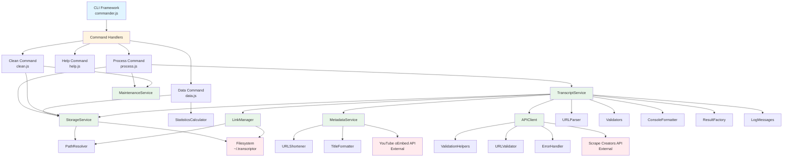
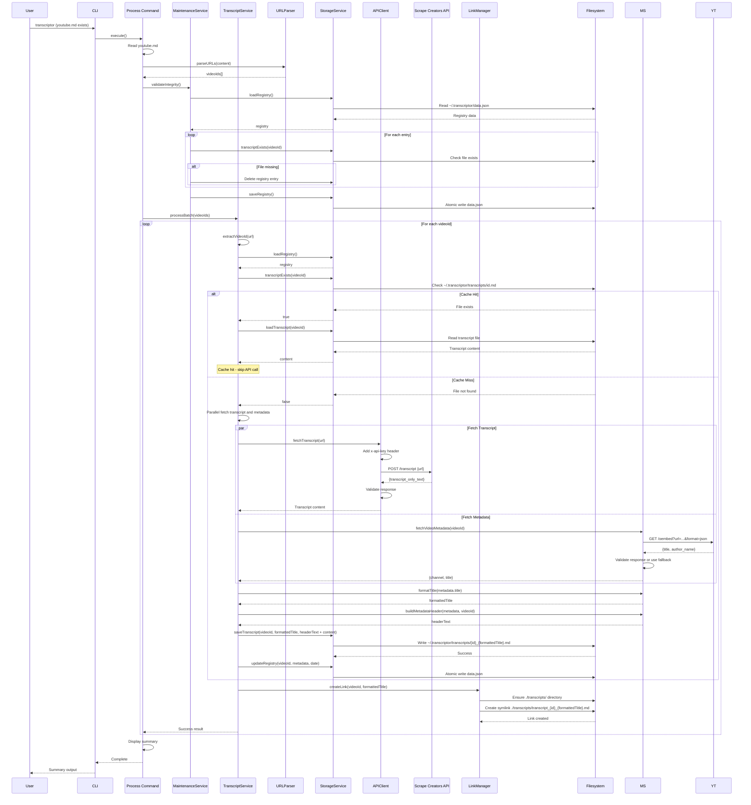
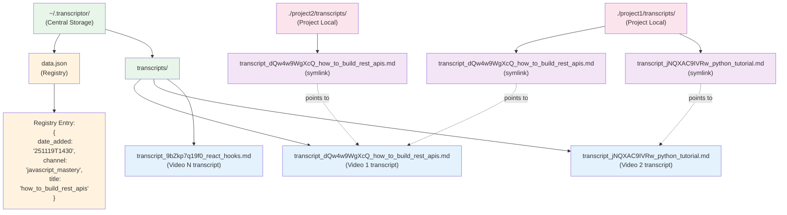

# System Architecture

## System Overview

Transcriptor is a command-line tool built on a modular architecture that separates concerns across distinct layers. The system follows a service-oriented design where business logic is isolated in dedicated services, utilities provide reusable functionality, and command handlers orchestrate user interactions.

The architecture centers on three key design decisions:

1. **Centralized Storage**: A single user-wide storage location (`~/.transcriptor`) serves as the source of truth for all transcript data
2. **Symbolic Link Distribution**: Transcripts are shared across projects through symbolic links rather than file duplication
3. **Cache-First Strategy**: All operations check local storage before making external API calls

### Technology Stack

- **Runtime**: Node.js v18+
- **CLI Framework**: commander.js (command parsing and routing)
- **HTTP Client**: axios (API communication)
- **File Operations**: fs-extra (filesystem utilities)
- **Environment Management**: dotenv (configuration)

### Architectural Layers

```
┌─────────────────────────────────────────────────┐
│          CLI Layer (commander.js)                │
│  Entry Point: bin/transcriptor → src/index.js   │
└─────────────────────────────────────────────────┘
                      ↓
┌─────────────────────────────────────────────────┐
│            Command Handlers Layer                │
│     process | help | data | clean               │
└─────────────────────────────────────────────────┘
                      ↓
┌─────────────────────────────────────────────────┐
│              Services Layer                      │
│  TranscriptService | StorageService              │
│  APIClient | LinkManager | MaintenanceService   │
└─────────────────────────────────────────────────┘
                      ↓
┌─────────────────────────────────────────────────┐
│              Utilities Layer                     │
│  PathResolver | Validators | URLParser           │
│  ConsoleFormatter | StatisticsCalculator        │
└─────────────────────────────────────────────────┘
                      ↓
┌─────────────────────────────────────────────────┐
│          External Dependencies                   │
│  Scrape Creators API | Filesystem | OS Env      │
└─────────────────────────────────────────────────┘
```

## Component Architecture



### Component Descriptions

#### CLI Framework (bin/transcriptor, src/index.js)

**Responsibility**: Parse command-line arguments and route to appropriate command handlers

**Key Functions**:
- Parse argv with commander.js
- Define available commands (default, help, data, clean)
- Route commands to handlers
- Display version information

**Dependencies**: commander.js library

**Interfaces**:
```javascript
// Entry point
#!/usr/bin/env node
program
  .name('transcriptor')
  .description('YouTube transcript extractor and manager')
  .version('1.0.0');

program
  .command('help')
  .action(() => require('./commands/help')());

program
  .command('data')
  .action(() => require('./commands/data')());

program
  .command('clean <date>')
  .action((date) => require('./commands/clean')(date));

program.action(() => require('./commands/process')());
```

#### Command Handlers (src/commands/)

**Process Command** (`src/commands/process.js`):
- Validates youtube.md file exists
- Reads and parses YouTube URLs
- Runs auto-maintenance to validate integrity
- Delegates to TranscriptService for processing
- Displays summary statistics

**Help Command** (`src/commands/help.js`):
- Displays usage information
- Shows command examples
- Triggered when youtube.md missing

**Data Command** (`src/commands/data.js`):
- Loads registry from storage
- Calculates statistics (count, size, date range)
- Formats output in human-readable form

**Clean Command** (`src/commands/clean.js`):
- Validates date format (YYYY-MM-DD)
- Converts to YYMMDD and matches against date portion of date_added (ignores THHMM)
- Filters registry for entries older than date (boundary excluded)
- Deletes transcript files and registry entries
- Displays deletion count

#### TranscriptService (src/services/TranscriptService.js)

**Responsibility**: Orchestrate transcript and metadata acquisition with cache-first strategy

**Key Functions**:
- Check cache before API calls (FR-2.3, TR-6)
- Fetch transcripts and metadata in parallel via APIClient and MetadataService (FR-2.1, FR-2.2)
- Save transcripts with metadata headers immediately (FR-2.4, FR-11, crash resilience)
- Generate filenames using formatted titles (FR-2.5)
- Create symbolic links via LinkManager
- Track statistics (cache hits, misses, links created)
- Process URLs sequentially (one at a time)

**Dependencies**: StorageService, APIClient, MetadataService, LinkManager, PathResolver

**Key Methods**:
```javascript
class TranscriptService {
  async processBatch(urls) // Process multiple URLs sequentially
  async processVideo(videoId, url) // Process single video (TR-25 workflow)
  async _checkCache(videoId) // Verify cache hit/miss
  async _getOrFetchTranscript(videoId, url) // Get cached or fetch new
  async _fetchMetadataAndTranscript(videoId, url) // Parallel fetch (TR-25)
  extractVideoId(url) // Parse YouTube ID from URL (TR-5)
}
```

**Processing Workflow** (TR-25):
1. Extract video ID from URL
2. Check cache (registry + file existence)
3. If cache hit: load transcript from storage
4. If cache miss:
   - Fetch transcript and metadata in parallel (Promise.all)
   - Format title for filename
   - Build metadata header
   - Save transcript with header
5. Create symbolic link (using formatted title in filename)
6. Update registry (with metadata: channel, title)
7. Persist registry atomically

#### StorageService (src/services/StorageService.js)

**Responsibility**: Manage filesystem persistence and registry operations

**Key Functions**:
- Initialize storage structure (~/.transcriptor, transcripts/)
- Load and save registry with atomic writes (TR-8, FR-9.1)
- Validate registry structure (FR-9.2)
- Save and load transcript files
- Delete transcripts and registry entries
- Ensure directories exist

**Dependencies**: fs-extra, PathResolver, Validators

**Key Methods**:
```javascript
class StorageService {
  async initialize() // Create directory structure (TR-19)
  async loadRegistry() // Load data.json with validation
  async saveRegistry(registry) // Atomic write to data.json
  async saveTranscript(videoId, content) // Write transcript file
  async loadTranscript(videoId) // Read transcript file
  async deleteTranscript(videoId) // Remove transcript file
  async transcriptExists(videoId) // Check file existence
  isValidRegistryStructure(data) // Validate schema
}
```

**Registry Schema**:
```javascript
{
  "videoId1": {
    "date_added": "251119T1430",
    "channel": "javascript_mastery",
    "title": "how_to_build_rest_apis_complete_tutorial"
  },
  "videoId2": {
    "date_added": "251118T0945",
    "channel": "tech_with_tim",
    "title": "python_tutorial_for_beginners"
  }
}
```

#### APIClient (src/services/APIClient.js)

**Responsibility**: HTTP communication with Scrape Creators API

**Key Functions**:
- Configure axios instance with authentication
- Inject API key via request interceptor
- Fetch transcripts from external API (FR-2.1)
- Implement exponential backoff retry for 429 errors (TR-12)
- Transform HTTP errors to application error types
- Validate response structure and size
- Log requests/responses (sanitized, no API key exposure)

**Dependencies**: axios, ErrorHandler, ValidationHelpers, URLValidator

**Key Methods**:
```javascript
class APIClient {
  async initialize() // Setup axios instance with interceptors
  async fetchTranscript(videoUrl) // Main public method
  async _fetchWithRetry(videoUrl, attempt) // Retry logic
  _transformError(error) // Classify error types
  _validateResponse(response) // Check transcript_only_text field
  _sanitizeConfig(config) // Remove API key from logs
}
```

**Error Handling** (TR-12):
- 400 Bad Request → Skip URL, continue
- 401 Unauthorized → Exit process with API key error
- 429 Rate Limited → Exponential backoff (1s, 2s, 4s), max 3 attempts
- 500 Server Error → Skip URL, continue
- Timeout → Skip URL, continue

#### MetadataService (src/services/MetadataService.js)

**Responsibility**: Fetch video metadata from YouTube oEmbed API and format for file operations

**Key Functions**:
- Fetch video title and channel name via YouTube oEmbed API (FR-2.2)
- Format titles for filesystem compatibility (FR-2.5)
- Build standardized short URLs (FR-3.3)
- Build metadata headers for transcript files (FR-11)
- Handle metadata fetch failures gracefully (non-fatal, TR-29)
- No authentication required (public API)

**Dependencies**: axios

**Key Methods**:
```javascript
class MetadataService {
  async fetchVideoMetadata(videoId) // Fetch from oEmbed API (TR-20)
  formatTitle(title) // Sanitize for filename (TR-21, TR-26)
  buildShortUrl(videoId) // Generate youtu.be URL (TR-22, TR-28)
  buildMetadataHeader(metadata, videoId) // Create file header (TR-27)
  _handleMetadataError(error) // Non-fatal error handling
}
```

**Error Handling** (TR-29):
- 404 Not Found → Use fallback values, log warning, continue
- 400 Bad Request → Use fallback values, log warning, continue
- 500 Server Error → Use fallback values, log warning, continue
- Timeout (15s) → Use fallback values, log warning, continue
- **No retry logic** (metadata is non-critical)

**Fallback Values**:
- channel: "Unknown Channel"
- title: "Unknown Title"

**Title Formatting** (TR-26):
- Lowercase transformation
- Spaces to underscores
- Remove non-alphanumeric characters (except dash/underscore)
- Truncate to 100 characters
- Fallback: "untitled"

#### LinkManager (src/services/LinkManager.js)

**Responsibility**: Create and manage symbolic links between central storage and project directories

**Key Functions**:
- Create symbolic links (FR-4.1, TR-9)
- Handle cross-platform path resolution
- Ensure project-local transcripts/ directory exists

**Dependencies**: fs-extra, StorageService, PathResolver

**Key Methods**:
```javascript
class LinkManager {
  async createLink(videoId, formattedTitle) // Create symlink
  async _unlinkSafely(linkPath) // Delete link with ENOENT tolerance
}
```

**Link Structure**:
```
Source: ~/.transcriptor/transcripts/transcript_{videoId}_{formattedTitle}.md
Target: ./transcripts/transcript_{videoId}_{formattedTitle}.md (project-local)
Type: Symbolic link
Filename: Built using formatted title (transcript_{videoId}_{formattedTitle}.md)
```

#### MaintenanceService (src/services/MaintenanceService.js)

**Responsibility**: Validate data integrity and clean orphaned entries

**Key Functions**:
- Check registry entries have corresponding files (FR-7.1, TR-14)
- Remove orphaned registry entries
- Run before each processing operation

**Dependencies**: StorageService

**Key Methods**:
```javascript
class MaintenanceService {
  async validateIntegrity() // Check registry vs filesystem
  async _removeOrphanedEntry(videoId) // Clean up missing files
}
```

**Integrity Check Workflow** (TR-14):
1. Load registry
2. For each video ID in registry:
   - Check if transcript file exists
   - If missing: remove registry entry
3. Save updated registry

## Request Processing Flow



### Request Flow Description

1. **User Input**: User runs `transcriptor` command with youtube.md file in current directory
2. **URL Parsing**: ProcessCommand reads youtube.md and extracts YouTube URLs using URLParser
3. **Integrity Check**: MaintenanceService validates registry against filesystem, removes orphaned entries
4. **Batch Processing**: TranscriptService processes URLs sequentially
5. **Cache Check**: For each video, check if transcript exists in cache (registry + file)
6. **API Fetch** (cache miss):
   - Fetch transcript and metadata in parallel using Promise.all
   - Transcript from Scrape Creators API (with retry logic)
   - Metadata from YouTube oEmbed API (no retry, non-fatal)
7. **Title Formatting**: Sanitize title and channel for filesystem compatibility
8. **Metadata Header**: Build header with formatted channel, formatted title, video ID, and URL
9. **Storage**: Save transcript with metadata header to ~/.transcriptor/transcripts/transcript_{id}_{formattedTitle}.md immediately
10. **Registry Update**: Add entry to data.json with date_added (YYMMDDTHHMM format), formatted channel, and formatted title
11. **Link Creation**: Create symbolic link in ./transcripts/ pointing to central storage (transcript_{id}_{formattedTitle}.md)
12. **Summary**: Display processing results (success count, cache hits, failures)

## Storage Architecture



### Storage Structure Details

**Central Storage** (`~/.transcriptor/`):
- **Location**: User home directory, cross-platform
- **Purpose**: Single source of truth for all transcripts
- **Persistence**: Data persists across all projects
- **Contents**:
  - `data.json`: Registry tracking all transcripts and links
  - `transcripts/`: Directory containing transcript markdown files

**Transcript Files** (`~/.transcriptor/transcripts/transcript_{videoId}_{formattedTitle}.md`):
- **Naming**: `transcript_` prefix + video ID + underscore + formatted title (FR-2.5, TR-23)
- **Format**: Markdown with structured headers (FR-11)
- **Content**:
  - `# Transcript` header
  - `## Information` section with formatted channel, formatted title, YouTube ID, URL (TR-27)
  - `## Content` section with transcript text from API
- **Encoding**: UTF-8
- **Size limit**: 10MB maximum per TR specifications

**Registry File** (`~/.transcriptor/data.json`):
- **Format**: JSON with 2-space indentation
- **Schema**: `{videoId: {date_added, channel, title}}` (FR-3.2, TR-24)
- **date_added format**: YYMMDDTHHMM (includes date and time)
- **channel**: Formatted/sanitized version (lowercase, underscores)
- **title**: Formatted/sanitized version (lowercase, underscores)
- **Write Strategy**: Atomic write (temp file + rename, per TR-8)
- **Validation**: Structure validated on load, corrupted file regenerated

**Project-Local Links** (`./transcripts/transcript_{videoId}_{formattedTitle}.md`):
- **Type**: Symbolic links (symlinks)
- **Target**: Points to central storage transcript
- **Naming**: `transcript_` prefix + video ID + underscore + formatted title
- **Purpose**: Project-specific access without file duplication
- **Creation**: Automatic on transcript processing

## Module Responsibilities

### Services Layer

**TranscriptService** (`src/services/TranscriptService.js`):
- Interface: `processBatch(urls)`, `processVideo(videoId, url)`, `_fetchMetadataAndTranscript(videoId, url)`
- Responsibilities: Orchestrate transcript and metadata workflow, parallel fetching, cache management, statistics
- Dependencies: StorageService, APIClient, MetadataService, LinkManager

**StorageService** (`src/services/StorageService.js`):
- Interface: `initialize()`, `loadRegistry()`, `saveRegistry()`, `saveTranscript()`, `loadTranscript()`
- Responsibilities: File persistence, registry operations, atomic writes
- Dependencies: fs-extra, PathResolver

**APIClient** (`src/services/APIClient.js`):
- Interface: `initialize()`, `fetchTranscript(videoUrl)`
- Responsibilities: HTTP communication, error handling, retry logic
- Dependencies: axios, ErrorHandler, URLValidator

**MetadataService** (`src/services/MetadataService.js`):
- Interface: `fetchVideoMetadata(videoId)`, `formatTitle(title)`, `buildShortUrl(videoId)`, `buildMetadataHeader(metadata, videoId)`
- Responsibilities: Fetch metadata from YouTube oEmbed API, title formatting, URL building, header generation
- Dependencies: axios

**LinkManager** (`src/services/LinkManager.js`):
- Interface: `createLink(videoId, formattedTitle)`
- Responsibilities: Symbolic link creation with formatted filenames
- Dependencies: fs-extra, StorageService, PathResolver

**MaintenanceService** (`src/services/MaintenanceService.js`):
- Interface: `validateIntegrity()`
- Responsibilities: Data integrity checks, orphan cleanup
- Dependencies: StorageService

### Utilities Layer

**PathResolver** (`src/utils/pathResolver.js`):
- Interface: `getStoragePath()`, `getTranscriptsPath()`, `getRegistryPath()`, `getLocalTranscriptsPath()`
- Responsibilities: Cross-platform path resolution
- Dependencies: path, process.env

**Validators** (`src/utils/validators.js`):
- Interface: `isValidDate()`, `sanitizeVideoId()`, `assertValidDate()`
- Responsibilities: Input validation, sanitization
- Dependencies: None

**URLParser** (`src/utils/URLParser.js`):
- Interface: `parseURLs(fileContent)`, `extractVideoId(url)`
- Responsibilities: YouTube URL parsing, video ID extraction
- Dependencies: YouTubeConstants (regex patterns)

**ConsoleFormatter** (`src/utils/ConsoleFormatter.js`):
- Interface: `formatSuccess()`, `formatError()`, `formatStats()`
- Responsibilities: Consistent console output formatting
- Dependencies: None

**StatisticsCalculator** (`src/utils/StatisticsCalculator.js`):
- Interface: `calculate(registry, transcriptsPath)`
- Responsibilities: Calculate metrics (count, size, date range), display metadata (channel, title)
- Dependencies: fs-extra

**TitleFormatter** (`src/utils/titleFormatter.js`):
- Interface: `formatTitle(title)`, `sanitizeForFilename(title)`
- Responsibilities: Title sanitization for filesystem, lowercase conversion, space replacement
- Dependencies: None

**URLShortener** (`src/utils/urlShortener.js`):
- Interface: `buildShortUrl(videoId)`
- Responsibilities: Generate standardized youtu.be URLs
- Dependencies: None

**ErrorHandler** (`src/utils/ErrorHandler.js`):
- Interface: `transformHttpError()`, `isRetryableError()`
- Responsibilities: Error classification and transformation
- Dependencies: APIClientConstants

**ResultFactory** (`src/utils/ResultFactory.js`):
- Interface: `createSuccess()`, `createError()`, `createCacheHit()`
- Responsibilities: Standardized result objects
- Dependencies: None

## Data Models

### Registry Entry Schema

```javascript
// Type definition
{
  [videoId: string]: {
    date_added: string,  // YYMMDDTHHMM format
    channel: string,     // Formatted channel name
    title: string        // Formatted video title
  }
}

// Example
{
  "dQw4w9WgXcQ": {
    "date_added": "251119T1430",
    "channel": "javascript_mastery",
    "title": "how_to_build_rest_apis_complete_tutorial"
  },
  "jNQXAC9IVRw": {
    "date_added": "251118T0945",
    "channel": "tech_with_tim",
    "title": "python_tutorial_for_beginners"
  }
}
```

**Field Descriptions**:
- `videoId` (key): 11-character YouTube video identifier
- `date_added`: Timestamp in YYMMDDTHHMM format when transcript first acquired
- `channel`: Formatted channel name (sanitized, lowercase, underscores)
- `title`: Formatted video title (sanitized, lowercase, underscores)

**Validation Rules**:
- Only allowed keys: `date_added`, `channel`, `title` (FR-3.2)
- `date_added` must match YYMMDDTHHMM format (/^\d{6}T\d{4}$/)
- `channel` must be non-empty string
- `title` must be non-empty string

### Transcript File Format

```markdown
# Transcript

## Information

Channel: javascript_mastery
Title: how_to_build_rest_apis_complete_tutorial
Youtube ID: dQw4w9WgXcQ
URL: https://youtu.be/dQw4w9WgXcQ

## Content

Hello and welcome to this video tutorial. Today we're going to learn about
JavaScript promises and async await patterns. Let's start with the basics...
```

**Structure** (FR-11):
- **Header**: `# Transcript` markdown heading
- **Information Section**: `## Information` heading followed by metadata fields
  - Channel: Formatted channel name (sanitized)
  - Title: Formatted video title (sanitized)
  - Youtube ID: Video identifier
  - URL: Standardized short URL (youtu.be format)
- **Content Section**: `## Content` heading followed by transcript text

**Characteristics**:
- Structured markdown format with headers (FR-11.1)
- Formatted metadata (lowercase, underscores, sanitized)
- No timestamps or speaker labels in transcript
- Plain text transcript content from `transcript_only_text`
- UTF-8 encoding
- Line breaks preserved from API response

### Processing Result Object

```javascript
{
  success: boolean,         // Operation succeeded
  videoId: string,          // YouTube video ID
  source: string,           // 'cache' | 'api' | 'error'
  error: string | null,     // Error message if failed
  cached: boolean,          // Was cache hit
  linkCreated: boolean      // Was symbolic link created
}
```

## Key Design Patterns

### Cache-First Strategy

All transcript requests follow this priority:

1. **Check Registry**: Does video ID exist in data.json?
2. **Verify File**: Does transcript file exist on disk?
3. **Cache Hit**: If both true, load transcript from storage
4. **Cache Miss**: If either false, fetch from API

**Benefits**:
- Minimizes API calls (reduces costs, improves speed)
- Prevents duplicate API requests for same video
- Enables offline access to previously-fetched transcripts

**Implementation**: TranscriptService.\_checkCache() and \_getOrFetchTranscript()

### Atomic Writes for Crash Resilience

All registry and transcript writes use atomic operations:

1. **Write to Temporary File**: Create {filename}.tmp
2. **Rename to Final**: Rename .tmp to actual filename (atomic operation)
3. **Verify**: Confirm file exists after write

**Benefits**:
- Prevents partial writes during crashes
- Ensures data integrity
- Enables re-run to complete unfinished work

**Implementation**: StorageService.saveRegistry() and saveTranscript()

**Crash Recovery Example**:
- Process crashes after transcript saved but before registry update
- Re-run: Cache check fails (not in registry), fetch again
- Auto-maintenance: Detects orphaned file, adds to registry

### Symbolic Link Distribution

Transcripts are shared via symbolic links rather than copies:

**Approach**:
- Central storage: One authoritative copy in ~/.transcriptor/transcripts/
- Project access: Symbolic link in ./transcripts/ points to central copy
- Registry tracking: All link locations stored in registry

**Benefits**:
- Storage efficiency: Single copy serves multiple projects
- Consistency: All projects always see same content
- Easy updates: Change central file, all links reflect update

**Implementation**: LinkManager.createLink()

**Cross-Platform Considerations**:
- Windows requires proper path handling (absolute paths)
- macOS/Linux use standard symlink operations
- Force option overwrites existing links

### Sequential Processing

URLs are processed one at a time rather than concurrently:

**Rationale**:
- API rate limiting: Sequential prevents hitting 100/min limit quickly
- Error isolation: Individual failure doesn't affect batch
- Resource control: Limits memory usage for large batches
- Predictable behavior: Easier to debug and reason about

**Implementation**: TranscriptService.processBatch() uses for loop, not Promise.all()

## Cross-References to Code

### Entry Points
- CLI Router: `src/index.js`
- Main Command: `src/commands/process.js`
- Help Display: `src/commands/help.js`
- Statistics: `src/commands/data.js`
- Cleanup: `src/commands/clean.js`

### Core Services
- Transcript Workflow: `src/services/TranscriptService.js`
- Storage Operations: `src/services/StorageService.js`
- API Integration: `src/services/APIClient.js`
- Metadata Operations: `src/services/MetadataService.js`
- Link Management: `src/services/LinkManager.js`
- Integrity Checks: `src/services/MaintenanceService.js`

### Utilities
- Path Resolution: `src/utils/pathResolver.js`
- URL Parsing: `src/utils/URLParser.js`
- Validation: `src/utils/validators.js`
- Error Handling: `src/utils/ErrorHandler.js`
- Console Output: `src/utils/ConsoleFormatter.js`
- Title Formatting: `src/utils/titleFormatter.js`
- URL Shortening: `src/utils/urlShortener.js`

### Configuration
- API Constants: `src/constants/APIClientConstants.js`
- YouTube Patterns: `src/utils/YouTubeConstants.js`
- Log Templates: `src/utils/LogMessages.js`

## Dependency Graph

```
Commands
  ├─→ process.js → TranscriptService, MaintenanceService, StorageService
  ├─→ help.js → (no dependencies)
  ├─→ data.js → StorageService, StatisticsCalculator
  └─→ clean.js → StorageService, MaintenanceService

Services
  ├─→ TranscriptService → StorageService, APIClient, MetadataService, LinkManager, URLParser, Validators
  ├─→ StorageService → PathResolver, Validators
  ├─→ APIClient → ErrorHandler, ValidationHelpers, URLValidator
  ├─→ MetadataService → TitleFormatter, URLShortener
  ├─→ LinkManager → StorageService, PathResolver
  └─→ MaintenanceService → StorageService

Utilities
  ├─→ PathResolver → (Node.js path, os)
  ├─→ URLParser → YouTubeConstants
  ├─→ Validators → (no dependencies)
  ├─→ ErrorHandler → APIClientConstants
  ├─→ ConsoleFormatter → (no dependencies)
  ├─→ TitleFormatter → (no dependencies)
  └─→ URLShortener → (no dependencies)
```

## Performance Characteristics

**Sequential Processing**: One URL at a time prevents rate limiting
**Cache Optimization**: Registry loaded once per batch, not per video
**Atomic Writes**: Small overhead for crash resilience (temp file + rename)
**Symbolic Links**: Zero storage overhead for multi-project usage
**File I/O**: Minimal reads (registry once, transcripts on cache hit only)

**Bottlenecks**:
- API fetch time (30s timeout per transcript, 15s for metadata)
- Parallel fetching reduces total wait time per video
- Large batches (100+ videos) hit rate limit
- Registry write per video (can batch in future optimization)

## Scalability Considerations

**Current Design**:
- Handles up to 1000 videos efficiently
- Registry file size grows linearly (approximately 200 bytes per entry with metadata)
- Sequential processing limits throughput to ~100 videos/minute
- Parallel metadata fetching saves 15-30 seconds per video

**Optimization Opportunities** (future):
- Batch registry updates (write once per batch instead of per video)
- Parallel API requests (respect rate limit with queue)
- Registry indexing for large datasets (>10,000 videos)
- Compression for very large transcript files

## Security Architecture

**API Key Protection**:
- Loaded from .env (never hardcoded)
- Never logged or displayed
- Sanitized from error messages

**Path Validation**:
- Video IDs sanitized (alphanumeric + dash only)
- Titles sanitized for filesystem (alphanumeric, underscore, dash only)
- Path traversal prevented (validates video ID and title format)
- Filename length limits enforced (255 characters)
- Absolute paths used throughout

**Error Message Sanitization**:
- API responses truncated in errors
- Sensitive data removed from logs
- User-facing errors provide guidance without exposing internals

## References

- **Functional Requirements**: FR-1 through FR-10
- **Technical Requirements**: TR-1 through TR-19
- **API Integration**: See `docs/API_INTEGRATION.md`
- **Data Flow**: See `docs/DATA_FLOW.md`
- **Contributing**: See `docs/CONTRIBUTING.md`
